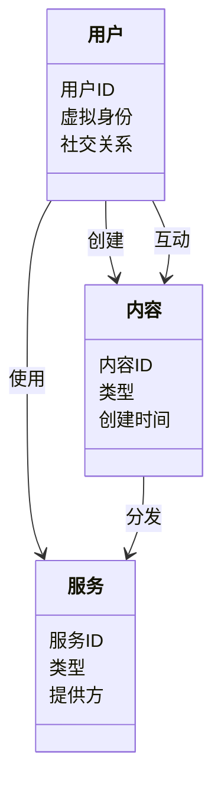
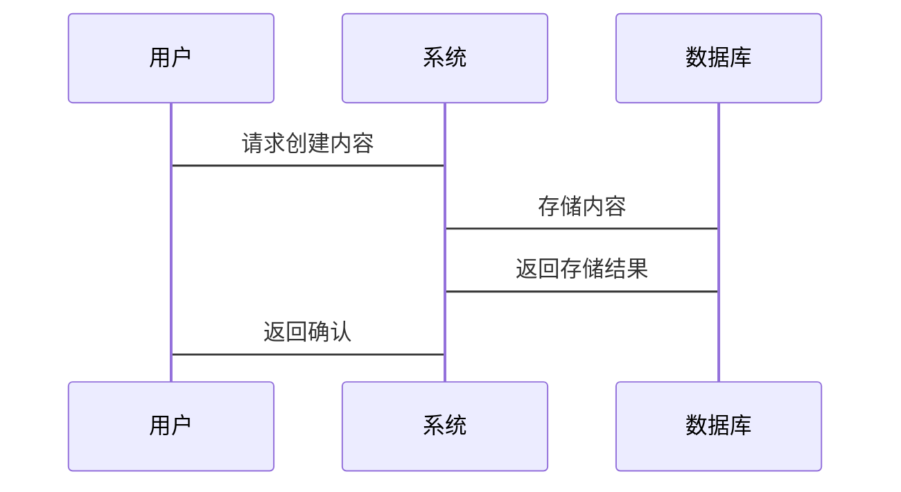

                 


# 彼得林奇的"行业分析"在元宇宙相关产业链中的框架创新

> 关键词：彼得·林奇，行业分析，元宇宙，产业链，框架创新

> 摘要：本文探讨了彼得·林奇的行业分析方法在元宇宙相关产业链中的创新应用，结合实际案例，详细阐述了如何通过系统化的分析框架优化产业链结构，提升竞争力。文章从行业分析的基本概念出发，深入分析元宇宙产业链的特点，并提出了一套创新的分析框架和优化策略。

---

## 第1章：行业分析方法的背景与核心概念

### 1.1 彼得·林奇的行业分析方法概述

#### 1.1.1 行业分析的基本概念
行业分析是通过研究特定行业内的企业竞争状况、市场结构、发展趋势等，来评估行业的整体竞争力和投资价值。彼得·林奇作为投资大师，将行业分析作为其投资策略的核心部分。

#### 1.1.2 彼得·林奇的行业分析框架
彼得·林奇的行业分析框架包括以下关键要素：
1. **行业周期分析**：识别行业所处的生命周期阶段（如初创期、成长期、成熟期、衰退期）。
2. **核心竞争力分析**：评估行业内企业的核心竞争力，包括技术、成本、品牌等。
3. **市场结构分析**：分析市场的竞争结构（如完全竞争、垄断竞争等）。
4. **财务指标分析**：通过财务数据评估行业整体的盈利能力和发展潜力。

#### 1.1.3 行业分析在投资中的应用
彼得·林奇通过行业分析，识别出那些处于成长期且具有强大竞争优势的行业，从而找到优质的投资标的。这种方法帮助他在投资生涯中取得了显著的成功。

---

### 1.2 元宇宙产业链的定义与特点

#### 1.2.1 元宇宙的定义与核心特征
元宇宙（Metaverse）是一个虚拟的三维空间，通过区块链、虚拟现实、增强现实等技术构建，用户可以在其中进行社交、娱乐、 commerce 等活动。其核心特征包括：
1. **虚拟性**：用户通过虚拟身份参与。
2. **开放性**：支持多平台和跨平台的交互。
3. **实时性**：内容和数据实时更新。
4. **可编程性**：通过智能合约实现自动化操作。

#### 1.2.2 元宇宙产业链的构成
元宇宙产业链可以分为以下几个部分：
1. **硬件层**：包括VR设备、AR设备、高性能计算设备等。
2. **网络层**：包括5G网络、边缘计算等支持实时交互的技术。
3. **软件层**：包括操作系统、开发工具、内容生成工具等。
4. **服务层**：包括社交平台、游戏平台、虚拟商品交易平台等。
5. **内容层**：包括虚拟内容创作、数字资产发行等。

#### 1.2.3 元宇宙产业链的演进趋势
随着技术的进步，元宇宙产业链正在从初步形成阶段向成熟阶段发展，未来将更加注重用户体验和生态系统的完善。

---

### 1.3 传统行业分析与元宇宙产业链分析的对比

#### 1.3.1 传统行业分析的局限性
传统行业分析主要依赖于历史数据和静态指标，难以应对快速变化的新兴行业。此外，传统分析方法往往忽略了行业内的技术创新和生态系统的影响。

#### 1.3.2 元宇宙产业链分析的独特性
元宇宙产业链的复杂性和多维度性要求分析方法更加动态和系统化。需要同时考虑技术、市场、用户行为等多个因素。

#### 1.3.3 两者结合的创新点
将彼得·林奇的行业分析方法与元宇宙产业链的特点相结合，可以构建一种动态的、多维度的分析框架，能够更好地捕捉行业机会和风险。

---

## 第2章：行业分析框架在元宇宙产业链中的应用

### 2.1 行业分析框架的核心要素

#### 2.1.1 产业链的结构分析
元宇宙产业链的结构包括硬件、网络、软件、服务和内容等多个层次，每个层次之间相互依赖，共同构建完整的生态系统。

#### 2.1.2 关键环节的识别与评估
在元宇宙产业链中，关键环节包括：
1. **硬件设备**：如VR/AR设备的质量直接影响用户体验。
2. **网络技术**：5G和边缘计算是实现低延迟和高带宽的关键。
3. **内容创作**：优质内容是吸引用户的核心。

#### 2.1.3 产业链的竞争力分析
通过分析各个环节的竞争力，评估整个产业链的优势和劣势，为优化策略提供依据。

---

### 2.2 元宇宙产业链的核心环节分析

#### 2.2.1 技术层：底层技术的分析
技术层包括区块链、AI、云计算等，这些技术是元宇宙实现的基础。

#### 2.2.2 应用层：应用场景的分析
应用层包括虚拟社交、游戏、虚拟办公等，这些是元宇宙的主要应用场景。

#### 2.2.3 服务层：生态系统的分析
服务层包括平台运营、内容分发、用户支持等，是维持元宇宙生态运转的关键。

---

### 2.3 行业分析框架的创新点

#### 2.3.1 数据驱动的分析方法
利用大数据和AI技术，对元宇宙产业链中的数据进行实时分析，提供更精准的洞察。

#### 2.3.2 多维度的综合评估模型
构建一个综合评估模型，涵盖技术、市场、竞争等多个维度，全面评估产业链的整体竞争力。

#### 2.3.3 动态调整的分析框架
根据市场变化和用户需求，动态调整分析框架，确保其适应性。

---

## 第3章：元宇宙产业链的系统分析与架构设计

### 3.1 系统分析与问题场景介绍

#### 3.1.1 元宇宙产业链的复杂性
元宇宙产业链涉及多个领域，各环节之间的关联性强，分析难度大。

#### 3.1.2 系统分析的目标与范围
系统分析的目标是优化产业链结构，提升效率和用户体验。范围包括从硬件到内容的各个层次。

#### 3.1.3 问题场景的定义与边界
以虚拟社交平台为例，分析如何提升用户参与度和平台稳定性。

---

### 3.2 系统功能设计与领域模型

#### 3.2.1 领域模型的构建
使用Mermaid图展示领域模型，包括用户、内容、服务等实体及其关系。



---

### 3.3 系统架构设计与实现

#### 3.3.1 系统架构的分层设计
使用Mermaid图展示分层架构，包括数据层、业务逻辑层、用户界面层。


---

### 3.4 系统接口设计与交互流程

#### 3.4.1 系统接口的定义与规范
使用Mermaid图展示系统接口，包括接口名称、输入、输出。



---

## 第4章：基于彼得·林奇行业分析的元宇宙产业链创新框架

### 4.1 行业分析框架的数学模型

#### 4.1.1 数学模型的构建
行业评分模型：
$$ \text{行业评分} = \alpha \times \text{技术评分} + \beta \times \text{市场评分} + \gamma \times \text{竞争评分} $$

---

### 4.2 元宇宙产业链的算法实现

#### 4.2.1 算法原理
使用机器学习算法，对元宇宙产业链中的数据进行特征提取和模型训练。

#### 4.2.2 核心代码实现
Python代码示例：

```python
import numpy as np
from sklearn import linear_model

# 示例数据
X = np.array([[1, 2, 3], [4, 5, 6], [7, 8, 9]])
y = np.array([10, 11, 12])

# 训练模型
model = linear_model.LinearRegression()
model.fit(X, y)

# 预测结果
print(model.predict([[10, 11, 12]]))
```

---

## 第5章：项目实战——基于彼得·林奇行业分析的元宇宙产业链优化

### 5.1 项目背景与目标

#### 5.1.1 项目背景
以虚拟社交平台为例，分析如何优化其产业链结构。

#### 5.1.2 项目目标
提升用户体验，增强平台竞争力。

---

### 5.2 环境安装与配置

#### 5.2.1 开发环境的搭建
安装Python、Jupyter Notebook、Pandas、Scikit-learn等工具。

#### 5.2.2 数据源的获取与准备
从公开数据源获取元宇宙产业链的相关数据，并进行清洗和预处理。

---

### 5.3 系统核心实现

#### 5.3.1 关键算法的实现
实现行业评分模型的训练和预测。

#### 5.3.2 系统功能的实现
开发用户界面，展示分析结果和优化建议。

---

### 5.4 实际案例分析与解读

#### 5.4.1 案例背景介绍
以Meta的虚拟社交平台为例，分析其产业链结构。

#### 5.4.2 行业分析与优化建议
根据分析结果，提出优化建议，如提升硬件性能、优化内容分发等。

#### 5.4.3 案例分析结果与启示
分析结果表明，优化硬件和内容分发可以显著提升用户体验。

---

### 5.5 项目小结与经验总结

#### 5.5.1 项目实现的关键点
关键在于数据的准确采集和算法的优化。

#### 5.5.2 项目中的挑战与解决方案
数据质量和计算资源是主要挑战，解决方案包括数据清洗和分布式计算。

#### 5.5.3 项目成果与未来展望
项目成功实现了元宇宙产业链的优化框架，未来将进一步研究动态调整的算法。

---

## 第6章：总结与展望——彼得·林奇行业分析方法在元宇宙产业链中的创新应用

### 6.1 本章总结

#### 6.1.1 核心内容回顾
本文探讨了彼得·林奇的行业分析方法在元宇宙产业链中的应用，提出了一套创新的分析框架。

#### 6.1.2 创新点总结
创新点在于构建了一个动态的、多维度的分析框架，能够适应元宇宙产业链的快速变化。

---

### 6.2 最佳实践与经验分享

#### 6.2.1 实践中的注意事项
在实际应用中，需要注意数据的准确性和模型的可解释性。

#### 6.2.2 行业分析框架的优化建议
未来可以进一步引入实时数据分析和增强的多维度评估模型。

---

### 6.3 未来研究与展望

#### 6.3.1 未来研究方向
未来可以研究更复杂的动态模型和多模态数据分析技术。

#### 6.3.2 元宇宙产业链的发展趋势
元宇宙产业链将更加注重用户体验和生态系统的完善，技术创新和跨界合作将成为主要趋势。

---

## 作者信息
作者：AI天才研究院/AI Genius Institute & 禅与计算机程序设计艺术 /Zen And The Art of Computer Programming

---

**摘要**：本文探讨了彼得·林奇的行业分析方法在元宇宙相关产业链中的创新应用，结合实际案例，详细阐述了如何通过系统化的分析框架优化产业链结构，提升竞争力。文章从行业分析的基本概念出发，深入分析元宇宙产业链的特点，并提出了一套创新的分析框架和优化策略。

