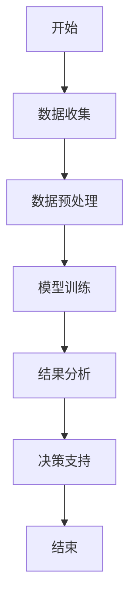
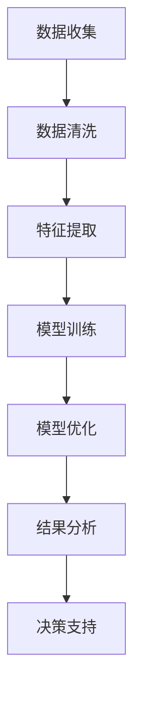
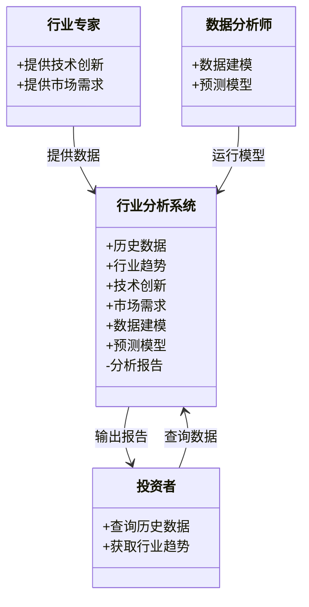
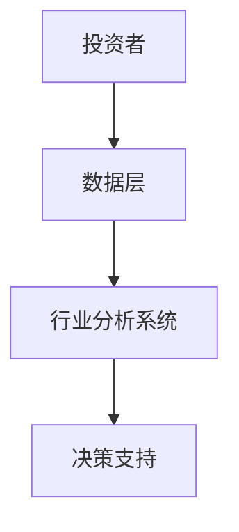

                 


# 彼得林奇的"行业分析"在新兴产业中的调整

## 关键词：行业分析，彼得林奇，新兴产业，投资策略，数据分析

## 摘要：  
本文探讨了彼得林奇的行业分析方法在新兴产业中的应用与调整。通过分析传统行业分析方法的局限性，结合新兴产业的特点，提出了一种基于数据驱动和机器学习的行业分析新方法。文章详细介绍了算法原理、数学模型、系统架构，并通过案例分析展示了新方法的实际应用效果。

---

## 第1章: 行业分析概述

### 1.1 彼得林奇的行业分析方法  
彼得林奇是全球知名的投资专家，他提出的行业分析方法以基本面分析为核心，强调通过研究行业趋势、市场结构和企业竞争优势来评估投资机会。这种方法在传统行业中表现出色，但在新兴产业中面临新的挑战。

#### 1.1.1 行业分析的基本概念  
行业分析是通过对行业内部结构、竞争格局、市场容量和增长潜力的分析，评估行业整体的投资价值。彼得林奇的方法注重行业生命周期和市场进入壁垒，帮助投资者识别高潜力的行业。

#### 1.1.2 彼得林奇行业分析的核心思想  
彼得林奇认为，成功的投资不仅依赖于企业的财务表现，还取决于行业的发展趋势。他强调选择那些具有可持续增长潜力的行业，并关注行业内具有竞争优势的企业。

#### 1.1.3 行业分析在投资决策中的作用  
行业分析是投资决策的重要组成部分，它帮助投资者规避行业风险，发现潜在的投资机会。通过行业分析，投资者可以更好地理解市场趋势，制定合理的投资策略。

---

### 1.2 新兴产业的特点与挑战  

#### 1.2.1 新兴产业的定义与分类  
新兴产业是指基于新技术、新商业模式或新市场需求而迅速发展的行业。例如，人工智能、新能源、生物技术等领域都属于新兴产业。

#### 1.2.2 新兴产业的市场特点  
新兴产业通常具有高增长性、高波动性和不确定性。市场进入壁垒较低，竞争激烈，技术更新迭代快，市场需求变化大。

#### 1.2.3 新兴产业分析的难点与挑战  
新兴产业的数据不完整，市场趋势难以预测，传统行业分析方法的适用性较低。此外，新兴产业的竞争格局变化快，需要动态调整分析方法。

---

## 第2章: 传统行业分析方法的局限性  

### 2.1 传统行业分析的核心要素  

#### 2.1.1 行业生命周期分析  
行业生命周期包括导入期、成长期、成熟期和衰退期。传统行业分析方法通过判断行业所处的生命周期阶段，评估行业的增长潜力。

#### 2.1.2 市场结构分析  
市场结构分析包括对市场集中度、竞争格局和市场进入壁垒的分析。传统方法通常基于静态数据，难以适应新兴产业的动态变化。

#### 2.1.3 竞争分析  
竞争分析包括对行业内主要企业的市场份额、竞争优势和竞争策略的分析。传统方法注重企业的财务表现，忽视了新兴行业的技术驱动因素。

---

### 2.2 传统行业分析方法的局限性  

#### 2.2.1 新兴产业的动态变化  
新兴产业的技术创新和市场需求变化快，传统行业分析方法难以捕捉这些变化。

#### 2.2.2 数据的不完整性和不确定性  
新兴产业的数据往往不够完整，市场趋势难以预测，导致传统分析方法的准确性降低。

#### 2.2.3 传统模型的适用性问题  
传统行业分析模型通常基于历史数据和静态假设，难以适应新兴产业的动态环境。

---

## 第3章: 新兴产业分析的核心概念与联系  

### 3.1 新兴产业分析的核心要素  

#### 3.1.1 市场潜力分析  
市场潜力分析包括市场规模、增长率和市场需求预测。新兴产业通常具有较高的市场潜力，但需要通过数据驱动的方法进行评估。

#### 3.1.2 技术创新与产业变革  
技术创新是新兴产业的核心驱动力。分析新兴产业时，需要关注技术发展趋势和企业的研发能力。

#### 3.1.3 市场进入壁垒与竞争优势  
新兴产业的市场进入壁垒通常较低，但竞争优势可能源于技术、商业模式或成本优势。

---

### 3.2 核心概念对比分析  

#### 3.2.1 传统行业与新兴产业的对比表格  
下表对比了传统行业和新兴产业在市场结构、生命周期、竞争格局等方面的主要差异：

| **属性**          | **传统行业**               | **新兴产业**               |
|--------------------|----------------------------|----------------------------|
| 市场进入壁垒      | 高                        | 低                        |
| 技术创新          | 较慢                      | 快                        |
| 生命周期阶段      | 成熟期或衰退期            | 导入期或成长期            |
| 市场需求          | 稳定                      | 快速变化                  |

#### 3.2.2 产业生命周期的对比分析  
传统行业通常处于成熟期或衰退期，而新兴产业多处于导入期或成长期。

#### 3.2.3 市场结构的对比分析  
传统行业市场集中度高，新兴产业市场集中度低，竞争格局变化快。

---

### 3.3 实体关系图与流程图  

#### 3.3.1 产业分析的ER实体关系图  

```mermaid
erDiagram
    actor 投资者 {
        <属性> 历史数据
        <属性> 行业趋势
    }
    actor 行业专家 {
        <属性> 技术创新
        <属性> 市场需求
    }
    actor 数据分析师 {
        <属性> 数据建模
        <属性> 预测模型
    }
    投资者 --> 行业专家 : 获取行业信息
    行业专家 --> 数据分析师 : 提供数据支持
    数据分析师 --> 投资者 : 输出分析报告
```

#### 3.3.2 新兴产业分析的流程图  



---

## 第4章: 新兴产业分析的算法原理  

### 4.1 算法原理概述  

#### 4.1.1 数据驱动的行业分析方法  
数据驱动的方法通过收集和分析大量行业数据，利用机器学习模型预测行业趋势和企业表现。

#### 4.1.2 基于机器学习的预测模型  
机器学习模型（如线性回归、随机森林）用于预测行业增长潜力和企业盈利能力。

#### 4.1.3 多因素分析模型  
多因素分析模型综合考虑行业生命周期、市场需求、技术趋势和竞争格局等多个因素。

---

### 4.2 算法流程图  



---

## 第5章: 数学模型与公式  

### 5.1 行业增长潜力评估模型  

行业增长潜力的评估公式如下：

$$
G = \frac{D}{T}
$$

其中，$G$ 表示行业增长潜力，$D$ 表示市场需求增长率，$T$ 表示行业技术成熟度。

---

## 第6章: 系统分析与架构设计  

### 6.1 系统功能设计  

#### 6.1.1 领域模型  



---

### 6.2 系统架构设计  

#### 6.2.1 系统架构图  



---

## 第7章: 项目实战  

### 7.1 环境安装  

```bash
pip install numpy pandas scikit-learn
```

### 7.2 核心实现  

```python
import pandas as pd
from sklearn.ensemble import RandomForestRegressor

# 数据加载
data = pd.read_csv('industry_data.csv')

# 特征选择
features = ['GDP增长率', '技术创新指数', '市场需求增长率']
target = '行业增长潜力'

# 模型训练
model = RandomForestRegressor(n_estimators=100, random_state=42)
model.fit(data[features], data[target])

# 预测结果
predictions = model.predict(data[features])
print('预测值:', predictions)
```

---

## 第8章: 最佳实践与总结  

### 8.1 最佳实践  

- 数据来源要可靠，确保分析结果的准确性。
- 定期更新模型，适应市场的动态变化。
- 结合行业专家意见，提升分析的深度和广度。

### 8.2 小结  
本文探讨了彼得林奇的行业分析方法在新兴产业中的调整与应用，提出了基于数据驱动和机器学习的分析新方法。通过案例分析和系统设计，展示了新方法的实际效果和优势。

### 8.3 注意事项  
在实际应用中，要注意数据的完整性和模型的可解释性，避免因数据不足或模型过拟合导致的误判。

### 8.4 拓展阅读  
建议读者进一步阅读《彼得林奇的投资艺术》和《机器学习在金融领域的应用》等书籍，深入了解行业分析与技术结合的更多可能性。

---

## 作者：AI天才研究院/AI Genius Institute & 禅与计算机程序设计艺术 /Zen And The Art of Computer Programming

