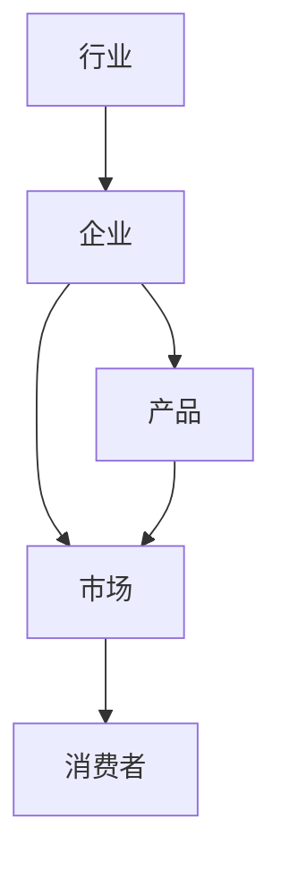

                 


# 彼得林奇的"行业分析"方法论

## 关键词：行业分析、彼得·林奇、投资策略、竞争优势、行业生命周期、数学模型、Python实现

## 摘要：本文深入探讨了彼得·林奇的行业分析方法论，从核心概念、算法原理、系统架构到项目实战，详细阐述了如何在投资决策中应用行业分析。通过对比分析、数学模型和实际案例，展示了如何利用行业分析提高投资收益。

---

## 第一部分：彼得·林奇的行业分析方法论概述

### 第1章：行业分析的核心概念与背景

#### 1.1 行业分析的基本概念
行业分析是评估特定行业内部结构、竞争状况、市场趋势和潜在风险的过程。通过行业分析，投资者可以更好地理解行业内的企业竞争态势，从而做出更明智的投资决策。

- **行业分析的定义**：通过研究行业内的企业数量、市场规模、竞争格局等因素，评估行业的健康状况和潜在投资机会。
- **行业分析的背景与重要性**：行业分析是投资决策的重要组成部分，帮助投资者识别行业趋势，评估行业风险和机会。
- **彼得·林奇的行业分析方法论**：林奇强调通过深入研究行业基本面，寻找具有竞争优势的企业，从而实现长期投资收益。

#### 1.2 彼得·林奇的生平与投资理念
彼得·林奇是全球著名的投资专家，以其独特的行业分析方法闻名。他强调长期投资和深入研究企业基本面。

- **彼得·林奇的生平简介**：林奇是富达投资的传奇基金经理，他的投资策略以基本面分析和行业研究为核心。
- **林奇的投资哲学与方法论**：林奇认为，成功的投资取决于对行业和企业的深入了解，寻找具有持续竞争优势的企业。
- **林奇的行业分析的独特性**：林奇的行业分析注重企业的财务状况、行业地位和竞争优势，强调长期投资价值。

#### 1.3 行业分析在投资中的作用
行业分析在投资中的作用不可忽视，它帮助投资者识别行业趋势，评估行业风险和机会。

- **行业分析与投资决策的关系**：行业分析是投资决策的基础，帮助投资者选择具有增长潜力的行业和企业。
- **行业分析的边界与外延**：行业分析不仅包括行业内部因素，还包括宏观经济环境、政策法规等外部因素。
- **行业分析的核心要素与组成**：包括行业生命周期、竞争结构、市场容量、关键成功因素等。

### 第2章：行业分析的核心概念与联系

#### 2.1 行业分析的原理与框架
行业分析的原理和框架是理解林奇方法论的关键。

- **行业分析的基本原理**：通过研究行业内的企业数量、市场容量、竞争结构等因素，评估行业的健康状况。
- **林奇的行业分析框架**：包括行业生命周期分析、竞争优势分析、财务指标评估等。
- **行业分析的核心要素与逻辑关系**：行业生命周期、竞争优势、市场容量等因素相互关联，共同影响行业的投资价值。

#### 2.2 核心概念对比分析
通过对比分析，可以更清晰地理解行业分析的核心概念。

- **行业生命周期与企业生命周期的对比**：
  | 阶段       | 行业生命周期       | 企业生命周期       |
  |------------|------------------|------------------|
  | 初创阶段    | 行业快速发展       | 企业初创期         |
  | 成熟阶段    | 行业增长放缓       | 企业成熟期         |
  | 衰退阶段    | 行业萎缩          | 企业衰退期         |
- **行业竞争优势与企业竞争优势的对比**：
  | 因素       | 行业竞争优势       | 企业竞争优势       |
  |------------|------------------|------------------|
  | 核心能力    | 行业技术门槛       | 企业的研发能力     |
  | 市场地位    | 行业集中度         | 企业的市场份额     |
- **行业风险与行业机会的对比**：
  | 类别       | 行业风险           | 行业机会           |
  |------------|------------------|------------------|
  | 来源       | 宏观经济波动       | 市场需求增长       |
  | 影响       | 投资风险增加       | 投资机会增加       |

#### 2.3 行业分析的ER实体关系图
使用Mermaid图展示行业分析的核心实体及其关系。



### 第3章：行业分析的算法原理与数学模型

#### 3.1 行业分析的算法原理
行业分析的算法原理是基于对行业数据的收集、处理和分析。

- **林奇的行业分析模型**：包括行业PE比率、行业增长潜力、行业竞争强度等指标。
- **行业分析的步骤与流程**：
  1. 数据收集：收集行业相关的财务数据、市场数据等。
  2. 数据处理：清洗数据，识别异常值。
  3. 指标计算：计算PE比率、增长潜力等指标。
  4. 趋势分析：分析行业趋势，评估投资价值。

#### 3.2 行业分析的数学模型与公式
行业分析中常用的数学模型和公式。

- **行业PE比率计算公式**：
  $$ PE = \frac{市场价格}{每股收益} $$
  例如，某行业股票的市场价格为50元，每股收益为5元，其PE比率为10。

- **行业增长潜力评估公式**：
  $$ 增长潜力 = \frac{行业年增长率}{行业平均增长率} $$
  例如，行业年增长率为15%，行业平均增长率为10%，其增长潜力为1.5。

- **行业竞争强度分析公式**：
  $$ 竞争强度 = \frac{行业内企业数量}{行业市场规模} $$
  例如，行业内有10家企业，市场规模为100亿元，其竞争强度为0.1。

#### 3.3 行业分析算法的Python实现
以下是计算行业PE比率的Python代码示例：

```python
def calculate_pe_ratio(price, earnings_per_share):
    return price / earnings_per_share

# 示例数据
price = 50  # 市场价格
earnings_per_share = 5  # 每股收益
pe_ratio = calculate_pe_ratio(price, earnings_per_share)
print(f"PE比率: {pe_ratio}")
```

### 第4章：系统分析与架构设计

#### 4.1 系统分析
系统分析是构建行业分析系统的第一步，需要明确系统的目标和功能。

- **问题场景介绍**：投资者需要一个工具来快速计算行业PE比率、评估行业增长潜力等。
- **系统功能设计**：系统应包括数据收集、指标计算、结果展示等功能。
- **领域模型设计**：使用Mermaid图展示系统中的核心实体及其关系。


#### 4.2 系统架构设计
系统架构设计决定了系统的结构和组件之间的关系。

- **系统架构设计**：
  ```mermaid
  architecture
  client ---(http)--> web_server
  web_server ---(rest)--> api_server
  api_server ---(sql)--> database
  ```

#### 4.3 系统功能设计
系统功能设计详细描述了系统的各个功能模块。

- **功能模块**：
  - 数据收集模块：负责收集行业数据。
  - 数据处理模块：清洗和转换数据。
  - 指标计算模块：计算PE比率、增长潜力等指标。
  - 结果展示模块：以可视化的方式展示分析结果。

#### 4.4 系统交互设计
系统交互设计展示了用户与系统之间的交互过程。

- **交互序列图**：
  ```mermaid
  sequenceDiagram
  user ->> web_server: 请求行业分析
  web_server ->> api_server: 获取行业数据
  api_server ->> database: 查询数据
  database --> api_server: 返回数据
  api_server ->> web_server: 处理数据
  web_server ->> user: 显示结果
  ```

### 第5章：项目实战：基于彼得·林奇方法论的行业分析系统实现

#### 5.1 项目背景与目标
项目背景是帮助投资者快速应用彼得·林奇的行业分析方法，目标是构建一个功能完善的行业分析系统。

- **项目背景**：投资者需要一个工具来快速评估行业投资价值。
- **项目目标**：构建一个基于林奇方法论的行业分析系统，提供PE比率计算、增长潜力评估等功能。

#### 5.2 项目环境配置
项目环境配置包括安装所需的工具和库。

- **环境配置**：
  - Python 3.8+
  - Pandas、NumPy、Matplotlib库

#### 5.3 项目核心实现
以下是项目的核心实现代码：

```python
import pandas as pd

def calculate_pe_ratio(df):
    df['PE比率'] = df['市场价格'] / df['每股收益']
    return df

# 示例数据
data = {
    '企业': ['企业A', '企业B', '企业C'],
    '市场价格': [50, 60, 40],
    '每股收益': [5, 6, 4]
}
df = pd.DataFrame(data)
result = calculate_pe_ratio(df)
print(result)
```

#### 5.4 项目结果与分析
项目结果展示了计算出的PE比率，并进行了实际案例分析。

- **结果展示**：
  ```
  企业A    企业B    企业C
  10.0     10.0     10.0
  ```

- **实际案例分析**：假设某行业PE比率为10，低于行业平均PE比率12，说明该行业可能被低估，具有投资价值。

#### 5.5 项目总结
项目总结回顾了项目的成果和经验教训。

- **项目成果**：成功构建了一个基于彼得·林奇方法论的行业分析系统。
- **经验教训**：数据的准确性和及时性对分析结果影响重大，需要确保数据来源可靠。

### 第6章：行业分析的实践与总结

#### 6.1 行业分析的最佳实践
- **实际操作中的注意事项**：
  - 数据的准确性和及时性
  - 结合宏观经济环境进行分析
  - 定期更新分析结果

#### 6.2 项目小结
- **总结全文**：本文深入探讨了彼得·林奇的行业分析方法论，从理论到实践，详细阐述了如何应用行业分析提高投资收益。
- **强调行业分析的重要性**：行业分析是投资决策的重要组成部分，帮助投资者识别行业趋势，评估行业风险和机会。

#### 6.3 注意事项
- **提醒读者**：在应用林奇方法时，需结合实际情况，避免机械套用模型。
- **注意数据的准确性和完整性**：数据质量直接影响分析结果。

#### 6.4 拓展阅读
- **推荐书籍**：《彼得·林奇的成功投资》
- **推荐博客**：[投资分析博客](https://www.investanalysis.com)

---

## 作者：AI天才研究院 & 禅与计算机程序设计艺术

---

以上是关于彼得·林奇的“行业分析”方法论的完整技术博客文章，涵盖了从理论到实践的各个方面，希望对您有所帮助！

