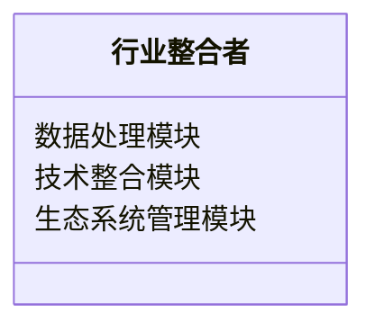
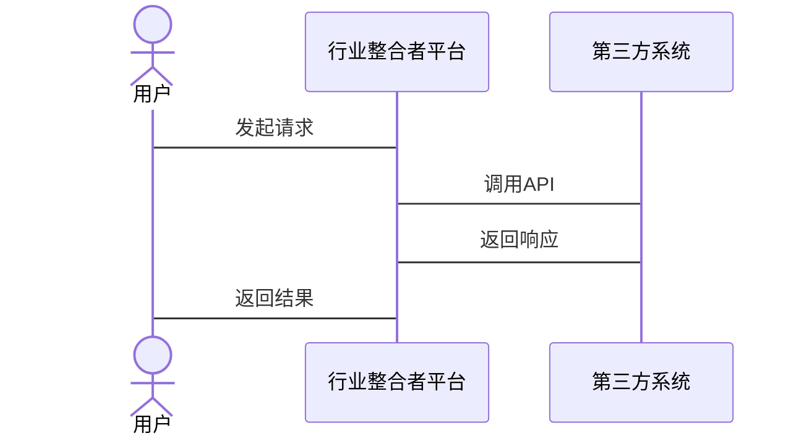

                 


# 彼得林奇的"行业整合者"在数字化浪潮中的特征

## 关键词：行业整合者，数字化浪潮，彼得林奇，技术整合，数字化转型

## 摘要：彼得·林奇提出的“行业整合者”在当前数字化浪潮中展现出独特的特征。本文从行业整合者的定义出发，分析其在数字化转型中的核心作用，探讨其与数字化技术的结合，揭示其在数据驱动决策、技术整合能力以及生态系统构建等方面的优势。通过详细的算法原理、系统架构设计和实际案例分析，本文深入解读行业整合者在数字化浪潮中的角色和应用，为企业提供实践指导和未来展望。

---

## 第1章: 数字化浪潮与行业整合者的背景

### 1.1 数字化浪潮的背景与趋势
#### 1.1.1 数字化浪潮的定义与特征
数字化浪潮是指当前信息技术和数据驱动的商业模式转型趋势，涵盖大数据、人工智能、云计算等领域。其核心是通过数字技术优化业务流程、提升效率和创造新价值。

#### 1.1.2 数字化浪潮对企业的影响
企业通过数字化转型实现业务模式创新、成本降低和竞争力提升。数字化浪潮推动企业从传统运营向智能化、数据驱动的模式转变。

#### 1.1.3 行业整合者在数字化浪潮中的角色
行业整合者在数字化浪潮中充当催化剂，通过技术整合和生态系统构建，推动行业向更高效率和价值的方向发展。

### 1.2 行业整合者的定义与特征
#### 1.2.1 行业整合者的定义
行业整合者是指在行业内通过技术、数据和资源整合，推动行业标准化和协同发展的企业或组织。

#### 1.2.2 行业整合者的特征
- **数据驱动决策**：利用大数据和人工智能技术进行精准决策。
- **技术整合能力**：能够整合行业上下游资源，构建高效的技术生态系统。
- **生态系统构建**：通过合作和创新，形成可持续发展的行业生态。

#### 1.2.3 行业整合者与传统企业的区别
传统企业通常专注于单一领域，而行业整合者具备跨领域的整合能力和数据驱动的决策优势。

### 1.3 数字化浪潮与行业整合者的结合
#### 1.3.1 数字化浪潮对行业整合的影响
数字化技术为行业整合者提供了新的工具和方法，推动了行业的深度融合和创新。

#### 1.3.2 行业整合者在数字化转型中的作用
行业整合者通过技术整合和数据共享，帮助传统企业实现数字化转型，提升行业整体效率。

#### 1.3.3 数字化浪潮中的行业整合趋势
行业整合者在数字化浪潮中逐渐成为行业领导者，推动行业向智能化、数据化的方向发展。

## 第2章: 数字化浪潮中的行业整合者特征分析

### 2.1 行业整合者的特征分析
#### 2.1.1 数据驱动的决策能力
行业整合者利用大数据分析和机器学习模型，进行精准的市场预测和决策优化。

#### 2.1.2 技术整合能力
行业整合者能够整合多种技术资源，构建高效的技术解决方案，提升行业整体技术水平。

#### 2.1.3 生态系统的构建能力
行业整合者通过合作和创新，构建开放的行业生态系统，促进资源的共享和价值的共创。

### 2.2 数字化转型中的行业整合者
#### 2.2.1 数字化转型的定义与目标
数字化转型是指通过数字技术的应用，实现业务流程优化、组织变革和价值创新。

#### 2.2.2 行业整合者在数字化转型中的核心作用
行业整合者通过技术整合和数据共享，帮助企业在数字化转型中实现协同创新和效率提升。

#### 2.2.3 数字化转型中的行业整合策略
行业整合者通过构建数字平台和生态系统，推动行业上下游企业实现协同发展。

### 2.3 行业整合者与数字化技术的结合
#### 2.3.1 大数据技术的应用
行业整合者利用大数据分析技术，进行市场洞察和精准营销，提升决策效率。

#### 2.3.2 人工智能技术的应用
行业整合者通过人工智能技术优化业务流程，实现自动化和智能化的运营。

#### 2.3.3 云计算技术的应用
行业整合者借助云计算技术，构建弹性扩展的数字平台，支持海量数据处理和资源共享。

## 第3章: 数字化浪潮中的行业整合者核心概念与联系

### 3.1 核心概念原理
#### 3.1.1 数据驱动的决策模型
行业整合者利用大数据和机器学习模型，构建数据驱动的决策系统，优化业务流程。

#### 3.1.2 技术整合的系统架构
行业整合者通过技术整合，构建高效的系统架构，支持跨平台的协同工作和资源优化。

#### 3.1.3 生态系统的构建方法
行业整合者通过合作和创新，构建开放的行业生态系统，促进资源的共享和价值的共创。

### 3.2 核心概念属性特征对比表格
| 特征         | 传统企业         | 行业整合者       |
|--------------|------------------|------------------|
| 数据驱动      | 有限             | 强大             |
| 技术整合      | 单一             | 跨界             |
| 生态系统构建  | 封闭             | 开放             |

### 3.3 ER实体关系图架构
```mermaid
er
    %% 行业整合者与数字化技术的实体关系图
    actor 行业整合者
    class 行业整合者技术平台
    class 数字化技术
    行业整合者 --> 行业整合者技术平台: 使用
    行业整合者 --> 数字化技术: 整合
    行业整合者技术平台 --> 数字化技术: 集成
```

### 3.4 本章小结
本章通过核心概念原理和对比分析，揭示了行业整合者在数字化浪潮中的独特优势和关键特征，为后续的算法和系统设计奠定了基础。

## 第4章: 数字化浪潮中的行业整合者算法原理讲解

### 4.1 数据处理与分析算法
#### 4.1.1 数据清洗算法
数据清洗是去除噪声数据和异常值的过程，确保数据质量。

#### 4.1.2 数据特征提取算法
通过主成分分析（PCA）提取数据的关键特征，降低数据维度。

#### 4.1.3 数据建模与预测算法
使用线性回归或随机森林模型进行预测，优化业务决策。

### 4.2 行业整合者决策模型
#### 4.2.1 基于机器学习的决策模型
利用监督学习算法（如支持向量机）进行分类和预测。

#### 4.2.2 基于规则的决策模型
通过专家系统制定业务规则，辅助决策。

#### 4.2.3 基于案例的决策模型
通过案例推理方法，借鉴历史案例进行决策。

### 4.3 算法原理的数学模型与公式
#### 4.3.1 线性回归模型
$$ y = \beta_0 + \beta_1x + \epsilon $$

#### 4.3.2 支持向量机模型
$$ \text{最大化} \quad 1 - \xi_i $$
$$ \text{受约束于} \quad y_i(\beta_0 + \beta_1x_i) \geq 1 - \xi_i $$

### 4.4 本章小结
本章通过具体的算法原理和数学模型，详细讲解了行业整合者在数据处理和决策优化中的技术实现。

---

## 第5章: 数字化浪潮中的行业整合者系统分析与架构设计

### 5.1 问题场景介绍
行业整合者需要构建一个支持数据处理、技术整合和生态系统管理的数字化平台。

### 5.2 系统功能设计
#### 5.2.1 领域模型设计


#### 5.2.2 系统架构设计


#### 5.2.3 系统接口设计
系统接口包括数据接口、API接口和用户接口，支持与其他系统的无缝对接。

#### 5.2.4 系统交互设计


### 5.3 本章小结
本章通过系统架构设计和交互流程图，详细描述了行业整合者在数字化平台中的实现方案。

---

## 第6章: 数字化浪潮中的行业整合者项目实战

### 6.1 环境安装
安装Python、Jupyter Notebook和相关库（如numpy、pandas、scikit-learn）。

### 6.2 系统核心实现源代码
```python
# 示例代码：数据清洗与建模
import pandas as pd
from sklearn.model_selection import train_test_split
from sklearn.linear_model import LinearRegression

# 加载数据
data = pd.read_csv('data.csv')

# 数据清洗
data.dropna(inplace=True)

# 划分训练集和测试集
X = data[['feature1', 'feature2']]
y = data['target']
X_train, X_test, y_train, y_test = train_test_split(X, y, test_size=0.2)

# 建立模型
model = LinearRegression()
model.fit(X_train, y_train)

# 预测和评估
y_pred = model.predict(X_test)
print('预测结果:', y_pred)
```

### 6.3 代码应用解读与分析
代码实现了数据清洗、特征选择和线性回归模型的训练与预测，展示了行业整合者在数据处理和决策优化中的技术实现。

### 6.4 实际案例分析
通过具体案例分析，展示了行业整合者如何利用数字化技术解决实际业务问题，提升行业效率。

### 6.5 本章小结
本章通过项目实战，帮助读者理解行业整合者在数字化平台中的具体实现和应用。

---

## 第7章: 数字化浪潮中的行业整合者最佳实践与小结

### 7.1 最佳实践 tips
- 技术整合要注重开放性和可扩展性。
- 数据驱动决策要结合业务场景，避免过于依赖模型。
- 生态系统构建要注重合作伙伴的协同和资源共享。

### 7.2 小结
本篇文章从背景、特征、算法、系统设计和项目实战等多个方面，全面解读了彼得·林奇提出的“行业整合者”在数字化浪潮中的特征和应用，为企业的数字化转型提供了理论和实践指导。

### 7.3 注意事项
在数字化转型过程中，企业要注重数据安全和隐私保护，避免因技术整合带来潜在风险。

### 7.4 拓展阅读
推荐阅读《彼得·林奇的投资哲学》和《数字化转型的实践指南》，深入了解行业整合者和数字化技术的更多细节。

---

## 作者：AI天才研究院/AI Genius Institute & 禅与计算机程序设计艺术 /Zen And The Art of Computer Programming

