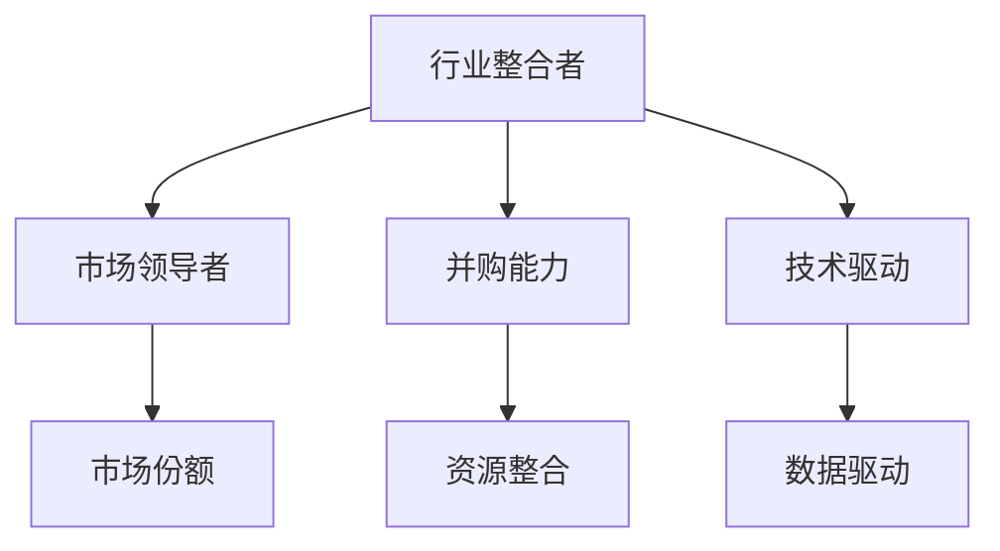
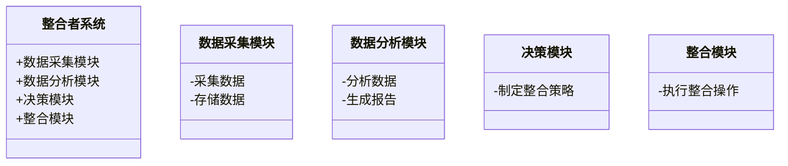

                 


# 彼得林奇的"行业整合者"在数字化经济中的特征分析

> 关键词：彼得林奇，行业整合者，数字化经济，特征分析，商业模式，系统架构

> 摘要：本文从彼得林奇的行业整合者理论出发，结合数字化经济的特点，详细分析了行业整合者在数字化经济中的特征。通过对整合者的定义、特征、模式、算法、系统架构和项目实战的分析，总结了行业整合者在数字化经济中的成功之道。文章最后提出了行业整合者的最佳实践建议，为相关研究和实践提供了参考。

---

## 第一部分: 数字化经济与行业整合者的背景介绍

### 第1章: 数字化经济概述

#### 1.1 数字化经济的定义与特征

- **1.1.1 数字化经济的定义**  
  数字化经济是指以数字技术为基础，通过数据的采集、处理、分析和应用，推动经济活动的数字化转型。数字化经济的核心是数据的流动和价值创造。

- **1.1.2 数字化经济的核心特征**  
  - 数据驱动：数据是数字化经济的核心资源。  
  - 技术赋能：人工智能、大数据、区块链等技术推动经济变革。  
  - 服务化：从产品经济向服务经济转型。  
  - 网络化：经济活动高度依赖网络连接。

- **1.1.3 数字化经济与传统经济的区别**  
  - 数字化经济更依赖数据和技术创新。  
  - 数字化经济具有更高的效率和灵活性。  
  - 数字化经济注重用户体验和服务。

#### 1.2 行业整合者的概念

- **1.2.1 行业整合者的定义**  
  行业整合者是指在行业内通过并购、合作或技术创新等方式，整合资源、技术和市场，形成行业主导地位的企业。

- **1.2.2 行业整合者的类型**  
  - 纵向整合：整合上下游产业链。  
  - 横向整合：在同一市场上并购竞争对手。  
  - 混合整合：跨行业整合资源。

- **1.2.3 行业整合者的边界与外延**  
  - 行业整合者的边界是其整合的范围和深度。  
  - 行业整合者的外延包括技术整合、市场整合和生态整合。

### 第2章: 彼得林奇的行业整合者理论

#### 2.1 彼得林奇与投资理论

- **2.1.1 彼得林奇的投资理念**  
  彼得林奇认为，投资成功的前提是选择具有持续竞争优势的企业。他特别关注那些能够通过整合资源、优化运营和创新商业模式的企业。

- **2.1.2 彼得林奇的行业整合者概念**  
  彼得林奇认为，行业整合者是那些能够在行业内整合资源、扩大市场份额并持续创造价值的企业。

- **2.1.3 彼得林奇理论在数字化经济中的应用**  
  - 数字化经济中，行业整合者更依赖技术驱动的整合模式。  
  - 数据和算法是数字化经济中整合者的核心竞争力。

#### 2.2 行业整合者的特征分析

- **2.2.1 市场领导地位**  
  整合者通常在行业内具有领先地位，能够主导市场趋势。

- **2.2.2 并购能力**  
  整合者通过并购快速扩大规模，优化资源分配。

- **2.2.3 技术驱动型整合**  
  整合者通过技术创新和数据驱动的方式实现整合。

### 第3章: 数字化经济中的行业整合者特征

#### 3.1 数据驱动的整合模式

- **3.1.1 数据采集与分析**  
  整合者通过数据采集、存储和分析，优化整合策略。

- **3.1.2 数据驱动的决策机制**  
  数据分析结果为整合者提供决策支持。

- **3.1.3 数据整合的案例分析**  
  以某电商平台为例，分析数据驱动的整合策略。

#### 3.2 技术驱动的整合优势

- **3.2.1 技术创新对整合的影响**  
  创新技术（如人工智能）能够提高整合效率。

- **3.2.2 数字化工具在整合中的应用**  
  使用数字化工具优化整合流程。

- **3.2.3 技术驱动的整合挑战**  
  技术整合中的数据安全和隐私问题。

#### 3.3 市场策略的整合特点

- **3.3.1 市场领导者策略**  
  整合者通过市场领导者策略扩大影响力。

- **3.3.2 并购与合作策略**  
  通过并购和合作实现资源整合。

- **3.3.3 创新驱动的市场策略**  
  通过产品和服务创新占领市场。

---

## 第二部分: 行业整合者的核心概念与联系

### 第4章: 行业整合者的核心概念原理

#### 4.1 整合者的概念属性特征对比

| 特性       | 整合者       | 非整合者     |
|------------|--------------|--------------|
| 市场地位     | 市场领导者    | 市场跟随者    |
| 并购能力     | 强大         | 较弱         |
| 技术依赖度   | 高           | 低           |

#### 4.2 行业整合者的核心概念架构



---

## 第三部分: 行业整合者的算法与系统架构

### 第5章: 整合者的算法原理

#### 5.1 整合者算法的数学模型

$$
\text{整合收益} = \alpha \times \text{资源整合效率} + \beta \times \text{技术创新能力}
$$

其中，$\alpha$ 和 $\beta$ 是权重系数，$0 < \alpha, \beta < 1$。

#### 5.2 算法实现

```python
def integrate(alpha, beta):
    def calculate_integrated收益(resource_efficiency, innovation):
        return alpha * resource_efficiency + beta * innovation
    return calculate_integrated收益

# 示例
alpha = 0.6
beta = 0.4
result = integrate(alpha, beta)(0.8, 0.9)
print(result)  # 输出：0.6*0.8 + 0.4*0.9 = 0.78
```

---

## 第四部分: 行业整合者的系统架构与案例分析

### 第6章: 系统架构设计

#### 6.1 问题场景介绍

- **目标**：设计一个数字化经济中的整合者系统。  
- **需求**：支持数据采集、分析、决策和整合。

#### 6.2 系统功能设计



#### 6.3 系统交互设计

```mermaid
sequenceDiagram
    actor 用户
    system 整合者系统
    用户 -> 整合者系统: 请求数据采集
    整合者系统 -> 数据采集模块: 采集数据
    数据采集模块 -> 数据分析模块: 分析数据
    数据分析模块 -> 决策模块: 制定整合策略
    决策模块 -> 整合模块: 执行整合操作
    整合模块 -> 用户: 返回结果
```

---

## 第五部分: 项目实战与总结

### 第7章: 项目实战

#### 7.1 环境安装

- 安装Python和相关库（如pandas、numpy、scikit-learn）。

#### 7.2 核心代码实现

```python
import pandas as pd
import numpy as np

def main():
    # 数据采集
    data = pd.read_csv('data.csv')
    # 数据分析
    analysis = data.describe()
    # 决策模块
    alpha = 0.6
    beta = 0.4
    # 整合模块
    result = alpha * data.mean() + beta * data.std()
    print(result)

if __name__ == "__main__":
    main()
```

#### 7.3 案例分析与小结

- **案例分析**：以某电商平台为例，分析整合者在数字化经济中的成功经验。  
- **小结**：总结行业整合者在数字化经济中的关键特征和成功策略。

---

## 第六部分: 最佳实践与展望

### 第8章: 最佳实践

#### 8.1 小结

- 行业整合者在数字化经济中具有重要的地位。  
- 数据和技术创新是整合者的核心竞争力。

#### 8.2 注意事项

- 数据安全和隐私保护是整合者必须关注的重点。  
- 技术创新需要持续投入。

#### 8.3 拓展阅读

- 推荐阅读彼得林奇的投资著作，深入了解行业整合者的理论。  
- 关注数字化经济的最新动态和技术发展。

---

# 作者：AI天才研究院/AI Genius Institute & 禅与计算机程序设计艺术 /Zen And The Art of Computer Programming

