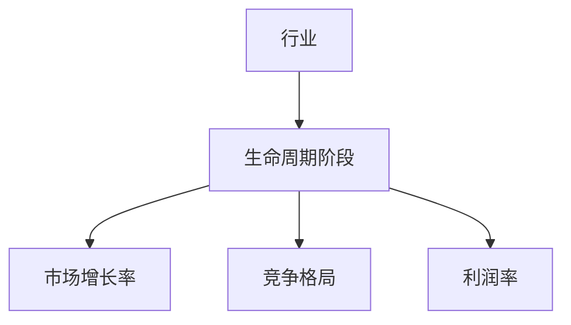
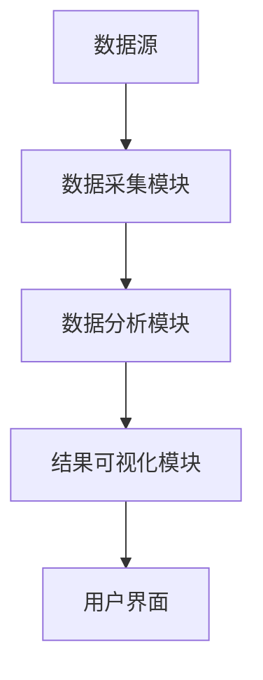

                 


# 彼得林奇的"行业生命周期"分析框架

## 关键词：行业生命周期，彼得林奇，投资分析，行业分析，生命周期阶段

## 摘要：  
彼得·林奇的行业生命周期分析框架是一种经典的投资分析方法，通过分析行业的不同生命周期阶段，帮助投资者做出更明智的投资决策。本文将详细探讨行业生命周期的核心概念、分析方法、数学模型以及实际应用，帮助读者全面理解并掌握这一分析框架。

---

## 第一部分: 行业生命周期的基本概念

### 第1章: 行业生命周期的基本概念

#### 1.1 什么是行业生命周期
行业生命周期是指一个行业从诞生到成熟，再到衰退和可能的再生的整个发展过程。它类似于企业生命周期，但适用于整个行业。行业生命周期的分析对于投资者来说至关重要，因为不同阶段的行业具有不同的投资价值和风险。

- **行业生命周期的定义**：行业生命周期是指一个行业从初创期到成熟期，再到衰退期的演变过程。  
- **行业生命周期的核心要素**：包括市场规模、市场增长率、竞争格局、利润率等。  
- **行业生命周期与企业发展的关系**：行业的生命周期直接影响企业的发展空间和竞争环境。

#### 1.2 行业生命周期的阶段划分
彼得林奇将行业生命周期划分为四个主要阶段：

1. **初创期（成长期）**：行业刚刚起步，市场增长率高，竞争较小，但风险较大。  
2. **成熟期**：行业市场趋于饱和，增长率放缓，竞争激烈，利润稳定。  
3. **衰退期**：行业需求下降，市场萎缩，利润减少，企业倒闭率上升。  
4. **再生期**：部分行业（如周期性行业）可能在衰退期后复苏并重新进入成长期。

#### 1.3 行业生命周期与投资策略
不同阶段的行业适合不同的投资策略：
- **初创期**：适合风险偏好较高的投资者，可能获得高回报。  
- **成熟期**：适合稳健型投资者，回报稳定。  
- **衰退期**：适合抄底型投资者，寻找被低估的机会。  
- **再生期**：适合周期性投资者，关注行业复苏带来的投资机会。

---

### 第2章: 行业生命周期的核心概念

#### 2.1 行业生命周期的核心要素
行业生命周期的核心要素包括市场规模、市场增长率、竞争格局和利润率。这些要素共同决定了行业的生命周期阶段和投资价值。

- **市场规模**：行业的市场规模越大，通常意味着行业处于成熟期或衰退期的可能性越大。  
- **市场增长率**：市场增长率是判断行业是否处于成长期的关键指标。  
- **竞争格局**：行业的竞争格局在成熟期最为激烈，而在初创期相对宽松。  
- **利润率**：利润率的变化反映了行业的盈利能力，通常在成熟期达到峰值。

#### 2.2 行业生命周期的特征对比
以下是不同生命周期阶段的特征对比表格：

| 阶段       | 市场增长率 | 竞争格局 | 利润率 | 风险 |
|------------|------------|-----------|--------|------|
| 初创期     | 高         | 低       | 低     | 高   |
| 成熟期     | 中         | 高       | 高     | 中   |
| 衰退期     | 低         | 高       | 低     | 高   |
| 再生机       | 高         | 低       | 中     | 中   |

#### 2.3 行业生命周期的ER实体关系图
以下是行业生命周期的实体关系图：



---

### 第3章: 彼得林奇的行业生命周期分析方法

#### 3.1 行业生命周期分析的核心步骤
彼得林奇的行业生命周期分析方法包括以下几个核心步骤：
1. **确定行业的生命周期阶段**：通过市场规模、市场增长率和利润率等指标判断行业所处的阶段。  
2. **分析行业竞争格局**：了解行业的竞争对手数量和市场集中度。  
3. **评估行业投资价值**：根据生命周期阶段和行业特征制定投资策略。  

#### 3.2 行业生命周期分析的工具与方法
- **数据分析工具**：使用Excel、Python等工具进行数据分析。  
- **行业比较法**：将目标行业与同行业进行对比分析。  
- **市场调研**：通过行业报告和市场数据获取行业生命周期信息。

---

## 第二部分: 行业生命周期的核心概念与联系

### 第4章: 行业生命周期的核心概念

#### 4.1 行业生命周期的核心要素
行业生命周期的核心要素包括市场规模、市场增长率、竞争格局和利润率。这些要素共同决定了行业的生命周期阶段和投资价值。

- **市场规模**：行业的市场规模越大，通常意味着行业处于成熟期或衰退期的可能性越大。  
- **市场增长率**：市场增长率是判断行业是否处于成长期的关键指标。  
- **竞争格局**：行业的竞争格局在成熟期最为激烈，而在初创期相对宽松。  
- **利润率**：利润率的变化反映了行业的盈利能力，通常在成熟期达到峰值。

#### 4.2 行业生命周期的特征对比
以下是不同生命周期阶段的特征对比表格：

| 阶段       | 市场增长率 | 竞争格局 | 利润率 | 风险 |
|------------|------------|-----------|--------|------|
| 初创期     | 高         | 低       | 低     | 高   |
| 成熟期     | 中         | 高       | 高     | 中   |
| 衰退期     | 低         | 高       | 低     | 高   |
| 再生机       | 高         | 低       | 中     | 中   |

#### 4.3 行业生命周期的ER实体关系图
以下是行业生命周期的实体关系图：


---

### 第5章: 行业生命周期的数学模型与公式

#### 5.1 行业生命周期的数学模型
行业生命周期的数学模型可以帮助投资者量化行业的生命周期阶段。以下是常用的数学模型：

1. **行业增长率预测模型**  
   使用时间序列分析预测行业的市场增长率。  
   $$\text{增长率} = \frac{\text{本期销售额} - \text{上期销售额}}{\text{上期销售额}}$$  

2. **行业生命周期的阶段划分公式**  
   根据市场增长率和利润率判断行业所处的阶段：  
   $$\text{阶段划分} = \begin{cases} 
   \text{初创期} & \text{如果增长率 > 20\% 且利润率 < 10\%} \\
   \text{成熟期} & \text{如果增长率在 5\% 到 20\% 之间且利润率 > 10\%} \\
   \text{衰退期} & \text{如果增长率 < 5\% 且利润率 < 10\%} \\
   \text{再生期} & \text{如果增长率 > 20\% 且利润率 > 10\%}
   \end{cases}$$  

#### 5.2 行业生命周期的数学公式示例
以下是使用Python进行行业增长率计算的代码示例：

```python
import pandas as pd

# 假设 df 是包含行业销售额数据的 DataFrame
# 计算年增长率
df['增长率'] = (df['本期销售额'] - df['上期销售额']) / df['上期销售额']
print(df['增长率'].head())
```

---

### 第6章: 行业生命周期的系统架构设计

#### 6.1 系统功能设计
行业生命周期分析系统包括以下功能模块：
1. **数据采集模块**：从数据库或外部数据源获取行业数据。  
2. **数据分析模块**：计算行业增长率、利润率等指标。  
3. **结果可视化模块**：生成行业生命周期阶段的图表。

#### 6.2 系统架构设计
以下是行业生命周期分析系统的架构图：



---

### 第7章: 行业生命周期的项目实战

#### 7.1 项目背景
本项目旨在通过彼得林奇的行业生命周期分析框架，分析一个具体行业的生命周期阶段，并制定相应的投资策略。

#### 7.2 数据收集
从公开数据源获取目标行业的市场规模、市场增长率和利润率等数据。

#### 7.3 数据分析
使用Python代码计算行业增长率和利润率，判断行业所处的生命周期阶段。

#### 7.4 结果可视化
生成行业生命周期阶段的图表，展示分析结果。

---

### 第8章: 行业生命周期的最佳实践

#### 8.1 小结
行业生命周期分析是投资决策的重要工具，通过分析行业的生命周期阶段，投资者可以制定更科学的投资策略。

#### 8.2 注意事项
- 数据分析的准确性是关键，需确保数据来源可靠。  
- 不同行业的生命周期特征可能有所不同，需结合具体情况进行分析。  
- 投资决策需结合宏观经济环境和其他因素，避免单一依赖行业生命周期分析。

#### 8.3 拓展阅读
- 彼得·林奇的《选股的艺术》  
- 克里斯托弗·布朗的《机构投资的信念体系》  

---

## 作者：AI天才研究院/AI Genius Institute & 禅与计算机程序设计艺术/Zen And The Art of Computer Programming

