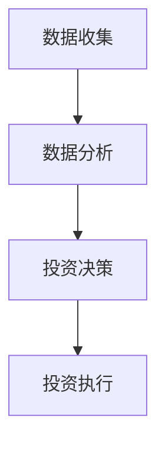
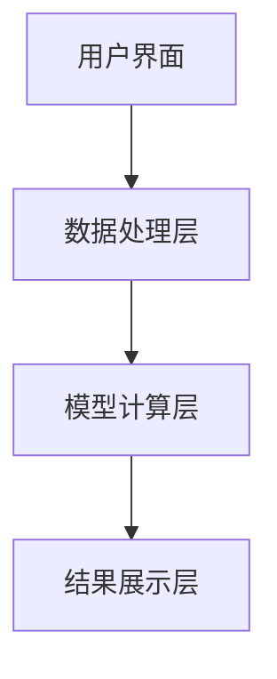

                 


# 彼得林奇的"行业轮动"投资策略

## 关键词：彼得·林奇，行业轮动，投资策略，经济周期，资产配置，风险管理，投资组合

## 摘要：本文深入探讨了彼得·林奇的行业轮动投资策略，分析其在经济周期变化中的应用，结合数学模型和系统架构设计，通过实际案例展示策略实施，帮助投资者优化资产配置和风险管理。

---

# 第一部分: 行业轮动的背景与概述

## 第1章: 行业轮动的背景与概述

### 1.1 行业轮动的基本概念
#### 1.1.1 行业轮动的定义
行业轮动是指投资者根据经济周期的变化，调整投资组合中不同行业资产的比例，以优化收益并降低风险。其核心在于识别不同经济阶段中表现优异的行业，并据此动态调整投资策略。

#### 1.1.2 行业轮动的重要性和必要性
在经济周期波动中，不同行业表现出不同的收益和风险特征。通过行业轮动，投资者可以在不同经济阶段选择收益较高的行业，从而提升整体投资回报。此外，行业轮动有助于分散投资风险，避免过度集中在单一行业带来的波动。

#### 1.1.3 行业轮动的基本原理
行业轮动基于经济周期理论，认为经济活动具有周期性。在不同周期阶段，不同行业的表现存在差异。例如，在经济增长阶段，周期性行业如制造业和建筑业表现较好；而在经济衰退阶段，防御性行业如公用事业和医疗保健可能更具稳定性。

---

## 第2章: 彼得·林奇的投资理念

### 2.1 彼得·林奇的个人简介
彼得·林奇是美国著名的投资专家，曾任富达投资集团的主席。他以深入的基本面分析和长期投资策略闻名，强调通过研究行业趋势和公司基本面来选择投资标的。

### 2.2 林奇的投资风格与特点
林奇的投资风格以价值投资为核心，注重长期收益和风险控制。他认为，成功的投资需要对行业趋势有深刻的理解，并能够在不同经济周期中灵活调整投资策略。

### 2.3 林奇对行业轮动策略的贡献
林奇在其著作中多次提到行业轮动的重要性。他认为，投资者应根据经济周期的变化，选择那些在当前经济阶段表现较好的行业进行投资。这种动态调整的投资策略帮助他在长期投资中取得了优异的业绩。

---

# 第二部分: 行业轮动的核心概念与联系

## 第3章: 行业轮动的核心概念与联系

### 3.1 行业轮动的核心概念
#### 3.1.1 经济周期与行业轮动的关系
经济周期分为复苏、增长、衰退和萧条四个阶段。不同阶段中，不同行业的表现存在显著差异。例如，在复苏阶段，金融和房地产行业可能表现较好，而在增长阶段，科技和制造业可能更具投资价值。

#### 3.1.2 行业轮动的驱动因素
行业轮动的驱动因素包括宏观经济政策、行业基本面变化、市场情绪和技术创新等。例如，政府的财政刺激政策可能推动基础设施行业的增长，而技术创新则可能提升科技行业的投资吸引力。

#### 3.1.3 行业轮动的周期性分析
通过对历史数据的分析，可以识别不同行业的周期性特征。例如，周期性行业如钢铁和汽车在经济复苏和增长阶段表现较好，而在衰退阶段则可能面临较大的下行压力。

### 3.2 行业轮动的核心要素对比
#### 3.2.1 不同经济周期下行业表现的对比
通过对比不同经济周期下各行业的表现，投资者可以更好地理解行业轮动的规律。例如，科技行业在经济衰退阶段可能表现不佳，而在复苏和增长阶段则可能有较高的收益。

#### 3.2.2 行业轮动与市场波动的关系
行业轮动与市场波动密切相关。在市场波动较大的情况下，行业轮动可以帮助投资者分散风险，避免因市场整体下跌而遭受损失。

#### 3.2.3 行业轮动与投资风险的关联
行业轮动虽然有助于优化投资组合的风险收益比，但也存在一定的风险。例如，行业轮动可能导致投资过于集中在某些行业，增加投资风险。

---

## 第4章: 行业轮动的数学模型与量化分析

### 4.1 行业轮动的数学模型
#### 4.1.1 行业轮动的数学公式
行业轮动可以通过多种数学模型进行量化分析。例如，可以通过回归分析来识别不同行业的收益与经济指标之间的关系。

$$ R_i = \beta_i \times R_m + \alpha_i $$

其中，\( R_i \) 表示行业 \( i \) 的收益，\( R_m \) 表示市场收益，\( \beta_i \) 表示行业 \( i \) 的贝塔系数，\( \alpha_i \) 表示行业的超额收益。

#### 4.1.2 行业轮动的量化指标
常用的行业轮动量化指标包括行业相对强弱（RSI）、行业波动率、行业市盈率等。这些指标可以帮助投资者判断行业的当前状态和未来趋势。

#### 4.1.3 行业轮动的预测模型
通过构建预测模型，投资者可以预测未来经济周期中的行业表现。例如，可以使用时间序列分析模型（如ARIMA）来预测行业的未来收益。

---

## 第5章: 行业轮动的系统架构设计

### 5.1 系统功能设计
#### 5.1.1 系统功能模块划分
行业轮动投资系统可以划分为数据收集、数据分析、投资决策和投资执行四个主要模块。

#### 5.1.2 系统功能流程图（使用Mermaid）


### 5.2 系统架构设计
#### 5.2.1 系统架构图（使用Mermaid）


---

## 第6章: 行业轮动的项目实战与最佳实践

### 6.1 环境安装与数据准备
#### 6.1.1 环境配置
投资者需要安装必要的投资分析软件，如Excel、Python等。建议使用Python和Pandas库进行数据处理和分析。

#### 6.1.2 数据来源与收集
数据可以来源于金融市场数据供应商，如Yahoo Finance、 Bloomberg等。需要收集各行业的历史收益数据、宏观经济指标等。

### 6.2 核心代码实现
#### 6.2.1 数据预处理代码
```python
import pandas as pd
import numpy as np

# 加载数据
data = pd.read_csv('industry_data.csv')

# 数据清洗
data = data.dropna()
data = data[~data['date'].duplicated()]
```

#### 6.2.2 行业轮动策略实现
```python
def industry_rotation_strategy(data, window=12):
    # 计算过去一年的平均收益
    data['过去一年收益'] = data['收益'].rolling(window=window).mean()
    # 选择收益最高的行业
    selected_industry = data.loc[data['过去一年收益'].idxmax(), '行业']
    return selected_industry
```

### 6.3 项目实战与案例分析
#### 6.3.1 实际案例分析
假设当前经济处于复苏阶段，根据历史数据，制造业和房地产行业的收益较高。因此，投资者可以将投资重点转向这两个行业。

#### 6.3.2 投资组合优化
通过行业轮动策略，投资者可以优化其投资组合，提高收益并降低风险。例如，在经济衰退阶段，增加对防御性行业的投资比例。

### 6.4 最佳实践 tips、小结、注意事项、拓展阅读
- **最佳实践 tips**：定期评估行业轮动策略的有效性，并根据市场变化进行调整。
- **小结**：行业轮动是一种有效的投资策略，但需要结合宏观经济分析和市场实际情况进行动态调整。
- **注意事项**：行业轮动存在一定的风险，投资者应具备一定的市场分析能力和风险控制能力。
- **拓展阅读**：建议阅读彼得·林奇的《彼得·林奇的成功投资》和《战胜华尔街》等书籍，以深入了解行业轮动和其他投资策略。

---

# 结论

行业轮动是彼得·林奇投资策略的重要组成部分，通过动态调整投资组合中的行业配置，投资者可以在不同经济周期中优化收益并降低风险。本文通过理论分析、数学模型和实际案例，详细介绍了行业轮动的投资策略，为投资者提供了实用的指导和建议。

---

# 作者：AI天才研究院/AI Genius Institute & 禅与计算机程序设计艺术 /Zen And The Art of Computer Programming

