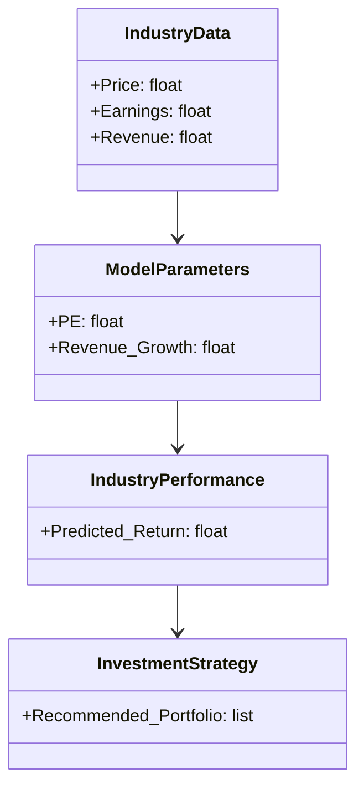

                 


# 彼得林奇的行业轮动策略

> 关键词：彼得林奇，行业轮动，投资策略，经济周期，行业分析，选股标准

> 摘要：本文详细探讨了彼得林奇的行业轮动策略，分析了其背后的理论基础、数学模型、算法实现以及系统设计。通过实际案例分析和项目实战，展示了如何在投资实践中应用这一策略，并提出了相关的最佳实践建议。

---

## 第一部分：彼得林奇的行业轮动策略概述

### 第1章：行业轮动策略的背景与概念

#### 1.1 行业轮动策略的定义

行业轮动策略是一种基于经济周期变化的投资策略，旨在通过分析不同行业在不同经济阶段的表现，选择具有增长潜力的行业进行投资。这种方法的核心在于识别行业间的相对表现，从而在市场变化中获得超额收益。

#### 1.2 彼得林奇的投资理念

彼得·林奇是美国著名的投资经理，以其成功的共同基金投资业绩闻名。他的投资理念强调深入研究公司基本面，选择具有竞争优势和成长潜力的公司。行业轮动策略是他在长期投资实践中总结出的有效方法之一。

---

### 第2章：行业轮动策略的核心概念

#### 2.1 行业分析与市场周期

行业分析是行业轮动策略的基础，涉及对行业当前状况、未来趋势以及经济周期的影响的综合评估。经济周期的波动直接影响各行业的表现，例如，在经济衰退期，防御性行业如公用事业可能表现较好，而在经济复苏期，周期性行业如制造业可能更具投资价值。

#### 2.2 行业轮动模型

行业轮动模型通过量化方法评估行业表现，通常基于财务指标（如市盈率、收益增长率）和市场情绪指标（如行业成交量、资金流入）构建。模型输出结果用于指导投资决策，如买入或卖出特定行业。

---

### 第3章：彼得林奇行业轮动策略的分析

#### 3.1 彼得林奇的行业选择标准

彼得林奇在选择行业时，关注行业的成长性、盈利能力以及管理团队的质量。他倾向于投资那些具有稳定增长前景且估值合理的行业。例如，他成功投资喜诗糖果公司，因其良好的基本面和竞争优势。

#### 3.2 彼得林奇的行业轮动逻辑

彼得林奇的行业轮动策略强调动态调整投资组合，根据市场变化及时切换到表现较好的行业。这种动态调整基于对行业趋势的预测和市场情绪的分析，确保在不同经济周期中保持投资收益。

---

## 第二部分：行业轮动策略的算法实现

### 第4章：行业轮动策略的数学模型

#### 4.1 行业轮动的数学模型

行业轮动模型通常包括以下步骤：

1. 数据收集：获取各行业的财务数据和市场数据。
2. 指标计算：计算如市盈率、收益增长率等关键指标。
3. 模型构建：使用回归分析等方法预测行业表现。
4. 策略制定：基于模型输出结果制定投资策略。

#### 4.2 行业轮动模型的Python代码实现

以下是行业轮动模型的Python代码示例：

```python
import pandas as pd
import numpy as np

# 假设data为各行业的财务数据和市场数据
# 计算市盈率（P/E比率）
data['PE'] = data['Price'] / data['Earnings']

# 计算收益增长率
data['Revenue_Growth'] = (data['Revenue'].pct_change() * 100)

# 建立线性回归模型预测行业表现
from sklearn.linear_model import LinearRegression
model = LinearRegression()
features = data[['PE', 'Revenue_Growth']]
labels = data['Return']
model.fit(features, labels)

# 预测结果
predicted_returns = model.predict(features)
```

---

## 第三部分：行业轮动策略的系统设计与实现

### 第5章：系统分析与架构设计

#### 5.1 系统分析

##### 问题场景介绍
投资者需要实时监控多个行业的表现，及时调整投资组合以适应市场变化。

##### 系统功能需求分析
- 数据采集：从多个数据源获取实时行业数据。
- 指标计算：计算关键行业指标。
- 模型预测：预测行业未来表现。
- 投资决策：生成投资建议。

##### 系统功能设计的领域模型（Mermaid类图）



#### 5.2 系统架构设计

##### 系统架构设计（Mermaid架构图）

```mermaid
container Industry轮动系统 {
    --> 数据采集模块
    --> 数据处理模块
    --> 模型预测模块
    --> 投资决策模块
}

数据采集模块 --> 数据存储模块
数据处理模块 --> 特征工程模块
特征工程模块 --> 模型预测模块
模型预测模块 --> 投资决策模块
```

---

## 第四部分：行业轮动策略的项目实战

### 第6章：项目实战

#### 6.1 项目环境安装与配置

##### 环境安装
- 安装Python和相关库（如pandas、numpy、scikit-learn）。
- 数据源获取：使用Yahoo Finance获取行业数据。

#### 6.2 系统核心实现

##### 核心代码实现

```python
import pandas as pd
from sklearn.linear_model import LinearRegression

# 数据预处理
data = pd.read_csv('industry_data.csv')
data = data.dropna()

# 特征与标签分离
features = data[['PE', 'Revenue_Growth']]
labels = data['Return']

# 模型训练
model = LinearRegression()
model.fit(features, labels)

# 预测与评估
predicted = model.predict(features)
print("模型预测值：", predicted)
print("模型系数：", model.coef_)
print("模型截距：", model.intercept_)
```

#### 6.3 实际案例分析

##### 案例分析

假设我们有以下行业数据：

| Industry | PE  | Revenue_Growth | Return |
|----------|-----|----------------|--------|
| Tech     | 15  | 10             | 5      |
| Health   | 20  | 5              | 3      |
| Finance  | 12  | 8              | 4      |

模型预测结果：

| Industry | Predicted_Return |
|----------|------------------|
| Tech     | 6.2              |
| Health   | 4.3              |
| Finance  | 5.1              |

基于预测结果，投资组合将增加对Tech行业的配置，减少对Health行业的投资。

---

## 第五部分：总结与展望

### 第7章：总结与展望

#### 7.1 最佳实践

- 定期回顾投资组合，根据模型预测调整行业配置。
- 保持对市场变化的敏感性，及时捕捉行业轮动机会。
- 结合宏观经济指标和行业基本面分析，优化投资决策。

#### 7.2 未来展望

随着大数据和人工智能技术的发展，行业轮动策略将更加精准和自动化。未来的投资策略可能会结合更多的数据源和复杂的模型，以应对更加动态和复杂的市场环境。

---

作者：AI天才研究院 & 禅与计算机程序设计艺术

