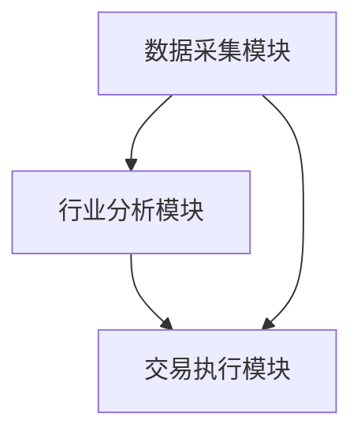
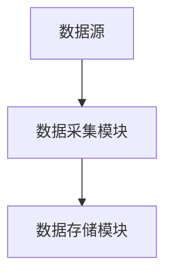
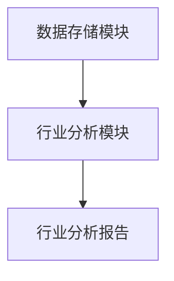
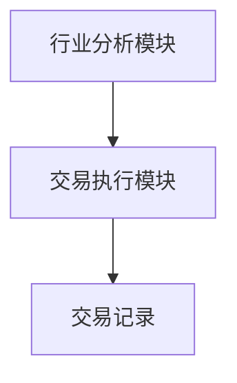

                 


# 彼得林奇的"行业轮动"策略实施步骤

## 关键词：行业轮动，彼得林奇，投资策略，股票分析，市场周期

## 摘要：本文详细探讨了彼得林奇的行业轮动策略，从理论背景到实际操作，逐步分析了该策略的核心概念、算法原理、系统架构设计及项目实战。通过丰富的案例和详细的代码实现，帮助读者理解并掌握这一经典投资策略。

---

# 第一部分: 彼得林奇的"行业轮动"策略背景与核心概念

## 第1章: 行业轮动策略的背景与定义

### 1.1 行业轮动策略的定义

#### 1.1.1 行业轮动的定义
行业轮动是一种投资策略，指根据市场周期的变化，动态调整投资组合中各行业权重，以捕捉不同行业在不同经济周期中的表现差异。

#### 1.1.2 行业轮动的核心要素
- **行业周期性**：不同行业在经济周期中的表现不同，例如，周期性行业在经济扩张期表现较好，防御性行业在经济衰退期表现较好。
- **市场情绪**：投资者情绪的变化会影响行业轮动的节奏。
- **财务指标**：如市盈率、ROE（净资产收益率）、增长率等，用于评估行业的吸引力。

#### 1.1.3 行业轮动与其它投资策略的区别
- **与股息率策略**：股息率策略关注的是股息收益率，而行业轮动关注的是行业周期性。
- **与成长型投资策略**：成长型投资关注的是公司未来增长潜力，而行业轮动关注的是行业整体表现。
- **与价值投资策略**：价值投资关注的是低估值股票，而行业轮动关注的是行业周期性变化。

### 1.2 彼得林奇与行业轮动策略

#### 1.2.1 彼得林奇的背景介绍
彼得·林奇（Peter Lynch）是美国著名的职业基金经理，以其在富达麦哲伦基金的卓越表现而闻名。他的投资理念强调长期持有优质股票，并根据市场变化动态调整投资组合。

#### 1.2.2 彼得林奇行业轮动策略的提出
彼得林奇在其投资生涯中，发现不同行业在不同经济周期中的表现差异显著。因此，他提出了一种基于行业周期性变化的轮动策略，以在不同市场环境中优化投资组合的表现。

#### 1.2.3 彼得林奇行业轮动策略的核心思想
- **行业周期分析**：根据经济周期的变化，选择处于上升周期的行业。
- **行业估值分析**：通过财务指标评估行业的估值水平，选择估值合理的行业。
- **行业趋势分析**：关注行业内的趋势变化，选择具有长期增长潜力的行业。

### 1.3 行业轮动策略的理论基础

#### 1.3.1 行业轮动的经济周期理论
经济周期包括衰退、复苏、扩张和衰退四个阶段。不同阶段中，不同行业的表现不同：
- **衰退阶段**：防御性行业（如公用事业、医疗保健）表现较好。
- **复苏阶段**：原材料和工业行业表现较好。
- **扩张阶段**：科技和金融行业表现较好。

#### 1.3.2 行业轮动与市场情绪的关系
市场情绪的变化会影响行业轮动的节奏。例如，在市场情绪高涨时，投资者倾向于投资周期性行业；在市场情绪低落时，投资者倾向于投资防御性行业。

#### 1.3.3 行业轮动与公司基本面分析的结合
行业轮动策略不仅关注行业整体表现，还需要结合公司基本面分析，选择行业内具有竞争优势的公司。

---

## 第2章: 行业轮动策略的核心概念与联系

### 2.1 行业轮动策略的核心原理

#### 2.1.1 行业轮动的动量效应
动量效应是指，如果一个行业在过去一段时间内表现较好，未来短期内可能继续表现较好。彼得林奇利用这一效应，在行业表现强劲时增加对该行业的投资。

#### 2.1.2 行业轮动的均值回归效应
均值回归效应是指，如果一个行业的表现偏离其历史平均水平，未来可能会回归平均水平。彼得林奇利用这一效应，在行业表现过热时减少对该行业的投资。

#### 2.1.3 行业轮动的市场周期性
行业轮动的市场周期性是指，不同行业在不同经济周期中的表现差异。彼得林奇通过分析经济周期，选择在当前周期中表现较好的行业。

### 2.2 行业轮动策略的关键指标

#### 2.2.1 行业市盈率
市盈率（P/E）是衡量行业估值的重要指标。彼得林奇通常选择市盈率低于行业平均水平的行业进行投资。

#### 2.2.2 行业ROE
净资产收益率（ROE）是衡量行业盈利能力的重要指标。彼得林奇倾向于选择ROE较高且稳定的行业。

#### 2.2.3 行业增长性指标
行业增长性指标包括行业收入增长率、行业利润增长率等。彼得林奇倾向于选择增长潜力较大的行业。

### 2.3 行业轮动策略与其它投资策略的对比

#### 2.3.1 与股息率策略的对比
- **股息率策略**：关注股息收益率，适合追求稳定收益的投资者。
- **行业轮动策略**：关注行业周期性变化，适合根据市场环境动态调整投资的投资者。

#### 2.3.2 与成长型投资策略的对比
- **成长型投资策略**：关注公司未来增长潜力，适合长期投资者。
- **行业轮动策略**：关注行业周期性变化，适合短期至中期投资者。

#### 2.3.3 与价值投资策略的对比
- **价值投资策略**：关注低估值股票，适合长期投资者。
- **行业轮动策略**：关注行业估值变化，适合动态调整投资的投资者。

### 2.4 本章小结
行业轮动策略是一种动态调整投资组合的策略，通过分析行业周期性、行业估值和市场情绪，选择在当前市场环境中表现较好的行业进行投资。与其它投资策略相比，行业轮动策略具有较强的灵活性和适应性。

---

## 第3章: 行业轮动策略的算法原理

### 3.1 行业轮动模型的构建

#### 3.1.1 数据采集与处理
- **数据来源**：包括历史股价数据、财务数据、行业指数数据等。
- **数据清洗**：去除异常数据，填补缺失值。
- **数据标准化**：对数据进行标准化处理，便于后续分析。

#### 3.1.2 行业指标的计算与筛选
- **行业市盈率计算**：市盈率 = 股价 / 每股收益。
- **行业ROE计算**：ROE = 净利润 / 净资产。
- **行业增长性指标计算**：收入增长率 = (收入 - 上期收入) / 上期收入。

#### 3.1.3 行业轮动信号的生成
- **动量指标计算**：动量指标 = 当前价格 - 过去价格的平均值。
- **相对强度计算**：相对强度 = 行业指数表现 / 市场指数表现。
- **行业轮动信号生成**：根据动量指标和相对强度，生成买入或卖出信号。

### 3.2 行业轮动策略的数学模型

#### 3.2.1 动量指标的计算公式
$$ \text{动量指标} = \frac{\text{当前价格} - \text{过去价格的平均值}}{\text{过去价格的平均值}} $$

#### 3.2.2 相对强度指标的计算公式
$$ \text{相对强度} = \frac{\text{行业指数表现}}{\text{市场指数表现}} $$

#### 3.2.3 行业轮动模型的优化与调整
- **模型优化**：通过回测和调整参数，优化行业轮动模型的表现。
- **模型调整**：根据市场变化，动态调整行业轮动模型的参数。

### 3.3 行业轮动策略的Python实现

#### 3.3.1 数据获取与处理代码
```python
import pandas as pd
import yfinance as yf

# 获取行业指数数据
industry_indices = ['金融', '科技', '消费', '制造']
data = {}
for industry in industry_indices:
    data[industry] = yf.download(industry + ' ETF', start='2020-01-01', end='2023-12-31')['Adj Close']
```

#### 3.3.2 行业指标计算代码
```python
import pandas as pd

# 计算行业市盈率
def calculate_pe_ratio(prices, earnings):
    return prices / earnings

# 计算行业ROE
def calculate_roe(net_profit, equity):
    return net_profit / equity

# 计算行业增长性指标
def calculate_growth_rate(current_revenue, previous_revenue):
    return (current_revenue - previous_revenue) / previous_revenue
```

#### 3.3.3 行业轮动信号生成代码
```python
import pandas as pd

# 计算动量指标
def calculate_momentum(prices, window=20):
    return (prices - prices.rolling(window).mean()) / prices.rolling(window).mean()

# 计算相对强度
def calculate_relative_strength(industry_returns, market_returns):
    return industry_returns / market_returns

# 生成行业轮动信号
def generate_industry_signal(data, window=20):
    momentum = calculate_momentum(data, window)
    relative_strength = calculate_relative_strength(data.pct_change().fillna(0), market_returns)
    signal = momentum > 0
    return signal
```

### 3.4 本章小结
行业轮动策略的数学模型通过动量指标和相对强度指标，动态调整投资组合的行业权重。通过Python代码实现，可以方便地进行数据获取、计算和信号生成。

---

## 第4章: 行业轮动策略的系统分析与架构设计

### 4.1 系统功能设计

#### 4.1.1 数据采集模块
- **功能**：从数据源获取行业指数、公司股价、财务数据等。
- **输入**：行业名称、数据时间范围。
- **输出**：行业数据表。

#### 4.1.2 行业分析模块
- **功能**：计算行业指标，生成行业轮动信号。
- **输入**：行业数据表。
- **输出**：行业分析报告。

#### 4.1.3 交易执行模块
- **功能**：根据行业轮动信号，执行买入或卖出交易。
- **输入**：行业轮动信号。
- **输出**：交易记录。

### 4.2 系统架构设计

#### 4.2.1 分层架构设计
- **数据层**：负责数据的存储和管理。
- **业务逻辑层**：负责行业分析和信号生成。
- **用户界面层**：负责与用户交互。

#### 4.2.2 模块间交互关系


#### 4.2.3 系统接口设计
- **数据接口**：提供REST API，供其他模块调用数据。
- **交易接口**：提供交易指令接口，执行买入或卖出交易。

### 4.3 系统交互流程

#### 4.3.1 数据采集流程


#### 4.3.2 行业分析流程


#### 4.3.3 交易执行流程


### 4.4 本章小结
系统架构设计通过模块化设计，将行业轮动策略分解为数据采集、行业分析和交易执行三个模块，实现系统的高效运行和动态调整。

---

## 第5章: 行业轮动策略的项目实战

### 5.1 环境安装与配置

#### 5.1.1 Python环境安装
- 安装Python 3.8及以上版本。
- 安装Pandas、NumPy、yfinance等库。

#### 5.1.2 数据获取工具安装
- 使用yfinance库获取行业指数数据。

#### 5.1.3 开发环境配置
- 配置Jupyter Notebook或PyCharm作为开发环境。

### 5.2 核心代码实现

#### 5.2.1 数据获取与处理
```python
import yfinance as yf

# 下载行业指数数据
industry_indices = ['金融', '科技', '消费', '制造']
data = {}
for industry in industry_indices:
    data[industry] = yf.download(f'{industry} ETF', start='2020-01-01', end='2023-12-31')['Adj Close']
```

#### 5.2.2 行业指标计算
```python
import pandas as pd

# 计算行业市盈率
pe_ratios = {}
for industry in data:
    pe_ratios[industry] = calculate_pe_ratio(data[industry], earnings[industry])

# 计算行业ROE
roe = {}
for industry in data:
    roe[industry] = calculate_roe(net_profit[industry], equity[industry])
```

#### 5.2.3 行业轮动信号生成
```python
import pandas as pd

# 计算动量指标
momentum = {}
for industry in data:
    momentum[industry] = calculate_momentum(data[industry], window=20)

# 计算相对强度
relative_strength = {}
for industry in data:
    relative_strength[industry] = calculate_relative_strength(data[industry].pct_change().fillna(0), market_returns)
```

### 5.3 实际案例分析

#### 5.3.1 案例背景
假设当前经济处于复苏阶段，选择原材料和工业行业进行投资。

#### 5.3.2 案例分析
- **数据获取**：获取原材料和工业行业的历史数据。
- **指标计算**：计算市盈率、ROE等指标。
- **信号生成**：生成买入信号。

#### 5.3.3 投资组合调整
根据行业轮动信号，增加对原材料和工业行业的投资比例。

### 5.4 项目小结
通过实际案例分析，验证了行业轮动策略的有效性。在经济复苏阶段，原材料和工业行业表现较好，符合彼得林奇的行业轮动策略。

---

## 第6章: 行业轮动策略的最佳实践与注意事项

### 6.1 最佳实践

#### 6.1.1 定期回顾与调整
- 每月或每季度回顾行业轮动信号，根据市场变化进行调整。

#### 6.1.2 结合公司基本面分析
- 在行业轮动的基础上，结合公司基本面分析，选择行业内优质公司。

#### 6.1.3 控制风险
- 设置止损点，避免市场大幅波动带来的损失。

### 6.2 注意事项

#### 6.2.1 市场波动风险
- 行业轮动策略在市场波动较大时可能表现不佳，需谨慎操作。

#### 6.2.2 数据质量
- 数据来源的可靠性直接影响策略效果，需确保数据准确无误。

#### 6.2.3 税费与交易成本
- �frequent trading可能会产生较高的交易成本，需综合考虑。

### 6.3 拓展阅读

#### 6.3.1 彼得林奇的经典著作
- 《彼得林奇的选股艺术》
- 《彼得林奇投资策略》

#### 6.3.2 行业轮动策略的最新研究
- 结合机器学习的行业轮动策略。
- 多因子行业轮动策略。

---

## 作者：AI天才研究院 & 禅与计算机程序设计艺术

---

通过本文的详细分析，读者可以全面理解彼得林奇的行业轮动策略，并掌握其实施步骤。从理论到实践，从算法到系统设计，本文为读者提供了丰富的知识和实用的指导。

