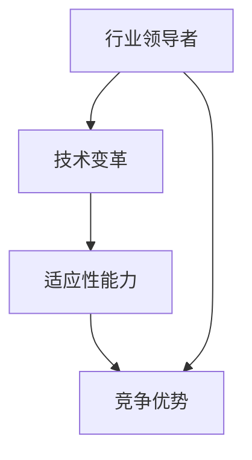
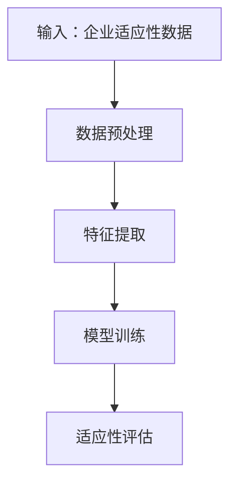
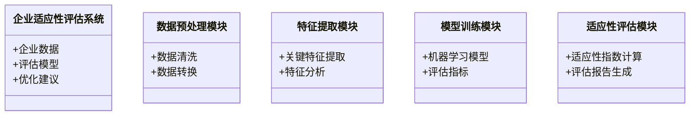
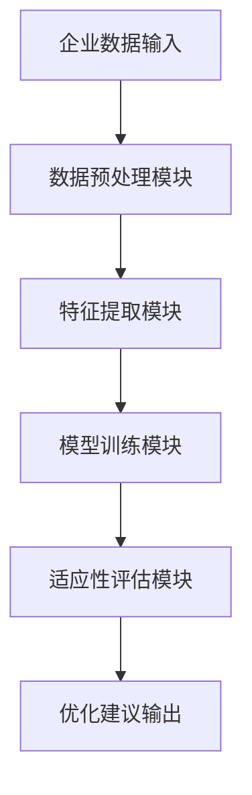
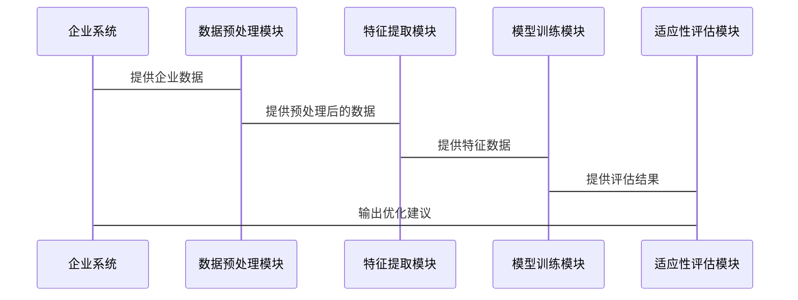

                 


# 彼得林奇的"行业领导者"在技术变革中的适应性

> 关键词：彼得·林奇，行业领导者，技术变革，适应性，投资策略，企业转型

> 摘要：本文深入探讨了彼得·林奇的“行业领导者”理论在技术变革中的适应性问题。通过分析适应性在企业中的重要性，结合技术变革对企业的影响，提出了适应性评估模型和系统设计方法。文章从背景、概念、算法、系统、项目和实践等多个维度展开，为企业应对技术变革提供了理论和实践指导。

---

## 第一部分：技术变革中的行业领导者概述

### 第1章：技术变革的背景与挑战

#### 1.1 技术变革的背景

- **数字化转型的加速**  
  数字技术的快速发展推动了全球范围内的数字化转型，企业必须快速适应新技术带来的变化，以保持竞争优势。

- **行业领导者的定义与特征**  
  行业领导者是指在特定行业中占据主导地位，并能在技术和市场变化中保持领先地位的企业。

- **彼得·林奇的行业领导者理论**  
  彼得·林奇认为，行业领导者具有强大的市场地位、竞争优势和可持续发展能力，是长期投资的理想对象。

#### 1.2 技术变革对企业的影响

- **技术驱动的市场变化**  
  技术创新改变了市场格局，新兴技术如人工智能、大数据和区块链正在重塑行业规则。

- **适应性与企业生存**  
  在技术变革中，适应性是企业生存和发展的关键能力，决定了企业能否在竞争中立于不败之地。

- **适应性与行业领导地位的关系**  
  适应性越强的企业，越能在技术变革中巩固和提升其行业领导地位。

#### 1.3 适应性的重要性

- **适应性是企业应对技术变革的核心能力**  
  适应性不仅关乎企业的生存，还决定了其在行业中的影响力和话语权。

- **适应性与创新的关系**  
  适应性不仅仅是被动应对变化，更是主动创新，引领行业发展的能力。

---

### 第2章：行业领导者的核心概念与联系

#### 2.1 核心概念原理

- **行业领导者的特征分析**  
  行业领导者通常具有强大的市场占有率、品牌影响力和创新能力，能够在技术和市场变化中保持领先地位。

- **技术变革的驱动因素**  
  技术变革是由市场需求、竞争压力和技术创新共同驱动的，企业需要主动拥抱变化，而非被动应对。

- **适应性能力的构成要素**  
  适应性能力包括技术适应性、组织适应性和文化适应性，三者共同作用，决定了企业应对变革的能力。

#### 2.2 核心概念属性对比表

| 特征          | 行业领导者                          | 非领导者                          |
|---------------|------------------------------------|------------------------------------|
| 市场地位       | 领导地位，主导市场趋势              | 被动跟随，市场影响力有限          |
| 技术创新       | 主动创新，引领技术变革              | 被动接受，技术创新能力有限        |
| 适应能力       | 强大的适应能力，快速调整策略        | 适应能力较弱，调整速度较慢        |
| 竞争优势       | 持续竞争优势，巩固市场地位          | 竞争优势逐渐削弱，市场份额流失    |

#### 2.3 实体关系图



---

### 第3章：适应性评估模型

#### 3.1 算法原理



#### 3.2 算法实现

```python
def adaptability_score(enterprise_data):
    # 数据预处理
    processed_data = preprocess(enterprise_data)
    # 特征提取
    features = extract_features(processed_data)
    # 模型训练
    model = train_model(features)
    # 适应性评估
    score = model.predict(features)
    return score
```

#### 3.3 数学模型与公式

适应性指数公式：
$$
A = \frac{\sum_{i=1}^{n} w_i \cdot f_i}{\sum_{i=1}^{n} w_i}
$$
其中，$w_i$ 是第 $i$ 个特征的权重，$f_i$ 是第 $i$ 个特征的值。

---

### 第4章：系统分析与架构设计

#### 4.1 问题场景介绍

**问题场景：技术变革中企业适应性的评估与优化**

- 随着技术的快速发展，企业需要快速评估自身的适应能力，并进行优化。

#### 4.2 系统功能设计

- **问题场景分析**  
  技术变革对企业的影响是多方面的，包括技术、组织和文化等多个层面。

- **系统功能设计**  
  本系统旨在帮助企业评估适应性能力，并提供优化建议。

- **领域模型类图**  
  通过类图展示系统的各个模块及其关系。



#### 4.3 系统架构设计

- **系统架构图**  
  展示系统的整体架构。



#### 4.4 系统接口设计

- **输入接口**：接收企业数据。
- **输出接口**：提供适应性评估结果和优化建议。

#### 4.5 系统交互设计



---

## 第五部分：项目实战

### 第5章：项目实战与案例分析

#### 5.1 环境安装与配置

```bash
pip install numpy pandas scikit-learn
```

#### 5.2 核心代码实现

```python
import numpy as np
import pandas as pd
from sklearn.model_selection import train_test_split
from sklearn.metrics import accuracy_score

def preprocess(data):
    # 数据清洗
    data = data.dropna()
    return data

def extract_features(data):
    # 提取特征
    features = data[['revenue', 'profit', 'growth_rate']]
    return features

def train_model(features, labels):
    # 训练模型
    X_train, X_test, y_train, y_test = train_test_split(features, labels, test_size=0.2)
    # 简单模型示例
    model = LinearRegression()
    model.fit(X_train, y_train)
    return model

def evaluate_model(model, X_test, y_test):
    # 模型评估
    predictions = model.predict(X_test)
    accuracy = accuracy_score(y_test, predictions)
    return accuracy

# 示例数据
data = pd.DataFrame({
    'revenue': [100, 200, 150, 300],
    'profit': [50, 100, 70, 150],
    'growth_rate': [10, 20, 15, 25],
    'label': [1, 1, 0, 1]
})

processed_data = preprocess(data)
features = extract_features(processed_data)
labels = processed_data['label']

model = train_model(features, labels)
accuracy = evaluate_model(model, features, labels)

print(f"模型准确率：{accuracy}")
```

#### 5.3 代码解读与分析

- **数据预处理**：清除缺失值，确保数据质量。
- **特征提取**：选择关键特征，如收入、利润和增长率。
- **模型训练**：使用线性回归模型进行训练。
- **模型评估**：计算模型的准确率，评估模型性能。

#### 5.4 案例分析

假设某企业的适应性评估结果显示，其技术适应性较强，但组织适应性较弱。根据评估结果，企业可以制定相应的优化策略，如加强组织结构调整和文化建设，以提升整体适应能力。

#### 5.5 项目小结

通过项目实战，我们可以验证适应性评估模型的有效性，并为企业提供具体的优化建议，帮助其在技术变革中保持领先地位。

---

## 第六部分：最佳实践与总结

### 第6章：最佳实践与总结

#### 6.1 小结

- 技术变革对企业适应性的影响深远，行业领导者需要具备强大的适应能力。
- 通过适应性评估模型，企业可以识别自身的薄弱环节，并制定相应的优化策略。

#### 6.2 注意事项

- 适应性评估需要结合企业的实际情况，避免一刀切。
- 技术变革是持续的过程，企业需要建立长期的适应机制。

#### 6.3 拓展阅读

- 彼得·林奇的《投资之道》
- 技术变革与企业战略的相关书籍和论文

---

## 作者信息

作者：AI天才研究院/AI Genius Institute & 禅与计算机程序设计艺术/Zen And The Art of Computer Programming

