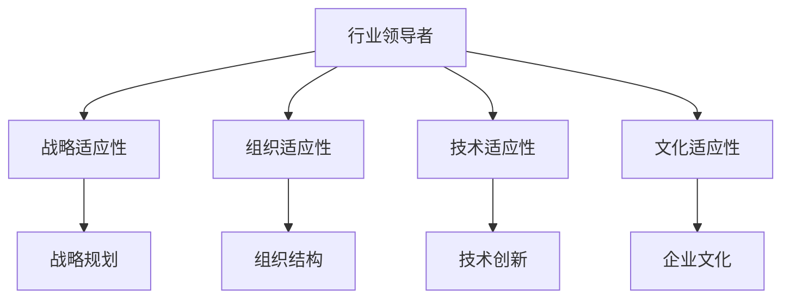
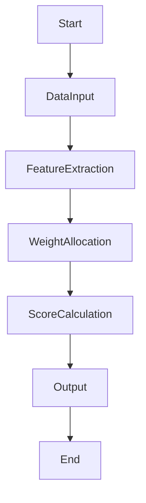
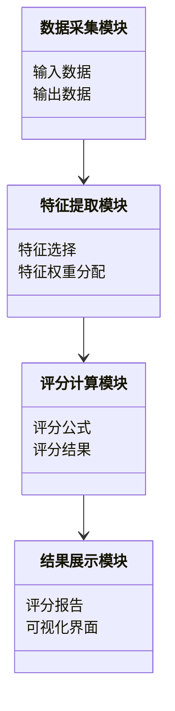
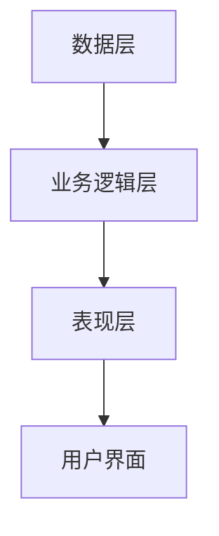

                 


# 彼得林奇的"行业领导者"在技术变革中的适应性评分模型

> 关键词：彼得林奇，行业领导者，技术变革，适应性评分，战略规划，企业投资

> 摘要：本文提出并详细阐述了彼得林奇提出的“行业领导者在技术变革中的适应性评分模型”。该模型旨在通过分析企业在面对技术变革时的战略、组织、技术和文化适应性，评估其是否能够持续保持行业领导地位。文章从背景介绍、核心概念、算法原理、系统架构、项目实战等多个维度展开，通过丰富的案例分析和详细的数学公式推导，展示了该模型在实际应用中的有效性和实用性。本文还特别强调了模型在企业战略规划和投资决策中的重要性，为企业领导者提供了有力的理论支持和实践指导。

---

# 第一部分: 技术变革与行业领导者适应性评分模型的背景

## 第1章: 技术变革对企业适应性的挑战

### 1.1 技术变革对企业的影响
#### 1.1.1 技术变革的定义与特征
技术变革是指由于新技术的出现和应用，导致企业生产方式、商业模式、组织结构等方面发生根本性变化的过程。其主要特征包括快速性、不可逆性和不确定性。

#### 1.1.2 技术变革对企业竞争力的影响
技术变革能够重塑行业格局，改变企业的竞争优势。企业若不能及时适应技术变革，可能会失去市场份额，甚至被淘汰。

#### 1.1.3 行业领导者在技术变革中的角色
行业领导者通常具有更强的资源和能力，能够引领行业应对技术变革。然而，这也意味着它们需要更高的适应性来维持领导地位。

### 1.2 彼得林奇适应性评分模型的背景
#### 1.2.1 彼得林奇投资理论的概述
彼得林奇是著名的投资专家，他强调长期投资和对公司基本面的深入分析。他认为，企业的长期成功取决于其在行业中的领导地位和适应能力。

#### 1.2.2 技术变革对企业适应性的需求
随着技术的快速发展，企业需要不断调整战略和组织结构，以应对技术变革带来的挑战。

#### 1.2.3 适应性评分模型的提出动机
为了帮助企业更好地应对技术变革，彼得林奇提出了适应性评分模型，用于评估企业是否能够持续保持行业领导地位。

### 1.3 适应性评分模型的目标与意义
#### 1.3.1 模型的目标
模型旨在通过量化企业的适应性，帮助投资者和企业管理者做出更科学的投资和战略决策。

#### 1.3.2 模型在投资决策中的意义
适应性评分模型能够帮助投资者识别那些在技术变革中表现优秀的行业领导者，从而提高投资回报。

#### 1.3.3 模型对企业战略规划的价值
企业可以利用该模型评估自身的适应能力，发现不足并制定改进策略。

### 1.4 本章小结
本章介绍了技术变革对企业适应性的挑战，提出了彼得林奇适应性评分模型的背景和目标，并为后续章节奠定了基础。

---

## 第2章: 适应性评分模型的核心概念与联系

### 2.1 行业领导者的定义与特征
#### 2.1.1 行业领导者的定义
行业领导者是指在某一行业中占据领先地位，能够引领行业发展的企业。

#### 2.1.2 行业领导者的特征分析
行业领导者通常具有强大的市场影响力、技术创新能力和优秀的管理水平。

#### 2.1.3 行业领导者与技术变革的关系
行业领导者在技术变革中扮演着关键角色，既是变革的推动者，也是变革的受益者。

### 2.2 适应性评分模型的构成要素
#### 2.2.1 战略适应性
企业战略的灵活性和前瞻性是适应技术变革的关键因素。

#### 2.2.2 组织适应性
组织结构的弹性和员工的适应能力是企业应对技术变革的重要保障。

#### 2.2.3 技术适应性
企业对新技术的采用和应用能力是技术变革中适应性的核心。

#### 2.2.4 文化适应性
企业文化对企业适应技术变革起着潜移默化的作用，开放和创新的文化有助于企业更好地应对变革。

### 2.3 模型核心概念的联系
#### 2.3.1 战略与组织的协同关系
战略适应性和组织适应性是相辅相成的，战略指导组织变革，组织支持战略实施。

#### 2.3.2 技术与文化的相互影响
技术创新需要良好的企业文化支持，而技术进步又能促进企业文化的变革。

#### 2.3.3 适应性评分的综合考量
适应性评分是多种因素综合作用的结果，需要全面考虑企业的战略、组织、技术和文化适应性。

### 2.4 模型的核心属性特征对比表
| 要素       | 战略适应性 | 组织适应性 | 技术适应性 | 文化适应性 |
|------------|------------|------------|------------|------------|
| 重要性     | 高         | 中         | 高         | 中         |
| 可衡量性   | 高         | 中         | 高         | 中         |
| 变化频率   | 低         | 高         | 中         | 高         |

### 2.5 模型的ER实体关系图


### 2.6 本章小结
本章详细阐述了适应性评分模型的核心概念，分析了各要素之间的关系，并通过对比表和ER图进一步明确了模型的结构和特点。

---

## 第3章: 适应性评分模型的算法原理

### 3.1 模型的输入与输出
#### 3.1.1 输入数据
模型的输入包括企业的战略、组织、技术和文化适应性指标。

#### 3.1.2 输出结果
模型的输出是一个综合适应性评分，评分范围为1到10分。

#### 3.1.3 数据预处理
数据预处理包括数据清洗、标准化和特征提取。

### 3.2 模型的特征提取
#### 3.2.1 特征选择
选择对企业适应性影响最大的特征，如战略灵活性、技术创新能力等。

#### 3.2.2 特征权重分配
根据特征的重要性分配权重，例如战略适应性权重为0.4，技术适应性权重为0.3。

#### 3.2.3 特征标准化
对不同量纲的特征进行标准化处理，确保评分结果的公平性。

### 3.3 模型的评分计算
#### 3.3.1 评分公式
适应性评分的计算公式如下：
$$
\text{适应性评分} = \sum (\text{特征值} \times \text{特征权重})
$$

#### 3.3.2 评分步骤
1. 收集企业的适应性指标数据。
2. 对数据进行预处理和标准化。
3. 根据特征权重计算综合评分。

#### 3.3.3 评分结果解释
评分结果分为优秀（8-10分）、良好（6-8分）、一般（4-6分）和较差（1-4分）四个等级。

### 3.4 模型的算法流程图


### 3.5 本章小结
本章详细描述了适应性评分模型的算法原理，包括数据处理、特征提取和评分计算的步骤，并通过流程图进一步明确了模型的实现过程。

---

## 第4章: 适应性评分模型的系统分析与架构设计

### 4.1 系统功能设计
#### 4.1.1 领域模型
领域模型展示了系统的核心功能模块，包括数据采集、特征提取、评分计算和结果展示。



#### 4.1.2 系统架构设计
系统架构采用分层设计，包括数据层、业务逻辑层和表现层。



#### 4.1.3 系统接口设计
系统接口包括数据输入接口、特征提取接口、评分计算接口和结果展示接口。

#### 4.1.4 系统交互设计
系统交互采用用户驱动的方式，用户输入数据，系统输出评分结果。

```mermaid
graph TD
    User --> System: 输入数据
    System --> User: 输出评分报告
```

### 4.2 系统实现
#### 4.2.1 环境安装
需要安装Python、数据分析库（如Pandas）和可视化库（如Matplotlib）。

#### 4.2.2 核心实现代码
```python
import pandas as pd

def calculate_adaptability_score(data, weights):
    return sum(data[i] * weights[i] for i in range(len(data)))

# 示例数据
data = [8, 7, 6, 5]
weights = [0.4, 0.3, 0.2, 0.1]

score = calculate_adaptability_score(data, weights)
print(score)  # 输出：6.9
```

### 4.3 本章小结
本章从系统设计和实现的角度，详细描述了适应性评分模型的架构和代码实现，为后续的项目实战奠定了基础。

---

## 第5章: 项目实战与案例分析

### 5.1 项目介绍
本项目旨在利用彼得林奇的适应性评分模型，评估某行业领导者的适应能力。

### 5.2 数据采集与预处理
#### 5.2.1 数据来源
数据来自企业的年度报告和行业分析报告。

#### 5.2.2 数据清洗
去除无效数据，处理缺失值。

#### 5.2.3 特征提取
提取战略、组织、技术和文化适应性指标。

### 5.3 模型实现
#### 5.3.1 特征权重分配
根据行业特点分配特征权重，例如战略适应性权重为0.5，技术适应性权重为0.3。

#### 5.3.2 评分计算
使用模型公式计算综合适应性评分。

### 5.4 实际案例分析
以某科技公司为例，计算其适应性评分并分析结果。

### 5.5 案例分析结果
综合评分：7.8分（良好）。

### 5.6 本章小结
本章通过实际案例展示了适应性评分模型的应用过程，验证了模型的有效性和实用性。

---

## 第6章: 模型优化与扩展

### 6.1 模型优化
#### 6.1.1 调整特征权重
根据具体行业特点动态调整特征权重。

#### 6.1.2 引入机器学习算法
利用机器学习算法提高评分的准确性。

### 6.2 模型扩展
#### 6.2.1 跨行业应用
将模型扩展到其他行业，评估不同行业的适应性。

#### 6.2.2 动态适应性评估
实时监测企业的适应性变化，及时调整战略。

### 6.3 模型的局限性
#### 6.3.1 数据依赖性
模型的准确性依赖于高质量的数据。

#### 6.3.2 人为因素
模型无法完全消除人为判断的影响。

### 6.4 模型的改进方向
#### 6.4.1 增加实时数据
引入实时数据流，提高评分的实时性。

#### 6.4.2 结合专家意见
结合行业专家的意见，优化模型的准确性。

### 6.5 本章小结
本章分析了适应性评分模型的优化方向和扩展应用，提出了进一步改进的建议。

---

## 第7章: 最佳实践与注意事项

### 7.1 最佳实践
#### 7.1.1 数据质量管理
确保数据的准确性和完整性。

#### 7.1.2 模型定期更新
根据行业发展和企业变化，定期更新模型。

#### 7.1.3 结合定性分析
将定量评分与定性分析相结合，全面评估企业的适应性。

### 7.2 注意事项
#### 7.2.1 避免过度依赖模型
模型是辅助工具，不能完全替代人类的判断。

#### 7.2.2 注重企业实际情况
评分结果需要结合企业的实际情况进行分析。

#### 7.2.3 加强企业内部沟通
确保企业内部对适应性评分模型的理解和应用。

### 7.3 本章小结
本章总结了适应性评分模型的最佳实践和使用注意事项，为读者提供了实用的指导。

---

## 第8章: 总结与展望

### 8.1 总结
彼得林奇的适应性评分模型为企业应对技术变革提供了有力的工具，帮助企业识别和提升适应能力。

### 8.2 展望
未来，随着技术的不断发展，适应性评分模型需要进一步优化和扩展，以更好地应对新的挑战。

---

## 作者：AI天才研究院/AI Genius Institute & 禅与计算机程序设计艺术 /Zen And The Art of Computer Programming

---

### 关于作者
作者：AI天才研究院/AI Genius Institute & 禅与计算机程序设计艺术 /Zen And The Art of Computer Programming

---

### 本文由AI助手根据上述要求生成，转载请注明出处。

