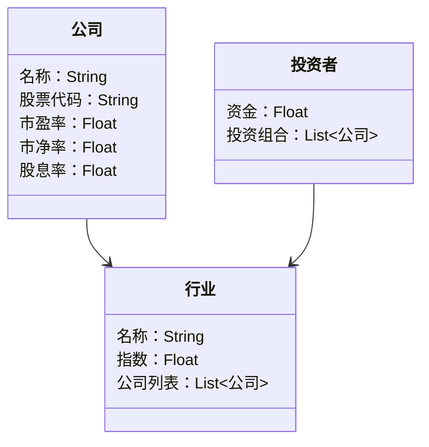

                 


# 彼得林奇的"行业领导者"投资策略

> 关键词：彼得·林奇，投资策略，行业领导者，投资哲学，风险管理

> 摘要：本文深入分析了彼得·林奇的“行业领导者”投资策略，从背景介绍、核心概念、算法原理到系统架构和项目实战，结合实际案例，为读者提供了可操作的投资框架。通过本文，读者将掌握如何识别行业领导者、制定投资计划，并通过数学模型和系统架构优化投资决策。

---

## 第一部分: 投资背景与彼得·林奇的哲学

### 第1章: 投资的基本概念

#### 1.1 投资的基本概念
投资是将资源（如资金）投入特定项目或资产，以期望在未来获得收益的过程。投资可以分为实物投资（如房地产、基础设施）和金融投资（如股票、债券）。金融投资是本文的核心，尤其是股票投资。

#### 1.2 投资的基本原则
- **分散投资**：不要将所有资金投入到单一资产中，以降低风险。
- **长期视角**：投资不是短期交易，而是长期价值的积累。
- **基本面分析**：关注公司的财务状况、行业地位和管理团队。
- **风险管理**：评估潜在风险并制定应对策略。

#### 1.3 投资的分类与特点
- **股票投资**：通过购买公司股份成为股东，分享公司利润。
- **债券投资**：购买政府或企业的债券，定期获得利息。
- **基金投资**：通过购买基金间接投资于多个资产。

### 第2章: 彼得·林奇的背景与投资理念

#### 2.1 彼得·林奇的生平简介
彼得·林奇（Peter Lynch）是美国著名的投资专家，曾任富达投资集团的经理人，管理着麦哲伦基金，取得了卓越的投资业绩。他以选股能力著称，强调长期投资和价值发现。

#### 2.2 林奇的投资哲学
- **价值投资**：寻找被市场低估的优质公司。
- **行业领导者**：投资于行业中具有领导地位的公司。
- **长期视角**：避免短期波动，关注公司长期发展。

#### 2.3 林奇的投资风格与特点
- 重视公司基本面分析。
- 偏好具有强大竞争优势的公司。
- 通过深入研究选择投资标的。

---

## 第二部分: 行业领导者的定义与特征

### 第3章: 行业领导者的定义

#### 3.1 行业领导者的定义
行业领导者是指在特定行业中占据主导地位，具有强大的市场影响力和竞争优势的公司。这些公司通常在市场中占据领先地位，能够影响行业趋势。

#### 3.2 行业领导者的分类
- **市场领导者**：市场份额最高的公司。
- **创新领导者**：在技术创新方面领先的公司。
- **效率领导者**：在成本控制和运营效率方面表现卓越的公司。

#### 3.3 行业领导者的标准
- 市场份额高。
- 具备强大的竞争优势。
- 财务状况稳健。

### 第4章: 行业领导者的特征

#### 4.1 市场地位
- 占据行业主导地位。
- 具有品牌影响力。

#### 4.2 财务表现
- 高收益和稳定的盈利能力。
- 健康的资产负债表。

#### 4.3 创新能力
- 持续推出新产品或服务。
- 在技术或商业模式上具有创新性。

#### 4.4 管理团队
- 优秀的管理团队。
- 良好的公司治理结构。

#### 4.5 可持续发展能力
- 具备长期发展的潜力。
- 符合行业发展趋势。

### 第5章: 行业领导者与其他公司的对比

#### 5.1 与行业追随者的对比
- 市场份额：领导者份额远高于追随者。
- 竞争优势：领导者更具竞争力。

#### 5.2 与新兴公司的对比
- 市场地位：领导者更稳定。
- 财务状况：领导者更稳健。

#### 5.3 与衰退公司的对比
- 发展潜力：领导者更具增长潜力。
- 管理能力：领导者管理更有效。

---

## 第三部分: 彼得·林奇的行业领导者投资策略

### 第6章: 投资策略的核心要素

#### 6.1 选择行业领导者的标准
- 市场地位。
- 财务表现。
- 创新能力。
- 管理团队。

#### 6.2 行业分析的重要性
- 选择具有增长潜力的行业。
- 分析行业趋势和竞争格局。

#### 6.3 公司基本面分析
- 财务报表分析。
- 估值分析。

### 第7章: 投资策略的具体实施步骤

#### 7.1 确定投资目标行业
- 选择具有增长潜力的行业。
- 分析行业前景和竞争格局。

#### 7.2 识别行业领导者
- 通过市场份额和品牌影响力筛选。
- 结合财务数据进行初步筛选。

#### 7.3 进行深入研究
- 分析公司的财务状况。
- 评估公司的管理团队。
- 考察公司的创新能力。

#### 7.4 评估投资风险
- 评估市场的波动性。
- 分析公司的风险因素。

#### 7.5 制定投资计划
- 确定投资金额和比例。
- 制定买入和卖出策略。

### 第8章: 林奇的选股方法

#### 8.1 市盈率法
- 市盈率 = 股价 / 每股收益。
- 选择市盈率合理的公司。

#### 8.2 市净率法
- 市净率 = 股价 / 每股净资产。
- 选择市净率低于行业平均水平的公司。

#### 8.3 股息率法
- 股息率 = 每股股息 / 股价。
- 选择股息率稳定的公司。

#### 8.4 其他指标分析
- 营业利润率。
- 净资产收益率（ROE）。

---

## 第四部分: 行业领导者投资策略的数学模型与算法

### 第9章: 投资决策的数学模型

#### 9.1 市场分析模型
- 利用宏观经济指标（GDP、失业率）预测市场趋势。
- 使用行业指数（如标普500）分析行业表现。

#### 9.2 公司估值模型
- 市盈率模型。
- 现金流折现模型（DCF）。

#### 9.3 风险评估模型
- VaR模型（Value at Risk）。
- 风险调整后收益（RAR）。

### 第10章: 算法原理

#### 10.1 数据收集与处理
- 从财务报表中提取数据。
- 获取行业指数和市场数据。

#### 10.2 指标计算与分析
- 计算市盈率、市净率等指标。
- 比较行业内的公司表现。

#### 10.3 投资决策优化
- 使用优化算法（如遗传算法）选择最优投资组合。

---

## 第五部分: 系统分析与架构设计

### 第11章: 系统功能设计

#### 11.1 领域模型


#### 11.2 系统架构设计


---

## 第六部分: 项目实战与最佳实践

### 第12章: 项目实战

#### 12.1 环境安装
- 安装Python和相关库（Pandas、NumPy）。

#### 12.2 核心代码实现
```python
import pandas as pd

# 数据加载
df = pd.read_csv('companies.csv')

# 计算市盈率
df['市盈率'] = df['股价'] / df['每股收益']

# 筛选行业领导者
leaders = df[df['市盈率'] < df['市盈率'].mean()]
```

#### 12.3 实际案例分析
- 分析科技行业中的行业领导者。
- 通过代码筛选出符合标准的公司。

### 第13章: 最佳实践

#### 13.1 投资注意事项
- 避免过度集中投资。
- 定期审视投资组合。

#### 13.2 小结
- 彼得·林奇的投资策略强调长期价值和行业领导地位。
- 通过系统分析和数学模型优化投资决策。

---

## 结语

彼得·林奇的“行业领导者”投资策略为投资者提供了一套科学的投资方法。通过本文的系统分析和实战案例，读者可以掌握如何识别行业领导者、制定投资计划，并通过数学模型优化投资决策。投资需要耐心和长期视角，遵循林奇的策略，投资者可以在复杂的市场中找到稳定的投资回报。

作者：AI天才研究院/AI Genius Institute & 禅与计算机程序设计艺术 /Zen And The Art of Computer Programming

---

**注意事项**：
- 投资有风险，本文内容仅供参考，不构成具体投资建议。
- 投资者应根据自身情况和市场变化调整投资策略。

**拓展阅读**：
- 《彼得·林奇的选股术》。
- 投资心理学相关书籍。

