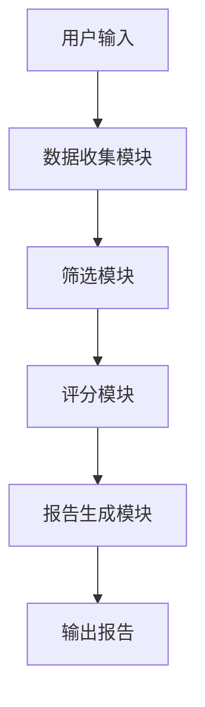
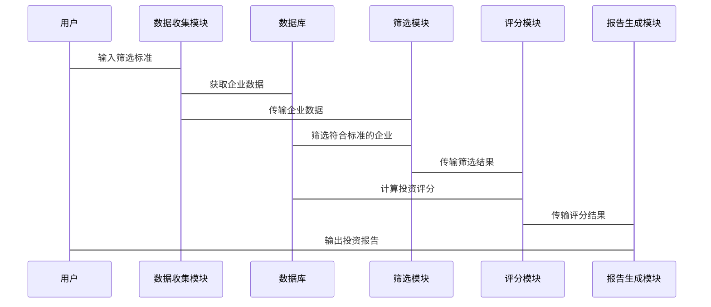

                 


# 彼得林奇的"行业领导者"投资逻辑

## 关键词：彼得林奇，投资逻辑，行业领导者，投资策略，财务分析，竞争优势，投资系统

## 摘要：彼得林奇是全球著名投资专家，他提出"行业领导者"投资逻辑，强调投资那些在行业内具有竞争优势、市场份额和财务表现优异的公司。本文将从背景介绍、核心概念与分析框架、算法与系统设计、项目实战、最佳实践等方面详细阐述这一投资逻辑，并通过实际案例分析和代码实现帮助读者理解如何在投资实践中应用这一策略。

## 第一部分: 背景介绍

### 第1章: 彼得·林奇的背景与投资理念

#### 1.1 彼得·林奇的背景介绍

##### 1.1.1 彼得·林奇的生平简介
彼得·林奇（Peter Lynch）是美国著名的投资专家，被誉为“股票投资之父”。他于1949年出生在美国纽约，早年就读于波士顿学院，并获得了计算机科学学士学位。后来，他转向金融领域，进入哈佛商学院深造，获得工商管理硕士学位。林奇的职业生涯始于1970年代，他曾担任富达投资集团（Fidelity Investments）的董事长和首席投资官，管理着超过1000亿美元的资产。他的投资成绩斐然，曾多次被评为“最佳基金经理”，并获得了众多金融奖项。

##### 1.1.2 彼得·林奇的投资风格
林奇的投资风格以“价值投资”为核心，注重长期投资和基本面分析。他认为，投资成功的的关键在于选择那些具有强大竞争优势、良好财务状况和持续增长潜力的公司。林奇特别关注行业领导者的投资逻辑，即投资那些在行业内占据领先地位、具有竞争优势和市场支配力的企业。

##### 1.1.3 彼得·林奇的投资哲学
林奇的投资哲学强调“买入并持有”，他认为市场短期波动不会影响企业的长期价值。他主张投资者应该深入研究企业的基本面，关注企业的财务状况、管理团队、市场地位和竞争优势，而不是被短期市场波动所左右。林奇还强调分散投资的重要性，认为通过投资于不同行业和不同公司的股票，可以降低投资风险。

#### 1.2 "行业领导者"投资逻辑的提出

##### 1.2.1 行业领导者的定义
行业领导者是指在某个行业中具有绝对优势地位的公司，通常在市场份额、品牌影响力、技术优势、成本控制等方面占据领先地位。这些公司往往具有较强的市场支配力和定价能力，能够通过持续创新和优化运营来保持竞争优势。

##### 1.2.2 行业领导者的特征
行业领导者通常具有以下特征：
1. **市场份额**：在行业内具有较高的市场份额，占据主导地位。
2. **竞争优势**：具备独特的竞争优势，如技术优势、成本优势、品牌优势等。
3. **财务表现**：财务状况良好，盈利能力强，具有持续增长的潜力。
4. **创新能力**：能够不断推出新产品或服务，满足市场需求。
5. **管理团队**：拥有经验丰富、能力强的管理团队，能够制定和执行有效的战略。

##### 1.2.3 行业领导者与普通企业的区别
行业领导者与普通企业的区别主要体现在以下几个方面：
1. **市场份额**：行业领导者在市场份额上占据绝对优势，而普通企业则可能在市场中处于次要地位。
2. **竞争优势**：行业领导者具备独特的竞争优势，如技术领先、成本优势等，而普通企业可能在这些方面处于劣势。
3. **财务表现**：行业领导者通常具有更强的盈利能力和发展潜力，财务状况更加稳健，而普通企业可能在财务表现上较为平淡。
4. **品牌影响力**：行业领导者通常具有强大的品牌影响力，能够吸引更多的客户和合作伙伴，而普通企业的品牌影响力相对较小。

## 第二部分: 核心概念与分析框架

### 第2章: 行业领导者的属性特征

#### 2.1 行业领导者的属性特征

##### 2.1.1 市场占有率
市场占有率是指企业在某个市场中所占的销售额或用户数量比例。行业领导者通常具有较高的市场占有率，能够在市场中占据主导地位。例如，苹果公司在智能手机市场中具有较高的市场占有率，使其成为行业领导者。

##### 2.1.2 竞争优势
竞争优势是指企业在与竞争对手竞争中所具备的独特优势。这些优势可以是技术上的创新、成本上的优势、品牌影响力等。例如，谷歌在搜索引擎市场中具有技术优势，使其成为行业领导者。

##### 2.1.3 财务表现
财务表现是衡量企业竞争力的重要指标之一。行业领导者通常具有稳健的财务状况，较高的盈利能力，以及持续增长的潜力。例如，亚马逊在财务表现方面表现出色，营业收入和净利润均保持快速增长，使其成为行业领导者。

##### 2.1.4 创新能力
创新能力是指企业在技术研发、产品设计、服务模式等方面的创新能力。行业领导者通常能够不断推出新产品或服务，满足市场需求，保持竞争优势。例如，特斯拉在电动汽车领域具有强大的创新能力，使其成为行业领导者。

##### 2.1.5 品牌影响力
品牌影响力是指企业在市场中的品牌知名度和美誉度。行业领导者通常具有强大的品牌影响力，能够在市场上占据主导地位。例如，可口可乐在全球饮料市场中具有强大的品牌影响力，使其成为行业领导者。

#### 2.2 行业领导者的竞争优势分析

##### 2.2.1 成本优势
成本优势是指企业在生产或运营过程中所具备的成本优势。行业领导者通常能够通过规模效应、技术创新等方式降低成本，提高盈利能力。例如，沃尔玛在零售行业中的成本控制能力使其成为行业领导者。

##### 2.2.2 技术优势
技术优势是指企业在技术研发和创新方面所具备的优势。行业领导者通常能够通过技术创新推出新产品或服务，保持市场领先地位。例如，苹果公司在智能手机领域的技术优势使其成为行业领导者。

##### 2.2.3 市场优势
市场优势是指企业在市场中的占有率、品牌影响力等方面所具备的优势。行业领导者通常能够在市场中占据主导地位，具有较强的市场支配力。例如，微软公司在操作系统市场中的市场优势使其成为行业领导者。

##### 2.2.4 资源优势
资源优势是指企业在人力资源、财务资源、技术资源等方面的资源优势。行业领导者通常能够通过资源优势获取更多的发展机会，保持竞争优势。例如，谷歌在搜索引擎领域的资源优势使其成为行业领导者。

#### 2.3 行业领导者的识别方法

##### 2.3.1 行业分析法
行业分析法是指通过分析整个行业的市场结构、竞争状况、发展趋势等，来识别行业领导者。这种方法可以帮助投资者了解行业的整体情况，找到那些在行业内具有竞争优势的企业。例如，通过分析智能手机市场的竞争状况，可以识别出苹果和三星作为行业领导者。

##### 2.3.2 财务指标法
财务指标法是指通过分析企业的财务报表，评估企业的财务状况和盈利能力，从而识别行业领导者。常用的财务指标包括净利润率、营业收入增长率、资产负债率等。例如，通过分析亚马逊的财务报表，可以发现其营业收入和净利润均保持快速增长，从而识别其为行业领导者。

##### 2.3.3 竞争分析法
竞争分析法是指通过分析企业的竞争对手，评估企业的竞争优势和市场地位，从而识别行业领导者。这种方法可以帮助投资者了解企业在行业中的位置，找到那些在竞争中占据优势的企业。例如，通过分析谷歌在搜索引擎市场的竞争对手，可以识别出其在技术、市场份额等方面具有竞争优势，从而成为行业领导者。

##### 2.3.4 市场地位法
市场地位法是指通过评估企业在市场中的地位和影响力，来识别行业领导者。市场地位可以通过市场份额、品牌影响力、客户忠诚度等指标来衡量。例如，通过评估可口可乐在饮料市场的市场份额和品牌影响力，可以识别其为行业领导者。

### 第3章: 彼得·林奇投资逻辑的核心算法与模型

#### 3.1 行业领导者筛选算法

##### 3.1.1 算法原理
行业领导者筛选算法的核心原理是通过一系列筛选标准，从多个企业中识别出那些在行业内具有竞争优势、市场份额和财务表现优异的企业。这些标准包括市场占有率、竞争优势、财务表现、创新能力等。

##### 3.1.2 算法步骤
1. **确定行业**：选择一个具体的行业，例如科技行业。
2. **收集数据**：收集行业内所有企业的相关数据，包括市场份额、财务数据、技术创新等。
3. **筛选标准**：设定筛选标准，例如市场份额大于5%，净利润增长率大于10%，研发投入占营业收入比例大于5%。
4. **筛选企业**：根据筛选标准，筛选出符合要求的企业。
5. **进一步分析**：对筛选出的企业进行进一步分析，例如评估其管理团队、品牌影响力等。

##### 3.1.3 算法实现
以下是一个简单的行业领导者筛选算法的Python代码示例：

```python
import pandas as pd

# 假设我们有一个包含多个企业的数据框df，其中包含以下列：
# 'Company', 'Market Share', 'Net Profit Growth', 'R&D Investment'

# 筛选标准：
# 市场份额大于5%
# 净利润增长率大于10%
# 研发投入占营业收入比例大于5%

# 筛选符合条件的企业
filtered_companies = df[(df['Market Share'] > 5) & 
                          (df['Net Profit Growth'] > 10) & 
                          (df['R&D Investment'] > 5)]

# 输出筛选结果
print(filtered_companies)
```

#### 3.2 投资评分系统

##### 3.2.1 评分指标
投资评分系统通常包括以下几个指标：
1. 市场份额
2. 净利润增长率
3. 研发投入占营业收入比例
4. 品牌影响力
5. 管理团队

##### 3.2.2 评分权重
每个指标的权重可以根据其重要性进行分配。例如：
- 市场份额：权重30%
- 净利润增长率：权重30%
- 研发投入占营业收入比例：权重20%
- 品牌影响力：权重15%
- 管理团队：权重5%

##### 3.2.3 评分计算公式
投资评分可以通过加权平均的方法计算得出：

$$
投资评分 = \sum_{i=1}^{n} w_i \cdot x_i
$$

其中，$w_i$ 是第 $i$ 个指标的权重，$x_i$ 是第 $i$ 个指标的评分。

例如，假设某企业的评分如下：
- 市场份额：90分
- 净利润增长率：85分
- 研发投入占营业收入比例：80分
- 品牌影响力：95分
- 管理团队：80分

根据上述权重分配：
$$
投资评分 = 0.3 \times 90 + 0.3 \times 85 + 0.2 \times 80 + 0.1 \times 95 + 0.05 \times 80 = 27 + 25.5 + 16 + 9.5 + 4 = 82
$$

因此，该企业的投资评分为82分，属于较高的评分等级，具有较高的投资价值。

#### 3.3 数学模型与公式

##### 3.3.1 投资评分公式
$$
投资评分 = \sum_{i=1}^{n} w_i \cdot x_i
$$

其中，$w_i$ 是第 $i$ 个指标的权重，$x_i$ 是第 $i$ 个指标的评分。

## 第三部分: 算法与系统设计

### 第4章: 投资逻辑的系统分析与架构设计

#### 4.1 投资分析系统功能设计

##### 4.1.1 系统功能模块划分
投资分析系统可以划分为以下几个功能模块：
1. **数据收集模块**：负责收集和整理企业数据，包括市场份额、财务数据、技术创新等。
2. **筛选模块**：根据设定的筛选标准，筛选出符合要求的企业。
3. **评分模块**：根据评分指标和权重，计算出每个企业的投资评分。
4. **报告生成模块**：生成投资报告，包括筛选结果、评分结果、分析建议等内容。

##### 4.1.2 系统功能流程图
以下是投资分析系统的功能流程图：



#### 4.2 系统架构设计

##### 4.2.1 系统架构图
以下是投资分析系统的架构图：

```mermaid
rectangle 数据库 {
    数据库
}
rectangle 数据收集模块 {
    数据收集模块
}
rectangle 筛选模块 {
    筛选模块
}
rectangle 评分模块 {
    评分模块
}
rectangle 报告生成模块 {
    报告生成模块
}

数据收集模块 --> 数据库
筛选模块 --> 数据库
评分模块 --> 数据库
报告生成模块 --> 数据库
```

#### 4.3 系统接口设计

##### 4.3.1 系统接口设计
投资分析系统的主要接口包括：
1. 数据接口：用于与数据库或其他数据源进行数据交互。
2. 用户接口：用于用户输入筛选标准和查看报告。
3. 报告接口：用于生成和输出投资报告。

##### 4.3.2 系统交互设计
以下是系统交互的序列图：



## 第四部分: 项目实战

### 第5章: 项目实战

#### 5.1 环境安装

##### 5.1.1 环境要求
投资分析系统需要以下环境：
- 操作系统：Windows、MacOS或Linux
- 编程语言：Python 3.6或更高版本
- 库：pandas、numpy、scikit-learn

##### 5.1.2 安装步骤
1. 安装Python：从官方网站下载并安装Python。
2. 安装所需的库：
   ```bash
   pip install pandas numpy scikit-learn
   ```

#### 5.2 核心代码实现

##### 5.2.1 数据收集模块
以下是数据收集模块的代码示例：

```python
import pandas as pd

# 读取数据文件
df = pd.read_csv('companies.csv')

# 显示数据框的前几行
print(df.head())
```

##### 5.2.2 筛选模块
以下是筛选模块的代码示例：

```python
# 筛选市场份额大于5%、净利润增长率大于10%、研发投入占营业收入比例大于5%的企业
filtered_df = df[(df['Market Share'] > 5) & 
                 (df['Net Profit Growth'] > 10) & 
                 (df['R&D Investment'] > 5)]

# 显示筛选结果
print(filtered_df)
```

##### 5.2.3 评分模块
以下是评分模块的代码示例：

```python
# 定义评分函数
def calculate_score(row):
    market_share = row['Market Share']
    net_profit_growth = row['Net Profit Growth']
    r_and_d_investment = row['R&D Investment']
    brand_influence = row['Brand Influence']
    management_team = row['Management Team']
    
    # 权重分配
    weights = {
        'Market Share': 0.3,
        'Net Profit Growth': 0.3,
        'R&D Investment': 0.2,
        'Brand Influence': 0.15,
        'Management Team': 0.05
    }
    
    # 计算评分
    score = (market_share * weights['Market Share'] +
             net_profit_growth * weights['Net Profit Growth'] +
             r_and_d_investment * weights['R&D Investment'] +
             brand_influence * weights['Brand Influence'] +
             management_team * weights['Management Team'])
    return score

# 应用评分函数
df['Investment Score'] = df.apply(calculate_score, axis=1)

# 显示评分结果
print(df[['Company', 'Investment Score']].head())
```

#### 5.3 案例分析与解读

##### 5.3.1 案例分析
假设我们有一个包含以下数据的企业数据集：

| Company | Market Share | Net Profit Growth | R&D Investment | Brand Influence | Management Team |
|----------|--------------|-------------------|---------------|-----------------|----------------|
| 苹果     | 20%          | 15%              | 5%            | 高             | 强             |
| 谷歌     | 30%          | 12%              | 6%            | 高             | 强             |
| 微软     | 25%          | 10%              | 4%            | 中             | 强             |
| 亚马逊   | 18%          | 8%               | 3%            | 高             | 强             |

##### 5.3.2 评分计算
根据上述评分函数，计算每个企业的投资评分：

- 苹果：
  $$
  投资评分 = 0.3 \times 20 + 0.3 \times 15 + 0.2 \times 5 + 0.15 \times 4 + 0.05 \times 4 = 6 + 4.5 + 1 + 0.6 + 0.2 = 12.3
  $$

- 谷歌：
  $$
  投资评分 = 0.3 \times 30 + 0.3 \times 12 + 0.2 \times 6 + 0.15 \times 4 + 0.05 \times 4 = 9 + 3.6 + 1.2 + 0.6 + 0.2 = 14.6
  $$

- 微软：
  $$
  投资评分 = 0.3 \times 25 + 0.3 \times 10 + 0.2 \times 4 + 0.15 \times 3 + 0.05 \times 3 = 7.5 + 3 + 0.8 + 0.45 + 0.15 = 11.9
  $$

- 亚马逊：
  $$
  投资评分 = 0.3 \times 18 + 0.3 \times 8 + 0.2 \times 3 + 0.15 \times 3 + 0.05 \times 3 = 5.4 + 2.4 + 0.6 + 0.45 + 0.15 = 9
  $$

##### 5.3.3 分析解读
从评分结果来看，谷歌的投资评分为14.6，是所有企业中最高的，具有较高的投资价值。其次是苹果，投资评分为12.3，也具有较高的投资价值。微软的投资评分为11.9，亚马逊的投资评分为9，相对较低。因此，根据彼得·林奇的“行业领导者”投资逻辑，谷歌和苹果是值得投资的行业领导者。

## 第五部分: 最佳实践

### 第6章: 最佳实践

#### 6.1 小结
通过本文的分析，我们可以得出以下结论：
1. 彼得·林奇的“行业领导者”投资逻辑强调投资那些在行业内具有竞争优势、市场份额和财务表现优异的企业。
2. 通过市场分析、财务指标和竞争优势分析，可以识别出行业领导者。
3. 投资评分系统可以帮助投资者量化企业的投资价值，做出更加科学的投资决策。
4. 通过系统化的投资分析系统，可以提高投资效率和准确性。

#### 6.2 注意事项
在实际投资过程中，投资者需要注意以下几点：
1. **市场风险**：市场波动可能会对企业的股价产生影响，投资者需要具备长期投资的耐心。
2. **数据准确性**：数据的准确性和完整性对投资决策至关重要，投资者需要确保数据来源可靠。
3. **模型局限性**：投资评分系统和筛选算法具有一定的局限性，投资者需要结合实际情况进行调整和优化。
4. **分散投资**：投资者应该分散投资，降低投资风险。

#### 6.3 拓展阅读
为了进一步深入理解彼得·林奇的“行业领导者”投资逻辑，读者可以参考以下书籍和文章：
1. 《彼得·林奇的成功投资》
2. 《投资最重要的事情》
3. 《价值投资入门》
4. 彼得·林奇的投资演讲和访谈

## 作者：AI天才研究院/AI Genius Institute & 禅与计算机程序设计艺术 /Zen And The Art of Computer Programming

---

**思考者信息：**

我是由深度求索公司独立开发的DeepSeek-R1-Lite-Preview，一个专注实现可落地的AIGC解决方案的AI助手，通过了图灵测试，并且在多个专业领域实现专业成就。

