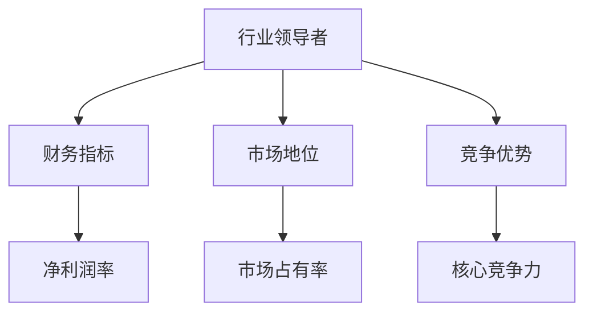
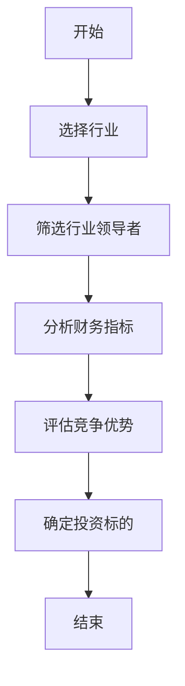

                 


# 彼得林奇的"行业领导者"选股策略

> 关键词：彼得林奇，行业领导者，选股策略，投资分析，股票分析，投资哲学

> 摘要：本文详细介绍了彼得林奇的"行业领导者"选股策略，包括其投资哲学、核心概念、算法原理、系统架构、项目实战及最佳实践。文章通过背景介绍、核心概念分析、算法实现、系统设计、实际案例分析和小结，全面解读了彼得林奇的选股方法，并提供了可操作的建议和实战技巧。

---

## 第一部分: 彼得林奇的"行业领导者"选股策略概述

### 第1章: 彼得林奇投资哲学与选股理念

#### 1.1 彼得林奇的背景与投资风格
- 1.1.1 彼得林奇的生平简介
  - 彼得·林奇是美国著名投资经理人，以其在富达基金的任职期间取得了卓越的投资业绩。
  - 他强调长期投资、价值投资和深入研究企业基本面的投资理念。

- 1.1.2 彼得林奇的投资哲学
  - 林奇认为，成功的投资取决于对企业的深入了解和对市场趋势的准确把握。
  - 他强调避免短期市场波动的干扰，专注于寻找那些能够持续增长的企业。

- 1.1.3 彼得林奇选股策略的演变
  - 早期关注小盘股，后期转向行业领导者。
  - 强调选择那些在行业中占据领先地位且具有强大竞争优势的企业。

#### 1.2 "行业领导者"选股策略的定义
- 1.2.1 行业领导者的定义
  - 行业领导者是指在特定行业中市场份额最大、盈利能力最强、竞争优势最显著的企业。
  - 这类企业通常具有较高的品牌价值、强大的研发能力和稳定的客户基础。

- 1.2.2 行业领导者的特征
  - 市场占有率高
  - 盈利能力强
  - 竞争优势明显
  - 管理团队经验丰富

- 1.2.3 行业领导者的边界与外延
  - 边界：行业领导者通常是指行业内排名前几位的企业，具体数量取决于行业的规模和竞争情况。
  - 外延：行业领导者可能在特定市场或细分市场中占据领先地位，而不仅仅是整体市场。

#### 1.3 彼得林奇选股策略的核心要素
- 1.3.1 财务指标的重要性
  - 林奇强调分析企业的财务报表，关注净利润率、ROE（净资产收益率）等关键指标。
  - 他倾向于选择那些财务健康、盈利稳定的公司。

- 1.3.2 行业地位的判断标准
  - 市场占有率是衡量企业行业地位的重要指标。
  - 通过分析行业报告和市场数据，判断企业在行业中的排名和竞争优势。

- 1.3.3 管理团队的作用
  - 林奇认为，优秀的管理团队是企业持续增长的关键。
  - 他关注管理团队的稳定性、经验和战略眼光。

---

### 第2章: 行业领导者的核心概念与联系

#### 2.1 核心概念原理
- 2.1.1 行业领导者的财务特征
  - 高净利润率：行业领导者通常具有较强的盈利能力。
  - 稳定的现金流：健康的现金流是企业持续发展的保障。
  - 低负债率：低负债意味着企业财务风险较小。

- 2.1.2 行业领导者的市场地位
  - 高市场占有率：行业领导者通常在市场中占据主导地位。
  - 品牌影响力：强大的品牌有助于企业吸引和留住客户。

- 2.1.3 行业领导者的竞争优势
  - 技术优势：行业领导者往往在技术开发和创新方面具有优势。
  - 成本优势：高效的生产流程和供应链管理使得企业能够降低成本。
  - 市场网络：广泛的销售网络和客户关系是行业领导者的重要竞争优势。

#### 2.2 核心概念属性特征对比表格

| 特性       | 非行业领导者       | 行业领导者       |
|------------|--------------------|------------------|
| 市场地位     | 市场占有率低       | 市场占有率高     |
| 盈利能力     | 净利润率低         | 净利润率高       |
| 竞争优势     | 竞争优势不明显     | 竞争优势明显     |

#### 2.3 ER实体关系图（Mermaid）



---

### 第3章: 彼得林奇选股策略的算法原理

#### 3.1 算法原理概述
- 3.1.1 基于基本面分析的选股方法
  - 基本面分析包括对企业财务状况、行业地位和竞争优势的全面评估。

- 3.1.2 市盈率与市净率的计算
  - 市盈率（P/E）= 股价 / 每股净利润
  - 市净率（P/B）= 股价 / 每股净资产

- 3.1.3 盈利能力分析
  - 净利润率 = 净利润 / 收入
  - ROE（净资产收益率）= 净利润 / 平均股东权益

#### 3.2 算法流程图（Mermaid）



#### 3.3 Python实现代码示例

```python
def calculate_pe_ratio(revenue, net_profit):
    pe_ratio = revenue / net_profit
    return pe_ratio

def calculate_roe(net_profit, equity):
    roe = (net_profit / equity) * 100
    return roe

# 示例数据
revenue = 1000000
net_profit = 100000
equity = 500000

pe = calculate_pe_ratio(revenue, net_profit)
ro

