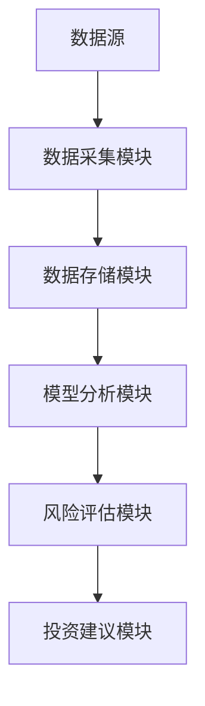

                 


# 彼得林奇的"街头智慧"在新兴市场的应用

---

## 关键词

- 彼得林奇
- 投资策略
- 新兴市场
- 价值评估
- 风险管理

---

## 摘要

本文探讨了彼得·林奇的“街头智慧”在新兴市场的应用。通过分析其投资哲学、核心原则以及在新兴市场的适用性，结合数学模型和系统架构设计，展示了如何在新兴市场中运用这些策略。文章详细介绍了CAPM模型和市盈率分析，并构建了一个投资决策支持系统，通过具体案例分析，说明了如何在实际操作中应用这些理论。最后，提出了最佳实践建议，强调了风险管理、长期投资和持续学习的重要性。

---

## 正文

### 第一部分：彼得林奇的“街头智慧”概述

#### 第1章：彼得林奇“街头智慧”的核心理念

##### 1.1 彼得林奇及其投资哲学

彼得·林奇是美国著名的投资专家，以其独特的投资哲学闻名。他的“街头智慧”是指在投资过程中总结出的经验和策略，强调基本面分析和长期投资。林奇的投资哲学包括以下几点：

- **价值投资**：寻找被市场低估的股票。
- **长期投资**：避免频繁交易，注重长期收益。
- **分散投资**：通过多样化降低风险。

##### 1.2 街头智慧的核心原则

- **价值评估**：通过分析公司的财务状况、行业地位和未来前景，判断其内在价值。
- **风险管理**：通过分散投资和止损策略，降低投资风险。
- **市场情绪**：关注市场情绪，避免盲目跟风。

##### 1.3 街头智慧在新兴市场的适用性

新兴市场具有高增长潜力，但也伴随着高风险。林奇的策略在新兴市场的应用需要考虑以下因素：

- **市场流动性**：新兴市场流动性较低，可能影响交易执行。
- **政策风险**：新兴市场政策变化较快，影响市场稳定性。
- **行业周期**：新兴市场行业波动较大，需关注周期性变化。

---

### 第二部分：新兴市场的投资策略分析

#### 第2章：新兴市场与传统市场的对比

##### 2.1 新兴市场的定义与特征

- **经济结构**：新兴市场通常处于快速发展阶段，经济增长率较高。
- **行业分布**：新兴市场行业集中度较低，新兴产业较多。
- **风险与机遇**：新兴市场波动性大，但潜在回报高。

##### 2.2 传统市场与新兴市场的投资策略差异

- **投资目标**：传统市场注重稳定收益，新兴市场注重高增长。
- **投资工具**：新兴市场使用更多衍生工具，如期货和期权。
- **市场流动性**：新兴市场流动性较低，影响交易策略。

##### 2.3 街头智慧在新兴市场的应用前景

- **价值发现**：新兴市场中存在许多被低估的公司，适合价值投资。
- **行业趋势**：新兴市场行业变化快，需及时捕捉趋势。
- **风险管理**：新兴市场波动大，需加强风险管理。

---

### 第三部分：数学模型与算法原理

#### 第3章：投资策略的数学模型

##### 3.1 CAPM模型

CAPM（资本资产定价模型）用于评估资产的预期回报率。公式如下：

$$ \text{CAPM} = r_f + \beta (r_m - r_f) $$

其中：
- $r_f$ 是无风险利率。
- $\beta$ 是股票的贝塔系数，衡量其波动性。
- $r_m$ 是市场预期回报率。

##### 3.2 市盈率分析

市盈率（P/E）用于评估股票的估值。公式如下：

$$ P/E = \frac{\text{股价}}{\text{每股收益}} $$

低市盈率通常表示股票被低估，适合价值投资。

##### 3.3 实例分析

假设某新兴市场股票，无风险利率为3%，市场预期回报率为10%，贝塔系数为1.5。计算其预期回报率：

$$ \text{CAPM} = 3\% + 1.5 \times (10\% - 3\%) = 15.5\% $$

---

### 第四部分：系统分析与架构设计

#### 第4章：投资决策支持系统

##### 4.1 系统功能设计

- 数据采集模块：收集市场数据。
- 模型分析模块：应用CAPM和市盈率模型。
- 风险评估模块：评估投资组合风险。
- 投资建议模块：提供优化建议。

##### 4.2 系统架构设计



##### 4.3 系统接口设计

系统接口包括数据输入、模型调用和结果输出。以下是接口设计示例：

```python
def collect_data(symbol):
    # 数据采集逻辑
    pass

def calculate_capm(risk_free_rate, beta, market_return):
    return risk_free_rate + beta * (market_return - risk_free_rate)
```

---

### 第五部分：项目实战

#### 第5章：新兴市场投资实战

##### 5.1 案例分析

假设在新兴市场中，某公司的市盈率为15，行业平均市盈率为20。根据市盈率分析，该股票可能被低估。

##### 5.2 代码实现

```python
import pandas as pd

def calculate_pe_ratio(stock_data):
    pe_ratio = stock_data['股价'] / stock_data['每股收益']
    return pe_ratio

# 示例数据
data = {
    '股价': [100, 200, 150],
    '每股收益': [5, 10, 7.5]
}
df = pd.DataFrame(data)
pe_ratios = calculate_pe_ratio(df)
print(pe_ratios)
```

##### 5.3 案例解读

通过代码计算，发现某股票的市盈率低于行业平均水平，表明该股票可能被低估，适合投资。

---

### 第六部分：最佳实践与总结

#### 第6章：最佳实践与总结

##### 6.1 最佳实践

- **风险管理**：定期评估投资组合，及时调整。
- **长期投资**：避免短期波动，关注长期收益。
- **持续学习**：关注市场动态，更新投资策略。

##### 6.2 小结

彼得林奇的“街头智慧”在新兴市场的应用需要结合市场特点和投资策略。通过数学模型和系统设计，投资者可以更有效地进行价值评估和风险管理。

##### 6.3 注意事项

- **市场风险**：新兴市场波动大，需谨慎评估。
- **数据质量**：确保数据准确，避免错误决策。
- **政策变化**：关注政策调整，及时应对。

##### 6.4 拓展阅读

- 《彼得·林奇的成功投资》
- 《新兴市场投资指南》

---

## 作者：AI天才研究院 & 禅与计算机程序设计艺术

