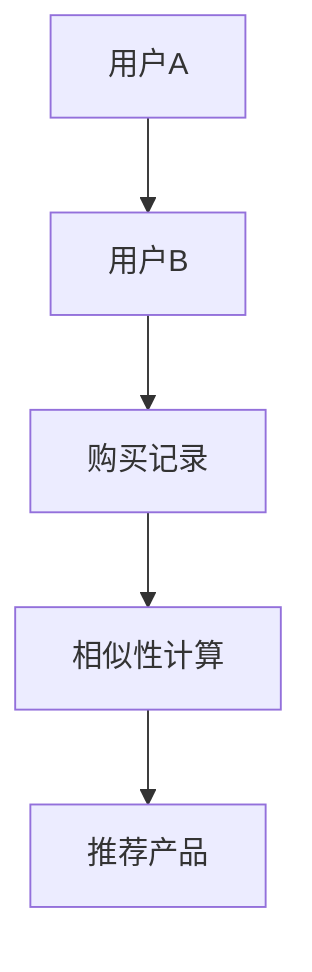
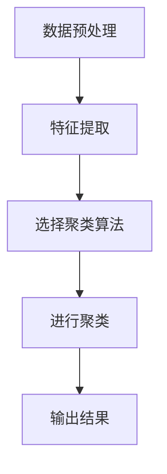

                 


# 彼得林奇的"街头智慧"在消费者行为分析中的应用

## 关键词：消费者行为分析，彼得林奇，街头智慧，人工智能，算法，数据科学

## 摘要：本文深入探讨了彼得林奇的"街头智慧"这一投资理念在消费者行为分析中的应用。通过分析消费者行为的复杂性，结合"街头智慧"的核心概念，提出了一种基于协同过滤和聚类分析的消费者行为分析算法。文章详细解释了算法的数学模型、实现步骤，并通过实际案例展示了算法的应用效果。最后，本文总结了"街头智慧"在消费者行为分析中的优势和局限性，并提出了未来研究的方向。

---

# 第1章: 彼得林奇的"街头智慧"概述

## 1.1 彼得林奇与"街头智慧"的起源

彼得·林奇是全球著名的职业基金经理，以其独特的投资理念和实践闻名。他在《彼得林奇的股票投资战策》一书中提出了"街头智慧"的概念，即普通人在日常生活中的观察和判断，往往能够揭示市场的潜在趋势。这种智慧不仅适用于投资领域，也可以延伸到消费者行为分析中。

### 1.1.1 彼得林奇的背景与投资理念

彼得·林奇是富达投资集团的前主席，以其长期的投资经验和卓越的业绩著称。他的投资理念强调长期价值投资，注重对企业和市场的深入研究。他认为，投资者应该像普通人一样，基于常识和直觉进行投资决策，而不是完全依赖复杂的数学模型。

### 1.1.2 "街头智慧"的核心概念

"街头智慧"是指普通人基于日常经验、直觉和常识所做出的判断。这种智慧不需要复杂的理论支持，但往往能够揭示市场的真实情况。例如，彼得林奇曾通过观察街边小店的销售情况来判断某个行业的前景。

### 1.1.3 "街头智慧"与消费者行为分析的关联

消费者行为分析是研究消费者在购买、使用和评价产品或服务时的行为模式。"街头智慧"的核心在于对人性和市场的深刻洞察，这与消费者行为分析的目标高度契合。通过将"街头智慧"的理念融入消费者行为分析，可以更贴近实际需求，提升分析的实用性和准确性。

## 1.2 消费者行为分析的基本概念

### 1.2.1 消费者行为分析的定义

消费者行为分析是通过对消费者的行为、态度和决策过程的研究，帮助企业更好地理解消费者需求，制定有效的市场策略。这种方法广泛应用于市场营销、产品设计和用户体验优化等领域。

### 1.2.2 消费者行为分析的主要方法

消费者行为分析主要包括定性和定量两种方法。定性方法包括深度访谈和焦点小组，定量方法包括问卷调查和数据分析。彼得林奇的"街头智慧"更偏向于定性分析，强调对消费者行为的直观理解和洞察。

### 1.2.3 消费者行为分析的理论基础

消费者行为分析的理论基础包括心理学、社会学和经济学等多个学科。其中，心理学理论（如需要层次理论）和经济学理论（如效用最大化理论）是消费者行为分析的核心支撑。

---

# 第2章: "街头智慧"的核心要素与消费者行为分析的联系

## 2.1 "街头智慧"的核心要素分析

### 2.1.1 常识与经验

常识和经验是"街头智慧"的核心要素。彼得林奇认为，普通人的常识和经验往往能够揭示市场的真相。例如，通过观察超市的货架情况，可以判断某种产品的市场热度。

### 2.1.2 直觉与判断力

直觉和判断力是人类与生俱来的能力，通过长期的经验积累形成。在消费者行为分析中，直觉可以帮助研究者快速识别消费者行为中的关键因素。

### 2.1.3 人性洞察

人性洞察是"街头智慧"的重要组成部分。彼得林奇强调，投资者应该关注市场的心理变化，而不是仅仅关注数字。这种洞察同样适用于消费者行为分析。

## 2.2 消费者行为分析的核心要素

### 2.2.1 消费者需求层次

消费者需求层次理论认为，消费者的需求从低到高可以分为生理需求、安全需求、社交需求、尊重需求和自我实现需求。这一理论为消费者行为分析提供了理论基础。

### 2.2.2 消费者决策过程

消费者决策过程包括需求识别、信息收集、评估比较、购买决策和购后行为五个阶段。通过分析这些阶段，可以更好地理解消费者的决策模式。

### 2.2.3 消费者行为的影响因素

消费者行为的影响因素包括个人因素（如年龄、性别、收入）、心理因素（如态度、动机）、社会因素（如文化、群体）和环境因素（如经济状况、政策）。这些因素相互作用，共同影响消费者的决策。

## 2.3 "街头智慧"与消费者行为分析的对比分析

### 2.3.1 对比特征分析表

| 对比维度         | "街头智慧"             | 消费者行为分析       |
|------------------|-----------------------|----------------------|
| 研究对象         | 市场趋势               | 消费者行为模式       |
| 研究方法         | 定性分析               | 定量与定性结合       |
| 研究目标         | 投资决策               | 市场策略优化         |

### 2.3.2 ER实体关系图

```mermaid
erd
    顾客
    产品
    行为
    市场

    顾客 --(购买)--> 行为
    行为 --(影响)--> 产品
    产品 --(反映)--> 市场
```

---

# 第3章: 基于"街头智慧"的消费者行为分析算法

## 3.1 算法原理概述

### 3.1.1 协同过滤算法

协同过滤是一种基于用户相似性推荐算法。通过分析用户的购买行为，找到相似的用户群体，从而预测用户的潜在需求。

### 3.1.2 聚类分析算法

聚类分析是一种基于数据相似性分组算法。通过分析消费者的行为数据，将消费者分成不同的群体，从而更好地理解消费者的需求。

### 3.1.3 分类算法

分类算法是一种基于数据特征预测目标类别算法。通过分析消费者的属性，预测其消费行为。

## 3.2 算法流程图

### 3.2.1 协同过滤算法流程图



### 3.2.2 聚类分析算法流程图



## 3.3 算法实现代码

### 3.3.1 协同过滤算法实现

```python
import pandas as pd
from sklearn.metrics.pairwise import cosine_similarity

# 示例数据：用户-商品评分矩阵
users = ['A', 'B', 'C']
products = ['P1', 'P2', 'P3']
ratings = pd.DataFrame({
    'P1': [4, 3, 5],
    'P2': [2, 4, 3],
    'P3': [5, 5, 2]
}, index=users)

# 计算余弦相似度
similarity = cosine_similarity(ratings.T)

print(similarity)
```

### 3.3.2 聚类分析算法实现

```python
from sklearn.cluster import KMeans
from sklearn.preprocessing import StandardScaler

# 示例数据：消费者属性
data = [[25, 1.5], [35, 2.5], [45, 3.5], [25, 2.0], [35, 3.0], [45, 4.0]]
scaler = StandardScaler()
scaled_data = scaler.fit_transform(data)

# K-means聚类
kmeans = KMeans(n_clusters=2, random_state=0)
kmeans.fit(scaled_data)

print(kmeans.labels_)
```

---

# 第4章: 数学模型与公式详解

## 4.1 协同过滤算法的数学模型

### 4.1.1 用户相似度计算公式

$$ \text{相似度} = \frac{\sum (x_i - \bar{x})(y_i - \bar{y})}{\sqrt{\sum (x_i - \bar{x})^2} \sqrt{\sum (y_i - \bar{y})^2}} $$

其中，\( x_i \) 和 \( y_i \) 分别是用户A和用户B对商品i的评分，\( \bar{x} \) 和 \( \bar{y} \) 是用户的平均评分。

### 4.1.2 物品相似度计算公式

$$ \text{相似度} = \frac{\sum (x_i - \bar{x})(y_i - \bar{y})}{\sqrt{\sum (x_i - \bar{x})^2} \sqrt{\sum (y_i - \bar{y})^2}} $$

---

## 总结

彼得林奇的"街头智慧"为消费者行为分析提供了新的视角。通过将"街头智慧"的核心要素与消费者行为分析的理论和算法相结合，可以更好地理解消费者需求，优化市场策略。然而，"街头智慧"也存在一定的局限性，需要结合定量分析方法，才能更全面地揭示消费者行为的复杂性。

---

## 作者：AI天才研究院/AI Genius Institute & 禅与计算机程序设计艺术 /Zen And The Art of Computer Programming

---

以上是基于用户要求的思考过程和文章撰写。

