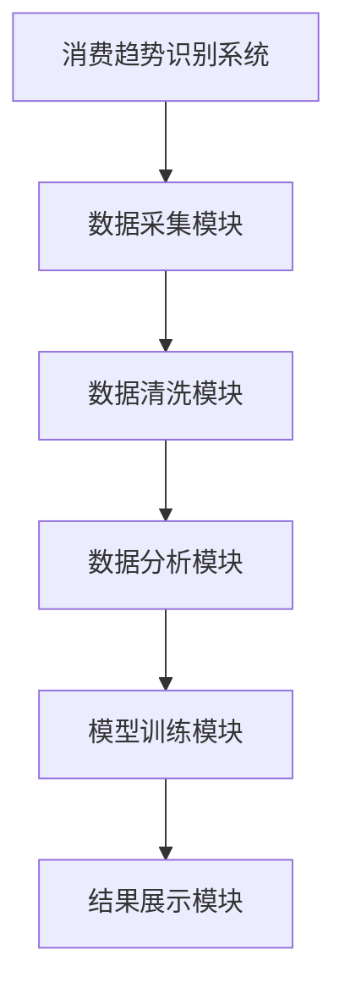

                 


# 彼得林奇的"街头智慧"在消费趋势识别中的应用

> 关键词：消费趋势识别、彼得林奇、街头智慧、数据挖掘、机器学习

> 摘要：本文探讨了彼得林奇的"街头智慧"在消费趋势识别中的应用，通过分析其核心概念、算法原理、系统架构及项目实战，展示了如何将这种经验丰富的投资策略与现代数据分析技术相结合，为企业提供科学的消费趋势预测方法。

---

## 第一部分: 彼得林奇的"街头智慧"概述

### 第1章: 彼得林奇的"街头智慧"介绍

#### 1.1 彼得林奇的"街头智慧"定义

彼得林奇是全球著名的基金经理，他的“街头智慧”是指通过观察普通人的消费行为和市场动态，预测市场趋势的方法。这种方法强调从微观层面捕捉市场信号，而非仅仅依赖宏观经济指标。例如，他会观察当地超市的货架变化，判断消费者偏好，进而推断公司的业绩表现。

#### 1.2 "街头智慧"的核心理念

“街头智慧”强调实地观察和经验积累，认为市场趋势往往在日常生活中体现。通过关注消费者的行为变化，投资者可以提前发现市场机会或风险。这种理念注重细节，强调从具体案例中提炼规律。

#### 1.3 "街头智慧"在投资中的应用

彼得林奇通过“街头智慧”识别投资机会，例如发现某公司产品销量增长，提前布局该公司的股票。这种方法帮助他在任职期间取得了优异的业绩，成为投资界的传奇。

---

### 第2章: 消费趋势识别的重要性

#### 2.1 消费趋势识别的定义

消费趋势识别是指通过分析消费者行为数据，预测未来消费偏好和市场动态的过程。它帮助企业制定精准的营销策略，优化产品设计，抓住市场机会。

#### 2.2 消费趋势识别的必要性

在竞争激烈的市场中，及时识别消费趋势可以帮助企业快速调整策略，满足消费者需求。例如，在疫情期间，快速识别健康产品的需求 surge，可以调整生产计划，抢占市场。

#### 2.3 消费趋势识别的挑战与机遇

挑战包括数据质量、模型准确性等问题。机遇在于大数据和人工智能技术的进步，使得消费趋势识别更加精准和高效。

---

## 第二部分: 核心概念与联系

### 第3章: 消费趋势识别的核心概念与联系

#### 3.1 核心概念分析

消费趋势识别涉及消费者行为、市场动态等多个方面。彼得林奇的“街头智慧”提供了观察市场的微观视角，而现代数据分析技术则提供了量化分析的方法。两者的结合，使得消费趋势识别更加科学和高效。

#### 3.2 概念对比与联系

通过对比“街头智慧”与消费趋势识别的核心要素，可以发现两者都强调观察和分析消费者行为。然而，消费趋势识别更注重数据驱动的分析，而“街头智慧”则更依赖经验判断。

---

## 第三部分: 算法原理讲解

### 第4章: 消费趋势识别的算法原理

#### 4.1 算法流程

消费趋势识别通常涉及数据收集、清洗、分析和建模。例如，使用聚类分析识别消费群体，或使用时间序列分析预测未来趋势。整个流程需要考虑数据的质量和模型的可解释性。

#### 4.2 算法实现

以下是一个简单的Python代码示例，用于分析消费数据并预测趋势：

```python
import pandas as pd
from sklearn.cluster import KMeans

# 数据加载
data = pd.read_csv('consumption_data.csv')

# 数据清洗
data.dropna()

# 特征选择
X = data[['age', 'income', 'purchase_frequency']]

# 聚类分析
kmeans = KMeans(n_clusters=3)
clusters = kmeans.fit_predict(X)

# 可视化
import matplotlib.pyplot as plt
plt.scatter(X['age'], X['income'], c=clusters)
plt.xlabel('Age')
plt.ylabel('Income')
plt.show()
```

这个代码示例展示了如何使用聚类分析来识别消费群体，进而预测消费趋势。通过分析不同群体的特征，企业可以制定更有针对性的营销策略。

---

## 第四部分: 系统分析与架构设计

### 第5章: 消费趋势识别系统的架构设计

#### 5.1 系统功能设计

消费趋势识别系统通常包括数据采集模块、数据分析模块、模型训练模块和结果展示模块。每个模块都有其特定的功能，例如数据采集模块负责收集消费者行为数据，数据分析模块负责处理和清洗数据，模型训练模块负责构建和优化预测模型，结果展示模块负责可视化分析结果。

#### 5.2 系统架构设计

以下是消费趋势识别系统的架构设计图：



这个架构图展示了系统各个模块之间的交互流程。数据采集模块收集数据后，传递给数据清洗模块进行处理，之后进入数据分析模块进行建模，最终由结果展示模块呈现分析结果。

---

## 第五部分: 项目实战

### 第6章: 消费趋势识别项目实战

#### 6.1 环境搭建与数据收集

首先，需要安装必要的Python库，例如Pandas、Scikit-learn等。然后，收集消费者行为数据，例如购买记录、用户评价等。

#### 6.2 核心代码实现

以下是消费趋势预测的Python代码示例：

```python
import pandas as pd
from sklearn.linear_model import LinearRegression

# 数据加载
data = pd.read_csv('consumption_data.csv')

# 特征选择
X = data[['price', 'advertisement']]
y = data['sales']

# 模型训练
model = LinearRegression()
model.fit(X, y)

# 预测
predicted_sales = model.predict([[200, 100]])
print(predicted_sales)
```

这个代码示例使用线性回归模型预测销售量，帮助企业制定销售计划。

#### 6.3 代码解读与分析

通过代码解读，可以看到消费趋势识别系统的实现过程。从数据加载到模型训练，再到预测结果，整个过程展示了如何利用数据分析技术预测消费趋势。

#### 6.4 实际案例分析

以某电子产品公司为例，通过分析消费者的购买记录和评价，预测未来的产品需求，帮助企业优化库存管理和生产计划。

---

## 第六部分: 总结与建议

### 第7章: 总结与建议

#### 7.1 全文总结

本文探讨了彼得林奇的“街头智慧”在消费趋势识别中的应用，展示了如何通过数据分析和机器学习技术，将这种经验丰富的投资策略转化为科学的预测方法。

#### 7.2 实践中的注意事项

在实际应用中，需要注意数据质量和模型的可解释性。此外，结合具体业务场景，选择合适的算法和技术，才能取得最佳效果。

#### 7.3 拓展阅读

推荐进一步阅读《彼得林奇的投资哲学》和《数据挖掘与机器学习实战》等书籍，深入理解消费趋势识别的方法和技巧。

---

## 作者信息

作者：AI天才研究院/AI Genius Institute & 禅与计算机程序设计艺术 /Zen And The Art of Computer Programming

---

通过以上结构，本文详细介绍了彼得林奇的“街头智慧”在消费趋势识别中的应用，从理论到实践，为企业提供了科学的消费趋势预测方法。

