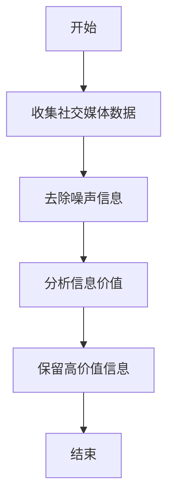
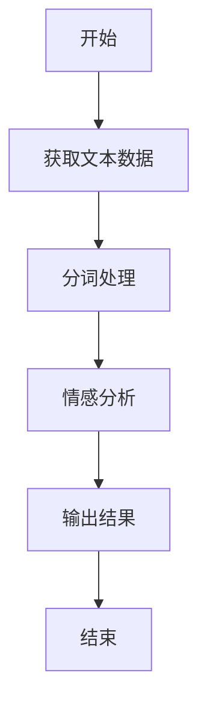
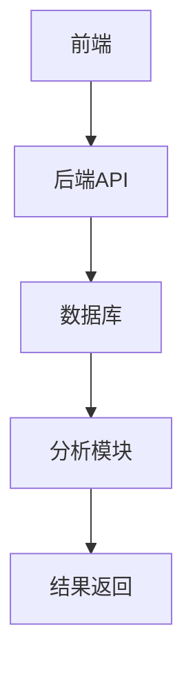

                 


# 彼得林奇的"街头智慧"在社交媒体时代的应用

## 关键词：
- 彼得·林奇
- 街头智慧
- 投资策略
- 社交媒体
- 数据分析
- 情感分析
- 算法模型

## 摘要：
本文探讨了彼得·林奇的“街头智慧”在社交媒体时代的应用，分析了社交媒体环境对投资决策的影响，结合算法和系统设计，展示了如何利用这些智慧在现代投资中取得优势。文章详细讲解了信息筛选、情感分析、系统架构等关键内容，并通过案例分析和项目实战，为读者提供了实用的指导。

---

## 第一部分：背景介绍

### 第1章：彼得·林奇的“街头智慧”概述

#### 1.1 “街头智慧”的核心概念
- **1.1.1 定义与特点**
  - 街头智慧是指普通投资者通过观察市场和实践总结出的投资策略。
  - 强调基本面分析和长期投资，避免短期波动的干扰。

- **1.1.2 与传统投资方法的区别**
  - 传统投资方法依赖于复杂的模型和数据，而街头智慧更注重实际观察和经验。
  - 街头智慧更贴近普通投资者的实际操作，强调简单和实用。

#### 1.2 社交媒体时代的投资环境
- **1.2.1 社交媒体对投资的影响**
  - 社交媒体改变了信息传播的方式，投资者可以即时获取市场动态和专家观点。
  - 社交媒体上的讨论可能影响市场情绪，从而影响投资决策。

- **1.2.2 街头智慧在社交媒体时代的必要性**
  - 在信息爆炸的时代，街头智慧帮助投资者筛选有价值的信息，避免被噪声干扰。
  - 社交媒体为投资者提供了更多交流和学习的机会，街头智慧的应用变得更加重要。

---

## 第二部分：核心概念与联系

### 第2章：街头智慧的核心原理

#### 2.1 信息收集与判断力
- **2.1.1 信息筛选机制**
  - 街头智慧强调通过观察市场和公司基本面来收集信息。
  - 信息筛选机制帮助投资者识别出有价值的信息，避免被虚假信息误导。

- **2.1.2 情绪分析与市场预测**
  - 通过分析社交媒体上的用户情绪，可以预测市场的趋势。
  - 情绪分析是街头智慧在社交媒体时代的重要应用，帮助投资者做出更明智的决策。

#### 2.2 决策机制与风险控制
- **2.2.1 投资决策流程**
  - 街头智慧强调逐步分析和验证，避免盲目跟风。
  - 决策流程包括信息收集、分析、验证和执行。

- **2.2.2 风险评估方法**
  - 通过分析市场的波动性和公司的财务状况，评估投资的风险。
  - 风险控制是街头智慧的重要组成部分，帮助投资者避免重大损失。

### 第3章：社交媒体环境下的投资分析

#### 3.1 信息传播与影响力
- **3.1.1 社交媒体信息的扩散特点**
  - 信息传播速度快，覆盖范围广。
  - 用户互动频繁，信息可能被快速放大或削弱。

- **3.1.2 网络效应与投资决策**
  - 网络效应可能导致市场情绪的过度波动，影响投资决策。
  - 投资者需要警惕网络效应带来的羊群效应，避免盲目跟随。

#### 3.2 用户行为分析
- **3.2.1 用户互动模式**
  - 通过分析用户的互动行为，识别市场情绪的变化。
  - 用户行为分析帮助投资者更好地理解市场动态。

- **3.2.2 社会影响力对投资决策的影响**
  - 有影响力的意见领袖在社交媒体上的观点可能对市场产生重大影响。
  - 投资者需要理性分析这些观点，避免被误导。

---

## 第三部分：算法原理讲解

### 第4章：基于街头智慧的算法模型

#### 4.1 信息筛选算法

- **4.1.1 Mermaid流程图：信息筛选流程**


- **4.1.2 Python代码示例：数据爬取与清洗**
```python
import requests
from bs4 import BeautifulSoup

def collect_data(url):
    response = requests.get(url)
    soup = BeautifulSoup(response.text, 'html.parser')
    articles = soup.find_all('div', class_='article')
    return articles

# 示例用法
articles = collect_data('https://example.com')
```

#### 4.2 情感分析

- **4.2.1 Mermaid流程图：情感分析流程**


- **4.2.2 Python代码示例：情感分析**
```python
from textblob import TextBlob

def sentiment_analysis(text):
    blob = TextBlob(text)
    return blob.sentiment.polarity

# 示例用法
text = "The stock market is booming today."
sentiment = sentiment_analysis(text)
print(sentiment)  # 输出结果在-1到1之间
```

---

## 第四部分：系统分析与架构设计方案

### 第5章：系统功能设计与架构

#### 5.1 项目介绍与系统功能设计
- **5.1.1 领域模型Mermaid类图**


- **5.1.2 系统架构设计Mermaid图**


---

## 第五部分：项目实战

### 第6章：项目实战与案例分析

#### 6.1 环境安装与配置
- **6.1.1 安装必要的工具与库**
  - Python 3.x
  - requests, BeautifulSoup, TextBlob
  - 数据库：MySQL或MongoDB

#### 6.2 系统核心实现

- **6.2.1 核心代码实现**
```python
import requests
from textblob import TextBlob
from bs4 import BeautifulSoup
import pymysql

def collect_tweets(hashtag):
    url = f'https://twitter.com/search?q={hashtag}'
    response = requests.get(url)
    soup = BeautifulSoup(response.text, 'html.parser')
    tweets = soup.find_all('div', class_='tweet')
    return tweets

def analyze_sentiment(tweets):
    sentiments = []
    for tweet in tweets:
        text = tweet.find('div', class_='content').get_text()
        blob = TextBlob(text)
        sentiments.append((tweet.user.screen_name, blob.sentiment.polarity))
    return sentiments

# 示例用法
tweets = collect_tweets('#StockMarket')
sentiments = analyze_sentiment(tweets)
print(sentiments)
```

#### 6.3 案例分析

- **6.3.1 投资决策过程**
  - 收集社交媒体上的相关讨论。
  - 进行情感分析，判断市场情绪。
  - 结合基本面分析，做出投资决策。

---

## 第六部分：总结与展望

### 第7章：总结与展望

#### 7.1 小结
- 本文详细探讨了彼得·林奇的街头智慧在社交媒体时代的应用，结合算法和系统设计，展示了如何在现代投资环境中应用这些智慧。

#### 7.2 最佳实践 tips
- **信息筛选**：使用算法筛选有价值的信息，避免被噪声干扰。
- **情感分析**：结合情感分析，判断市场情绪，做出更明智的决策。
- **系统架构**：设计合理的系统架构，确保数据的高效处理和分析。

#### 7.3 注意事项
- **信息过载**：注意避免信息过载，保持理性分析。
- **数据隐私**：保护个人数据隐私，遵守相关法律法规。

#### 7.4 拓展阅读
- 推荐书籍：《彼得·林奇的成功投资》
- 推荐博客：技术博客、投资分析博客

---

## 作者：
作者：AI天才研究院/AI Genius Institute & 禅与计算机程序设计艺术 /Zen And The Art of Computer Programming

