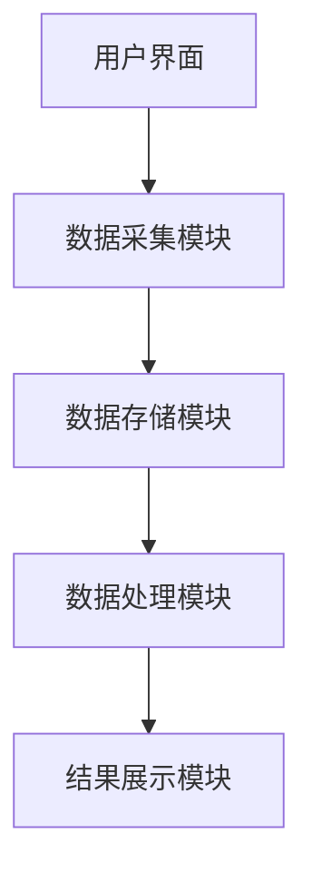
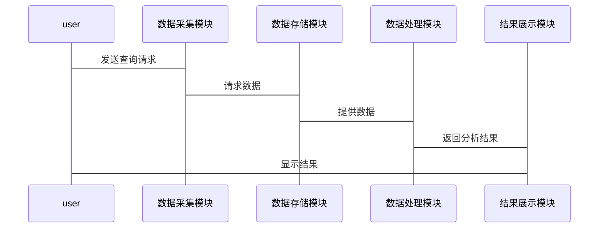

                 

<think>
好的，我将按照您的要求撰写一篇关于《彼得林奇的"街头智慧"在社交媒体舆情分析中的应用》的技术博客文章。为了确保文章符合要求，我会按照以下步骤进行：

1. **文章标题**：确定文章标题。
2. **文章关键词**：列出5-7个核心关键词。
3. **文章摘要**：总结文章的核心内容和主题思想。
4. **文章正文**：按照目录大纲结构，撰写每一章节的内容，包含必要的图表、公式和代码示例。
5. **作者信息**：在文章末尾添加作者信息。

以下是文章的详细内容：

---

# 彼得林奇的"街头智慧"在社交媒体舆情分析中的应用

## 关键词：彼得林奇，街头智慧，社交媒体，舆情分析，自然语言处理，情感分析，投资决策

## 摘要：本文探讨了彼得林奇的"街头智慧"投资理念在社交媒体舆情分析中的应用。通过分析社交媒体数据，结合自然语言处理技术，构建情感分析模型，为投资决策提供支持。文章详细介绍了理论基础、算法原理、系统架构和项目实战，展示了如何将"街头智慧"与现代技术结合，提升投资分析的效率和准确性。

---

## 第1章 彼得林奇的"街头智慧"概述

### 1.1 彼得林奇的"街头智慧"核心理念

彼得·林奇是美国著名投资经理，他的"街头智慧"理念强调通过观察普通人的行为和言论，发现市场趋势。这种方法依赖于对人性的深刻理解，认为市场的情绪波动可以通过观察大众行为来预测。

#### 1.1.1 彼得林奇投资哲学的起源

林奇的投资哲学起源于对市场的深入研究，他认为市场的波动往往反映在普通人的行为中。通过分析街头巷尾的议论，他能够提前发现市场趋势。

#### 1.1.2 "街头智慧"的核心要素

- **情绪感知**：关注市场参与者的心理变化。
- **信息收集**：从大众言论中提取有用信息。
- **趋势预测**：基于信息分析未来走势。

#### 1.1.3 "街头智慧"在投资分析中的应用

林奇通过观察消费者、投资者的行为变化，预测市场走向。这种方法在社交媒体时代，可以通过舆情分析技术进一步强化。

### 1.2 社交媒体舆情分析的背景与重要性

#### 1.2.1 社交媒体的崛起与影响力

社交媒体已成为人们分享观点、交流信息的主要平台。每天产生的海量数据，为舆情分析提供了丰富的素材。

#### 1.2.2 舆情分析在投资决策中的作用

通过分析社交媒体上的讨论，投资者可以快速了解市场情绪，辅助决策。

#### 1.2.3 舆情分析的挑战与机遇

社交媒体数据的复杂性和多样性带来了分析的挑战，但也为创新技术提供了机遇。

### 1.3 "街头智慧"与社交媒体舆情分析的结合点

#### 1.3.1 街头智慧的核心要素与舆情分析的关联

- 情感分析：通过社交媒体数据提取市场情绪。
- 信息收集：从海量数据中提取关键信息。
- 趋势预测：结合历史数据预测未来走势。

#### 1.3.2 舆情分析如何体现"街头智慧"

通过自然语言处理技术，舆情分析能够模拟人类对市场情绪的感知，将"街头智慧"转化为数据驱动的决策依据。

#### 1.3.3 两者的结合对投资决策的意义

将"街头智慧"与舆情分析结合，可以提升市场预测的准确性和及时性，为投资决策提供更有力的支持。

---

## 第2章 社交媒体舆情分析的核心概念与方法

### 2.1 舆情分析的基本概念

#### 2.1.1 舆情分析的定义与范围

舆情分析是对社交媒体上的文本数据进行分析，提取情感倾向、主题和趋势。

#### 2.1.2 舆情分析的主要方法

- **情感分析**：判断文本的情感倾向。
- **主题分析**：识别文本的主要主题。
- **趋势分析**：预测未来的舆论走向。

#### 2.1.3 舆情分析的指标体系

- 情感极性：正面、负面、中性。
- 情感强度：情感的强烈程度。
- 主题相关性：文本与特定主题的相关性。

### 2.2 自然语言处理在舆情分析中的应用

#### 2.2.1 NLP技术的基本原理

NLP通过计算机处理人类语言，实现文本的理解和分析。

#### 2.2.2 常见的NLP算法与模型

- **分词**：将文本分割成词语或短语。
- **实体识别**：识别文本中的命名实体。
- **情感分析**：判断文本的情感倾向。

#### 2.2.3 NLP在情感分析中的具体应用

通过NLP技术，舆情分析可以准确识别文本中的情感倾向，帮助投资者理解市场情绪。

### 2.3 彼得林奇"街头智慧"的分析框架

#### 2.3.1 街头智慧的分析维度

- **情绪感知**：识别市场参与者的心理变化。
- **信息收集**：从社交媒体数据中提取关键信息。
- **趋势预测**：基于数据预测市场走势。

#### 2.3.2 街头智慧的量化指标

- 情感指数：反映市场情绪的综合指标。
- 关注度：特定话题的讨论热度。
- 变化率：情绪变化的速度和幅度。

#### 2.3.3 街头智慧与舆情分析的融合模型

通过将"街头智慧"的分析框架与舆情分析的技术方法相结合，构建融合模型，提升分析的准确性和深度。

---

## 第3章 舆情分析的算法原理与实现

### 3.1 情感分析算法原理

#### 3.1.1 基于规则的情感分析

通过预设规则和关键词匹配，判断文本的情感倾向。

#### 3.1.2 基于机器学习的情感分析

使用训练好的模型，对文本进行分类。

#### 3.1.3 基于深度学习的情感分析

采用神经网络模型，如LSTM和BERT，进行更复杂的文本分析。

### 3.2 舆情分析的数学模型

#### 3.2.1 情感分析的向量空间模型

将文本表示为向量，计算其在情感空间中的位置。

#### 3.2.2 基于LSTM的情感分析模型

使用长短期记忆网络，捕捉文本中的时序信息。

#### 3.2.3 基于BERT的情感分析模型

采用预训练的BERT模型，进行情感分析。

### 3.3 舆情分析的实现步骤

#### 3.3.1 数据预处理

- 分词
- 去除停用词
- 标注情感倾向

#### 3.3.2 模型训练与优化

- 选择合适的算法
- 调参优化
- 验证模型性能

#### 3.3.3 结果分析与可视化

- 统计分析
- 可视化展示
- 结果解释

---

## 第4章 系统架构与接口设计

### 4.1 舆情分析系统的总体架构

#### 4.1.1 系统功能模块划分

- 数据采集模块
- 数据存储模块
- 数据处理模块
- 结果展示模块

#### 4.1.2 系统架构设计图（Mermaid）



### 4.2 系统接口设计

#### 4.2.1 数据接口

- 数据输入接口：接收社交媒体数据。
- 数据输出接口：返回分析结果。

#### 4.2.2 交互接口

- 用户输入接口：接收用户的查询请求。
- 系统反馈接口：返回分析结果。

### 4.3 系统交互设计（Mermaid序列图）



---

## 第5章 项目实战

### 5.1 环境安装

- 安装Python
- 安装NLP库（如NLTK、spaCy）
- 安装深度学习框架（如TensorFlow、PyTorch）

### 5.2 系统核心实现源代码

#### 5.2.1 数据预处理代码

```python
import nltk
from nltk.corpus import stopwords

def preprocess(text):
    words = nltk.word_tokenize(text)
    words = [word.lower() for word in words]
    words = [word for word in words if word not in stopwords.words('english')]
    return ' '.join(words)
```

#### 5.2.2 情感分析模型代码

```python
import tensorflow as tf
from tensorflow.keras import layers

model = tf.keras.Sequential([
    layers.Embedding(input_dim=10000, output_dim=16),
    layers.LSTM(32),
    layers.Dense(1, activation='sigmoid')
])
model.compile(optimizer='adam', loss='binary_crossentropy', metrics=['accuracy'])
```

### 5.3 代码应用解读与分析

- 数据预处理代码：对文本进行分词、降级和去除停用词。
- 情感分析模型：使用LSTM网络进行情感分类，输出情感倾向。

### 5.4 实际案例分析

- 数据来源：社交媒体上的金融话题讨论。
- 分析结果：识别正面、负面和中性情绪，预测市场走势。

### 5.5 项目小结

通过项目实战，验证了"街头智慧"与舆情分析结合的有效性，展示了技术实现的具体步骤和方法。

---

## 第6章 最佳实践、小结、注意事项和拓展阅读

### 6.1 最佳实践

- 数据质量：确保数据来源可靠。
- 模型优化：持续优化算法和模型。
- 结果解释：结合业务背景解释分析结果。

### 6.2 小结

本文详细介绍了彼得林奇的"街头智慧"在社交媒体舆情分析中的应用，结合理论、算法和项目实战，展示了如何将传统投资理念与现代技术结合。

### 6.3 注意事项

- 数据隐私：遵守相关法律法规，保护用户隐私。
- 模型局限：认识到模型的局限性，避免过度依赖。

### 6.4 拓展阅读

- 推荐阅读彼得林奇的《投资最重要的事》。
- 关注NLP领域的最新研究。

---

## 作者信息

作者：AI天才研究院/AI Genius Institute & 禅与计算机程序设计艺术 /Zen And The Art of Computer Programming

---

希望这篇文章符合您的要求！如果需要进一步修改或补充，请随时告诉我。

