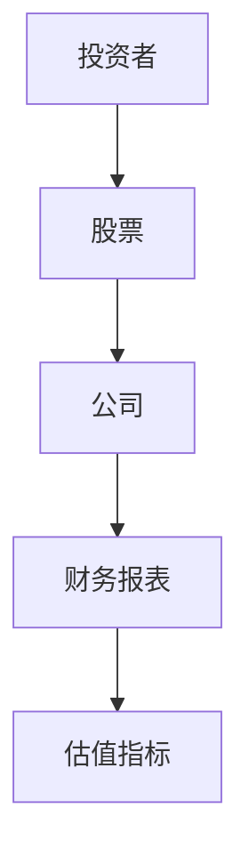
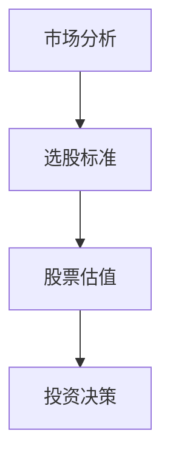
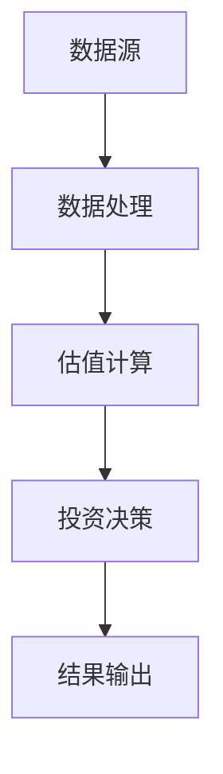
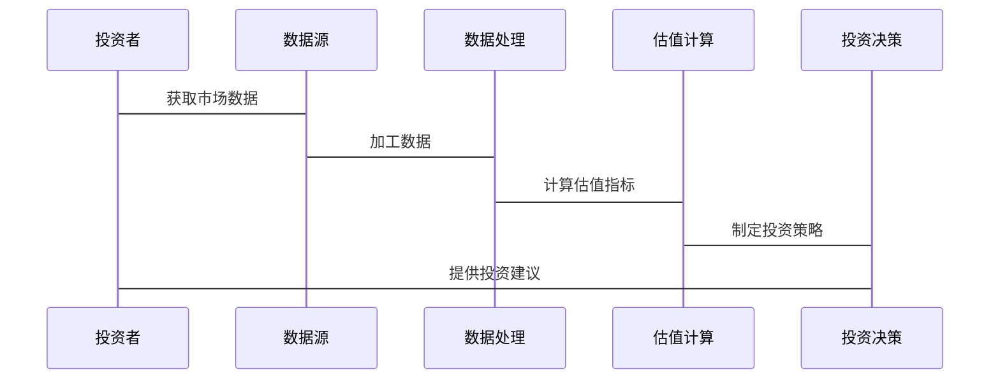

                 


# 彼得林奇的"街头智慧"投资技巧

> 关键词：彼得林奇，投资技巧，价值投资，成长投资，股票估值

> 摘要：本文深入探讨了彼得林奇的投资理念，特别是他的“街头智慧”策略。通过分析价值投资和成长投资的核心要素，结合算法模型和数学公式，详细讲解了如何在实际投资中应用这些技巧。文章还通过案例分析，展示了如何通过基本面分析和估值指标来选择优质股票。

---

## 第一部分: 彼得林奇及其投资理念

### 第1章: 彼得林奇的生平简介

#### 1.1.1 早年经历
彼得·林奇（Peter Lynch）是美国著名投资专家，曾担任富达麦哲伦基金的经理，创造了该基金年平均回报率13.4%的神话。他的投资哲学以价值投资和成长投资为核心，强调深入研究公司基本面。

#### 1.1.2 投资哲学
林奇主张投资者应关注市场中的非效率性，寻找那些被市场低估的股票。他认为，普通投资者可以通过分析公司财务报表和行业前景，发现那些具有长期增长潜力的公司。

#### 1.1.3 贡献
林奇的贡献在于将复杂的投资理论简化为实用的技巧，使普通投资者能够理解和应用。他的方法强调长期投资和对公司基本面的深入分析。

### 第1.2章 街头智慧的定义与特点

#### 1.2.1 定义
“街头智慧”是指在投资中，通过观察市场动态、分析公司基本面，以较低的价格买入优质股票，并长期持有，直至其价值被市场发现。

#### 1.2.2 核心特点
- 逆向思维：在市场恐慌时寻找机会，避免跟随市场情绪。
- 深入研究：通过分析公司财务报表，评估其内在价值。
- 长期视角：关注公司的长期增长潜力，而非短期波动。

#### 1.2.3 与传统投资理念的区别
传统投资可能更注重技术分析，而“街头智慧”强调基本面分析和长期价值。

---

## 第二部分: 街头智慧的核心概念与联系

### 第2章: 核心概念原理

#### 2.1.1 价值投资
价值投资寻找市场价格低于内在价值的股票。内在价值计算公式为：$内在价值 = \frac{每股收益}{市盈率}$。当市场价格低于内在价值时，股票具有投资价值。

#### 2.1.2 成长投资
成长投资关注具有高增长潜力的公司。通过分析公司收入增长率和行业增长前景，选择那些增长速度快于行业平均水平的股票。

### 第2.2章 概念属性特征对比表格

| 概念 | 价值投资 | 成长投资 |
|------|-----------|----------|
| 定义 | 价格低于内在价值 | 高增长潜力 |
| 关注点 | 市盈率、市净率 | 收入增长率、ROE |
| 适合 | 稳定行业 | 高增长行业 |

### 第2.3章 ER实体关系图


---

## 第三部分: 算法原理讲解

### 第3章: 彼得林奇投资模型



### 第3.2章 价值投资算法

```python
def value_investment(stock_price, intrinsic_value):
    if stock_price < intrinsic_value:
        return "买入"
    else:
        return "观望"
```

### 第3.3章 成长投资算法

```python
def growth_investment(growth_rate, industry_growth):
    if growth_rate > industry_growth:
        return "买入"
    else:
        return "观望"
```

---

## 第四部分: 数学模型与公式

### 第4章: 市盈率计算

$$市盈率 = \frac{股价}{每股收益}$$

### 第4.2章 市净率计算

$$市净率 = \frac{股价}{每股净资产}$$

---

## 第五部分: 系统设计与架构

### 第5章: 投资系统设计

#### 5.1 系统架构图


#### 5.2 系统交互图


---

## 第六部分: 项目实战

### 第6章: 投资策略应用

#### 6.1 案例分析
选择一家公司，分析其财务报表，计算市盈率和市净率，评估其投资价值。

#### 6.2 代码实现
```python
import pandas as pd

# 假设df是包含股票数据的DataFrame
def calculate_pe_ticker(df):
    df['PE'] = df['股价'] / df['每股收益']
    return df

df = calculate_pe_ticker(df)
```

---

## 第七部分: 总结与最佳实践

### 第7章: 总结

彼得林奇的“街头智慧”投资技巧强调基本面分析和长期投资。通过深入研究公司财务数据和行业前景，投资者可以在市场中发现低估的股票，实现长期收益。

### 第7.2章 最佳实践 Tips

- 长期持有优质股票。
- 分散投资以降低风险。
- 避免频繁交易和跟风。

---

作者：AI天才研究院 & 禅与计算机程序设计艺术

