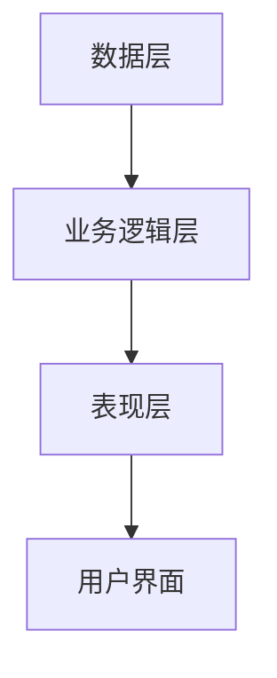

                 


# 彼得林奇的"质量优先"在不同行业的应用

---

## 关键词：
彼得林奇，质量优先，投资策略，行业应用，企业分析

---

## 摘要：
本文探讨了彼得林奇的质量优先投资策略在不同行业的应用。通过分析制造业、科技、消费、金融和医疗行业，展示了如何在这些领域中选择具有强大质量优势的企业。文章结合理论与实践，提供了质量优先评分模型和系统架构设计，并通过案例分析展示了策略的实施过程。

---

# 第一部分: 引言

## 1.1 彼得林奇与质量优先投资概述

### 1.1.1 彼得林奇的背景与投资理念
彼得林奇是富达投资的传奇经理人，强调长期投资和质量优先。他主张投资于具有强大护城河和良好管理的企业。

### 1.1.2 "质量优先"策略的定义与核心思想
质量优先策略注重企业的核心竞争力，包括市场地位、财务健康和管理团队。目标是选择那些在行业中具有领先地位的企业。

### 1.1.3 本书的目的与框架
本书旨在将质量优先策略应用于不同行业，通过理论分析和案例研究，帮助投资者识别优质企业。

---

## 1.2 质量优先策略的核心要素

### 1.2.1 质量优先的定义
质量优先策略强调选择具有强大市场地位、良好财务状况和优秀管理团队的企业。

### 1.2.2 核心要素：企业质量、行业地位、财务健康
- **企业质量**：包括产品竞争力、创新能力。
- **行业地位**：市场份额和行业影响力。
- **财务健康**：盈利能力、资产负债情况。

### 1.2.3 质量优先与投资回报的关系
高质量企业通常能带来稳定的投资回报，尤其是在市场波动时表现更优。

---

## 1.3 本书的结构与阅读指南

### 1.3.1 书籍章节安排
从理论到应用，再到系统设计和实战，层层递进。

### 1.3.2 阅读本书的方法建议
建议读者结合理论与案例，逐步理解质量优先策略。

### 1.3.3 本书的适用人群
投资者、企业高管、金融从业者。

---

## 1.4 本章小结
彼得林奇的质量优先策略注重企业质量、行业地位和财务健康，本书将探讨其在不同行业的应用。

---

# 第二部分: 质量优先策略的理论基础

## 2.1 质量优先策略的核心原理

### 2.1.1 投资决策的逻辑框架
质量优先策略基于对企业质量的全面评估，结合市场环境和财务状况进行决策。

### 2.1.2 质量优先与企业生命周期的关系
企业生命周期不同阶段的质量优先策略应用不同，需根据阶段调整策略。

### 2.1.3 质量优先策略的数学模型
质量评分公式：$$\text{质量评分} = \sum (\text{权重}_i \times \text{指标值}_i)$$

---

## 2.2 质量优先策略与企业分析

### 2.2.1 企业质量的评估指标
- 市场份额
- 净利润率
- 研发投入比例

### 2.2.2 财务健康状况的分析方法
- 资产负债率
- 净利润增长率

### 2.2.3 行业地位对企业价值的影响
行业地位高的企业更具竞争优势，抗风险能力更强。

---

## 2.3 质量优先策略的算法原理

### 2.3.1 质量优先评分模型的构建
模型基于多维度指标，使用加权平均方法计算企业质量评分。

### 2.3.2 投资组合优化的数学公式
投资组合优化公式：$$\text{最大收益} = \sum w_i \times r_i$$

### 2.3.3 算法的实现步骤与代码示例

```python
def quality_score(company_data):
    weights = {'市场份额': 0.4, '利润率': 0.3, '研发投入': 0.3}
    score = 0
    for metric in company_data:
        score += weights[metric] * company_data[metric]
    return score

# 示例数据
company = {
    '市场份额': 0.75,
    '利润率': 0.2,
    '研发投入': 0.15
}

print(quality_score(company))
```

---

## 2.4 本章小结
质量优先策略通过多维度评估企业，构建评分模型，并优化投资组合。

---

# 第三部分: 质量优先策略在不同行业的应用

## 3.1 制造业中的质量优先策略

### 3.1.1 制造业的特点与质量优先策略的适用性
制造业竞争激烈，质量优先策略适用于选择具有强大生产能力和品牌影响力的企业。

### 3.1.2 知名制造企业的成功案例分析
如苹果公司，具有强大的研发能力和品牌影响力。

### 3.1.3 制造业质量优先策略的实施步骤
- 评估生产效率
- 分析研发投入
- 考察品牌影响力

---

## 3.2 科技行业中的质量优先策略

### 3.2.1 科技行业的特点与挑战
科技行业变化快，创新能力强，质量优先策略需关注研发能力和技术领先性。

### 3.2.2 科技企业质量优先策略的实施要点
- 评估技术创新能力
- 分析市场占有率
- 考虑财务稳定性

### 3.2.3 科技行业中的成功案例分析
如谷歌，具有强大的技术领先性和稳定的财务表现。

---

## 3.3 消费行业中的质量优先策略

### 3.3.1 消费行业的特点与挑战
消费市场大，竞争激烈，需关注品牌忠诚度和市场反馈。

### 3.3.2 消费企业质量优先策略的实施要点
- 评估品牌影响力
- 分析客户满意度
- 考虑财务健康状况

### 3.3.3 消费行业中的成功案例分析
如可口可乐，具有强大的品牌影响力和稳定的市场需求。

---

## 3.4 金融行业中的质量优先策略

### 3.4.1 金融行业的特点与挑战
金融行业风险高，需关注资本实力和风险管理能力。

### 3.4.2 金融机构质量优先策略的实施要点
- 评估资本充足率
- 分析风险管理能力
- 考虑市场地位

### 3.4.3 金融行业中的成功案例分析
如摩根大通，具有强大的资本实力和优秀的风险管理能力。

---

## 3.5 医疗行业中的质量优先策略

### 3.5.1 医疗行业的特点与挑战
医疗行业受政策影响大，需关注研发能力和市场准入。

### 3.5.2 医疗机构质量优先策略的实施要点
- 评估研发能力
- 分析市场准入情况
- 考虑财务健康状况

### 3.5.3 医疗行业中的成功案例分析
如强生公司，具有强大的研发能力和广泛的市场准入。

---

## 3.6 本章小结
质量优先策略在不同行业中有不同的应用，需结合行业特点和企业具体情况制定策略。

---

# 第四部分: 系统分析与架构设计

## 4.1 质量优先策略的系统架构设计

### 4.1.1 系统功能设计
- 数据收集模块
- 质量评分计算模块
- 投资组合优化模块

### 4.1.2 系统架构设计
使用分层架构，包括数据层、业务逻辑层和表现层。



---

## 4.2 质量优先策略的系统实现

### 4.2.1 数据收集模块
从财务报表和行业报告中收集企业数据。

### 4.2.2 质量评分计算模块
使用Python代码计算企业质量评分。

```python
import pandas as pd

data = pd.read_csv('company_data.csv')
data['质量评分'] = data.apply(quality_score, axis=1)
data.to_csv('quality_scores.csv', index=False)
```

---

## 4.3 本章小结
系统架构设计和实现为质量优先策略提供了技术支持，便于实际应用。

---

# 第五部分: 项目实战

## 5.1 项目选择与环境安装

### 5.1.1 项目选择
选择科技行业，分析苹果公司的质量评分。

### 5.1.2 环境安装
安装Python和相关库，如Pandas和Scikit-learn。

---

## 5.2 数据收集与预处理

### 5.2.1 数据来源
从公开财报和行业报告中收集苹果公司数据。

### 5.2.2 数据清洗
处理缺失值和异常值。

---

## 5.3 质量评分计算与分析

### 5.3.1 质量评分计算
使用评分模型计算苹果公司的质量评分。

### 5.3.2 结果分析
评分结果显示苹果公司在科技行业中的领先地位。

---

## 5.4 投资组合优化与策略制定

### 5.4.1 投资组合优化
根据质量评分构建投资组合。

### 5.4.2 策略制定
定期评估和调整投资组合，确保符合质量优先策略。

---

## 5.5 本章小结
通过实战项目，验证了质量优先策略的有效性和可操作性。

---

# 第六部分: 总结与展望

## 6.1 总结

### 6.1.1 质量优先策略的核心内容
选择具有强大质量优势的企业，注重企业质量、行业地位和财务健康。

### 6.1.2 本书的主要贡献
系统分析了质量优先策略在不同行业的应用，提供了理论和实践指导。

## 6.2 本书的优缺点

### 6.2.1 优点
理论与实践结合，案例丰富，方法实用。

### 6.2.2 缺点
部分行业分析较为简略，需进一步深入研究。

## 6.3 对未来的展望

### 6.3.1 质量优先策略的发展趋势
随着技术进步和市场变化，策略将更加智能化和个性化。

### 6.3.2 对投资者的建议
持续学习和更新知识，适应市场变化。

---

# 作者：AI天才研究院/AI Genius Institute & 禅与计算机程序设计艺术 /Zen And The Art of Computer Programming

---

以上是《彼得林奇的"质量优先"在不同行业的应用》的完整目录和内容概览。通过理论分析、系统设计和实战项目，深入探讨了质量优先策略在不同行业中的应用，为投资者提供了实用的指导和参考。

