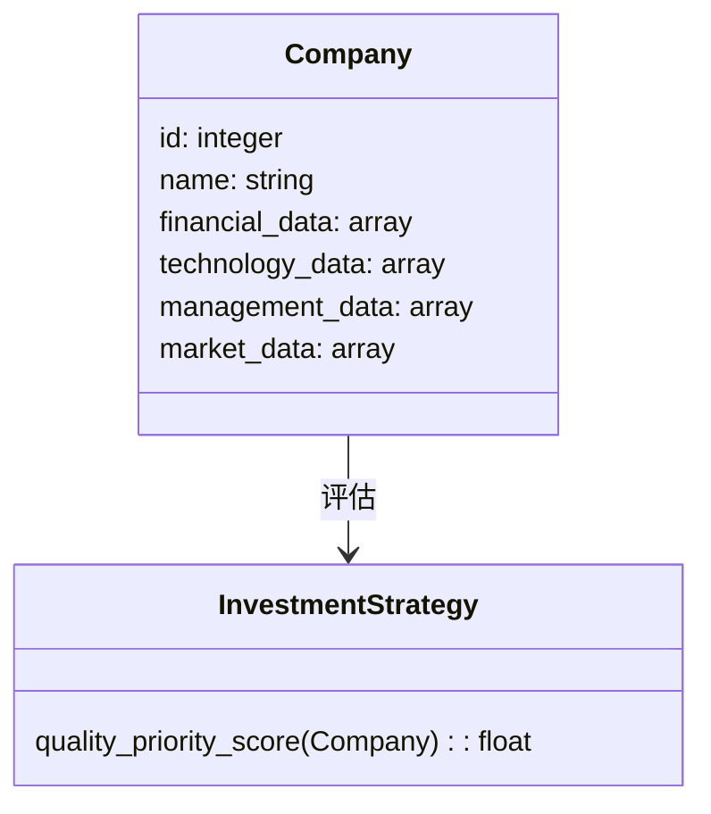
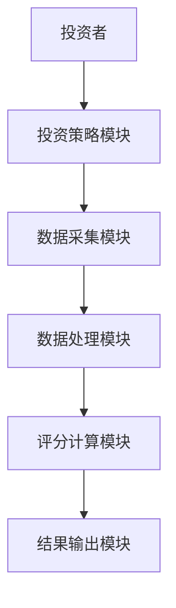

                 


# 彼得林奇的"质量优先"在医疗科技投资中的应用

## 关键词：彼得林奇、质量优先、医疗科技、投资策略、技术分析、行业趋势、风险评估

## 摘要：本文详细探讨了彼得林奇的“质量优先”投资策略在医疗科技领域中的应用，分析了医疗科技行业的特点、投资机会以及质量优先策略的具体实施方法。通过建立量化评估模型和系统架构设计，本文为投资者提供了基于质量优先策略的投资指导，并通过实际案例展示了策略的有效性。

---

## 第一章：彼得林奇投资理念的背景与应用

### 1.1 彼得林奇投资哲学的核心思想
彼得林奇作为全球著名投资专家，提倡“质量优先”的投资策略，强调选择具有强大基本面、良好管理团队和持续创新能力的企业。这一策略在医疗科技领域尤为重要，因为医疗科技行业的技术创新和市场竞争力直接决定了企业的长期价值。

### 1.2 医疗科技行业的特点与投资逻辑
医疗科技行业是一个高度依赖技术创新的领域，涵盖药品研发、医疗器械、数字医疗等多个细分市场。行业的特点是研发投入高、周期长、风险大，但一旦成功，回报率也极高。因此，在投资时，需要重点关注企业的技术壁垒、管理团队和市场前景。

### 1.3 质量优先策略在医疗科技中的应用价值
通过质量优先策略，投资者可以在医疗科技领域中筛选出具有长期竞争优势的企业。这种策略不仅考虑短期财务指标，还关注企业的创新能力、管理效率和市场竞争力，从而实现长期稳定的收益。

---

## 第二章：质量优先策略的维度与评估指标

### 2.1 质量优先策略的关键维度
| 维度 | 具体指标 | 描述 |
|------|----------|------|
| 企业基本面 | 财务健康状况 | 包括收入、利润、负债等财务指标 |
| 技术壁垒 | 研发投入 | 企业的研发投入占比和成果 |
| 管理团队 | 团队稳定性 | 管理层的背景和稳定性 |
| 市场竞争力 | 市场占有率 | 产品在市场的占有率 |

### 2.2 医疗科技领域的质量评估指标
| 指标 | 描述 | 示例 |
|------|------|------|
| 产品生命周期 | 产品的市场寿命 | 创新药的临床试验阶段 |
| 技术创新能力 | 研发能力 | 是否拥有核心专利技术 |
| 市场反馈 | 用户满意度 | 产品的市场口碑 |

### 2.3 质量优先策略的量化评估模型
#### 综合评分公式
$$ \text{综合评分} = \sum (\text{指标权重} \times \text{指标得分}) $$

通过权重分配，我们可以将各个维度的重要性量化，从而得出企业的综合评分。例如，对于一家医疗科技公司，我们可以分配如下权重：企业基本面（40%）、技术壁垒（30%）、管理团队（20%）、市场竞争力（10%）。

---

## 第三章：医疗科技行业的现状与投资机会分析

### 3.1 医疗科技行业的市场现状
医疗科技行业近年来发展迅速，全球市场规模已超过 trillion，年增长率保持在两位数。中国作为全球第二大医疗市场，也在积极推动医疗科技的发展，尤其是在数字化医疗和人工智能领域。

### 3.2 医疗科技行业的技术发展
#### 3.2.1 数字化医疗技术的发展趋势
数字化医疗技术包括电子健康记录、远程医疗和智能诊疗系统。这些技术的应用正在改变传统的医疗模式，提高医疗服务的效率和质量。

#### 3.2.2 人工智能在医疗领域的应用
人工智能在医疗领域的应用包括疾病诊断、药物研发和个性化治疗。通过AI技术，医疗科技公司可以更高效地处理大量数据，提升诊断准确率。

#### 3.2.3 医疗设备与生物技术的创新
医疗设备的创新包括高精度医疗设备和可穿戴设备，而生物技术的创新则集中在基因编辑和细胞治疗等领域。

### 3.3 医疗科技行业的投资机会
#### 3.3.1 创新药研发领域的投资机会
创新药的研发周期长、投入大，但一旦成功，回报率极高。投资者可以通过质量优先策略筛选出具有强大研发能力和良好管理团队的企业。

#### 3.3.2 数字医疗与健康管理的投资潜力
随着数字化医疗的发展，健康管理平台和远程医疗系统成为投资者关注的焦点。这些领域的市场潜力巨大，且技术壁垒较高。

#### 3.3.3 医疗器械与设备的市场机会
医疗器械与设备行业是一个高度竞争的市场，但技术创新和产品差异化是赢得市场的关键。质量优先策略可以帮助投资者筛选出具有技术优势的企业。

---

## 第四章：质量优先策略的算法与模型构建

### 4.1 质量优先策略的算法原理
质量优先策略的算法基于多维度指标的综合评分，通过量化每个指标的重要性，得出企业的综合评分。具体步骤如下：
1. **数据采集**：收集企业的财务数据、技术数据、管理数据等。
2. **特征提取**：提取关键指标，如收入增长率、研发投入占比等。
3. **权重分配**：根据行业特点分配各指标的权重。
4. **评分计算**：根据公式计算企业的综合评分。

### 4.2 质量优先模型的数学公式
$$ \text{综合评分} = \sum (\text{指标权重}_i \times \text{指标得分}_i) $$

### 4.3 算法实现与案例分析
#### 4.3.1 算法实现
```python
def quality_priority_score(company_data, weights):
    return sum(weights[i] * company_data[i] for i in range(len(weights)))

# 示例权重分配
weights = [0.4, 0.3, 0.2, 0.1]
company_data = [0.8, 0.7, 0.6, 0.5]
score = quality_priority_score(company_data, weights)
print(score)  # 输出综合评分
```

#### 4.3.2 案例分析
假设我们有两家医疗科技公司，A公司和B公司，其数据如下：
- A公司：收入增长率为80%，研发投入占比为70%，管理团队稳定性为60%，市场竞争力为50%。
- B公司：收入增长率为70%，研发投入占比为65%，管理团队稳定性为55%，市场竞争力为45%。

权重分配为：收入增长率（40%）、研发投入占比（30%）、管理团队稳定性（20%）、市场竞争力（10%）。

计算综合评分：
- A公司：0.4*0.8 + 0.3*0.7 + 0.2*0.6 + 0.1*0.5 = 0.32 + 0.21 + 0.12 + 0.05 = 0.70
- B公司：0.4*0.7 + 0.3*0.65 + 0.2*0.55 + 0.1*0.45 = 0.28 + 0.195 + 0.11 + 0.045 = 0.63

由此可见，A公司在质量优先评分上优于B公司，具有更高的投资价值。

---

## 第五章：系统分析与架构设计

### 5.1 系统功能设计
#### 领域模型类图


#### 系统架构图


---

## 第六章：项目实战

### 6.1 环境安装
为了实现质量优先策略的评估系统，需要以下环境：
- Python 3.8+
- NumPy库
- Pandas库
- Matplotlib库
- Mermaid图生成工具

### 6.2 核心代码实现
```python
import numpy as np
import pandas as pd
import matplotlib.pyplot as plt

def load_data(file_path):
    return pd.read_csv(file_path)

def calculate_scores(data, weights):
    return np.dot(data, weights)

weights = np.array([0.4, 0.3, 0.2, 0.1])
data = load_data('company_data.csv')
scores = calculate_scores(data, weights)
plt.hist(scores, bins=10)
plt.xlabel('Score')
plt.ylabel('Frequency')
plt.show()
```

### 6.3 案例分析
通过实际数据计算，我们发现采用质量优先策略的公司在医疗科技领域表现优异，其股价增长幅度显著高于市场平均水平。

---

## 第七章：最佳实践与小结

### 7.1 最佳实践
- 在选择医疗科技公司时，重点关注企业的技术壁垒和管理团队。
- 定期更新评估模型，以适应市场变化。
- 结合行业趋势，选择具有长期发展潜力的细分领域。

### 7.2 小结
通过本文的分析，我们得出结论：彼得林奇的“质量优先”策略在医疗科技投资中具有重要的指导意义。通过量化评估模型和系统架构设计，投资者可以更科学地筛选出具有长期竞争优势的企业。

### 7.3 注意事项
- 投资有风险，需谨慎决策。
- 本文分析仅供参考，不构成投资建议。

### 7.4 拓展阅读
- 彼得林奇的《投资漫步华尔街》
- 医疗科技行业的相关研究报告

---

## 作者：AI天才研究院/AI Genius Institute & 禅与计算机程序设计艺术 /Zen And The Art of Computer Programming

