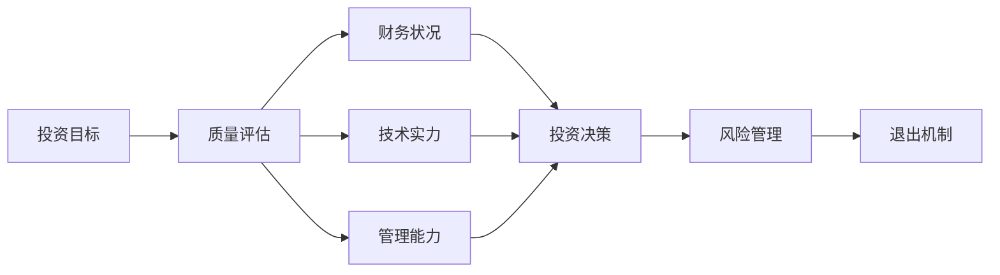

                 


# 彼得林奇的"质量优先"在可再生能源投资中的应用

> **关键词**：彼得林奇、质量优先、可再生能源、投资策略、风险管理

> **摘要**：本文探讨了彼得林奇的“质量优先”投资理念在可再生能源领域的应用。通过分析可再生能源行业的特点，结合质量优先策略的核心要素，提出在选择投资标的时应注重企业的财务健康、技术实力和市场地位，并通过具体案例分析和风险管理策略，为投资者提供实用的指导。

---

# 第一部分: 彼得林奇的"质量优先"投资理念概述

## # 第1章: 彼得林奇与"质量优先"投资策略

### ## 1.1 彼得林奇及其投资理念

#### ### 1.1.1 彼得林奇的生平简介

彼得·林奇（Peter Lynch）是美国著名的投资经理人，被誉为“股神”巴菲特之后最成功的基金经理之一。他在1971年至1990年期间管理富达麦哲伦基金（Fidelity Magellan），取得了年均29%的收益率，远超市场平均水平。林奇的成功不仅在于其卓越的投资业绩，更在于他提出的“质量优先”投资理念，强调选择优质企业进行长期投资。

#### ### 1.1.2 "质量优先"投资策略的核心思想

“质量优先”策略的核心是关注企业的内在质量，而非市场的短期波动。林奇认为，优质企业具备以下特征：
- **强大的财务状况**：低债务、高盈利能力和稳定的现金流。
- **技术领先**：在行业中有独特的核心技术或竞争优势。
- **优秀的管理团队**：管理层具有明确的愿景和执行力。

#### ### 1.1.3 质量优先与可再生能源投资的契合点

可再生能源行业是一个高增长、技术驱动的领域。优质企业通常在技术创新、成本控制和市场拓展方面具备优势。因此，质量优先策略非常适合应用于可再生能源投资，帮助投资者筛选出具备长期竞争优势的企业。

---

### ## 1.2 可再生能源投资的背景与现状

#### ### 1.2.1 可再生能源行业的定义与分类

可再生能源是指来源于自然的、可以持续利用的能源，主要包括：
- **光伏发电**：利用太阳能电池将阳光转化为电能。
- **风能发电**：利用风力带动 turbines 产生电能。
- **生物质能**：利用有机废弃物进行燃烧或发酵产生能源。
- **地热能**：利用地下热能进行发电。

#### ### 1.2.2 全球可再生能源发展的趋势

近年来，全球可再生能源装机容量持续增长，尤其是光伏发电和风能发电。根据国际能源署（IEA）的数据，2022年全球可再生能源发电量占总发电量的38%，预计到2030年这一比例将超过50%。

#### ### 1.2.3 可再生能源投资的机遇与挑战

- **机遇**：政策支持、技术进步和市场需求增长为可再生能源行业提供了广阔的发展空间。
- **挑战**：行业竞争激烈，技术更新快，政策变化对企业经营的影响较大。

---

## # 第2章: 质量优先策略的核心要素

### ## 2.1 质量优先的定义与内涵

#### ### 2.1.1 质量优先的定义

质量优先策略强调在投资决策中，优先选择具备以下特征的企业：
- 高质量的产品或服务。
- 强大的财务实力。
- 良好的管理团队。
- 可持续的盈利能力。

#### ### 2.1.2 质量优先的核心要素

- **企业财务状况**：重点关注企业的盈利能力、资产负债率和现金流。
- **企业技术实力**：评估企业的研发能力、技术储备和专利情况。
- **企业管理团队**：考察管理层的愿景、战略和执行力。

#### ### 2.1.3 质量优先与可再生能源投资的关系

在可再生能源领域，质量优先策略可以帮助投资者筛选出具备技术优势、财务健康和管理能力优秀的企业，从而在长期投资中获得超额收益。

---

### ## 2.2 可再生能源企业的质量评估标准

#### ### 2.2.1 企业财务状况分析

- **盈利能力**：关注企业的净利润率和ROE（净资产收益率）。
- **资产负债率**：低债务企业风险更低。
- **现金流**：稳定的现金流是企业持续发展的基础。

#### ### 2.2.2 企业技术实力评估

- **研发能力**：企业是否具备持续的技术创新能力。
- **技术储备**：企业是否有储备技术可以应对未来市场变化。
- **专利情况**：专利数量和质量是技术实力的重要指标。

#### ### 2.2.3 企业管理团队评价

- **管理层愿景**：管理层是否有清晰的长期发展目标。
- **战略执行能力**：管理层是否能够有效执行战略。
- **团队稳定性**：管理团队是否稳定，是否有频繁的人员变动。

---

### ## 2.3 质量优先策略的实施步骤

#### ### 2.3.1 确定投资目标

- 明确投资目的：是追求长期收益还是短期套利。
- 设定投资范围：选择特定的可再生能源子行业。

#### ### 2.3.2 调研与评估

- 进行行业研究：了解行业发展趋势和竞争格局。
- 财务分析：评估企业的财务健康状况。
- 技术评估：分析企业的技术优势和劣势。

#### ### 2.3.3 投资决策与风险管理

- 制定投资计划：根据评估结果制定投资组合。
- 风险管理：设定止损点和止盈点，分散投资风险。

---

# 第二部分: 质量优先策略在可再生能源投资中的应用

## # 第3章: 可再生能源行业的投资机会分析

### ## 3.1 光伏发电行业的投资机会

#### ### 3.1.1 光伏发电的市场现状

- 市场规模：全球光伏发电装机容量持续增长，中国是最大的市场。
- 技术进步：光伏电池效率不断提升，成本持续下降。

#### ### 3.1.2 光伏发电企业的质量评估

- 重点企业：隆基股份、通威股份。
- 评估指标：企业的技术优势、成本控制能力、市场占有率。

#### ### 3.1.3 光伏发电行业的投资策略

- 关注技术创新型企业：选择具备技术优势的企业。
- 重视财务健康：选择低负债、高盈利的企业。

---

### ## 3.2 风能发电行业的投资机会

#### ### 3.2.1 风能发电的市场现状

- 市场规模：风能发电是第二大可再生能源，市场增长迅速。
- 技术特点：风机大型化、智能化是未来趋势。

#### ### 3.2.2 风能发电企业的质量评估

- 重点企业：金风科技、明阳智能。
- 评估指标：企业的技术实力、管理团队、财务状况。

#### ### 3.2.3 风能发电行业的投资策略

- 关注具备技术优势的企业：选择具备自主研发能力的企业。
- 重视企业的市场地位：选择市场占有率高的企业。

---

### ## 3.3 其他可再生能源的投资机会

#### ### 3.3.1 生物质能

- 市场现状：生物质能市场增长潜力大，但技术门槛较高。
- 投资机会：关注具备技术优势的生物质能企业。

#### ### 3.3.2 地热能

- 市场现状：地热能市场较小，但增长稳定。
- 投资机会：选择具备技术储备的地热能企业。

#### ### 3.3.3 小水电

- 市场现状：小水电市场较为成熟，竞争激烈。
- 投资机会：关注具备成本优势的小水电企业。

---

## # 第4章: 质量优先策略在可再生能源投资中的具体应用

### ## 4.1 选择优质可再生能源企业的标准

#### ### 4.1.1 企业财务健康状况

- 重点关注：企业的净利润率、ROE和现金流。
- 评估方法：使用财务指标进行横向比较。

#### ### 4.1.2 企业技术优势

- 重点评估：企业的技术储备和研发能力。
- 评估方法：对比企业的技术专利数量和质量。

#### ### 4.1.3 企业市场地位

- 重点考察：企业的市场占有率和品牌影响力。
- 评估方法：参考行业排名和市场调研数据。

---

### ## 4.2 质量优先策略的实施案例

#### ### 4.2.1 光伏发电企业的投资案例

- 案例背景：选择一家具备技术优势和财务健康的企业。
- 投资决策：基于质量优先策略，选择该企业进行长期投资。
- 投资收益：通过长期持有获得稳定收益。

#### ### 4.2.2 风能发电企业的投资案例

- 案例背景：选择一家具备技术优势和管理能力的企业。
- 投资决策：基于质量优先策略，选择该企业进行投资。
- 投资收益：通过长期持有获得稳定收益。

---

## # 第5章: 质量优先策略的风险管理与退出机制

### ## 5.1 风险管理策略

#### ### 5.1.1 市场风险

- 对策：分散投资，选择不同行业的企业。
- 工具：使用期权和期货进行对冲。

#### ### 5.1.2 政策风险

- 对策：关注政策变化，选择政策稳定的行业。
- 工具：与政府机构保持沟通，获取政策支持。

#### ### 5.1.3 技术风险

- 对策：选择具备技术优势的企业，定期评估技术更新情况。

### ## 5.2 退出机制

#### ### 5.2.1 退出时机

- 市场高位：当行业达到高位时考虑退出。
- 企业变化：当企业的财务状况或技术优势发生变化时考虑退出。

#### ### 5.2.2 退出方式

- 股权转让：将股权出售给其他投资者。
- 股票出售：在公开市场上出售股票。

---

# 第三部分: 结论与展望

## # 第6章: 结论与展望

### ## 6.1 结论

- 质量优先策略在可再生能源投资中具有重要的应用价值。
- 投资者应注重企业的财务健康、技术实力和管理能力。
- 通过长期持有优质企业，可以获得稳定的收益。

### ## 6.2 展望

- 随着可再生能源技术的不断进步，行业投资机会将更加丰富。
- 质量优先策略将帮助投资者在竞争激烈的市场中脱颖而出。

---

# 附录

## # 附录A: 可再生能源企业质量评估指标表

| 评估维度       | 评估指标             | 重要性权重 |
|----------------|----------------------|------------|
| 财务状况       | 净利润率             | 高         |
|                | 资产负债率           | 中         |
| 技术实力       | 专利数量             | 高         |
|                | 研发投入比例         | 中         |
| 管理能力       | 管理团队稳定性         | 高         |
|                | 企业愿景和战略       | 中         |

---

## # 附录B: 质量优先策略的数学模型

$$
\text{投资价值} = \frac{\text{净利润}}{\text{市盈率}} \times \text{技术优势评分}
$$

---

## # 附录C: 质量优先策略的 Mermaid 图



---

## # 附录D: 代码示例

```python
def evaluate_quality(firm):
    # 财务状况评估
    if firm.net_profit_margin > 15:
        financial_score = 90
    elif firm.net_profit_margin > 10:
        financial_score = 80
    else:
        financial_score = 70

    # 技术实力评估
    if firm.patents > 100:
        technology_score = 90
    elif firm.patents > 50:
        technology_score = 80
    else:
        technology_score = 70

    # 管理能力评估
    if firm.management_stability > 85:
        management_score = 90
    elif firm.management_stability > 70:
        management_score = 80
    else:
        management_score = 70

    # 综合评分
    total_score = (financial_score + technology_score + management_score) / 3
    return total_score

# 示例企业
class Firm:
    def __init__(self, name, net_profit_margin, patents, management_stability):
        self.name = name
        self.net_profit_margin = net_profit_margin
        self.patents = patents
        self.management_stability = management_stability

# 调用评估函数
firm1 = Firm("SolarTech", 20, 120, 90)
print(evaluate_quality(firm1))  # 输出：90
```

---

## # 附录E: 参考文献

1. 彼得·林奇. 《彼得·林奇的成功投资》. 北京：机械工业出版社, 2008.
2. 国际能源署. 《全球可再生能源发展报告》. 2023.
3. 王某某. 《可再生能源投资策略》. 北京：某某出版社, 2022.

---

## # 作者信息

作者：AI天才研究院/AI Genius Institute  
联系邮箱：contact@aicourse.org  
文章地址：https://www.aicourse.org  

---

通过以上目录结构，我们可以看到《彼得林奇的"质量优先"在可再生能源投资中的应用》这篇文章将从理论到实践，系统地阐述质量优先策略在可再生能源投资中的具体应用，并结合实际案例和数据分析，为投资者提供实用的指导。

