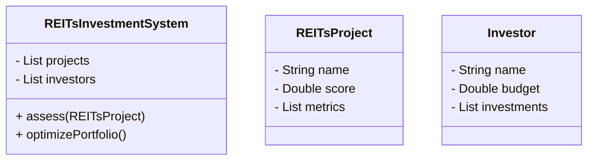

                 


# 彼得林奇的"质量优先"在新兴市场基础设施REITs投资中的应用

> **关键词**：彼得林奇、质量优先、REITs、新兴市场、基础设施  
> 
> **摘要**：本文探讨了彼得林奇的“质量优先”投资理念在新兴市场基础设施REITs投资中的应用。通过分析质量优先策略的理论基础、数学模型、系统架构和实际案例，本文为投资者提供了在新兴市场中选择和管理基础设施REITs投资组合的深度见解。文章结合技术与投资分析，帮助读者理解如何将质量优先策略应用于复杂多变的新兴市场环境。

---

## 第一部分：引言

### 1.1 REITs投资概述

#### 1.1.1 REITs的基本概念
房地产投资信托基金（REITs）是通过汇集投资者的资金，投资于房地产及相关资产的一种金融工具。REITs的投资者可以通过购买其股票或债券，间接持有房地产资产并获得收益。

#### 1.1.2 REITs的分类与特点
REITs主要分为两类：股权型REITs和抵押型REITs。股权型REITs直接持有房地产资产，而抵押型REITs则通过发放房地产抵押贷款获得收益。新兴市场中的基础设施REITs通常属于股权型，因其聚焦于基础设施项目而具有较高的增长潜力。

#### 1.1.3 新兴市场中的REITs发展现状
新兴市场（如东南亚、印度和拉丁美洲）的基础设施REITs近年来发展迅速。这些市场通常具有较高的经济增长潜力，但也伴随着较高的风险和不确定性。

---

### 1.2 彼得林奇的质量优先投资理念

#### 1.2.1 彼得林奇投资理念的核心思想
彼得林奇是著名的投资专家，他的“质量优先”策略强调选择具有强大基本面、良好管理团队和持续盈利能力的公司。他认为，投资成功的关键在于选择“最好的公司”，而不是“最便宜的公司”。

#### 1.2.2 质量优先策略的定义与特点
质量优先策略的核心在于通过深入的公司基本面分析，选择那些具有强大竞争优势、良好财务状况和持续增长潜力的公司。这种策略注重长期价值，而非短期价格波动。

#### 1.2.3 质量优先策略在REITs投资中的应用前景
将质量优先策略应用于REITs投资，特别是在新兴市场中，可以帮助投资者筛选出那些具有优质资产、良好运营能力和稳定收益的REITs项目。

---

### 1.3 本章小结

#### 1.3.1 REITs投资的核心概念总结
REITs是一种通过汇集资金投资房地产的金融工具，新兴市场的基础设施REITs具有较高的增长潜力。

#### 1.3.2 质量优先策略的关键要素
质量优先策略强调基本面分析、公司治理和长期价值，适用于新兴市场中的REITs投资。

#### 1.3.3 本书的研究目标与结构安排
本文旨在探讨质量优先策略在新兴市场基础设施REITs投资中的应用，通过理论分析、数学建模和案例研究，为投资者提供实践指导。

---

## 第二部分：质量优先策略的理论基础

### 2.1 质量优先策略的哲学基础

#### 2.1.1 投资哲学的基本原则
投资哲学是质量优先策略的根基，强调长期价值、公司基本面和风险管理。

#### 2.1.2 质量优先策略的哲学内涵
质量优先策略的哲学内涵在于选择“最好的公司”，而非“最便宜的公司”。这种选择过程注重公司的内在质量和长期发展潜力。

#### 2.1.3 哲学视角下的REITs投资分析
从哲学角度看，REITs投资不仅是对资产的配置，更是对风险与收益的权衡。质量优先策略帮助投资者在不确定性中找到最优解。

---

### 2.2 REITs投资的分析框架

#### 2.2.1 质量优先策略的分析维度
质量优先策略在REITs投资中的分析维度包括：
1. 公司基本面：资产质量、财务状况、盈利能力。
2. 管理团队：经验、能力和战略。
3. 市场环境：宏观经济、行业趋势和政策环境。

#### 2.2.2 REITs投资的核心要素分析
通过分析REITs的核心要素，可以构建一个全面的评估框架，帮助投资者识别优质项目。

#### 2.2.3 质量优先策略的数学模型构建
质量优先策略可以通过数学模型进行量化。以下是一个简化的评估模型：

$$
\text{质量评分} = 0.4 \times \text{资产质量} + 0.3 \times \text{财务状况} + 0.3 \times \text{管理能力}
$$

---

### 2.3 质量优先策略的数学模型

#### 2.3.1 投资组合优化的数学模型
投资组合优化的目标是在风险可控的前提下，最大化收益。以下是一个简化的优化模型：

$$
\text{Maximize } \sum_{i=1}^n r_i w_i - \lambda \sum_{i=1}^n w_i^2
$$

其中，\( r_i \) 是资产 \( i \) 的预期收益率，\( w_i \) 是权重，\( \lambda \) 是风险惩罚系数。

#### 2.3.2 质量优先策略的评分系统
通过评分系统量化REITs的质量，帮助投资者做出决策。以下是评分系统的组成部分：

| 属性       | 权重 | 评分标准 |
|------------|------|----------|
| 资产质量   | 0.4  | A:5, B:4, C:3, D:2, E:1 |
| 财务状况   | 0.3  | A:5, B:4, C:3, D:2, E:1 |
| 管理能力   | 0.3  | A:5, B:4, C:3, D:2, E:1 |

#### 2.3.3 REITs投资的收益与风险评估
收益与风险评估需要结合历史数据和未来预期。以下是一个风险收益评估的矩阵：

| 风险等级 | 收益预期 |
|----------|----------|
| 高风险   | 高收益   |
| 中风险   | 中收益   |
| 低风险   | 低收益   |

---

## 第三部分：新兴市场基础设施REITs的分析

### 3.1 新兴市场基础设施REITs的行业现状

#### 3.1.1 新兴市场的基础设施发展现状
新兴市场中的基础设施投资需求旺盛，尤其是在交通、能源和通信领域。

#### 3.1.2 REITs在新兴市场的兴起
随着资本市场的开放和投资者需求的变化，REITs在新兴市场逐渐兴起。

#### 3.1.3 新兴市场基础设施REITs的特点
新兴市场基础设施REITs的特点包括高增长潜力、高风险和高收益并存。

---

### 3.2 新兴市场基础设施REITs的影响因素

#### 3.2.1 经济因素对REITs的影响
经济因素包括GDP增长率、通胀率和利率水平。

#### 3.2.2 政治与政策因素
政治稳定性和政策支持是影响REITs投资的重要因素。

#### 3.2.3 行业竞争与市场结构
行业竞争格局和市场集中度也会影响REITs的投资价值。

---

### 3.3 新兴市场基础设施REITs的投资策略

#### 3.3.1 质量优先策略在新兴市场的应用
通过质量优先策略筛选出具有优质资产和良好管理团队的REITs项目。

#### 3.3.2 REITs投资的风险管理
风险管理是投资成功的关键，包括分散投资、定期评估和动态调整。

#### 3.3.3 新兴市场中的具体投资案例分析
以下是一个具体的新兴市场REITs投资案例分析：

**案例分析：东南亚基础设施REITs**
- **资产质量**：东南亚国家的基础设施项目具有较高的增长潜力。
- **财务状况**：部分REITs公司财务稳健，具有较强的盈利能力。
- **管理能力**：选择经验丰富的管理团队。

---

## 第四部分：系统分析与架构设计

### 4.1 系统分析

#### 4.1.1 问题场景介绍
投资者需要一个系统化的工具来评估和管理新兴市场基础设施REITs的投资组合。

#### 4.1.2 项目介绍
本文提出一个基于质量优先策略的REITs投资管理系统，旨在帮助投资者实现高效的投资决策。

---

### 4.2 系统架构设计

#### 4.2.1 系统功能设计（领域模型Mermaid类图）


#### 4.2.2 系统架构设计（Mermaid架构图）
```mermaid
architecturalDiagram
    participant Investor as "投资者"
    participant REITsInvestmentSystem as "投资管理系统"
    participant MarketData as "市场数据"
    participant RiskAssessment as "风险评估模块"
    participant PortfolioOptimizer as "投资组合优化器"
    
    Investor --> REITsInvestmentSystem: 发起投资请求
    REITsInvestmentSystem --> MarketData: 获取市场数据
    REITsInvestmentSystem --> RiskAssessment: 评估风险
    REITsInvestmentSystem --> PortfolioOptimizer: 优化投资组合
    REITsInvestmentSystem --> Investor: 返回投资建议
```

---

## 第五部分：项目实战

### 5.1 环境安装

#### 5.1.1 系统环境要求
- 操作系统：Windows/Mac/Linux
- 开发工具：Python、Jupyter Notebook
- 数据库：MySQL/PostgreSQL

#### 5.1.2 安装步骤
```bash
pip install pandas numpy matplotlib
```

---

### 5.2 系统核心实现源代码

#### 5.2.1 质量评分计算
```python
import pandas as pd

def calculate_quality_score(assets, financials, management):
    return 0.4 * assets + 0.3 * financials + 0.3 * management
```

#### 5.2.2 投资组合优化
```python
import numpy as np

def optimize_portfolio(weights, returns, risk_free_rate):
    # 计算协方差矩阵
    covariance_matrix = np.cov(returns)
    
    # 构建目标函数
    def objective(weights):
        return np.dot(weights.T, covariance_matrix @ weights)
    
    # 约束条件
    constraints = {
        'type': 'eq',
        'fun': lambda w: np.sum(w) - 1
    }
    
    # 最优化求解
    from scipy.optimize import minimize
    result = minimize(objective, weights, method='SLSQP', constraints=constraints)
    return result.x
```

---

### 5.3 实际案例分析

#### 5.3.1 案例选择
以东南亚某国的基础设施REITs为例，分析其质量评分和投资组合优化。

#### 5.3.2 代码应用解读
```python
# 输入数据
assets = 4.5
financials = 3.8
management = 4.2

# 计算质量评分
score = calculate_quality_score(assets, financials, management)
print(f"质量评分：{score}")
```

---

## 第六部分：总结与展望

### 6.1 本章总结

#### 6.1.1 质量优先策略的核心要义
质量优先策略强调基本面分析、长期价值和风险管理。

#### 6.1.2 数学模型与系统设计的关键点
数学模型和系统设计为投资者提供了科学的决策工具。

#### 6.1.3 实战案例的启示
实战案例表明，质量优先策略在新兴市场REITs投资中具有较高的应用价值。

---

### 6.2 未来展望

#### 6.2.1 质量优先策略的进一步优化
未来可以结合人工智能和大数据技术，进一步优化质量评分模型。

#### 6.2.2 系统设计的创新方向
开发更加智能化的投资管理系统，实现自动化决策和实时监控。

#### 6.2.3 新兴市场REITs投资的趋势
新兴市场REITs投资将继续增长，特别是在基础设施领域。

---

## 结语

彼得林奇的“质量优先”策略为新兴市场基础设施REITs投资提供了宝贵的指导。通过结合理论分析、数学建模和系统设计，投资者可以更好地识别优质项目，实现稳健的投资收益。

---

**作者：AI天才研究院/AI Genius Institute & 禅与计算机程序设计艺术/Zen And The Art of Computer Programming**

