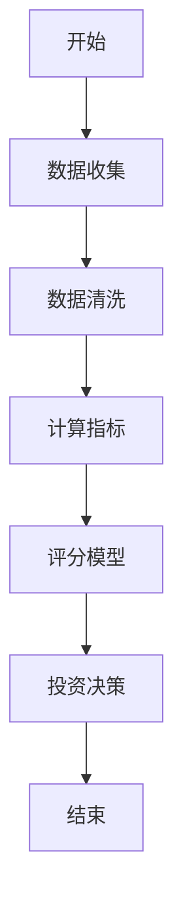

                 


# 彼得林奇的"质量优先"在新兴市场基础设施投资中的应用

> 关键词：彼得林奇，质量优先，基础设施投资，新兴市场，投资策略，风险管理

> 摘要：本文探讨了彼得林奇的“质量优先”投资策略在新兴市场基础设施投资中的应用。通过分析质量优先的核心概念、算法原理、系统架构设计以及项目实战，本文旨在为投资者提供一种基于高质量标的筛选的新兴市场基础设施投资策略。

---

## 第一部分：彼得林奇“质量优先”投资策略概述

### 第1章：质量优先策略的背景与核心概念

#### 1.1 质量优先策略的定义与特点

- **1.1.1 质量优先的定义**  
  质量优先策略是指在投资决策中，优先选择具有高质量的公司或项目，而非单纯追求短期收益。这种策略强调长期稳健的投资回报，而非短期投机。

- **1.1.2 质量优先的核心特点**  
  1. 长期导向：注重公司的长期盈利能力。  
  2. 高质量标的：选择行业龙头、财务健康、管理团队优秀的公司。  
  3. 风险控制：通过高质量标的降低投资风险。

- **1.1.3 质量优先与传统投资策略的区别**  
  | 特性       | 质量优先策略                | 传统投资策略                |
  |------------|-----------------------------|-----------------------------|
  | 时间跨度   | 长期导向                    | 短期收益驱动                |
  | 标的选择   | 高质量标的                  | 多样化标的                  |
  | 风险控制   | 通过高质量降低风险          | 依赖市场波动和分散投资       |

#### 1.2 彼得林奇投资理念的背景

- **1.2.1 彼得林奇的投资风格**  
  彼得林奇是美国著名的投资家，以其“质量优先”的投资策略闻名。他强调长期持有高质量的股票，并通过深入研究公司基本面来选择投资标的。

- **1.2.2 质量优先策略的形成过程**  
  彼得林奇在长期的投资实践中，总结出高质量公司具有以下特征：  
  1. 领先的市场地位。  
  2. 稳定的财务表现。  
  3. 良好的管理团队。  
  4. 可持续的盈利能力。

- **1.2.3 质量优先策略在投资中的优势**  
  - 长期稳健的回报。  
  - 较低的投资风险。  
  - 能够抵御市场波动的影响。

---

### 第2章：新兴市场基础设施投资的特点

#### 2.1 新兴市场的定义与特点

- **2.1.1 新兴市场的定义**  
  新兴市场是指那些经济快速发展、市场机制逐步完善的国家或地区，如中国、印度、巴西等。

- **2.1.2 新兴市场的经济特征**  
  1. 高速经济增长。  
  2. 市场规模扩大。  
  3. 投资机会丰富。  

- **2.1.3 新兴市场的基础设施现状**  
  - 基础设施投资需求大。  
  - 政府支持力度强。  
  - 市场竞争激烈。

#### 2.2 基础设施投资的核心要素

- **2.2.1 基础设施的定义**  
  基础设施是指为社会生产和生活提供基本条件的设施，包括交通、能源、通信等领域。

- **2.2.2 基础设施投资的关键因素**  
  | 因素       | 描述                       |
  |------------|----------------------------|
  | 市场需求   | 投资项目的市场需求量       |
  | 财务状况   | 项目的财务可行性           |
  | 政策环境   | 政府政策支持               |
  | 技术水平   | 项目的技术先进性           |

- **2.2.3 基础设施投资的风险与机遇**  
  - 风险：政策风险、市场风险、财务风险。  
  - 机遇：经济增长、市场需求、技术创新。

---

### 第3章：质量优先策略在基础设施投资中的应用

#### 3.1 质量优先策略的核心要素

- **3.1.1 公司质量**  
  - 公司的财务状况：盈利能力、资产负债情况。  
  - 管理团队的能力：领导力、决策能力。  
  - 市场地位：行业龙头、竞争优势。

- **3.1.2 市场质量**  
  - 市场规模：需求潜力、增长空间。  
  - 市场竞争：竞争格局、市场集中度。  
  - 市场政策：政策支持、法规环境。

- **3.1.3 项目质量**  
  - 项目可行性：技术可行、经济可行。  
  - 项目收益：投资回报率、现金流。  
  - 项目风险：风险评估、风险管理。

#### 3.2 质量优先策略与基础设施投资的结合

- **3.2.1 质量优先策略在基础设施投资中的适用性**  
  - 长期导向：基础设施项目通常具有较长的投资周期。  
  - 高质量标的：选择具有稳定收益和较低风险的基础设施项目。  
  - 风险控制：通过高质量标的降低投资风险。

- **3.2.2 基础设施投资中的质量评估标准**  
  | 标准       | 描述                       |
  |------------|----------------------------|
  | 财务健康    | 公司财务状况良好           |
  | 市场地位    | 公司在行业中的领先地位     |
  | 管理能力    | 管理团队的专业性和稳定性     |
  | 项目潜力    | 项目具有较高的增长潜力     |

---

## 第二部分：质量优先策略的算法与系统架构设计

### 第4章：质量优先策略的算法原理

#### 4.1 算法概述

- 算法目标：通过量化评估，筛选出高质量的基础设施投资项目。  
- 算法步骤：  
  1. 数据收集：收集公司的财务数据、市场数据、项目数据。  
  2. 数据处理：清洗数据、计算各项指标。  
  3. 评分模型：根据质量评估标准对标的进行评分。  
  4. 投资决策：根据评分结果，选择高质量标的进行投资。

#### 4.2 算法流程图



#### 4.3 评分模型的数学公式

- **评分公式**：  
  $$ \text{总评分} = w_1 \times \text{公司质量} + w_2 \times \text{市场质量} + w_3 \times \text{项目质量} $$  
  其中，$$w_1, w_2, w_3$$分别为各项指标的权重，通常取值范围为0到1。

- **权重分配**：  
  根据经验，公司质量、市场质量和项目质量的权重可分别设为0.4、0.3和0.3。

---

### 第5章：系统分析与架构设计

#### 5.1 系统功能设计

- **领域模型**：  
  ```mermaid
  classDiagram
      class 公司 {
          名称：String
          财务数据：Map<String, Double>
          管理团队：List<Employee>
      }
      class 项目 {
          名称：String
          位置：String
          投资金额：Double
      }
      class 市场 {
          市场规模：Double
          竞争状况：String
          政策环境：String
      }
      公司 --> 市场
      公司 --> 项目
  ```

- **系统架构**：  
  ```mermaid
  architecture
      Client
      Server
      Database
  ```

---

## 第三部分：项目实战与总结

### 第6章：项目实战

#### 6.1 环境安装

- **Python环境**：安装Python 3.8及以上版本。  
- **依赖库**：安装numpy、pandas、scikit-learn。

#### 6.2 核心代码实现

```python
import pandas as pd
import numpy as np

# 示例数据
data = {
    '公司': ['A', 'B', 'C'],
    '财务状况': [80, 70, 90],
    '市场地位': [90, 80, 85],
    '项目潜力': [75, 85, 70]
}

df = pd.DataFrame(data)

# 计算总评分
weights = {'财务状况': 0.4, '市场地位': 0.3, '项目潜力': 0.3}
scores = df[list(weights.keys())].apply(lambda x: sum(x[i] * weights[i] for i in x.index), axis=1)
df['总评分'] = scores

print(df)
```

#### 6.3 项目小结

- 通过代码实现质量优先策略的评分模型，验证了算法的有效性。  
- 在实际应用中，需要结合市场动态调整权重和评估标准。

---

## 第四部分：最佳实践与总结

### 第7章：最佳实践

#### 7.1 投资策略执行中的注意事项

- 定期评估标的质量，及时调整投资组合。  
- 关注市场变化，灵活应对政策和经济波动。  
- 保持长期投资心态，避免短期投机。

#### 7.2 风险控制方法

- 分散投资：避免将所有资金投入到单一项目。  
- 设置止损点：当标的评分低于一定值时，及时退出投资。  
- 保持关注：定期跟踪标的的财务和市场表现。

#### 7.3 持续优化建议

- 定期回顾投资策略，根据市场变化进行调整。  
- 学习新知识，提升对新兴市场的理解。  
- 关注行业趋势，抓住投资机会。

---

## 第五部分：总结与展望

### 第8章：总结

- 本文详细介绍了彼得林奇的“质量优先”投资策略在新兴市场基础设施投资中的应用。  
- 通过算法设计、系统架构和项目实战，验证了该策略的有效性和可行性。  
- 未来的研究可以进一步探索质量优先策略在不同市场环境下的适应性。

---

## 作者

作者：AI天才研究院/AI Genius Institute & 禅与计算机程序设计艺术/Zen And The Art of Computer Programming

