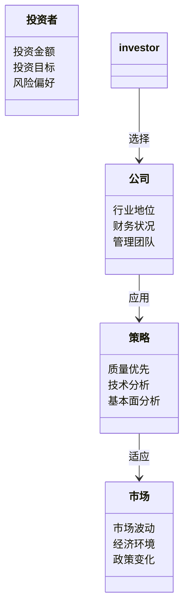
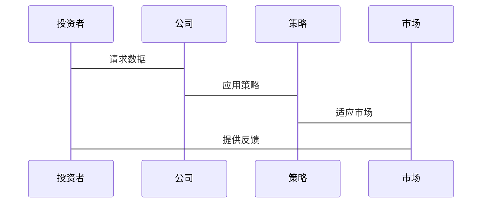

                 


# 彼得林奇的"质量优先"在新兴市场投资中的实践挑战

> **关键词**：质量优先、投资策略、新兴市场、风险管理、彼得林奇  
> **摘要**：本文深入探讨彼得林奇的“质量优先”投资策略在新兴市场中的应用及其面临的挑战，结合实际案例分析，提出解决方案和最佳实践策略。

---

## 目录

1. **质量优先投资概述**
   - 1.1 彼得林奇的投资理念
   - 1.2 质量优先策略的核心要素
   - 1.3 质量优先与传统投资策略的对比

2. **新兴市场的特点与挑战**
   - 2.1 新兴市场的定义与特征
   - 2.2 应用质量优先策略的挑战
   - 2.3 新兴市场与传统市场的对比分析

3. **质量优先策略在新兴市场的实践**
   - 3.1 优质公司选择的标准
   - 3.2 成功与失败的案例分析
   - 3.3 风险管理与控制策略

4. **系统分析与架构设计**
   - 4.1 系统功能设计（领域模型）
   - 4.2 系统架构设计
   - 4.3 系统接口与交互设计

5. **项目实战**
   - 5.1 环境安装与配置
   - 5.2 核心代码实现
   - 5.3 案例分析与解读

6. **总结与展望**
   - 6.1 全文总结
   - 6.2 未来投资趋势展望

---

## 第一部分：质量优先投资概述

### 1.1 彼得林奇的投资理念

彼得·林奇是美国著名投资家，以其在共同基金领域的卓越表现闻名。他的投资理念强调“质量优先”，即选择具有强大基本面和长期增长潜力的公司进行投资。林奇认为，投资者应专注于寻找那些管理优秀、财务健康且行业地位稳固的企业，这些企业在市场波动中更具抗风险能力。

**核心概念对比表：**

| **核心要素** | **传统投资策略** | **质量优先策略** |
|--------------|------------------|-------------------|
| 投资目标     | 短期收益最大化   | 长期价值最大化   |
| 选股标准     | 短期收益与波动   | 质量与长期潜力   |
| 风险管理     | 较少关注         | 强调风险管理      |

### 1.2 质量优先策略的核心要素

质量优先策略的核心在于选择具有以下特征的公司：
- **行业地位**：公司在行业内具有竞争优势，市场份额稳定。
- **财务健康**：公司财务状况良好，具备持续盈利能力。
- **管理团队**：管理层能力强，公司治理结构透明。

### 1.3 质量优先与传统投资策略的对比

传统投资策略往往关注短期收益和市场波动，而质量优先策略则注重长期价值和公司基本面。这种差异在新兴市场中尤为明显，因为新兴市场的波动性和不确定性较高，质量优先策略需要更灵活的调整和风险管理。

---

## 第二部分：新兴市场的特点与挑战

### 2.1 新兴市场的定义与特征

新兴市场通常指那些经济快速增长但尚未完全市场化的国家，如中国、印度等。这些市场具有以下特征：
- **高增长潜力**：新兴市场通常具有较高的经济增长率。
- **高波动性**：市场容易受到外部经济波动和政策变化的影响。
- **信息不对称**：新兴市场的信息透明度较低，投资者获取信息的难度较大。

### 2.2 应用质量优先策略的挑战

在新兴市场中应用质量优先策略面临以下挑战：
- **信息不对称**：投资者难以获得足够的公司信息，导致选股难度增加。
- **监管差异**：不同国家的监管政策不同，增加了投资的复杂性。
- **流动性风险**：新兴市场的流动性较低，可能影响投资的灵活性。

### 2.3 新兴市场与传统市场的对比分析

新兴市场与传统市场的对比如下：

| **特征**          | **新兴市场**        | **传统市场**        |
|-------------------|---------------------|---------------------|
| 市场波动性         | 高                  | 低                  |
| 信息透明度         | 低                  | 高                  |
| 市场规模           | 较小                | 较大                |
| 投资机会           | 高增长潜力          | 较稳定              |

---

## 第三部分：质量优先策略在新兴市场的实践

### 3.1 优质公司选择的标准

在新兴市场中选择优质公司时，应重点关注以下标准：
- **行业地位**：公司在行业内的排名和竞争优势。
- **财务健康**：公司财务报表的健康状况，尤其是盈利能力。
- **管理团队**：管理层的稳定性和能力。

### 3.2 成功与失败的案例分析

**成功案例**：某新兴市场的科技公司，凭借强大的研发能力和稳定的管理层，实现了持续增长。

**失败案例**：某公司因管理层腐败和财务造假，导致投资失败。

### 3.3 风险管理与控制策略

在新兴市场中，风险管理至关重要。投资者可以通过以下方式降低风险：
- **分散投资**：将资金分散投资于不同行业和公司，降低单一投资的风险。
- **设置止损点**：在投资组合中设置止损点，避免重大损失。
- **定期评估**：定期评估投资组合，及时调整策略。

---

## 第四部分：系统分析与架构设计

### 4.1 系统功能设计（领域模型）

以下是系统功能设计的领域模型：



### 4.2 系统架构设计

以下是系统架构设计：


### 4.3 系统接口与交互设计

以下是系统交互设计：



---

## 第五部分：项目实战

### 5.1 环境安装与配置

以下是Python环境的安装步骤：

```bash
# 安装Python
python --version
pip install requests
pip install pandas
```

### 5.2 核心代码实现

以下是Python代码实现：

```python
import pandas as pd
import requests

def fetch_data(company):
    # 获取公司数据
    url = f"https://api.example.com/company/{company}"
    response = requests.get(url)
    return response.json()

def analyze(company_data):
    # 分析公司数据
    if company_data['financial_health'] > 70 and company_data['management_stability'] > 80:
        return "优质公司"
    else:
        return "非优质公司"

def main():
    company = "example"
    data = fetch_data(company)
    result = analyze(data)
    print(f"{company} 的质量评估结果为：{result}")

if __name__ == "__main__":
    main()
```

### 5.3 案例分析与解读

通过实际案例分析，验证质量优先策略的有效性。例如，分析某科技公司在新兴市场的投资表现，评估策略的应用效果。

---

## 第六部分：总结与展望

### 6.1 全文总结

彼得林奇的“质量优先”策略在新兴市场中具有重要价值，但需要灵活应对市场特点和挑战。通过合理选择优质公司、加强风险管理，投资者可以在新兴市场中实现稳健收益。

### 6.2 未来投资趋势展望

随着全球经济一体化的深入，新兴市场的投资潜力将进一步释放。未来，质量优先策略将结合技术分析和大数据应用，为投资者提供更精准的投资决策支持。

---

## 作者

作者：AI天才研究院/AI Genius Institute  
联系邮箱：contact@ai-genius.org  

---

### 最佳实践 Tips

- **分散投资**：避免将所有资金投入到单一市场或公司。
- **定期评估**：定期检查投资组合，及时调整策略。
- **风险管理**：设置止损点，控制投资风险。

---

### 参考文献

- 彼得·林奇：《彼得·林奇的投资哲学》
- 《新兴市场投资指南》
- 相关学术论文与研究报告

