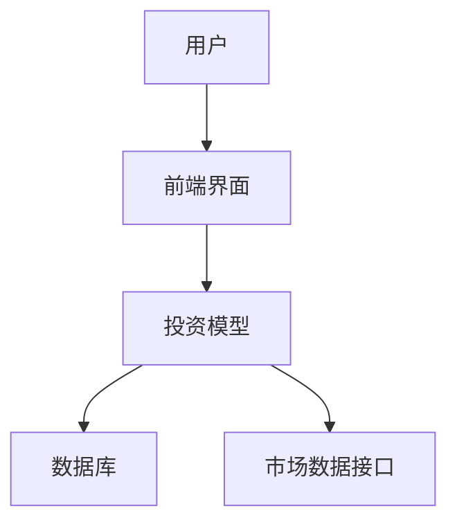
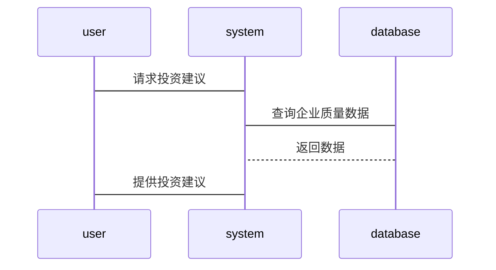

                 


# 彼得林奇的"质量优先"在新兴市场的应用挑战

## 关键词：
- 彼得林奇
- 质量优先
- 新兴市场
- 投资策略
- 市场波动

## 摘要：
本文探讨了彼得林奇的“质量优先”投资策略在新兴市场的应用挑战。通过分析新兴市场的特点、质量优先策略的核心要素，以及在新兴市场中的具体应用案例，本文揭示了如何在高波动性和不确定性环境中调整和优化投资策略，以实现稳健的投资回报。

---

## 正文：

### 第1章：彼得林奇的"质量优先"投资策略概述

#### 1.1 质量优先策略的核心概念
质量优先策略是彼得林奇提出的一种投资方法，其核心在于选择具有高质量的企业进行投资，而非仅仅关注价格因素。以下是质量优先策略的几个关键点：

##### 1.1.1 质量优先的定义
质量优先策略强调投资于那些具有强大竞争优势、良好管理团队和健康财务状况的企业。这种策略注重企业的内在质量，而非单纯追求低市盈率或低市净率。

##### 1.1.2 质量优先的核心要素
- **企业竞争优势**：企业是否在行业内具有独特的竞争优势，例如技术创新、品牌影响力等。
- **管理团队**：管理团队的能力和稳定性是企业质量的重要组成部分。
- **财务健康状况**：企业的财务状况是否稳健，包括盈利能力、资产负债情况等。

##### 1.1.3 质量优先与传统价值投资的区别
| 特性 | 质量优先 | 传统价值投资 |
|------|----------|--------------|
| 核心 | 企业质量 | 价格与价值 |
| 重点 | 竞争优势 | 低市盈率或低市净率 |
| 风险 | 中低 | 较高 |

#### 1.2 新兴市场的特点与挑战
新兴市场具有高增长、高波动性和政策不确定性等特点，这些特点对质量优先策略的应用提出了新的挑战。

##### 1.2.1 新兴市场的定义与特点
- **高增长**：新兴市场通常经济增长速度快，企业盈利能力强。
- **高波动性**：市场波动较大，受政策和外部环境影响显著。
- **政策不确定性**：新兴市场的政策变化频繁，对企业经营和投资决策产生较大影响。

##### 1.2.2 新兴市场与发达市场的对比
| 特性 | 新兴市场 | 发达市场 |
|------|----------|-----------|
| 市场波动 | 高 | 低 |
| 政策风险 | 高 | 低 |
| 企业质量 | 多样性高 | 稳定性高 |

---

### 第2章：质量优先策略在新兴市场的应用背景

#### 2.1 新兴市场中的企业质量评估
在新兴市场中，企业质量评估需要考虑更多的因素，例如企业治理、市场环境和政策风险。

##### 2.1.1 企业质量评估的核心指标
- **市盈率（P/E）**：衡量企业的盈利能力。
- **ROE（净资产收益率）**：衡量企业的财务健康状况。
- **管理团队稳定性**：评估企业在动荡环境中的应对能力。

##### 2.1.2 新兴市场中的企业治理问题
新兴市场中，企业治理问题较为突出，例如家族企业控制、关联交易频繁等，这些都可能影响企业的质量。

##### 2.1.3 企业质量与市场波动的关系
在高波动市场中，企业质量是决定投资收益的重要因素。高质量的企业能够在市场波动中保持稳健表现。

#### 2.2 新兴市场中的投资者行为
投资者行为在新兴市场中具有明显的特征，例如情绪化和羊群效应。

##### 2.2.1 投资者行为的特点
- **情绪化**：投资者容易受到市场情绪的影响，导致非理性决策。
- **羊群效应**：投资者倾向于跟随市场趋势，而非独立判断。

##### 2.2.2 投资者行为对企业质量的影响
投资者情绪化和羊群效应可能导致企业质量被高估或低估，进而影响投资决策。

##### 2.2.3 投资者行为与市场流动性
投资者行为与市场流动性密切相关，情绪化行为可能导致市场流动性波动。

---

### 第3章：构建质量优先的投资模型

#### 3.1 投资模型的设计思路
质量优先投资模型需要结合新兴市场的特点，动态调整投资策略。

##### 3.1.1 筛选标准
- **行业选择**：选择高增长行业的龙头企业。
- **财务指标**：重点关注ROE、毛利率等指标。
- **管理团队**：评估管理团队的稳定性和能力。

##### 3.1.2 权重分配
| 标准 | 权重 |
|------|------|
| 企业竞争优势 | 40% |
| 财务健康状况 | 30% |
| 管理团队稳定性 | 20% |
| 市场环境 | 10% |

##### 3.1.3 动态调整机制
根据市场环境的变化，定期评估投资组合的质量，进行动态调整。

---

### 第4章：质量优先策略在新兴市场的实际应用

#### 4.1 案例分析：科技企业的投资策略
以某新兴市场的科技企业为例，分析质量优先策略的应用。

##### 4.1.1 企业背景
- 公司名称：XYZ科技
- 所属行业：信息技术
- 核心业务：软件开发

##### 4.1.2 质量评估
- **竞争优势**：技术创新能力强。
- **财务状况**：ROE较高，毛利率稳步增长。
- **管理团队**：管理团队稳定，CEO具有丰富的行业经验。

##### 4.1.3 投资决策
基于质量优先策略，XYZ科技被选为投资标的。

#### 4.2 投资组合的动态调整
根据市场环境的变化，定期评估投资组合的质量，进行动态调整。

---

### 第5章：系统分析与架构设计

#### 5.1 系统功能设计
质量优先投资模型的系统功能包括：
- 数据采集：收集企业的财务数据和市场信息。
- 数据分析：评估企业的质量，生成投资建议。
- 投资组合管理：动态调整投资组合。

#### 5.2 系统架构设计
使用Mermaid图展示系统架构：



#### 5.3 接口设计
系统接口包括：
- 数据接口：与市场数据源对接。
- 用户接口：提供投资建议和决策支持。

#### 5.4 交互设计
使用Mermaid序列图展示用户与系统的交互：



---

### 第6章：项目实战

#### 6.1 环境安装
安装必要的工具和库，例如Python、Pandas、NumPy等。

#### 6.2 核心代码实现
以下是Python代码示例：

```python
import pandas as pd

# 数据加载
data = pd.read_csv('企业数据.csv')

# 质量评估函数
def quality_assessment(roe,毛利率):
    if roe > 15 and 利润率 > 20:
        return '高质量'
    elif roe > 10 and 利润率 > 15:
        return '中等质量'
    else:
        return '低质量'

# 投资建议生成
data['质量等级'] = data.apply(lambda x: quality_assessment(x['ROE'], x['毛利率']), axis=1)
```

#### 6.3 案例分析
通过具体案例分析，展示代码的应用和结果。

#### 6.4 项目小结
总结项目的实施过程和成果，提出改进建议。

---

### 第7章：总结与展望

#### 7.1 总结
本文探讨了彼得林奇的“质量优先”策略在新兴市场的应用，提出了构建质量优先投资模型的方法，并通过实际案例进行了验证。

#### 7.2 展望
未来，随着新兴市场的进一步发展，质量优先策略的应用将更加广泛。投资者需要不断优化投资模型，以应对市场的变化和挑战。

---

### 作者：AI天才研究院 & 禅与计算机程序设计艺术

---

以上是完整的目录和文章内容，涵盖了从背景介绍到系统设计的各个方面，确保内容详实、逻辑清晰，帮助读者深入理解彼得林奇的质量优先策略在新兴市场的应用。

