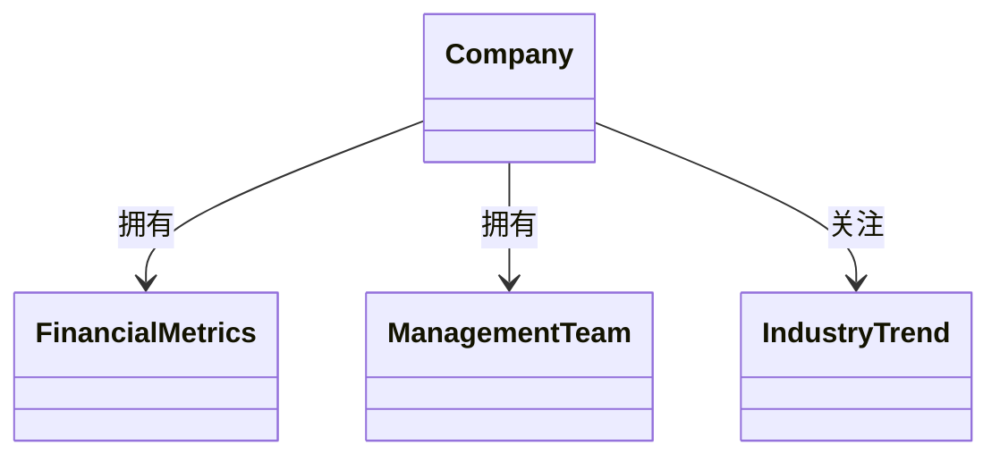
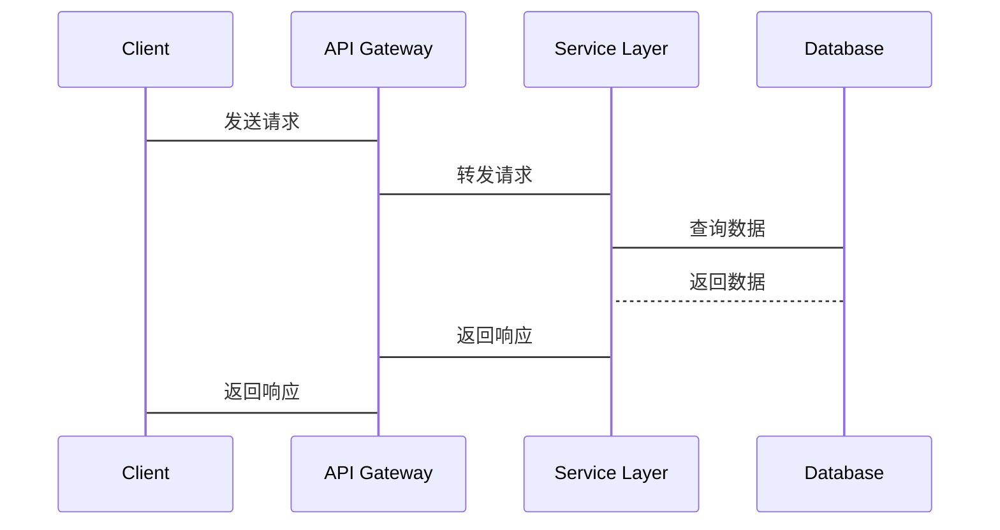

                 

# 彼得林奇的"质量优先"在生物科技行业的应用

## 关键词
彼得林奇，质量优先，生物科技，投资策略，企业评估

## 摘要
本文探讨了彼得·林奇的“质量优先”投资策略在生物科技行业的应用。通过分析该策略的核心原则和生物科技行业的特点，本文详细阐述了如何将“质量优先”策略应用于生物科技投资，并提供了系统分析与架构设计方案，以及实战案例。最终，本文总结了应用该策略的关键点和注意事项，为投资者提供了实用的指导。

---

# 第1章：彼得·林奇与“质量优先”策略

## 1.1 彼得·林奇的背景与投资理念

### 1.1.1 彼得·林奇的生平简介
彼得·林奇是美国著名投资经理，以其在富达麦哲伦基金的卓越表现闻名。他的投资理念强调长期持有优质股票，追求稳定的资本增值。

### 1.1.2 “质量优先”策略的核心思想
彼得·林奇认为，优质公司具备持续盈利能力、强大的管理团队和健康的财务状况。投资时应优先选择这些公司，而非短期高增长的企业。

### 1.1.3 该策略在投资领域的影响力
“质量优先”策略帮助投资者在长期中获得稳定收益，成为价值投资的重要组成部分。

## 1.2 “质量优先”策略的基本原则

### 1.2.1 选择优质公司的标准
包括稳定的盈利能力、健康的财务状况、强大的管理团队和良好的市场地位。

### 1.2.2 长期持有的投资哲学
林奇主张长期持有优质股票，避免频繁交易，以减少成本和税负。

### 1.2.3 风险控制与收益平衡
通过选择优质公司，投资者可以在控制风险的同时，实现收益最大化。

---

# 第2章：生物科技行业的特点与投资机会

## 2.1 生物科技行业的定义与范围

### 2.1.1 生物科技的定义
生物科技是利用生物技术进行研究、开发和应用的领域，涵盖制药、医疗设备和生物制品等。

### 2.1.2 行业的主要领域
包括制药、生物技术、医疗设备和基因技术等领域。

### 2.1.3 行业的现状与发展趋势
生物科技行业处于快速发展阶段，技术创新和政策支持推动其增长。

## 2.2 生物科技行业的投资特点

### 2.2.1 高风险与高回报并存
生物科技行业技术门槛高，研发周期长，失败风险高，但成功后回报巨大。

### 2.2.2 技术创新的核心作用
技术创新是生物科技行业的核心驱动力，决定了企业的竞争力和市场地位。

### 2.2.3 市场波动与政策影响
政策变化和市场波动对生物科技行业影响显著，投资者需密切关注相关政策和市场动态。

---

# 第3章：“质量优先”策略在生物科技行业的应用

## 3.1 策略的核心要素

### 3.1.1 企业质量评估标准
评估标准包括技术创新能力、财务健康状况、管理团队稳定性等。

### 3.1.2 财务健康状况分析
分析企业的盈利能力、资产负债情况和现金流健康状况。

### 3.1.3 管理团队的稳定性
评估管理团队的经验、稳定性及战略规划能力。

## 3.2 投资组合的构建与管理

### 3.2.1 筛选优质生物科技企业的标准
包括企业核心技术竞争力、财务健康状况和管理团队稳定性。

### 3.2.2 投资组合的动态调整
根据市场变化和企业情况，定期评估和调整投资组合。

### 3.2.3 风险评估与应对策略
通过分散投资、定期评估和风险模型构建，降低投资风险。

---

# 第4章：系统分析与架构设计方案

## 4.1 项目介绍

### 4.1.1 项目目标
构建一个基于“质量优先”策略的生物科技行业投资分析系统。

### 4.1.2 项目范围
涵盖企业评估、投资组合管理、风险分析等功能。

### 4.1.3 项目背景
随着生物科技行业的快速发展，投资者需要更高效的工具来分析投资机会。

## 4.2 系统功能设计

### 4.2.1 领域模型设计（Mermaid类图）

## 4.3 系统架构设计

### 4.3.1 分层架构（Mermaid架构图）

## 4.4 系统接口设计

### 4.4.1 API接口设计
定义RESTful API接口，用于数据查询和操作。

## 4.5 系统交互设计（Mermaid序列图）

---

# 第5章：实战案例分析

## 5.1 案例介绍

### 5.1.1 案例背景
某生物科技公司专注于基因技术，财务状况良好，管理团队稳定。

### 5.1.2 投资策略
根据“质量优先”策略，选择该企业作为投资标的。

## 5.2 投资过程

### 5.2.1 初期筛选
通过企业评估标准筛选出优质企业。

### 5.2.2 投资决策
基于财务分析和管理团队评估，决定投资。

## 5.3 投资结果

### 5.3.1 投资回报
企业成功上市，投资收益显著。

## 5.4 经验总结

### 5.4.1 关键决策点
精准的企业筛选和长期持有策略是成功的关键。

### 5.4.2 风险控制
通过定期评估和动态调整，有效控制投资风险。

---

# 第6章：总结与展望

## 6.1 策略总结

### 6.1.1 核心要点
质量优先策略在生物科技行业的应用需结合行业特点，选择优质企业。

### 6.1.2 实施步骤
包括企业筛选、财务分析、投资组合管理等步骤。

## 6.2 注意事项

### 6.2.1 风险提示
生物科技行业波动大，投资需谨慎。

### 6.2.2 长期视角
保持长期投资视角，避免短期波动影响决策。

## 6.3 未来展望

### 6.3.1 技术进步
基因编辑等技术的进步将推动行业进一步发展。

### 6.3.2 投资趋势
生物科技行业将继续吸引投资者关注，质量优先策略将发挥重要作用。

---

# 作者

作者：AI天才研究院 & 禅与计算机程序设计艺术

