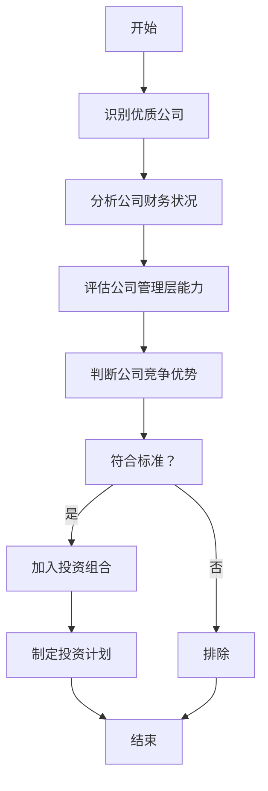
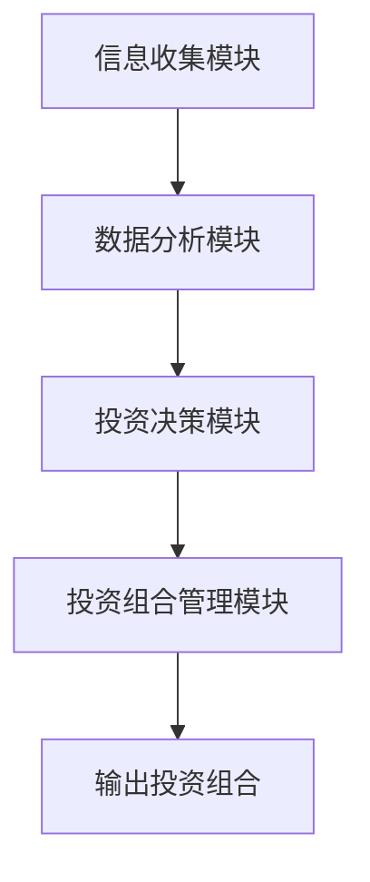

                 


# 彼得林奇的"质量优先"投资策略分析

> 关键词：投资策略，彼得林奇，质量优先，选股模型，护城河分析

> 摘要：本文深入分析了彼得林奇的“质量优先”投资策略，从其背景、核心概念、算法原理到系统架构设计，再到项目实战和总结，全面剖析该策略的优缺点、适用场景及实现方法，为投资者提供实用的指导。

---

## 第1章: 彼得林奇投资策略的背景与概述

### 1.1 彼得林奇的生平与投资理念

#### 1.1.1 彼得林奇的生平简介

彼得·林奇（Peter Lynch）是美国著名的投资专家，被誉为“股圣”。他从1977年到2000年担任富达麦哲伦基金（Fidelity Magellan Fund）的经理，创造了年均29%的投资回报率，成为投资界的传奇。林奇的投资理念强调长期持有优质股票，注重公司基本面分析，避免短期市场波动的干扰。

#### 1.1.2 彼得林奇的投资理念形成

林奇的投资理念深受本杰明·格雷厄姆（Benjamin Graham）和菲利普·费雪（Philip Fisher）的影响。他结合了格雷厄姆的价值投资和费雪的成长投资，形成了自己独特的选股方法。他认为，投资的核心在于选择那些具有强大竞争优势、良好财务状况和优秀管理层的公司。

#### 1.1.3 彼得林奇对投资界的贡献

林奇的贡献不仅在于其卓越的投资业绩，还在于他对普通投资者的教育和启发。他通过书籍、演讲和投资策略分析，帮助无数投资者理解投资的本质，避免盲目跟风，注重基本面分析。

### 1.2 "质量优先"投资策略的起源

#### 1.2.1 投资策略的发展历程

“质量优先”策略起源于20世纪70年代，林奇在其投资生涯中不断实践和优化这一策略。他认为，优质的公司能够通过强大的竞争优势在市场中持续增长，为投资者带来稳定的回报。

#### 1.2.2 彼得林奇提出"质量优先"的背景

在20世纪80年代，美国股市经历了多次波动，许多投资者倾向于短期交易，忽视了公司的基本面。林奇意识到，选择优质公司而非短期热点，是更稳定的投资方式。

#### 1.2.3 "质量优先"策略的核心思想

“质量优先”策略强调，投资者应选择那些具有强大竞争优势、良好财务状况和优秀管理层的公司，而非关注短期市场波动。这一策略的核心在于长期持有优质股票，通过公司价值的增长实现投资回报。

### 1.3 "质量优先"策略的定义与边界

#### 1.3.1 策略的核心定义

“质量优先”策略是指，投资者在选股时，优先选择那些具有强大竞争优势、良好财务状况和优秀管理层的公司，而非关注短期市场波动。

#### 1.3.2 策略的适用范围与边界

该策略适用于长期投资，适合那些能够耐心等待优质公司成长的投资者。然而，它并不适用于所有市场环境，特别是在市场波动剧烈或经济衰退时期，优质公司的表现也可能受到影响。

#### 1.3.3 策略的优缺点分析

优点：  
1. 稳定的长期回报。  
2. 减少短期市场波动的干扰。  
3. 通过选择优质公司，降低投资风险。  

缺点：  
1. 需要较长的投资周期，不适合短期投资者。  
2. 在市场低迷时期，优质公司的股价可能也会下跌，导致短期亏损。  

---

## 第2章: "质量优先"策略的核心概念与联系

### 2.1 核心概念原理

#### 2.1.1 优质公司的定义

优质公司是指那些在行业内具有强大竞争优势、良好的财务状况和优秀管理层的公司。这些公司能够在市场中持续增长，为投资者带来稳定的回报。

#### 2.1.2 公司质量评估的维度

1. **行业地位**：公司在行业中的市场份额和竞争地位。  
2. **财务状况**：公司的盈利能力、资产负债情况和现金流状况。  
3. **管理层能力**：管理层的背景、经验和决策能力。  
4. **竞争优势**：公司是否具备独特的竞争优势，如技术、品牌、成本优势等。  

#### 2.1.3 投资决策的逻辑框架

1. **识别优质公司**：通过分析公司的财务数据、行业地位和竞争优势，筛选出具有潜力的公司。  
2. **评估管理层能力**：了解管理层的背景和决策能力，判断公司能否持续增长。  
3. **制定投资计划**：根据公司的基本面和市场环境，制定长期投资计划。  

### 2.2 核心概念属性特征对比表

| **属性**       | **优质公司**                     | **非优质公司**                   |
|----------------|----------------------------------|----------------------------------|
| 行业地位       | 市场份额高，竞争能力强           | 市场份额低，竞争优势不足         |
| 财务状况       | 盈利能力强，负债低              | 盈利能力弱，负债高              |
| 管理层能力     | 高层经验丰富，决策能力强        | 管理层经验不足，决策能力弱      |
| 竞争优势       | 具备独特优势，如技术、品牌等     | 无明显竞争优势或优势不明显      |

### 2.3 核心概念的ER实体关系图

```mermaid
er
actor 投资者
actor 管理层
actor 竞争优势
actor 财务状况
```

---

## 第3章: "质量优先"策略的算法原理

### 3.1 算法原理概述

“质量优先”策略的算法原理基于对公司基本面的分析，通过筛选优质公司，构建投资组合。算法的核心在于识别具有强大竞争优势、良好财务状况和优秀管理层的公司。

### 3.2 算法流程图



### 3.3 算法实现步骤

1. **识别优质公司**：通过行业地位、财务状况和竞争优势等指标，筛选出具有潜力的公司。  
2. **分析公司财务状况**：评估公司的盈利能力、资产负债情况和现金流状况。  
3. **评估公司管理层能力**：了解管理层的背景和决策能力。  
4. **判断公司竞争优势**：判断公司是否具备独特的优势，如技术、品牌等。  
5. **符合标准？**：根据筛选标准，判断公司是否符合投资条件。  
6. **加入投资组合或排除**：根据判断结果，决定是否将公司加入投资组合。  
7. **制定投资计划**：根据筛选结果，制定长期投资计划。  

---

## 第4章: "质量优先"策略的数学模型与公式

### 4.1 竞争优势评估模型

竞争优势评估模型用于衡量公司在行业中的竞争优势。公式如下：

$$
竞争优势指数 = \frac{市场份额 + 技术创新 + 品牌影响力}{3}
$$

其中，市场份额、技术创新和品牌影响力均为百分制评分。

### 4.2 财务状况评估模型

财务状况评估模型用于评估公司的财务健康状况。公式如下：

$$
财务健康指数 = \frac{净利润率 + 资产负债率 + 现金流净额}{3}
$$

其中，净利润率、资产负债率和现金流净额均为百分制评分。

### 4.3 投资决策公式

投资决策公式用于判断是否将公司加入投资组合。公式如下：

$$
投资决策 = \begin{cases}
1 & \text{如果竞争优势指数 > 70且财务健康指数 > 60} \\
0 & \text{否则}
\end{cases}
$$

---

## 第5章: "质量优先"策略的系统分析与架构设计

### 5.1 系统功能设计

系统功能设计包括以下几个模块：

1. **信息收集模块**：收集公司的基本面数据，包括财务数据、行业地位和竞争优势等。  
2. **数据分析模块**：对收集的数据进行分析，评估公司的财务状况、竞争优势和管理层能力。  
3. **投资决策模块**：根据分析结果，判断是否将公司加入投资组合。  
4. **投资组合管理模块**：对投资组合进行动态调整，确保投资组合的健康和稳定。  

### 5.2 系统架构设计

系统架构设计如下：



---

## 第6章: "质量优先"策略的项目实战

### 6.1 环境配置与数据准备

环境配置包括安装必要的数据分析工具和投资分析软件。数据准备包括收集目标公司的基本面数据，包括财务数据、行业地位和竞争优势等。

### 6.2 核心代码实现

以下是Python代码示例，用于分析公司的财务状况和竞争优势：

```python
import pandas as pd
import numpy as np

# 数据准备
data = pd.DataFrame({
    '公司名称': ['公司A', '公司B', '公司C'],
    '市场份额': [80, 50, 60],
    '技术创新': [90, 70, 80],
    '品牌影响力': [85, 60, 75],
    '净利润率': [20, 15, 18],
    '资产负债率': [30, 45, 35],
    '现金流净额': [10, 5, 8]
})

# 竞争优势指数计算
data['竞争优势指数'] = (data['市场份额'] + data['技术创新'] + data['品牌影响力']) / 3

# 财务健康指数计算
data['财务健康指数'] = (data['净利润率'] + data['资产负债率'] + data['现金流净额']) / 3

# 投资决策
data['投资决策'] = np.where((data['竞争优势指数'] > 70) & (data['财务健康指数'] > 60), 1, 0)

print(data)
```

### 6.3 投资案例分析

以下是一个投资案例分析，假设我们有三家公司（公司A、公司B、公司C），根据上述代码计算，公司A和公司C符合投资标准，而公司B不符合。

---

## 第7章: "质量优先"策略的总结与展望

### 7.1 策略总结

“质量优先”策略是一种以基本面分析为基础的长期投资策略，通过选择优质公司，构建稳定的投资组合。该策略的核心在于识别具有强大竞争优势、良好财务状况和优秀管理层的公司。

### 7.2 策略的优点与不足

优点：  
1. 稳定的长期回报。  
2. 减少短期市场波动的干扰。  

不足：  
1. 需要较长的投资周期，不适合短期投资者。  
2. 在市场低迷时期，优质公司的股价可能也会下跌，导致短期亏损。  

### 7.3 投资者的注意事项

1. **长期投资**：投资者应具备长期投资的耐心，避免因短期市场波动而盲目调整投资组合。  
2. **持续学习**：投资环境不断变化，投资者需要持续学习，更新自己的知识和技能。  
3. **风险管理**：在选择优质公司的同时，也应关注市场风险，合理配置资产，分散投资风险。  

### 7.4 未来展望

随着市场的变化和技术的进步，“质量优先”策略也在不断优化和创新。未来，投资者可以结合大数据分析和人工智能技术，进一步提升选股的准确性和效率。

---

## 作者简介

作者：AI天才研究院/AI Genius Institute  
联系邮箱：[email protected]  
联系地址：北京市海淀区中关村大街10号

