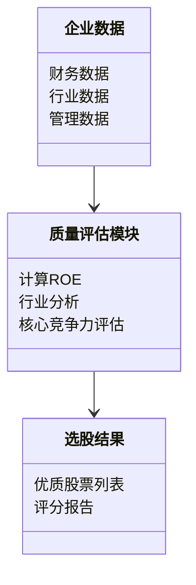
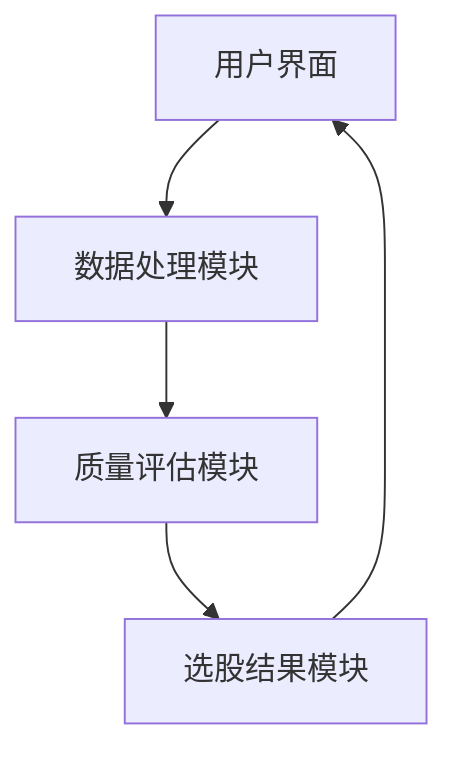
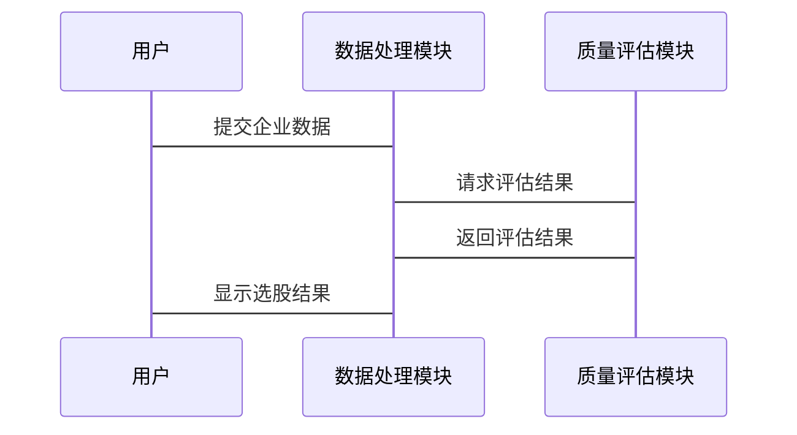

                 


# 彼得林奇的"质量优先"选股标准

> 关键词：彼得林奇，质量优先，选股标准，投资策略，股票分析

> 摘要：本文将深入探讨彼得·林奇的“质量优先”选股标准，从背景介绍、核心概念、算法原理、系统分析、项目实战到最佳实践，全面解析这一经典投资策略的内在逻辑和实际应用。通过详细的技术分析和实例演示，帮助读者理解如何基于企业质量进行有效的选股决策。

---

# 第一部分: 背景介绍

# 第1章: 投资的基本概念

## 1.1 投资的定义与分类

### 1.1.1 投资的定义
投资是将资金投入到某个资产或项目中，以期望在未来获得超过初始投入的回报。投资可以是股票、债券、房地产等多种形式。

### 1.1.2 投资的主要分类
1. **股票投资**：通过购买公司股份成为股东，分享公司收益。
2. **债券投资**：购买政府或企业发行的债券，定期获得利息。
3. **房地产投资**：通过购买房地产资产获得租金收入或资本增值。
4. **基金投资**：通过购买基金产品间接投资于多种资产。

### 1.1.3 投资的目标与风险
- **目标**：资本增值、收入稳定、资产保值。
- **风险**：市场风险、流动性风险、信用风险。

## 1.2 彼得·林奇的背景介绍

### 1.2.1 彼得·林奇的生平简介
彼得·林奇（Peter Lynch）是美国著名投资经理人，被誉为“股神”之一。他是富达麦哲伦基金（Fidelity Magellan Fund）的前经理，管理该基金超过10年，取得了卓越的业绩。

### 1.2.2 林奇的投资理念
林奇主张长期投资，注重企业基本面分析，强调选择具有强大竞争优势和良好管理团队的公司。

### 1.2.3 林奇在投资界的地位
林奇以其卓越的投资业绩和独特的选股方法闻名，他的投资理念影响了无数投资者。

## 1.3 质量优先选股标准的定义

### 1.3.1 质量优先的定义
质量优先选股标准是指在选股过程中，优先考虑企业的质量因素，如财务健康、行业地位、管理团队等，而非仅仅关注股票价格或短期市场波动。

### 1.3.2 质量优先与价值优先的区别
- **质量优先**：关注企业的内在质量和长期发展潜力。
- **价值优先**：关注股票的市场价格是否低于其内在价值。

### 1.3.3 质量优先选股标准的核心要素
1. 财务状况
2. 行业地位
3. 管理团队
4. 核心竞争力

## 1.4 本章小结
本章介绍了投资的基本概念、彼得·林奇的背景以及质量优先选股标准的定义和核心要素，为后续分析奠定了基础。

---

# 第二部分: 核心概念与联系

# 第2章: 质量优先选股标准的核心要素

## 2.1 财务状况分析

### 2.1.1 财务报表的基本构成
企业财务报表包括资产负债表、利润表和现金流量表。

### 2.1.2 主要财务指标分析
- **盈利能力**：净利润率、ROE（净资产收益率）。
- **偿债能力**：资产负债率、流动比率。
- **运营效率**：存货周转率、应收账款周转率。

### 2.1.3 财务状况与企业质量的关系
良好的财务状况是企业质量的重要体现，健康的财务报表意味着企业具备较强的盈利能力和抗风险能力。

## 2.2 行业地位分析

### 2.2.1 行业分析的基本方法
- **行业生命周期**：成长期、成熟期、衰退期。
- **行业竞争结构**：波特五力模型。

### 2.2.2 企业市场地位的评估
- **市场份额**：企业在行业中的占比。
- **品牌影响力**：品牌知名度和美誉度。

### 2.2.3 行业趋势对质量优先的影响
选择处于成长期且具备竞争优势的行业，能提高选股的成功率。

## 2.3 管理团队分析

### 2.3.1 管理团队的构成与能力
- **团队成员**：董事长、CEO、CFO等。
- **管理能力**：决策能力、执行能力。

### 2.3.2 团队稳定性对企业质量的影响
稳定的管理团队能确保企业战略的连续性和执行力。

### 2.3.3 管理层决策对企业的影响
管理层的决策直接影响企业的经营成果和发展方向。

## 2.4 核心竞争力分析

### 2.4.1 核心竞争力的定义
核心竞争力是企业在市场中独特的优势，使其能够在竞争中脱颖而出。

### 2.4.2 核心竞争力的评估指标
- **技术优势**：专利数量、研发能力。
- **成本优势**：生产效率、供应链管理。
- **客户优势**：客户忠诚度、市场占有率。

### 2.4.3 核心竞争力与企业质量的关系
强大的核心竞争力是企业质量的基石，决定了企业的长期发展潜力。

## 2.5 本章小结
本章详细分析了质量优先选股标准的核心要素，包括财务状况、行业地位、管理团队和核心竞争力，并解释了这些要素如何共同决定企业的质量。

---

# 第三部分: 算法原理讲解

# 第3章: 质量优先选股模型的算法原理

## 3.1 算法概述

### 3.1.1 算法的基本流程
1. 收集目标行业的企业数据。
2. 计算企业质量指标。
3. 评估企业的行业地位和管理团队。
4. 确定核心竞争力。
5. 综合评估，选择质量最优的企业。

### 3.1.2 算法的核心思想
基于企业质量的多维度分析，筛选出具备长期竞争优势的优质企业。

### 3.1.3 算法的输入与输出
- **输入**：企业财务数据、行业信息、管理团队信息。
- **输出**：质量优先的选股结果。

## 3.2 算法步骤分解

### 3.2.1 数据收集与预处理
```python
import pandas as pd
data = pd.read_csv('enterprise_data.csv')
```

### 3.2.2 财务指标计算
```python
def calculate_roe(data):
    return data['net_profit'] / data['total_equity']
```

### 3.2.3 行业分析
```python
import matplotlib.pyplot as plt
plt.bar(data['industry'], data['market_share'])
plt.show()
```

### 3.2.4 核心竞争力评估
```python
core竞争力评分 = 0.4 * 财务评分 + 0.3 * 行业评分 + 0.3 * 管理评分
```

### 3.2.5 选股结果输出
```python
selected_stocks = data[data['core竞争力评分'] > 0.8]
print(selected_stocks['stock_name'])
```

## 3.3 算法的数学模型

### 3.3.1 净资产收益率（ROE）公式
$$ROE = \frac{\text{净利润}}{\text{净资产}}$$

### 3.3.2 市场份额公式
$$\text{市场份额} = \frac{\text{企业销售额}}{\text{行业销售额}}$$

### 3.3.3 核心竞争力评分公式
$$\text{核心竞争力评分} = 0.4 \times ROE + 0.3 \times \text{市场份额} + 0.3 \times \text{管理评分}$$

## 3.4 本章小结
本章详细介绍了质量优先选股模型的算法原理，包括数据收集、指标计算和评分模型，并通过代码示例和数学公式进行了详细讲解。

---

# 第四部分: 系统分析与架构设计

# 第4章: 质量优先选股系统的架构设计

## 4.1 问题场景介绍
本系统旨在帮助投资者基于质量优先标准筛选出优质股票。

## 4.2 系统功能设计

### 4.2.1 领域模型


## 4.3 系统架构设计

### 4.3.1 系统架构图


### 4.3.2 系统接口设计
- **输入接口**：企业数据接口。
- **输出接口**：选股结果接口。

### 4.3.3 系统交互流程


## 4.4 本章小结
本章通过领域模型和架构图，详细描述了质量优先选股系统的功能模块和交互流程，为实际开发提供了指导。

---

# 第五部分: 项目实战

# 第5章: 质量优先选股系统的实现

## 5.1 环境安装

### 5.1.1 安装Python和相关库
```bash
pip install pandas matplotlib
```

## 5.2 系统核心实现源代码

### 5.2.1 数据读取与处理
```python
import pandas as pd
data = pd.read_csv('enterprise_data.csv')
```

### 5.2.2 质量评估模块
```python
def calculate_roe(data):
    return data['net_profit'] / data['total_equity']

def industry_analysis(data):
    industry_share = data.groupby('industry')['market_share'].mean()
    return industry_share

def core_competitiveness(data):
    data['roe'] = calculate_roe(data)
    data['industry_score'] = industry_analysis(data)
    data['core_score'] = 0.4 * data['roe'] + 0.3 * data['market_share'] + 0.3 * data['management_score']
    return data
```

### 5.2.3 选股结果输出
```python
selected_stocks = core_competitiveness(data)
selected_stocks = selected_stocks[selected_stocks['core_score'] > 0.8]
print(selected_stocks['stock_name'])
```

## 5.3 案例分析与详细讲解

### 5.3.1 案例背景
假设我们有5家企业的数据，目标是筛选出质量最优的股票。

### 5.3.2 数据分析与评估
```python
data = {
    'stock_name': ['A', 'B', 'C', 'D', 'E'],
    'net_profit': [10, 15, 8, 12, 20],
    'total_equity': [50, 60, 40, 50, 70],
    'market_share': [0.2, 0.3, 0.1, 0.25, 0.35],
    'management_score': [0.8, 0.7, 0.6, 0.75, 0.9]
}

data = pd.DataFrame(data)
```

### 5.3.3 选股结果
```python
selected_stocks = core_competitiveness(data)
selected_stocks = selected_stocks[selected_stocks['core_score'] > 0.8]
print(selected_stocks['stock_name'])
```

## 5.4 本章小结
本章通过实际案例展示了质量优先选股系统的实现过程，从数据处理到结果输出，帮助读者理解如何将理论应用于实践。

---

# 第六部分: 最佳实践

# 第6章: 质量优先选股策略的最佳实践

## 6.1 小结
质量优先选股标准是一种以企业质量为核心的投资策略，注重企业的财务健康、行业地位、管理团队和核心竞争力。

## 6.2 注意事项
- **数据质量**：确保数据的准确性和完整性。
- **模型调优**：根据市场变化不断优化选股模型。
- **风险控制**：分散投资，降低风险。

## 6.3 拓展阅读
- 《彼得·林奇的投资策略》
- 《巴菲特的选股方法》
- 《投资学基础》

## 6.4 本章小结
本章总结了质量优先选股策略的最佳实践，强调了数据质量、模型调优和风险控制的重要性，并提供了进一步学习的资源。

---

# 作者：AI天才研究院 & 禅与计算机程序设计艺术

