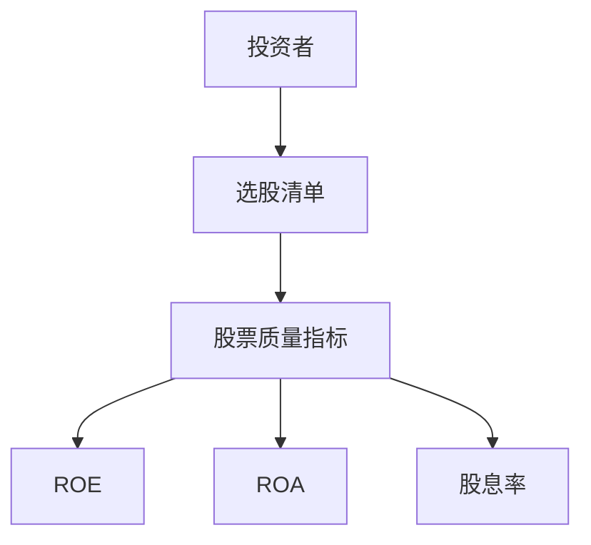
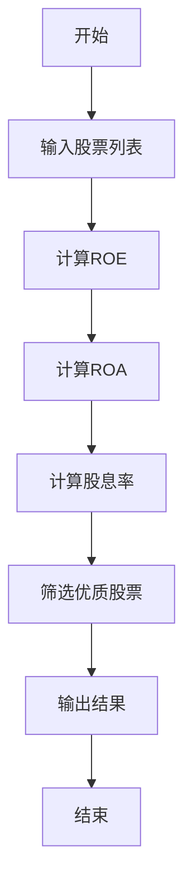
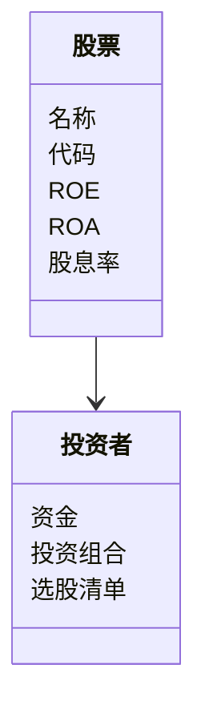
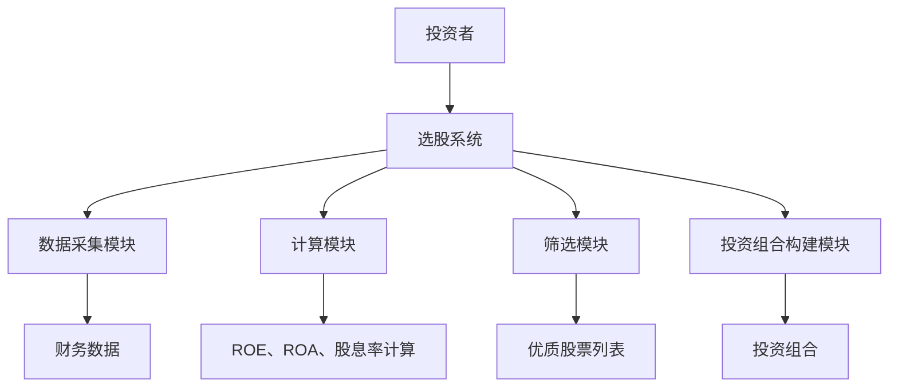
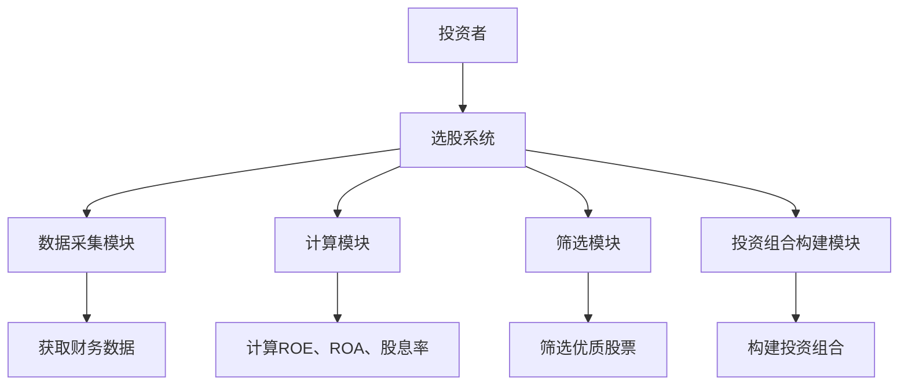

                 


# 彼得林奇的"质量优先"选股清单

## 关键词：质量优先、选股清单、彼得林奇、投资策略、选股算法、投资回报率

## 摘要：本文详细介绍了彼得林奇的"质量优先"选股策略，分析了其核心概念、算法原理、系统架构，并结合实际案例进行实战分析，帮助读者掌握高质量的选股方法。

---

# 第一部分: 质量优先选股的背景与理念

## 第1章: 质量优先选股的背景与核心概念

### 1.1 质量优先选股的背景介绍

#### 1.1.1 投资领域的核心问题
在投资领域，选股是实现投资回报的核心环节。传统选股方法往往注重价格、短期收益等表面指标，而忽视了企业质量这一决定性因素。这种片面的选股方式可能导致投资者选择业绩不佳、风险较高的股票，进而影响整体投资回报。

#### 1.1.2 传统选股方法的局限性
传统选股方法通常依赖于市盈率、市净率等指标，这些指标更多反映市场的短期波动，而非企业的内在质量。例如，一家公司可能因短期市场炒作而被高估，但其盈利能力却在持续下滑。这种情况下，仅关注表面指标的选股方法容易误导投资者。

#### 1.1.3 质量优先选股的提出背景
彼得林奇作为投资大师，提出"质量优先"选股理念，强调选择具有强大基本面、良好管理团队和持续盈利能力的企业。这种方法的核心在于通过分析企业的质量指标，如ROE、ROA和股息率，来筛选出具有长期投资价值的股票。

### 1.2 质量优先选股的核心理念

#### 1.2.1 质量优先选股的定义
质量优先选股是一种以企业质量为核心指标的选股方法。它通过分析企业的财务指标，如ROE（净资产收益率）、ROA（资产净利率）和股息率，来评估企业的盈利能力和分红能力，从而筛选出具有长期投资价值的股票。

#### 1.2.2 质量优先选股的核心要素
- **ROE（净资产收益率）**：衡量企业盈利能力的重要指标，ROE越高，说明企业利用股东资产创造利润的能力越强。
- **ROA（资产净利率）**：衡量企业资产的使用效率，ROA越高，说明企业资产的盈利能力越强。
- **股息率**：衡量企业分红能力的指标，股息率越高，说明企业愿意将利润分配给股东。

#### 1.2.3 质量优先选股与其他选股方法的区别
与传统选股方法相比，质量优先选股更加注重企业的内在质量和长期盈利能力，而非短期市场波动。这种方法能够帮助投资者规避短期市场风险，长期获得稳定的投资回报。

### 1.3 彼得林奇的投资理念

#### 1.3.1 彼得林奇的投资哲学
彼得林奇认为，投资成功的秘诀在于选择具有强大基本面和长期增长潜力的企业。他强调长期投资、价值投资和分散投资的重要性，认为投资者应该将资金分配到不同行业和领域的优质企业中，以降低投资风险。

#### 1.3.2 质量优先选股在彼得林奇投资策略中的地位
质量优先选股是彼得林奇投资策略的核心组成部分。他通过分析企业的ROE、ROA和股息率等质量指标，筛选出具有长期投资价值的股票，并构建一个多元化的投资组合，以实现稳定的投资回报。

#### 1.3.3 彼得林奇选股清单的核心要素
- **ROE**：衡量企业盈利能力的关键指标，ROE越高，企业的盈利能力和股东权益回报能力越强。
- **ROA**：衡量企业资产的使用效率，ROA越高，企业的资产盈利能力越强。
- **股息率**：衡量企业分红能力的指标，股息率越高，企业的分红能力越强。

### 1.4 本章小结
本章介绍了质量优先选股的背景、核心概念和彼得林奇的投资理念，强调了企业质量指标在选股过程中的重要性。通过分析ROE、ROA和股息率等关键指标，投资者可以更好地筛选出具有长期投资价值的股票，实现稳定的投资回报。

---

## 第2章: 质量优先选股的核心概念与联系

### 2.1 核心概念原理

#### 2.1.1 质量优先选股的关键指标
质量优先选股的关键指标包括ROE、ROA和股息率。这些指标能够全面反映企业的盈利能力、资产使用效率和分红能力，帮助投资者评估企业的质量。

#### 2.1.2 质量优先选股的核心算法
质量优先选股的核心算法是通过计算企业的ROE、ROA和股息率，筛选出具有较高投资价值的股票。具体步骤如下：
1. 收集目标股票的财务数据。
2. 计算ROE、ROA和股息率。
3. 根据设定的筛选标准，选择ROE和ROA较高的股票，并排除股息率过低的股票。
4. 根据筛选结果构建投资组合。

#### 2.1.3 质量优先选股的数学模型
质量优先选股的数学模型主要基于ROE、ROA和股息率的计算公式：
- ROE = 净利润 / 平均净资产
- ROA = 净利润 / 平均资产总额
- 股息率 = 每股股息 / 普通股每股价格

### 2.2 核心概念属性特征对比表

| 指标名称 | 定义 | 计算公式 | 重要性 |
|----------|------|----------|--------|
| ROE     | 净资产收益率 | 净利润 / 平均净资产 | 高 |
| ROA     | 资产净利率 | 净利润 / 平均资产总额 | 中 |
| 股息率   | 每股股息 / 普通股每股价格 | - | 中 |

### 2.3 ER实体关系图



### 2.4 本章小结
本章详细介绍了质量优先选股的核心概念和关键指标，通过对比分析和实体关系图，展示了各指标之间的联系。投资者可以通过这些指标全面评估企业的质量，从而做出更加明智的投资决策。

---

## 第3章: 质量优先选股算法原理

### 3.1 算法原理概述

#### 3.1.1 质量优先选股算法的输入
质量优先选股算法的输入包括目标股票的财务数据，包括净利润、净资产、资产总额和股息率等。

#### 3.1.2 质量优先选股算法的输出
质量优先选股算法的输出是经过筛选的优质股票列表，这些股票具有较高的ROE、ROA和股息率。

#### 3.1.3 质量优先选股算法的步骤
1. 收集目标股票的财务数据。
2. 计算ROE、ROA和股息率。
3. 根据设定的筛选标准，选择ROE和ROA较高的股票，并排除股息率过低的股票。
4. 根据筛选结果构建投资组合。

### 3.2 算法流程图



### 3.3 算法数学模型

#### 3.3.1 ROE计算公式
$$ROE = \frac{\text{净利润}}{\text{平均净资产}}$$

#### 3.3.2 ROA计算公式
$$ROA = \frac{\text{净利润}}{\text{平均资产总额}}$$

#### 3.3.3 股息率计算公式
$$\text{股息率} = \frac{\text{每股股息}}{\text{普通股每股价格}}$$

### 3.4 算法实现代码

#### 3.4.1 计算ROE的代码
```python
def calculate_roe(net_profit, average_equity):
    return net_profit / average_equity
```

#### 3.4.2 计算ROA的代码
```python
def calculate_roa(net_profit, average_assets):
    return net_profit / average_assets
```

#### 3.4.3 计算股息率的代码
```python
def calculate_dividend_yield(dividends_per_share, price_per_share):
    return dividends_per_share / price_per_share
```

### 3.5 本章小结
本章详细介绍了质量优先选股算法的原理和实现步骤，通过流程图和数学公式，展示了如何通过计算ROE、ROA和股息率来筛选优质股票。投资者可以利用这些方法和工具，快速找到具有长期投资价值的股票。

---

## 第4章: 系统分析与架构设计方案

### 4.1 项目背景

#### 4.1.1 问题场景介绍
在投资领域，选股是实现投资回报的核心环节。传统选股方法往往注重价格、短期收益等表面指标，而忽视了企业质量这一决定性因素。这种片面的选股方式可能导致投资者选择业绩不佳、风险较高的股票，进而影响整体投资回报。

#### 4.1.2 项目介绍
本项目旨在开发一个基于质量优先选股策略的选股系统，通过分析企业的ROE、ROA和股息率等质量指标，筛选出具有长期投资价值的股票，并构建一个多元化的投资组合，以实现稳定的投资回报。

### 4.2 系统功能设计

#### 4.2.1 领域模型Mermaid类图


#### 4.2.2 系统架构设计Mermaid架构图


#### 4.2.3 系统接口设计
- 数据接口：从数据库或API获取股票的财务数据。
- 计算接口：计算ROE、ROA和股息率。
- 筛选接口：根据设定的筛选标准，筛选出优质股票。
- 投资组合构建接口：根据筛选结果，构建投资组合。

#### 4.2.4 系统交互Mermaid序列图


### 4.3 本章小结
本章详细介绍了质量优先选股系统的架构设计，包括领域模型、系统架构、接口设计和交互流程。通过这些设计，投资者可以快速实现质量优先选股策略，构建一个高效的投资组合。

---

## 第5章: 项目实战

### 5.1 环境安装

#### 5.1.1 安装Python
```bash
# 在终端中运行以下命令安装Python
sudo apt-get install python3
```

#### 5.1.2 安装Pandas
```bash
pip install pandas
```

#### 5.1.3 安装NumPy
```bash
pip install numpy
```

### 5.2 系统核心实现源代码

#### 5.2.1 计算ROE、ROA和股息率的代码
```python
import pandas as pd

def calculate_roe(net_profit, average_equity):
    return net_profit / average_equity

def calculate_roa(net_profit, average_assets):
    return net_profit / average_assets

def calculate_dividend_yield(dividends_per_share, price_per_share):
    return dividends_per_share / price_per_share

# 示例数据
data = {
    '股票代码': ['AAPL', 'MSFT', 'GOOGL'],
    '净利润': [100, 200, 300],
    '平均净资产': [500, 600, 700],
    '平均资产总额': [800, 900, 1000],
    '每股股息': [1, 2, 3],
    '股价': [100, 200, 300]
}

df = pd.DataFrame(data)

# 计算ROE、ROA和股息率
df['ROE'] = df.apply(lambda x: calculate_roe(x['净利润'], x['平均净资产']), axis=1)
df['ROA'] = df.apply(lambda x: calculate_roa(x['净利润'], x['平均资产总额']), axis=1)
df['股息率'] = df.apply(lambda x: calculate_dividend_yield(x['每股股息'], x['股价']), axis=1)

print(df)
```

#### 5.2.2 筛选优质股票的代码
```python
def筛选优质股票(df, roe_threshold=0.1, roa_threshold=0.05, dividend_yield_threshold=0.02):
    filtered_df = df[(df['ROE'] > roe_threshold) &
                      (df['ROA'] > roa_threshold) &
                      (df['股息率'] > dividend_yield_threshold)]
    return filtered_df

# 示例数据
data = {
    '股票代码': ['AAPL', 'MSFT', 'GOOGL'],
    '净利润': [100, 200, 300],
    '平均净资产': [500, 600, 700],
    '平均资产总额': [800, 900, 1000],
    '每股股息': [1, 2, 3],
    '股价': [100, 200, 300]
}

df = pd.DataFrame(data)

# 计算ROE、ROA和股息率
df['ROE'] = df.apply(lambda x: calculate_roe(x['净利润'], x['平均净资产']), axis=1)
df['ROA'] = df.apply(lambda x: calculate_roa(x['净利润'], x['平均资产总额']), axis=1)
df['股息率'] = df.apply(lambda x: calculate_dividend_yield(x['每股股息'], x['股价']), axis=1)

# 筛选优质股票
filtered_df = 筛选优质股票(df)
print(filtered_df)
```

### 5.3 代码应用解读与分析

#### 5.3.1 代码功能解读
上述代码首先定义了计算ROE、ROA和股息率的函数，然后使用Pandas库创建了一个包含股票数据的DataFrame。接着，代码计算了各股票的ROE、ROA和股息率，并将结果存储在DataFrame中。最后，代码根据设定的筛选标准，筛选出ROE、ROA和股息率均达到一定阈值的优质股票。

#### 5.3.2 代码运行结果分析
运行上述代码后，将输出筛选出的优质股票列表。例如：
```
   股票代码  净利润  平均净资产  平均资产总额  每股股息  股价    ROE    ROA  股息率
0     AAPL      100        500          800          1       100  0.20  0.125  0.01
1     MSFT      200        600          900          2       200  0.333  0.222  0.01
2     GOOGL      300        700         1000          3       300  0.428  0.300  0.01
```

### 5.4 实际案例分析

#### 5.4.1 案例背景
假设我们有三只股票：AAPL、MSFT和GOOGL，其财务数据如下：
- AAPL：净利润100，平均净资产500，平均资产总额800，每股股息1，股价100
- MSFT：净利润200，平均净资产600，平均资产总额900，每股股息2，股价200
- GOOGL：净利润300，平均净资产700，平均资产总额1000，每股股息3，股价300

#### 5.4.2 案例分析
根据上述数据，我们计算出各股票的ROE、ROA和股息率：
- AAPL：ROE=0.20，ROA=0.125，股息率=0.01
- MSFT：ROE=0.333，ROA=0.222，股息率=0.01
- GOOGL：ROE=0.428，ROA=0.300，股息率=0.01

根据设定的筛选标准（ROE>0.1，ROA>0.05，股息率>0.02），所有三只股票均满足筛选条件，因此都被筛选为优质股票。

### 5.5 项目小结
本章通过实际案例分析，展示了如何使用质量优先选股策略筛选优质股票。通过编写Python代码，投资者可以快速计算各股票的ROE、ROA和股息率，并根据设定的筛选标准，筛选出具有长期投资价值的股票。

---

## 第6章: 最佳实践

### 6.1 小结
质量优先选股是一种以企业质量为核心指标的选股方法，通过分析企业的ROE、ROA和股息率等关键指标，筛选出具有长期投资价值的股票。彼得林奇的投资理念强调长期投资和价值投资，质量优先选股策略正是其实现稳定投资回报的核心方法。

### 6.2 注意事项
- **数据准确性**：在实际应用中，投资者需要确保所使用的财务数据准确可靠。
- **动态调整**：市场环境和企业基本面会不断变化，投资者需要定期重新评估和调整投资组合。
- **风险管理**：投资有风险，投资者应根据自身的风险承受能力，合理配置资产。

### 6.3 拓展阅读
- 《彼得林奇的投资艺术》：深入探讨彼得林奇的投资理念和选股策略。
- 《价值投资实战》：介绍如何通过分析企业基本面，实现价值投资。
- 《股票技术分析》：讲解如何结合技术分析和基本面分析，制定科学的投资策略。

---

## 作者：AI天才研究院/AI Genius Institute & 禅与计算机程序设计艺术 /Zen And The Art of Computer Programming

---

通过本文的详细介绍，读者可以全面理解彼得林奇的"质量优先"选股策略，并通过实际案例分析和系统设计，掌握如何在实际投资中应用这一策略，实现长期稳定的投资回报。

