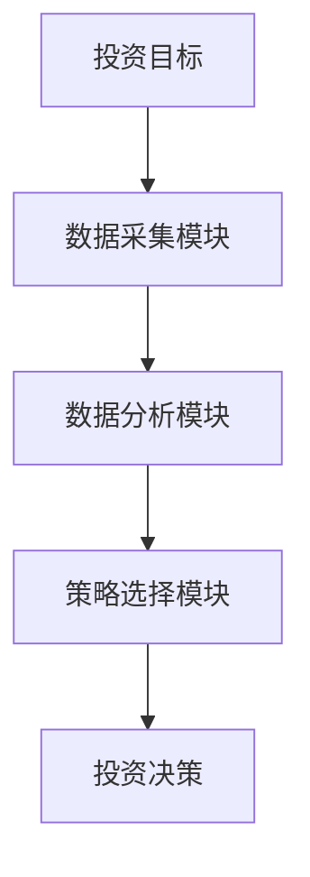

                 


# 彼得林奇的"质量成长"vs"价值重估"

## 关键词：投资策略，彼得林奇，质量成长，价值重估，股票分析，投资哲学

## 摘要：  
本文探讨了彼得林奇的两种投资策略——"质量成长"和"价值重估"，分析了它们的定义、核心原理、优缺点以及应用场景。通过对比和实例分析，帮助投资者理解这两种策略的差异和互补性，从而在实际投资中做出明智选择。

---

# 第1章：彼得林奇与他的投资哲学

## 1.1 彼得林奇的生平与成就  
- 彼得·林奇（Peter Lynch）是美国著名投资专家，曾管理富达麦哲伦基金，创造了卓越的投资业绩。  
- 他主张通过基本面分析和市场研究来寻找优质股票，提出了"质量成长"和"价值重估"两种投资策略。  

## 1.2 投资的基本概念与术语  
- **投资**：通过购买资产（如股票、债券等）获得未来收益的行为。  
- **股票市场**：企业通过发行股票融资的场所，投资者购买股票成为公司部分所有者。  
- **投资策略**：投资者为实现特定目标而采取的系统化方法，包括选股、时机选择和资产配置等。  

## 1.3 质量成长与价值重估的定义  
- **质量成长**：投资于基本面良好、持续增长的公司，关注企业的盈利能力和竞争优势。  
- **价值重估**：寻找市场价格低于内在价值的股票，关注市场低估的机会。  

---

# 第2章：质量成长策略的原理与应用  

## 2.1 质量成长的核心要素  
- **公司基本面**：包括收入、利润、资产负债表等财务指标。  
- **行业地位**：公司在行业中的竞争地位和市场占有率。  
- **财务健康状况**：企业是否有健康的现金流和负债结构。  

## 2.2 质量成长策略的优缺点  
| 优点 | 缺点 |  
|------|------|  
| 长期收益稳定 | 短期波动风险较大 |  
| 抗跌性强 | 需要较高的选股门槛 |  

## 2.3 质量成长策略的经典案例  
- 苹果公司：持续创新，市场地位稳固，符合质量成长的标准。  
- 微软公司：通过Windows和Azure等产品保持增长，体现质量成长的特征。  

---

# 第3章：价值重估策略的原理与应用  

## 3.1 价值重估的核心要素  
- **市场估值**：股票的市场价格与内在价值之间的差距。  
- **市场周期**：股市的周期性波动为价值重估提供机会。  
- **市场情绪**：投资者情绪的波动可能导致股票被低估。  

## 3.2 价值重估策略的优缺点  
| 优点 | 缺点 |  
|------|------|  
| 捕捉市场低估机会 | 判断市场底部难度大 |  
| 风险释放后收益高 | 需要较强的心理承受能力 |  

## 3.3 价值重估策略的经典案例  
- 2008年金融危机后，许多优质股票被低估，为价值重估提供了机会。  
- 部分周期性股票在市场低谷时被低估，适合价值重估策略。  

---

# 第4章：质量成长与价值重估的数学模型与算法  

## 4.1 质量成长策略的数学模型  
- **市盈率（P/E）**：$P/E = \frac{\text{股价}}{\text{每股收益}}$  
- **市净率（P/B）**：$P/B = \frac{\text{股价}}{\text{每股净资产}}$  
- **股息率（Dividend Yield）**：$\text{股息率} = \frac{\text{每股股息}}{\text{股价}} \times 100\%$  

## 4.2 价值重估策略的数学模型  
- **内在价值计算**：使用DCF模型（现金流贴现法）估算企业价值。  
- **市场偏差分析**：比较市场价格与内在价值的差异，判断是否存在低估机会。  

---

# 第5章：系统架构设计与项目实战  

## 5.1 投资决策系统的架构设计  


## 5.2 项目实战：质量成长与价值重估的对比分析  
- **环境配置**：选择适合的股票数据库和分析工具（如Python的Pandas库）。  
- **代码实现**：  
  ```python
  import pandas as pd
  # 加载数据
  df = pd.read_csv('stocks.csv')
  # 计算P/E和P/B
  df['P/E'] = df['股价'] / df['每股收益']
  df['P/B'] = df['股价'] / df['每股净资产']
  # 筛选质量成长和价值重估股票
  growth_stocks = df[df['P/E'] < 15]
  value_stocks = df[df['P/B'] < 1.5]
  ```
- **案例分析**：比较两种策略在2010-2020年期间的表现。  

---

# 第6章：最佳实践与投资建议  

## 6.1 投资策略的选择  
- 根据市场环境选择合适的策略：  
  - **牛市**：适合质量成长策略。  
  - **熊市**：适合价值重估策略。  

## 6.2 注意事项  
- 避免过度集中在单一策略，可以结合两种策略进行资产配置。  
- 定期复盘和调整投资组合，适应市场变化。  

## 6.3 拓展阅读  
- 彼得·林奇的书籍：《彼得·林奇的成功投资》、《战胜华尔街》。  
- 其他投资经典：《股票作手回忆录》、《投资学基础》。  

---

# 结语  
彼得林奇的"质量成长"和"价值重估"策略为投资者提供了两种不同的投资思路。质量成长注重长期增长，而价值重估关注市场低估机会。投资者应根据市场环境和个人风险偏好，灵活运用这两种策略，以实现稳健的投资收益。

---

作者：AI天才研究院/AI Genius Institute & 禅与计算机程序设计艺术 /Zen And The Art of Computer Programming

