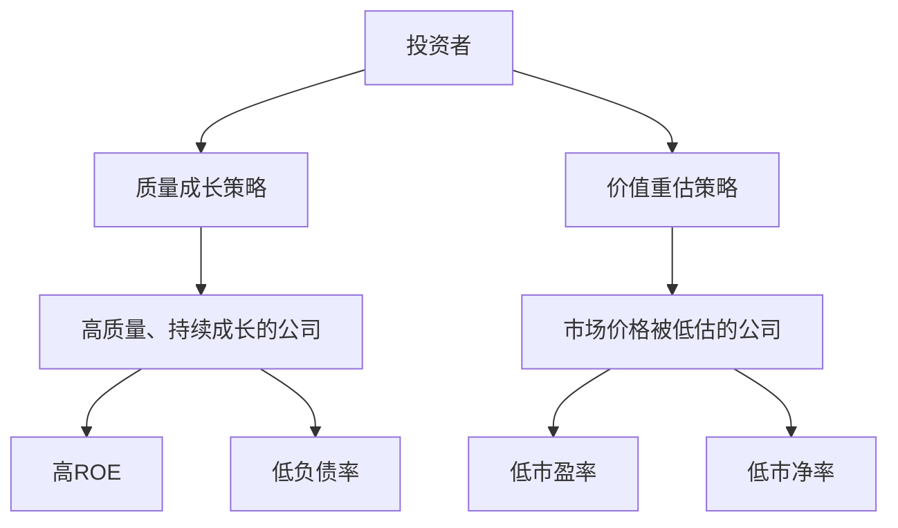
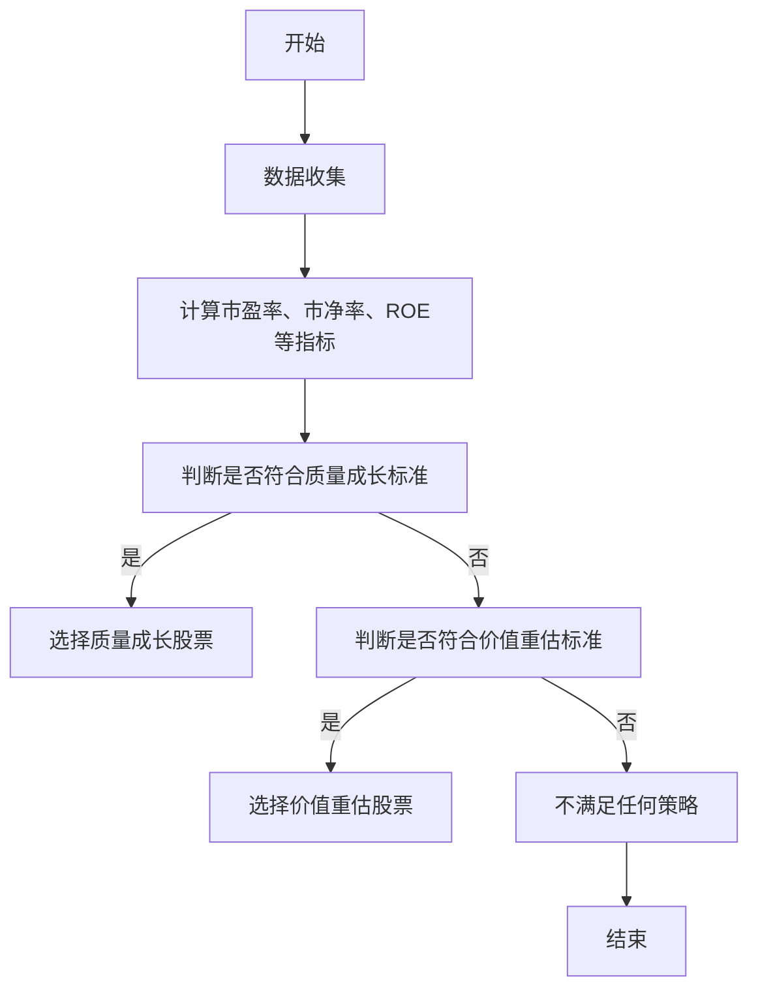

                 

# 彼得林奇的"质量成长"vs"价值重估"在不同市值段的应用比较

> 关键词：彼得·林奇，质量成长，价值重估，市值段，投资策略，投资组合优化

> 摘要：本文通过深入分析彼得·林奇提出的“质量成长”与“价值重估”两种投资策略，探讨它们在不同市值段（小盘股、中盘股、大盘股）中的应用差异与组合优化。文章首先介绍两种策略的核心概念与特点，然后通过对比分析，展示它们在不同市值段中的适用场景与潜在收益。接着，结合数学模型与算法，详细阐述两种策略的实现过程，并通过实际案例分析，验证其在不同市值段中的有效性。最后，总结出一套基于市值段的质量成长与价值重估策略的优化组合方案，为投资者提供实践指导。

---

# 第一部分：质量成长与价值重估的核心概念

## 第1章：质量成长与价值重估的定义与特点

### 1.1 质量成长策略的定义与特点

#### 1.1.1 质量成长策略的定义
质量成长策略是一种专注于投资那些具备稳定增长潜力、良好基本面和较强竞争优势的公司。这种策略强调公司质量（如高ROE、低负债、稳定的现金流）和成长性（如收入和利润的持续增长）的结合，旨在通过长期持有优质资产实现资本增值。

#### 1.1.2 质量成长策略的核心要素
- **高质量的管理层**：公司管理层具备良好的声誉和长期的行业经验。
- **稳定的现金流**：公司具备持续产生现金流的能力。
- **低负债率**：公司财务杠杆较低，财务风险可控。
- **高ROE（净资产收益率）**：公司盈利能力强，股东权益回报率高。
- **行业龙头地位**：公司在所在行业中具备领先地位和竞争优势。

#### 1.1.3 质量成长策略与传统投资策略的区别
- **区别于价值投资**：价值投资注重寻找市场价格低于内在价值的股票，而质量成长策略更关注公司的成长性和质量。
- **区别于投机交易**：质量成长策略强调长期持有的稳定性，而非短期价格波动。

### 1.2 价值重估策略的定义与特点

#### 1.2.1 价值重估策略的定义
价值重估策略是一种寻找市场价格被低估的股票的投资策略。这种策略的核心在于识别市场价格与内在价值之间存在较大差距的公司，通过长期持有这些股票，等待市场重新估值带来的资本增值。

#### 1.2.2 价值重估策略的核心要素
- **低市盈率（P/E）**：市场价格相对于公司盈利水平较低。
- **低市净率（P/B）**：市场价格相对于公司资产价值较低。
- **高股息率**：公司股息支付率较高，表明公司具备较强的盈利能力和分红能力。
- **行业周期性**：通常在行业周期低谷时，更容易发现被低估的价值股。
- **公司基本面稳定**：公司具备稳定的收入和利润，财务风险可控。

#### 1.2.3 价值重估策略与传统投资策略的区别
- **区别于成长投资**：价值投资注重价格的低估，而成长投资注重公司的成长潜力。
- **区别于指数投资**：价值投资强调个股选择，而非被动跟踪市场指数。

### 1.3 质量成长与价值重估的对比分析

#### 1.3.1 对比分析表格

| 对比维度       | 质量成长策略                         | 价值重估策略                         |
|----------------|--------------------------------------|--------------------------------------|
| 核心目标       | 寻找高质量、持续成长的公司             | 寻找市场价格被低估的公司               |
| 适用场景       | 市场稳定，成长性较强的行业             | 市场低估，周期性低谷行业               |
| 投资期限       | 长期持有，注重公司长期成长             | 中长期持有，等待市场重新估值           |
| 风险偏好       | 中等风险，注重质量和稳定性             | 较低风险，注重安全性和估值修复         |
| 适用市值段     | 中盘股和大盘股为主                   | 小盘股和中盘股为主                   |

#### 1.3.2 质量成长与价值重估的ER实体关系图

---

## 第2章：质量成长与价值重估的数学模型与算法

### 2.1 质量成长策略的数学模型

#### 2.1.1 市盈率（P/E）计算公式
$$ \text{市盈率} = \frac{\text{股价}}{\text{每股净利润}} $$

#### 2.1.2 内在价值计算公式
$$ \text{内在价值} = \frac{\text{净利润} \times (1 + g)}{\text{折现率} - g} $$
其中，$g$为净利润增长率。

#### 2.1.3 质量成长策略的筛选标准
1. 市盈率低于行业平均水平。
2. 净利润增长率大于5%。
3. 净资产收益率（ROE）高于15%。
4. 负债率低于50%。

### 2.2 价值重估策略的数学模型

#### 2.2.1 低市盈率筛选公式
$$ \text{低市盈率} = \frac{\text{股价}}{\text{每股净利润}} < 15 $$

#### 2.2.2 低市净率筛选公式
$$ \text{低市净率} = \frac{\text{股价}}{\text{每股净资产}} < 2 $$

#### 2.2.3 股价与盈利修正公式
$$ \text{修正股价} = \text{股价} \times (1 + \text{盈利增长率}) $$

### 2.3 质量成长与价值重估策略的算法流程图

---

## 第3章：市值段划分与策略选择

### 3.1 市值段的划分标准

#### 3.1.1 小盘股
- 市值范围：$100 million - $2 billion
- 特点：成长性强，但波动性大，适合价值重估策略。

#### 3.1.2 中盘股
- 市值范围：$2 billion - $10 billion
- 特点：兼具成长性和稳定性，适合质量成长策略。

#### 3.1.3 大盘股
- 市值范围：$10 billion以上
- 特点：稳定性高，适合质量成长策略，但价值重估机会较少。

### 3.2 不同市值段的策略选择

#### 3.2.1 小盘股的价值重估机会
- 小盘股通常在行业周期低谷时被低估，适合价值重估策略。
- 例如：某小型制造企业在行业不景气时，市盈率仅为10，远低于行业平均水平，具备价值重估潜力。

#### 3.2.2 中盘股的质量成长潜力
- 中盘股在行业稳步增长时，具备较高的ROE和稳定的现金流，适合质量成长策略。
- 例如：某中型科技公司在过去5年中，净利润年均增长15%，ROE稳定在20%以上。

#### 3.2.3 大盘股的质量成长稳定性
- 大盘股通常为行业龙头，具备稳定的现金流和市场地位，适合长期持有的质量成长策略。
- 例如：某大型公用事业公司在过去10年中，每年净利润增长5%，ROE保持在15%以上。

---

## 第4章：基于市值段的质量成长与价值重估策略

### 4.1 小盘股的价值重估策略

#### 4.1.1 策略实施步骤
1. 收集小盘股的财务数据，计算市盈率、市净率等指标。
2. 筛选出市盈率低于行业平均水平且盈利稳定的公司。
3. 对筛选出的公司进行基本面分析，确认其具备稳定盈利能力和较低财务风险。
4. 构建投资组合，定期跟踪公司财务状况和股价表现。

#### 4.1.2 实际案例分析
- 某小盘制造企业，市盈率10，行业平均水平15，净利润稳定增长，具备价值重估潜力。
- 投资者在该企业股价被低估时介入，等待市场重新估值带来的股价上升。

### 4.2 中盘股的质量成长策略

#### 4.2.1 策略实施步骤
1. 收集中盘股的财务数据，计算ROE、净利润增长率等指标。
2. 筛选出ROE高于15%且净利润年均增长超过10%的公司。
3. 对筛选出的公司进行行业地位和竞争优势分析，确认其具备持续成长潜力。
4. 构建投资组合，长期持有优质成长股。

#### 4.2.2 实际案例分析
- 某中型科技公司，ROE稳定在20%，净利润年均增长15%，行业地位稳固，具备较强竞争优势。
- 投资者在该企业处于成长期时介入，长期持有，享受公司成长带来的股价上涨。

### 4.3 大盘股的质量成长稳定性

#### 4.3.1 策略实施步骤
1. 收集大盘股的财务数据，计算ROE、负债率等指标。
2. 筛选出ROE稳定在15%以上且负债率低于50%的公司。
3. 对筛选出的公司进行行业地位和财务稳定性分析，确认其具备长期持有的安全性。
4. 构建投资组合，长期持有优质大盘股。

#### 4.3.2 实际案例分析
- 某大型公用事业公司，ROE稳定在15%，负债率低于50%，行业地位稳固，具备长期持有的安全性。
- 投资者在该企业稳定增长时介入，长期持有，享受稳定收益。

---

## 第5章：总结与展望

### 5.1 总结
质量成长策略和价值重估策略在不同市值段中的应用各有优劣，投资者应根据市场环境和自身风险偏好选择合适的策略。小盘股适合价值重估策略，中盘股和大盘股适合质量成长策略。通过合理搭配这两种策略，投资者可以在不同市场环境下实现资产的稳健增长。

### 5.2 未来展望
随着市场环境的变化，质量成长和价值重估策略的应用也将不断演变。未来，投资者需要更加注重对公司基本面的深入分析，结合人工智能和大数据技术，优化投资决策。同时，随着市场的国际化和多元化，跨市场、跨行业的投资策略也将成为未来的重要方向。

---

# 附录

## 附录A：术语表
- 质量成长策略：注重公司质量和成长性的投资策略。
- 价值重估策略：寻找市场价格被低估的股票的投资策略。
- 市值段：根据公司市值大小划分的股票类别，通常包括小盘股、中盘股和大盘股。

## 附录B：参考文献
1. 彼得·林奇，《彼得·林奇的成功投资策略》
2. 价值投资经典理论，《 Warren Buffett 的投资哲学》
3. 质量成长策略，《Growth at Reasonable Price (GRP) Strategy》

---

# 作者

作者：AI天才研究院/AI Genius Institute & 禅与计算机程序设计艺术 /Zen And The Art of Computer Programming

