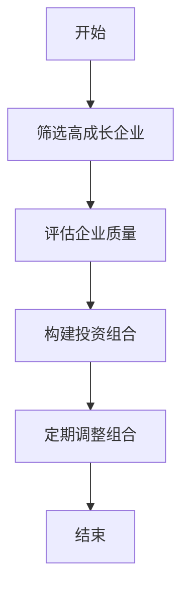
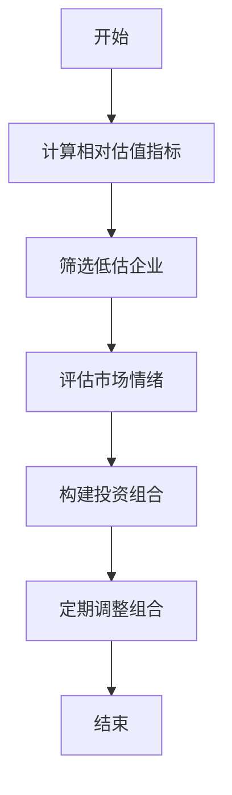
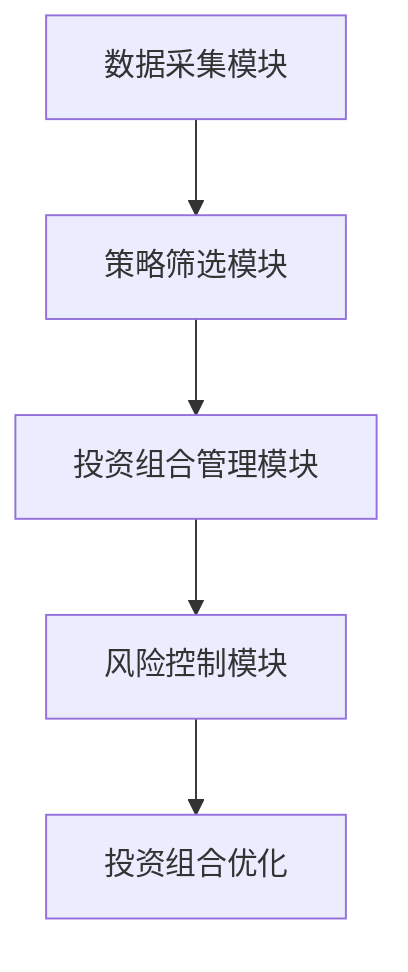
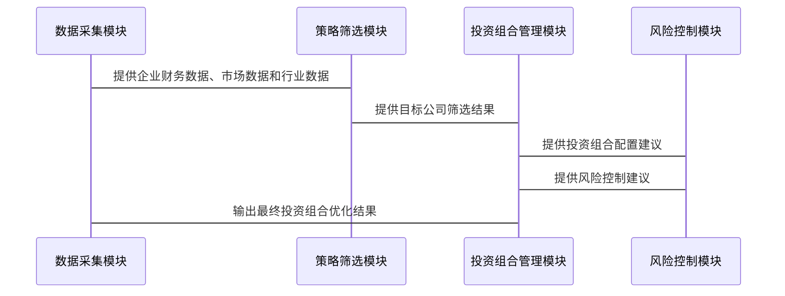

                 


# 彼得林奇的"质量成长"vs"价值重估"在不同行业的应用

> 关键词：彼得林奇、质量成长、价值重估、投资策略、行业应用、投资组合、风险控制  
> 摘要：本文深入探讨了彼得林奇提出的“质量成长”和“价值重估”两种投资策略，分析了它们在不同行业中的应用，结合理论与实战案例，为投资者提供系统性的指导。文章从策略背景、核心概念、算法原理、系统架构、项目实战到最佳实践，层层展开，旨在帮助读者全面理解并有效应用这两种投资策略。

---

## 第一部分: 彼得林奇的"质量成长"与"价值重估"投资策略概述

### 第1章: 彼得林奇投资策略的背景与核心理念

#### 1.1 彼得林奇及其投资哲学

彼得·林奇（Peter Lynch）是美国著名的职业基金经理，曾管理富达麦哲伦基金（Fidelity Magellan Fund）长达13年，创造了年均19.2%的复合回报率，成为全球最负盛名的基金经理之一。他的投资哲学以“逆市场思维”和“深入研究企业基本面”为核心，强调长期投资、价值发现和风险控制。

彼得林奇的投资理念可以概括为“买企业，不是买股票”。他主张通过深入研究企业的基本面，寻找那些具有持续成长潜力和合理估值的公司进行投资。他将这种投资方法总结为两大类：**质量成长**和**价值重估**。

#### 1.2 "质量成长"与"价值重估"的定义与区别

- **质量成长**：  
  质量成长策略的核心在于投资那些业绩稳定增长、质地优良、行业地位稳固的公司。这类公司通常具有较高的ROE（净资产收益率）、稳定的现金流和持续的收入增长。彼得林奇认为，质量成长型公司是那些能够持续扩大市场份额、提高利润率，并在经济周期波动中表现相对稳定的公司。

- **价值重估**：  
  价值重估策略则是寻找那些被市场低估的公司。这些公司可能因为市场情绪、行业周期或其他外部因素而导致股价低于其内在价值。彼得林奇擅长在市场低迷期或行业低谷时，发现这些被低估的公司，并在市场情绪好转时获利。

两者的主要区别在于：  
- 质量成长注重企业的内在成长潜力和稳定性；  
- 价值重估注重市场的外部估值偏差和价格修复机会。

#### 1.3 质量成长与价值重估的核心要素对比

| **核心要素**       | **质量成长**                         | **价值重估**                         |
|--------------------|--------------------------------------|--------------------------------------|
| **投资目标**       | 寻找具有持续成长潜力的企业           | 寻找被市场低估的优质企业             |
| **关注指标**       | 营收增长率、净利润增长率、ROE         | 市盈率（P/E）、市净率（P/B）、股息率   |
| **适用场景**       | 市场稳定或上升期                     | 市场低迷或行业低谷期                 |
| **风险承受**       | 较低风险（成长性提供缓冲）           | 较高风险（估值修复的不确定性）         |
| **持有期限**       | 中长期（等待成长兑现）               | 中短期（等待市场修复估值）             |

---

### 第2章: 质量成长与价值重估的理论基础与对比分析

#### 2.1 投资学基础理论

- **质量成长的理论基础**：  
  质量成长策略基于“价值发现”的投资理念，强调企业的内在价值与成长潜力。其理论基础包括：  
  1. **资本资产定价模型（CAPM）**：用于评估企业的内在价值和合理估值。  
  2. **基本分析（Fundamental Analysis）**：通过对企业财务报表的分析，评估企业的盈利能力、成长性和抗风险能力。  

- **价值重估的理论基础**：  
  价值重估策略基于“价格修复”的投资理念，强调市场定价的偏差与修复。其理论基础包括：  
  1. **相对估值法**：通过比较市盈率、市净率等指标，寻找被低估的公司。  
  2. **市场情绪分析**：通过分析市场情绪，寻找价格偏离价值的公司。  

#### 2.2 质量成长与价值重估的对比分析

- **目标公司类型对比**：  
  - 质量成长策略关注的是那些具有持续增长潜力的公司，通常属于朝阳行业或市场领导者。  
  - 价值重估策略关注的是那些被市场低估的公司，可能属于夕阳行业或周期性行业。  

- **风险与收益对比**：  
  - 质量成长策略的风险较低，收益相对稳定，适合长期投资者。  
  - 价值重估策略的风险较高，收益波动较大，但潜在回报也更高，适合短期投资者。  

- **适用场景对比**：  
  - 质量成长策略适合市场稳定或上升期，经济周期处于复苏或繁荣阶段。  
  - 价值重估策略适合市场低迷或行业低谷期，经济周期处于衰退阶段。  

#### 2.3 质量成长与价值重估的综合应用

- **互补性**：  
  两种策略并非完全对立，而是相辅相成。例如，在市场整体低迷时，可以通过价值重估策略寻找被低估的公司；在市场稳定时，可以通过质量成长策略寻找具有持续增长潜力的企业。  

- **动态调整**：  
  投资者可以根据市场环境的变化，灵活调整两种策略的权重。例如，在经济周期波动较大时，可以增加价值重估策略的比重；在经济周期稳定时，可以增加质量成长策略的比重。  

---

## 第二部分: 质量成长与价值重估的算法与系统分析

### 第3章: 质量成长策略的算法原理

#### 3.1 质量成长策略的核心算法

质量成长策略的核心算法是通过筛选具有高成长潜力的企业，具体步骤如下：

1. **筛选高成长企业**：  
   - 营收增长率 > 行业平均营收增长率  
   - 净利润增长率 > 行业平均净利润增长率  
   - ROE > 行业平均ROE  

2. **评估企业质量**：  
   - 市场地位（行业龙头或具有竞争优势）  
   - 财务健康状况（低负债率、高现金流）  
   - 管理团队稳定性  

3. **构建投资组合**：  
   - 根据企业的成长潜力和质量，分配权重（如：高成长企业权重较高）  
   - 定期调整组合，保持策略的有效性  

#### 3.2 质量成长策略的Mermaid流程图



#### 3.3 质量成长策略的Python代码示例

```python
import pandas as pd

# 假设df是包含财务数据的DataFrame，包括营收增长率、净利润增长率、ROE等指标
def quality_growth_screening(df):
    # 行业平均营收增长率
    industry_avg_revenue_growth = df.groupby('行业')['营收增长率'].mean()
    # 行业平均净利润增长率
    industry_avg_net_profit_growth = df.groupby('行业')['净利润增长率'].mean()
    # 行业平均ROE
    industry_avg_roe = df.groupby('行业')['ROE'].mean()

    # 筛选条件：营收增长率 > 行业平均营收增长率，净利润增长率 > 行业平均净利润增长率，ROE > 行业平均ROE
    mask = (df['营收增长率'] > industry_avg_revenue_growth[df['行业']]) & \
           (df['净利润增长率'] > industry_avg_net_profit_growth[df['行业']]) & \
           (df['ROE'] > industry_avg_roe[df['行业']])
    
    return df[mask]

# 示例使用
data = {
    '行业': ['科技', '消费', '科技', '消费'],
    '营收增长率': [25, 10, 15, 8],
    '净利润增长率': [18, 5, 12, 3],
    'ROE': [15, 8, 10, 6]
}
df = pd.DataFrame(data)
result = quality_growth_screening(df)
print(result)
```

---

### 第4章: 价值重估策略的算法原理

#### 4.1 价值重估策略的核心算法

价值重估策略的核心算法是通过筛选被市场低估的公司，具体步骤如下：

1. **计算相对估值指标**：  
   - 市盈率（P/E）= 股价 / 每股净利润  
   - 市净率（P/B）= 股价 / 每股净资产  
   - 股息率（Dividend Yield）= 每股股息 / 股价  

2. **筛选低估企业**：  
   - P/E < 行业平均P/E  
   - P/B < 行业平均P/B  
   - 股息率 > 行业平均股息率  

3. **评估市场情绪**：  
   - 市场情绪指标（如：恐慌指数、投资者情绪指数）  

4. **构建投资组合**：  
   - 根据低估程度和市场情绪，分配权重（如：低估程度越高，权重越高）  
   - 定期调整组合，捕捉市场修复机会  

#### 4.2 价值重估策略的Mermaid流程图



#### 4.3 价值重估策略的Python代码示例

```python
import pandas as pd

# 假设df是包含股票数据的DataFrame，包括P/E、P/B、股息率等指标
def value_revaluation_screening(df):
    # 行业平均P/E
    industry_avg_pe = df.groupby('行业')['P/E'].mean()
    # 行业平均P/B
    industry_avg_pb = df.groupby('行业')['P/B'].mean()
    # 行业平均股息率
    industry_avg_dividend_yield = df.groupby('行业')['股息率'].mean()

    # 筛选条件：P/E < 行业平均P/E，P/B < 行业平均P/B，股息率 > 行业平均股息率
    mask = (df['P/E'] < industry_avg_pe[df['行业']]) & \
           (df['P/B'] < industry_avg_pb[df['行业']]) & \
           (df['股息率'] > industry_avg_dividend_yield[df['行业']])
    
    return df[mask]

# 示例使用
data = {
    '行业': ['科技', '消费', '科技', '消费'],
    'P/E': [15, 12, 10, 8],
    'P/B': [2.5, 2, 1.8, 1.5],
    '股息率': [1.5, 2, 1, 1.2]
}
df = pd.DataFrame(data)
result = value_revaluation_screening(df)
print(result)
```

---

## 第三部分: 不同行业的应用与案例分析

### 第5章: 科技行业的质量成长与价值重估策略

#### 5.1 科技行业背景与特点

科技行业是一个典型的高成长行业，技术创新快、市场变化剧烈。适合质量成长策略，因为科技公司通常具有高营收增长率和高净利润增长率。同时，科技行业的周期性较强，适合价值重估策略在市场低迷时的应用。

#### 5.2 科技行业中的质量成长策略

- **案例分析**：假设我们投资于一家科技公司，其营收增长率为25%，净利润增长率为18%，ROE为15%，均高于行业平均水平。我们可以通过质量成长策略将其纳入投资组合，并长期持有，等待其成长潜力的兑现。

#### 5.3 科技行业中的价值重估策略

- **案例分析**：假设科技行业整体市盈率为15，而某家科技公司的市盈率为10，市净率为2，股息率为1.5%，均低于行业平均水平。我们可以通过价值重估策略将其纳入投资组合，并在市场情绪好转时卖出，获得超额收益。

---

### 第6章: 消费行业的质量成长与价值重估策略

#### 6.1 消费行业背景与特点

消费行业是一个相对稳定的行业，需求刚性、市场进入壁垒低。适合质量成长策略，因为消费公司通常具有稳定的现金流和较高的ROE。同时，消费行业的周期性较强，适合价值重估策略在市场低迷时的应用。

#### 6.2 消费行业中的质量成长策略

- **案例分析**：假设我们投资于一家消费公司，其营收增长率为10%，净利润增长率为5%，ROE为8%，均高于行业平均水平。我们可以通过质量成长策略将其纳入投资组合，并长期持有，等待其成长潜力的兑现。

#### 6.3 消费行业中的价值重估策略

- **案例分析**：假设消费行业整体市盈率为12，而某家消费公司的市盈率为9，市净率为1.5，股息率为2%，均低于行业平均水平。我们可以通过价值重估策略将其纳入投资组合，并在市场情绪好转时卖出，获得超额收益。

---

### 第7章: 医疗行业的质量成长与价值重估策略

#### 7.1 医疗行业背景与特点

医疗行业是一个需求刚性、增长稳定的行业，适合质量成长策略，因为医疗公司通常具有稳定的现金流和较高的ROE。同时，医疗行业的周期性较弱，适合价值重估策略在市场低迷时的应用。

#### 7.2 医疗行业中的质量成长策略

- **案例分析**：假设我们投资于一家医疗公司，其营收增长率为15%，净利润增长率为12%，ROE为10%，均高于行业平均水平。我们可以通过质量成长策略将其纳入投资组合，并长期持有，等待其成长潜力的兑现。

#### 7.3 医疗行业中的价值重估策略

- **案例分析**：假设医疗行业整体市盈率为18，而某家医疗公司的市盈率为12，市净率为1.2，股息率为2.5%，均低于行业平均水平。我们可以通过价值重估策略将其纳入投资组合，并在市场情绪好转时卖出，获得超额收益。

---

## 第四部分: 投资策略的系统架构与最佳实践

### 第8章: 质量成长与价值重估策略的系统架构设计

#### 8.1 系统功能设计

- **数据采集模块**：采集企业财务数据、市场数据和行业数据。  
- **策略筛选模块**：根据质量成长和价值重估的策略，筛选目标公司。  
- **投资组合管理模块**：根据筛选结果，构建投资组合，并进行动态调整。  
- **风险控制模块**：监控投资组合的风险，制定风险对冲策略。  

#### 8.2 系统架构设计



#### 8.3 系统接口设计

- **输入接口**：企业财务数据、市场数据和行业数据。  
- **输出接口**：目标公司筛选结果、投资组合配置建议、风险控制建议。  

#### 8.4 系统交互流程



---

### 第9章: 质量成长与价值重估策略的最佳实践

#### 9.1 最佳实践

- **动态调整策略**：根据市场环境的变化，灵活调整质量成长和价值重估策略的权重。  
- **分散投资**：通过分散投资降低风险，避免过度集中于单一策略或行业。  
- **长期视角**：质量成长策略需要长期持有，价值重估策略需要耐心等待市场修复。  

#### 9.2 注意事项

- **避免过度交易**：频繁交易会增加交易成本和税收负担。  
- **关注行业周期**：不同行业的周期性不同，需根据行业特点选择策略。  
- **保持风险控制**：通过多样化和分散投资降低风险，避免单一投资过于集中。  

#### 9.3 小结

质量成长与价值重估策略各有优劣，投资者应根据市场环境和自身风险承受能力，灵活运用这两种策略。在实际投资中，可以通过系统化的方法，将这两种策略结合起来，构建一个高效的投资组合。

---

## 第五部分: 结语与拓展阅读

### 第10章: 结语

彼得林奇的“质量成长”与“价值重估”策略为我们提供了一个全面的投资框架，帮助我们在不同行业和市场环境中找到投资机会。这两种策略并非对立，而是相辅相成，投资者可以根据市场变化和自身需求，灵活运用这两种策略，构建一个高效的投资组合。

### 第11章: 拓展阅读

- **推荐书籍**：  
  1. 《彼得·林奇的成功投资》（Peter Lynch on Investing）  
  2. 《投资最重要的事情》（The Most Important Thing）  
  3. 《价值投资：从格雷厄姆到巴菲特》（Value Investing: From Graham to Buffett）  

- **推荐网站**：  
  1. [富达投资](https://www.fidelity.com)  
  2. [晨星投资](https://www.morningstar.com)  
  3. [格雷厄姆投资俱乐部](https://www.valueinvestingclub.com)  

---

## 作者信息

作者：AI天才研究院/AI Genius Institute & 禅与计算机程序设计艺术/Zen And The Art of Computer Programming

---

**注**：本文为技术博客文章，内容基于彼得·林奇的投资理念展开，结合实际案例和系统设计，旨在为投资者提供系统的指导和启发。读者在实际投资中需结合市场环境和个人情况，谨慎决策。

