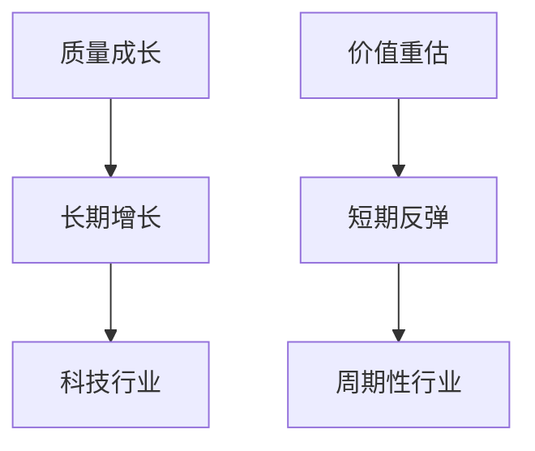
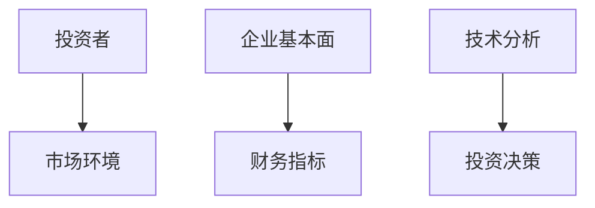
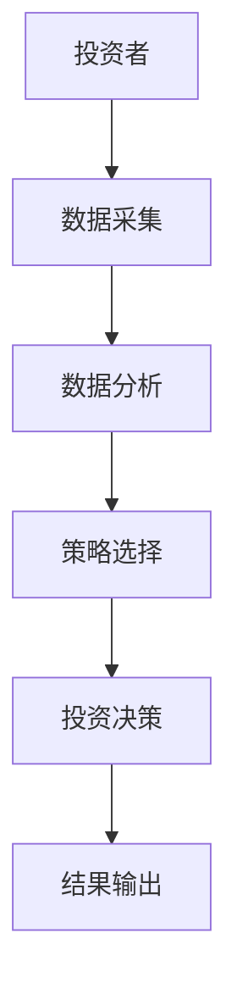

                 


```markdown
# 彼得林奇的"质量成长"vs"价值重估"在新经济中的平衡

> 关键词：彼得·林奇，质量成长，价值重估，投资策略，新经济，平衡点

> 摘要：本文深入探讨了彼得·林奇提出的“质量成长”与“价值重估”两种投资策略在新经济环境中的应用与平衡。通过分析两者的定义、优缺点、适用场景以及在新经济中的表现，结合数学模型和实际案例，为投资者提供科学的投资决策参考。

---

# 第一部分: 引言

## 1.1 彼得·林奇与投资策略概述
### 1.1.1 彼得·林奇的简介
彼得·林奇是美国著名投资经理，以其独特的投资策略闻名。他强调选择优质成长股和低估价值股，注重企业的基本面和长期发展潜力。

### 1.1.2 "质量成长"与"价值重估"的定义
- **质量成长**：投资于具备持续增长潜力的公司，注重企业的盈利能力和市场地位。
- **价值重估**：寻找市场价格低于内在价值的股票，关注被市场低估的机会。

### 1.1.3 新经济背景下的投资策略
新经济环境下，科技和创新成为主导，企业价值的评估需要结合技术和市场变化。

---

## 1.2 本书的目的与结构
### 1.2.1 本书的核心问题
探讨质量成长与价值重估在新经济中的平衡点，找到最优投资策略。

### 1.2.2 本书的结构安排
- 引言：介绍彼得·林奇及其投资策略。
- 质量成长策略：定义、优缺点、适用场景。
- 价值重估策略：定义、优缺点、适用场景。
- 平衡点分析：数学模型、案例对比、系统设计。
- 项目实战：实际案例分析、代码实现、结果解读。

### 1.2.3 本书的阅读方法
建议读者从背景介绍入手，逐步深入理解两种策略，再结合数学模型和实际案例，掌握投资平衡的技巧。

---

# 第二部分: 质量成长策略的核心要素

## 2.1 质量成长的定义与特点
### 2.1.1 质量成长的定义
质量成长是指投资于那些具有持续增长潜力的公司，关注企业的盈利能力和市场地位。

### 2.1.2 质量成长的核心要素
- **盈利能力**：ROE（净资产收益率）>行业平均水平。
- **市场地位**：行业龙头，竞争优势明显。
- **成长潜力**：未来三年收入增长>10%。

### 2.1.3 质量成长与价值重估的对比
- 质量成长：注重长期增长，价格合理。
- 价值重估：注重低估价格，关注短期反弹。

---

## 2.2 质量成长策略的优缺点
### 2.2.1 质量成长的优势
- 稳定增长，风险较低。
- 长期回报较高。

### 2.2.2 质量成长的劣势
- 投资成本高，流动性差。
- 对市场变化敏感。

### 2.2.3 质量成长的适用场景
- 经济复苏期，成长股表现较好。
- 创新行业，技术驱动型企业。

---

## 2.3 质量成长策略在新经济中的应用
### 2.3.1 新经济中的质量成长机会
- 科技创新企业，如人工智能、大数据等领域。
- 具备强大研发能力和市场扩展潜力的企业。

### 2.3.2 质量成长与企业生命周期的关系
- 处于成长期的企业适合质量成长策略。
- 企业生命周期不同阶段需要不同的投资策略。

### 2.3.3 质量成长策略的案例分析
以苹果公司为例，分析其质量成长的特征和投资价值。

---

# 第三部分: 价值重估策略的核心要素

## 3.1 价值重估的定义与特点
### 3.1.1 价值重估的定义
价值重估是指寻找市场价格低于其内在价值的股票，关注被市场低估的机会。

### 3.1.2 价值重估的核心要素
- **低市盈率**：市盈率<行业平均水平。
- **低市净率**：市净率<行业平均水平。
- **高股息率**：股息率>行业平均水平。

### 3.1.3 价值重估与质量成长的对比
- 价值重估：注重低估价格，关注短期反弹。
- 质量成长：注重长期增长，价格合理。

---

## 3.2 价值重估策略的优缺点
### 3.2.1 价值重估的优势
- 投资成本低，流动性好。
- 短期回报潜力大。

### 3.2.2 价值重估的劣势
- 风险较高，容易被市场忽视。
- 需要较强的市场敏感度。

### 3.2.3 价值重估的适用场景
- 经济低迷期，寻找低估机会。
- 周期性行业，如房地产、能源等领域。

---

## 3.3 价值重估策略在新经济中的应用
### 3.3.1 新经济中的价值重估机会
- 受经济周期影响较大的传统行业，如钢铁、煤炭等。
- 周期性波动较大的科技企业，如半导体行业。

### 3.3.2 价值重估与企业生命周期的关系
- 处于衰退期的企业适合价值重估策略。
- 企业生命周期不同阶段需要不同的投资策略。

### 3.3.3 价值重估策略的案例分析
以某钢铁企业为例，分析其价值重估的特征和投资价值。

---

# 第四部分: 新经济中的平衡点分析

## 4.1 质量成长与价值重估的平衡点
### 4.1.1 平衡点的定义
在新经济中，找到质量成长与价值重估的最佳结合点，实现风险与收益的平衡。

### 4.1.2 平衡点的数学模型
通过财务指标分析，构建平衡点的数学模型：

$$
\text{平衡点} = \frac{\text{质量成长潜力} + \text{价值重估潜力}}{2}
$$

### 4.1.3 平衡点的案例分析
以某科技企业为例，分析其在质量成长与价值重估中的平衡点。

---

## 4.2 质量成长与价值重估的对比分析
### 4.2.1 对比表格
| 策略 | 优点 | 缺点 | 适用场景 |
|------|------|------|----------|
| 质量成长 | 稳定增长，风险低 | 投资成本高，流动性差 | 成长期企业，科技行业 |
| 价值重估 | 投资成本低，短期回报高 | 风险高，流动性差 | 低估企业，周期性行业 |

### 4.2.2 对比的mermaid流程图


### 4.2.3 对比的结论
在新经济中，质量成长与价值重估各有优劣，投资者应根据市场环境和企业特点选择合适的策略。

---

## 4.3 新经济中的投资策略选择
### 4.3.1 投资策略的选择标准
- 市场环境：经济周期、行业趋势。
- 企业特点：成长潜力、估值水平。
- 投资目标：风险承受能力、收益预期。

### 4.3.2 投资策略的动态调整
- 定期评估投资组合，根据市场变化调整策略。
- 结合技术分析和基本面分析，优化投资决策。

---

# 第五部分: 数学模型与系统架构设计

## 5.1 数学模型
### 5.1.1 质量成长的财务指标分析
$$
\text{ROE} = \frac{\text{净利润}}{\text{净资产}} 
$$

### 5.1.2 价值重估的回归分析
$$
y = \beta_0 + \beta_1x + \epsilon
$$

## 5.2 系统架构设计
### 5.2.1 投资决策模型


### 5.2.2 系统架构图


---

# 第六部分: 项目实战

## 6.1 环境安装
- 数据分析工具：Python、Pandas、Matplotlib。
- 投资决策模型：构建企业基本面分析和市场趋势分析的代码框架。

## 6.2 核心实现
### 6.2.1 质量成长策略的代码实现
```python
import pandas as pd
import numpy as np

def quality_growth_score(company_data):
    # 计算ROE
    roe = company_data['净利润'] / company_data['净资产']
    # 计算收入增长率
    revenue_growth = (company_data['收入增长率'] - company_data['行业收入增长率']).abs()
    # 计算质量成长得分
    score = (roe > np.mean(roe)) & (revenue_growth > 10)
    return score
```

### 6.2.2 价值重估策略的代码实现
```python
import pandas as pd
import numpy as np

def value_revaluation_score(company_data):
    # 计算市盈率
    pe = company_data['市盈率'] / company_data['行业市盈率']
    # 计算市净率
    pb = company_data['市净率'] / company_data['行业市净率']
    # 计算价值重估得分
    score = (pe < 1) | (pb < 1)
    return score
```

## 6.3 案例分析
### 6.3.1 质量成长策略的案例
分析某科技企业的质量成长得分，评估其投资价值。

### 6.3.2 价值重估策略的案例
分析某周期性企业的价值重估得分，评估其投资价值。

---

# 第七部分: 总结与最佳实践

## 7.1 总结
本文探讨了质量成长与价值重估在新经济中的平衡点，通过数学模型和实际案例，为投资者提供了科学的投资决策参考。

## 7.2 最佳实践 tips
- 根据市场环境和企业特点选择投资策略。
- 定期评估投资组合，动态调整策略。
- 结合技术分析和基本面分析，优化投资决策。

## 7.3 小结
质量成长与价值重估各有优劣，投资者应在新经济中找到平衡点，实现风险与收益的最佳结合。

## 7.4 注意事项
- 风险提示：投资有风险，入市需谨慎。
- 数据来源：确保数据的准确性和完整性。

## 7.5 拓展阅读
推荐相关书籍和文章，进一步深入学习投资策略。

---

# 作者：AI天才研究院/AI Genius Institute & 禅与计算机程序设计艺术 /Zen And The Art of Computer Programming
```

