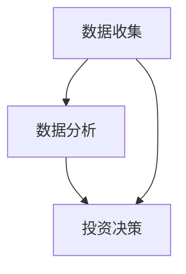

                 


# 彼得林奇的"质量成长"vs"价值重估"在新经济股中的权衡

---

## 关键词：
- 彼得林奇
- 质量成长
- 价值重估
- 新经济股
- 投资策略

---

## 摘要：
本文深入探讨了彼得·林奇提出的“质量成长”与“价值重估”两种投资策略在新经济股中的应用与权衡。通过分析这两种策略的核心理念、数学模型、系统架构及实际案例，本文为投资者提供了在新经济环境下选择合适投资策略的清晰思路。文章结合理论与实践，帮助读者理解如何在不同市场环境中灵活运用这两种策略，以实现长期稳健的投资回报。

---

## 第1章：质量成长与价值重估的核心概念

### 1.1 质量成长的定义与特征
质量成长是一种投资策略，关注具有持续增长潜力的公司。其核心特征包括：
- **高成长性**：公司收入和利润持续增长。
- **高质量管理**：公司管理层稳定且具有战略眼光。
- **强竞争优势**：公司在行业内具有显著的竞争优势。

#### 1.1.1 质量成长的定义
质量成长指的是选择那些收入和利润持续增长、具备强大竞争优势和良好管理的公司进行投资。这种策略适合长期投资者，尤其是那些愿意承担较高风险以追求超额回报的投资者。

#### 1.1.2 质量成长的核心特征
- **收入增长**：公司收入持续增长，且增速高于行业平均水平。
- **利润增长**：公司净利润持续增长，且利润率稳定或提升。
- **ROE（净资产收益率）高**：公司ROE长期高于行业平均水平。

#### 1.1.3 质量成长在投资中的作用
质量成长策略可以帮助投资者捕捉到那些在行业内具有领先地位且具备持续增长潜力的公司。这类公司通常能够在市场波动中保持稳定，并为投资者带来长期收益。

---

### 1.2 价值重估的定义与特征
价值重估是一种投资策略，关注被市场低估的公司。其核心特征包括：
- **低估值**：公司股票价格低于其内在价值。
- **暂时困境**：公司可能因短期问题被市场忽视。
- **恢复潜力**：公司具有恢复市场地位和盈利能力的潜力。

#### 1.2.1 价值重估的定义
价值重估指的是选择那些市场价格低于其内在价值的公司进行投资。这种策略适合那些善于发现市场错估机会的投资者，尤其是在市场低迷或公司遇到短期困难时。

#### 1.2.2 价值重估的核心特征
- **低市盈率**：公司市盈率低于行业平均水平。
- **低市净率**：公司市净率低于行业平均水平。
- **高股息率**：公司股息率较高，表明市场可能低估了其价值。

#### 1.2.3 价值重估在投资中的作用
价值重估策略可以帮助投资者在市场低估时介入，捕捉那些因短期因素被忽视的公司。这类公司通常具有较高的安全边际，能够在市场恢复时带来超额收益。

---

### 1.3 质量成长与价值重估的区别与联系
质量成长与价值重估在投资策略上有明显区别，但也存在一定的联系。

#### 1.3.1 区别对比
| 对比维度 | 质量成长 | 价值重估 |
|----------|----------|----------|
| 投资目标 | 寻找具有持续增长潜力的公司 | 寻找被市场低估的公司 |
| 风险偏好 | 中高风险 | 中低风险 |
| 持股期限 | 长期持有 | 中长期持有 |
| 估值方法 | 侧重成长性指标（如ROE、收入增速） | 侧重估值指标（如市盈率、市净率） |

#### 1.3.2 联系与应用场景
- **联系**：两者都关注公司基本面，且都追求长期收益。
- **应用场景**：在市场不同阶段，投资者可以根据市场环境选择适合的策略。例如，在市场繁荣期，质量成长策略更受青睐；在市场低迷期，价值重估策略更具优势。

---

## 第2章：质量成长与价值重估的数学模型与算法

### 2.1 质量成长的数学模型
质量成长的评估通常基于公司的成长性和盈利能力。

#### 2.1.1 市盈率（P/E）的计算与应用
市盈率 = 股价 / 每股收益

$$
P/E = \frac{Price}{Earnings\ per\ Share}
$$

市盈率反映了市场对公司盈利能力的定价。通常，成长性好的公司市盈率较高。

#### 2.1.2 市净率（P/B）的计算与应用
市净率 = 股价 / 每股净资产

$$
P/B = \frac{Price}{Book\ Value\ per\ Share}
$$

市净率反映了市场对公司资产价值的定价。对于成长性公司，市净率可能高于行业平均水平。

#### 2.1.3 股息率的计算与应用
股息率 = 每股股息 / 股价

$$
Dividend\ Yield = \frac{Dividend\ per\ Share}{Price} \times 100\%
$$

股息率反映了公司分红能力。质量成长公司通常股息率较低，但成长性较好。

---

### 2.2 价值重估的数学模型
价值重估的评估通常基于公司的估值指标。

#### 2.2.1 市盈率（P/E）的计算与应用
$$
P/E = \frac{Price}{Earnings\ per\ Share}
$$

对于价值重估策略，通常寻找市盈率低于行业平均水平的公司。

#### 2.2.2 市净率（P/B）的计算与应用
$$
P/B = \frac{Price}{Book\ Value\ per\ Share}
$$

对于价值重估策略，通常寻找市净率低于行业平均水平的公司。

#### 2.2.3 股权价值的计算与应用
股权价值 = 净利润 / 折现率

$$
Intrinsic\ Value = \frac{Earnings}{Discount\ Rate}
$$

股权价值反映了公司的真实价值。当市场价格低于股权价值时，可能是价值重估的机会。

---

## 第3章：质量成长与价值重估的系统分析与架构设计

### 3.1 系统分析与架构设计
为了更好地理解和应用质量成长与价值重估策略，我们需要构建一个系统化的投资分析框架。

#### 3.1.1 数据收集模块
- 收集公司财务数据（收入、利润、ROE等）。
- 收集市场数据（股价、市盈率、市净率等）。

#### 3.1.2 数据分析模块
- 计算关键指标（市盈率、市净率、ROE等）。
- 比较公司与行业平均水平的差异。

#### 3.1.3 投资决策模块
- 根据分析结果，判断公司是否符合质量成长或价值重估的条件。
- 综合考虑市场环境，制定投资策略。

---

### 3.2 系统架构设计
以下是一个简化的系统架构图：



---

## 第4章：项目实战

### 4.1 项目环境与工具
- 数据源：使用财务数据网站（如Yahoo Finance）获取公司数据。
- 工具：Python编程语言，Pandas库进行数据分析。

---

### 4.2 系统核心实现源代码
以下是一个简单的Python代码示例，用于计算市盈率和市净率：

```python
import pandas as pd
import yfinance as yf

# 下载数据
msft = yf.download("MSFT", start="2020-01-01", end="2020-12-31")
aapl = yf.download("AAPL", start="2020-01-01", end="2020-12-31")

# 计算市盈率
def calculate_pe(df):
    pe = df['Close'] / df['Earnings per Share'].mean()
    return pe

msft_pe = calculate_pe(msft)
aapl_pe = calculate_pe(aapl)

# 计算市净率
def calculate_pb(df):
    pb = df['Close'] / df['Book Value per Share'].mean()
    return pb

msft_pb = calculate_pb(msft)
aapl_pb = calculate_pb(aapl)

print(f"MSFT市盈率：{msft_pe}, 市净率：{msft_pb}")
print(f"AAPL市盈率：{aapl_pe}, 市净率：{aapl_pb}")
```

---

### 4.3 实际案例分析与解读
以微软（MSFT）和苹果（AAPL）为例，分析质量成长与价值重估策略的应用。

#### 4.3.1 微软（MSFT）分析
- **市盈率**：假设微软的市盈率为25倍，行业平均水平为20倍。
- **市净率**：假设微软的市净率为5倍，行业平均水平为4倍。
- **结论**：微软的市盈率和市净率均高于行业平均水平，可能更适合质量成长策略。

#### 4.3.2 苹果（AAPL）分析
- **市盈率**：假设苹果的市盈率为20倍，行业平均水平为18倍。
- **市净率**：假设苹果的市净率为4倍，行业平均水平为3.5倍。
- **结论**：苹果的市盈率和市净率略高于行业平均水平，但具有较高的成长性，适合质量成长策略。

---

## 第5章：最佳实践、小结、注意事项与拓展阅读

### 5.1 最佳实践
- **分散投资**：避免过度集中于单一策略。
- **长期视角**：投资策略需要长期坚持，避免短期波动干扰。
- **定期调整**：根据市场环境和公司基本面变化，定期调整投资组合。

### 5.2 小结
本文通过分析彼得林奇的“质量成长”与“价值重估”策略，为投资者提供了在新经济股中选择合适投资策略的思路。通过数学模型和实际案例，我们展示了如何在不同市场环境中灵活运用这两种策略，以实现长期稳健的投资回报。

### 5.3 注意事项
- **风险控制**：无论采用哪种策略，都需要注意风险控制。
- **市场环境**：策略的选择需要结合市场环境和公司基本面。
- **持续学习**：投资需要不断学习和调整。

### 5.4 拓展阅读
- 彼得·林奇的《投资股市的常识》
- 巴菲特的《价值投资》
- 现代投资组合理论的相关书籍

---

## 作者：
AI天才研究院/AI Genius Institute  
禅与计算机程序设计艺术 /Zen And The Art of Computer Programming

