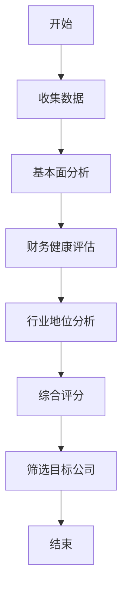
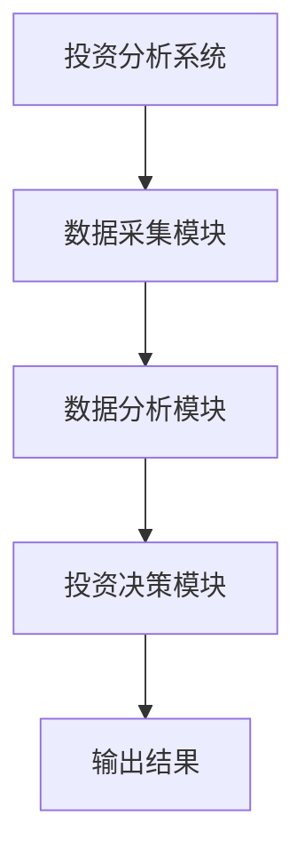
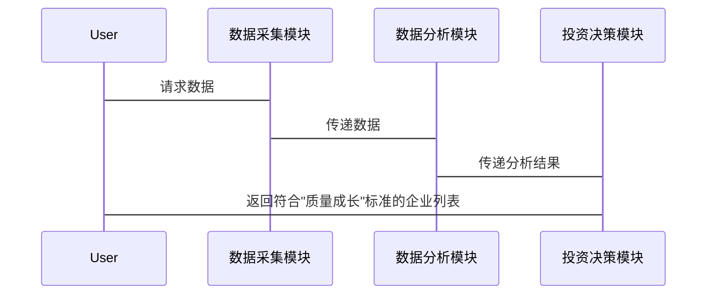

                 


# 彼得林奇的"质量成长"在不同市值公司中的应用

---

## 关键词：彼得林奇，质量成长，投资策略，市值分类，企业分析，算法原理

---

## 摘要：  
本文探讨了彼得林奇的"质量成长"投资策略在不同市值公司中的应用。通过分析小盘股、中盘股和大盘股的特点，本文详细阐述了如何在不同市值规模的公司中识别具有持续增长潜力的企业，并结合数学模型和算法原理，提供了实际的投资策略和系统架构设计方案。文章还通过具体案例分析和Python代码实现，展示了如何将"质量成长"策略应用于实际投资中。

---

# 第一部分: 彼得林奇的"质量成长"投资策略概述

## 第1章: 彼得林奇"质量成长"策略的背景与核心概念

### 1.1 "质量成长"策略的定义与背景

"质量成长"策略是彼得林奇提出的一种投资方法，旨在寻找那些具有持续增长潜力且财务健康、行业地位稳固的企业。这种方法的核心在于平衡企业成长性和财务稳健性，避免过度关注短期收益或高风险企业。

#### 1.1.1 投资策略的基本概念  
- 投资策略定义：通过分析企业的基本面、财务状况和行业地位，寻找具有持续增长潜力的企业进行投资。  
- 策略背景：在传统价值投资和成长投资之间寻找平衡点，避免过度关注市盈率或市净率等短期指标。

#### 1.1.2 彼得林奇投资理念的核心要素  
- 企业基本面分析：包括收入、利润、现金流等财务指标。  
- 公司的财务健康状况：关注资产负债表、利润表和现金流量表的关键指标。  
- 行业地位与竞争优势：分析企业在行业中的市场份额、竞争对手情况和竞争优势。

#### 1.1.3 "质量成长"策略在现代投资中的地位  
- 独特优势：结合了价值投资的稳健性和成长投资的成长性，适用于不同市值规模的公司。  
- 应用范围：不仅适用于小盘股，也适用于中盘股和大盘股。

### 1.2 "质量成长"策略的核心要素

#### 1.2.1 企业的基本面分析  
- 收入增长：关注企业的收入是否持续增长，且增长速度合理。  
- 利润能力：分析净利润率、毛利率等指标，判断企业的盈利能力。  
- 现金流：健康的现金流是企业持续发展的关键。

#### 1.2.2 公司的财务健康状况  
- 资产负债表分析：关注企业的负债水平和资产结构。  
- 利润表分析：分析收入和利润的关系，判断企业的盈利质量。  
- 现金流量表分析：关注经营活动现金流是否为正，判断企业的现金流健康状况。

#### 1.2.3 行业地位与竞争优势  
- 市场份额：企业在行业中的市场份额占比。  
- 竞争对手分析：分析主要竞争对手的优势和劣势。  
- 技术壁垒：企业是否拥有核心技术或专利，形成竞争优势。

### 1.3 "质量成长"策略与传统投资策略的区别

#### 1.3.1 传统价值投资的局限性  
- 传统价值投资注重低市盈率、低市净率等指标，可能忽视企业的成长性。  
- 仅关注估值，忽略企业的基本面和行业地位。

#### 1.3.2 成长投资的优势与风险  
- 成长投资注重企业的成长性，可能忽略估值风险。  
- 高成长性企业可能伴随着高波动性和高风险。

#### 1.3.3 "质量成长"策略的独特性  
- 结合了价值投资的稳健性和成长投资的成长性。  
- 通过综合分析企业的基本面、财务状况和行业地位，寻找具有持续增长潜力的企业。

### 1.4 "质量成长"策略的应用范围

#### 1.4.1 不同市值公司的定义与分类  
- 小盘股：市值较小，通常在1亿到20亿美元之间。  
- 中盘股：市值中等，通常在20亿到100亿美元之间。  
- 大盘股：市值较大，通常在100亿美元以上。  

#### 1.4.2 小盘股、中盘股、大盘股的特点对比  
| 市值规模 | 小盘股 | 中盘股 | 大盘股 |
|---------|--------|--------|--------|
| 特点    | 成长性强，波动性高 | 成长性适中，波动性较低 | 成长性较低，波动性最低 |
| 风险    | 高风险，高回报潜力 | 中等风险，中等回报潜力 | 低风险，稳定回报潜力 |

#### 1.4.3 "质量成长"策略在不同市值公司中的适用性  
- 小盘股：适合寻找具有高增长潜力的企业，但需要谨慎评估财务健康状况。  
- 中盘股：适合寻找具有一定规模且持续增长的企业。  
- 大盘股：适合寻找行业龙头，财务稳健，具有稳定增长潜力的企业。

### 1.5 本章小结  
本章介绍了彼得林奇的"质量成长"策略的核心概念和应用背景，分析了不同市值公司的特点，并探讨了该策略在不同市值公司中的适用性。

---

## 第2章: "质量成长"策略的核心概念与联系

### 2.1 "质量成长"策略的核心原理

#### 2.1.1 企业的持续增长能力  
- 收入和利润的持续增长是企业成长性的关键指标。  
- 现金流的稳定性是企业持续增长的重要保障。

#### 2.1.2 财务健康状况的评估标准  
- 资产负债表：关注企业的负债水平和资产结构。  
- 利润表：分析收入和利润的关系，判断企业的盈利质量。  
- 现金流量表：关注经营活动现金流是否为正，判断企业的现金流健康状况。

#### 2.1.3 行业地位与竞争优势的分析方法  
- 市场份额：企业在行业中的市场份额占比。  
- 竞争对手分析：分析主要竞争对手的优势和劣势。  
- 技术壁垒：企业是否拥有核心技术或专利，形成竞争优势。

### 2.2 核心概念的属性对比表格

| 核心概念       | 小盘股特点 | 中盘股特点 | 大盘股特点 |
|----------------|------------|------------|------------|
| 成长性         | 高         | 中         | 低         |
| 财务稳定性     | 低         | 中         | 高         |
| 市场地位       | 小         | 中         | 大         |
| 竞争优势       | 显著       | 明显       | 绝对        |

### 2.3 ER实体关系图

```mermaid
erd
    Company
    -------
    市值规模
    财务状况
    行业地位
    竞争优势
    市值规模 <--(o--  Company
    财务状况 <--(o--  Company
    行业地位 <--(o--  Company
    竞争优势 <--(o--  Company
```

### 2.4 本章小结  
本章通过对比分析，明确了不同市值公司在"质量成长"策略中的核心概念及其联系，为后续的策略实施提供了理论基础。

---

## 第3章: "质量成长"策略的算法原理与数学模型

### 3.1 算法原理概述

#### 3.1.1 算法步骤  
1. 数据收集：收集目标公司的财务数据、行业数据和市场数据。  
2. 基本面分析：分析企业的收入、利润、现金流等指标。  
3. 财务健康评估：评估企业的资产负债表、利润表和现金流量表。  
4. 行业地位分析：分析企业在行业中的市场份额和竞争优势。  
5. 综合评分：根据各项指标对目标公司进行综合评分，筛选出符合"质量成长"标准的企业。

#### 3.1.2 算法的核心逻辑  
- 综合考虑企业的成长性和财务稳健性，避免单一指标的偏差。  
- 根据不同市值公司的特点，调整评分权重，优化策略效果。

#### 3.1.3 算法的优缺点分析  
- 优点：综合考虑多方面因素，避免单一指标的偏差。  
- 缺点：需要大量数据支持，且评分权重需要根据实际情况调整。

### 3.2 算法的数学模型与公式

#### 3.2.1 市值分类的数学模型  
$$ \text{市值分类} = \begin{cases} \text{小盘股}, & \text{市值 < 20亿美元} \\ \text{中盘股}, & 20 \leq \text{市值} < 100 \text{亿美元} \\ \text{大盘股}, & \text{市值} \geq 100 \text{亿美元} \end{cases} $$

#### 3.2.2 企业基本面分析的数学公式  
$$ \text{成长性评分} = \frac{\text{收入增长率} + \text{净利润增长率}}{2} $$

#### 3.2.3 财务健康状况的数学模型  
$$ \text{财务健康评分} = \frac{\text{净资产收益率} + \text{息税前利润}}{2} $$

### 3.3 算法的mermaid流程图



### 3.4 算法的Python实现

#### 3.4.1 环境安装与配置  
需要安装以下Python库：  
- pandas: 数据处理  
- numpy: 数学计算  
- matplotlib: 可视化

#### 3.4.2 核心代码实现  

```python
import pandas as pd
import numpy as np

# 示例数据
data = {
    '公司': ['A', 'B', 'C'],
    '市值': [15, 50, 120],
    '收入增长率': [0.2, 0.15, 0.1],
    '净利润增长率': [0.15, 0.1, 0.08],
    '净资产收益率': [0.18, 0.15, 0.12],
    '息税前利润': [0.2, 0.18, 0.1]
}

df = pd.DataFrame(data)

# 市值分类
def classify_market_cap(value):
    if value < 20:
        return '小盘股'
    elif 20 <= value < 100:
        return '中盘股'
    else:
        return '大盘股'

df['市值分类'] = df['市值'].apply(classify_market_cap)

# 成长性评分
df['成长性评分'] = (df['收入增长率'] + df['净利润增长率']) / 2

# 财务健康评分
df['财务健康评分'] = (df['净资产收益率'] + df['息税前利润']) / 2

print(df)
```

### 3.5 本章小结  
本章通过数学模型和算法原理，详细讲解了如何在不同市值公司中应用"质量成长"策略，并提供了Python代码实现，帮助读者更好地理解和应用该策略。

---

## 第4章: "质量成长"策略的系统分析与架构设计方案

### 4.1 系统分析与架构设计方案

#### 4.1.1 问题场景介绍  
如何在不同市值公司中筛选出具有持续增长潜力的企业，需要一个高效的投资分析系统。

#### 4.1.2 系统功能设计  
- 数据采集模块：收集目标公司的财务数据、行业数据和市场数据。  
- 数据分析模块：对数据进行处理、分析和评分。  
- 投资决策模块：根据评分结果，筛选出符合"质量成长"标准的企业。

#### 4.1.3 系统架构设计  


#### 4.1.4 系统接口设计  
- 数据接口：与数据源（如股票数据库）连接，获取实时数据。  
- 用户界面：提供友好的用户界面，展示分析结果。

#### 4.1.5 系统交互流程图  


### 4.2 本章小结  
本章通过系统分析与架构设计，展示了如何构建一个高效的投资分析系统，帮助投资者在不同市值公司中应用"质量成长"策略。

---

## 第5章: "质量成长"策略的项目实战

### 5.1 项目实战

#### 5.1.1 环境安装与配置  
需要安装以下Python库：  
- pandas: 数据处理  
- numpy: 数学计算  
- matplotlib: 可视化

#### 5.1.2 系统核心实现源代码  

```python
import pandas as pd
import numpy as np
import matplotlib.pyplot as plt

# 示例数据
data = {
    '公司': ['A', 'B', 'C'],
    '市值': [15, 50, 120],
    '收入增长率': [0.2, 0.15, 0.1],
    '净利润增长率': [0.15, 0.1, 0.08],
    '净资产收益率': [0.18, 0.15, 0.12],
    '息税前利润': [0.2, 0.18, 0.1]
}

df = pd.DataFrame(data)

# 市值分类
def classify_market_cap(value):
    if value < 20:
        return '小盘股'
    elif 20 <= value < 100:
        return '中盘股'
    else:
        return '大盘股'

df['市值分类'] = df['市值'].apply(classify_market_cap)

# 成长性评分
df['成长性评分'] = (df['收入增长率'] + df['净利润增长率']) / 2

# 财务健康评分
df['财务健康评分'] = (df['净资产收益率'] + df['息税前利润']) / 2

# 可视化结果
plt.bar(df['公司'], df['成长性评分'], label='成长性评分')
plt.bar(df['公司'], df['财务健康评分'], label='财务健康评分')
plt.title('公司评分结果')
plt.legend()
plt.show()
```

#### 5.1.3 代码应用解读与分析  
- 数据采集：从数据库或API获取目标公司的财务数据。  
- 数据处理：清洗和转换数据，确保数据的准确性和一致性。  
- 数据分析：根据"质量成长"策略的核心指标，对数据进行评分和分类。  
- 可视化：通过图表展示分析结果，帮助投资者更直观地理解数据。

#### 5.1.4 实际案例分析  
以具体公司为例，展示如何应用"质量成长"策略进行市值分析和投资决策。

### 5.2 本章小结  
本章通过具体案例分析和Python代码实现，展示了如何在实际投资中应用"质量成长"策略，并通过可视化结果帮助投资者更好地理解和应用该策略。

---

## 第6章: "质量成长"策略的最佳实践与注意事项

### 6.1 最佳实践

#### 6.1.1 小结  
"质量成长"策略是一种综合考虑企业成长性和财务稳健性的投资方法，适用于不同市值规模的公司。

#### 6.1.2 注意事项  
- 数据准确性：确保数据来源可靠，避免错误决策。  
- 策略调整：根据市场变化和企业情况，及时调整策略。  
- 风险控制：合理分散投资，避免过度集中。

#### 6.1.3 拓展阅读  
- 《彼得林奇选股法则》  
- 《投资学原理》

### 6.2 本章小结  
本章总结了"质量成长"策略的最佳实践，并提出了投资者在实际应用中需要注意的事项，同时推荐了相关拓展阅读材料。

---

## 作者：AI天才研究院/AI Genius Institute & 禅与计算机程序设计艺术 /Zen And The Art of Computer Programming

---

**感谢您的耐心阅读！**

