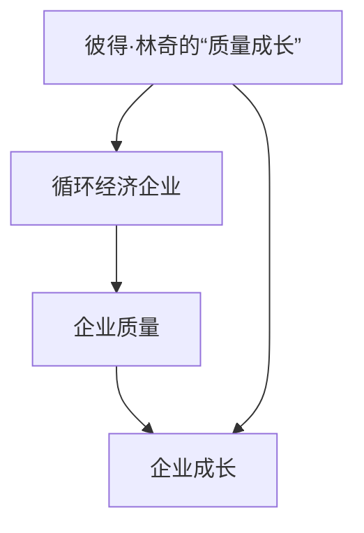
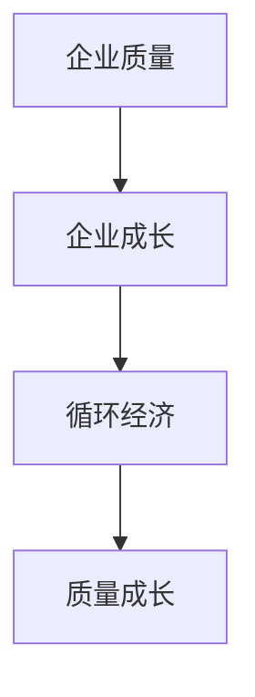
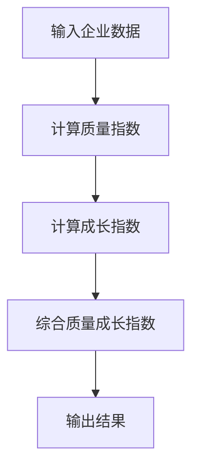
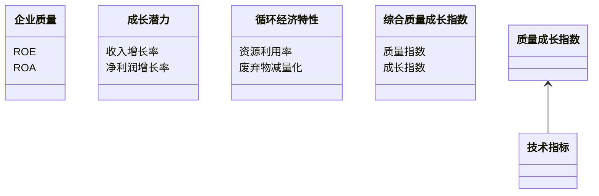
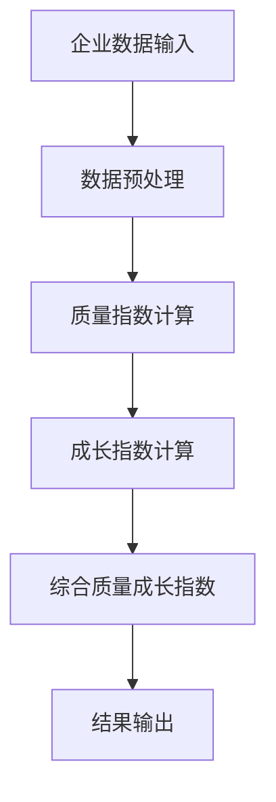

                 


# 彼得林奇的"质量成长"在循环经济企业中的应用

**关键词**：彼得·林奇、质量成长、循环经济、企业评估、投资策略

**摘要**：本文探讨了彼得·林奇的质量成长理论在循环经济企业中的应用，分析了质量成长与循环经济的结合点，探讨了其对企业发展的意义，并结合实际案例进行深入分析。通过系统的理论联系和实践应用，本文旨在为企业提供一种新的视角和方法，以实现可持续发展和投资价值的双重目标。

---

## 正文

### 第一部分：彼得·林奇的“质量成长”理论概述

#### 第1章：彼得·林奇与“质量成长”投资理念

##### 1.1 彼得·林奇及其投资理念
- **1.1.1 彼得·林奇的生平简介**
  彼得·林奇是美国著名投资经理人，以其在富达投资管理公司管理麦哲伦基金期间取得的卓越成绩而闻名。他强调长期投资和价值发现，注重企业的基本面分析，倡导寻找那些具有持续增长潜力的优秀企业。

- **1.1.2 “质量成长”投资策略的核心思想**
  质量成长策略关注那些具备强大竞争优势、良好财务状况和持续增长潜力的企业。林奇认为，投资的关键在于选择能够长期稳定增长的公司，而非短期市场波动。

- **1.1.3 彼得·林奇的成功投资案例**
  林奇在麦哲伦基金期间，成功投资了像可口可乐、迪士尼等企业，这些企业在他的投资组合中表现出色，验证了质量成长策略的有效性。

##### 1.2 循环经济的基本概念与特点
- **1.2.1 循环经济的定义与内涵**
  循环经济是一种以资源高效利用和循环利用为目标的经济模式，强调减少资源消耗和废弃物产生，促进可持续发展。

- **1.2.2 循环经济与传统经济的区别**
  传统经济基于资源的大量消耗和线性生产模式，而循环经济则强调闭环系统，资源在各环节间循环利用，减少对环境的影响。

- **1.2.3 循环经济对企业发展的意义**
  循环经济不仅有助于减少企业成本，还能提升企业的社会责任形象，促进长期可持续发展。

### 第2章：质量成长与循环经济的结合

#### 2.1 质量成长理论在循环经济中的应用背景
- **2.1.1 循环经济发展的现状与挑战**
  当前，全球资源短缺和环境问题日益严重，循环经济成为解决这些问题的重要途径。然而，许多企业在转型过程中面临技术和资金的双重挑战。

- **2.1.2 质量成长理论为企业带来的新机遇**
  质量成长理论强调企业内在质量和持续增长潜力，这与循环经济的目标高度契合。通过投资具备这些特质的企业，投资者可以在支持可持续发展的同时获得长期收益。

#### 2.2 循环经济企业中的质量成长模式
- **2.2.1 循环经济企业的核心特征**
  循环经济企业注重资源高效利用、废弃物减量化和产品循环设计，具备较强的环境适应性和创新能力。

- **2.2.2 质量成长在循环经济中的具体表现**
  在循环经济企业中，质量成长体现在企业的技术创新、市场扩展和可持续发展战略上。例如，某环保科技公司通过研发可再生材料技术，实现了销售额的快速增长。

- **2.2.3 循环经济与质量成长的协同发展**
  两者的协同意味着企业不仅追求经济利益，还注重环境保护和社会责任，这种模式能够吸引长期投资者，提升企业价值。

### 第3章：质量成长与循环经济的理论联系

#### 3.1 质量成长与循环经济的核心概念对比
- **3.1.1 质量成长的核心要素**
  包括企业盈利能力、管理团队、市场地位和竞争优势等方面。

- **3.1.2 循环经济的核心要素**
  包括资源利用效率、环境影响最小化和废弃物资源化利用。

- **3.1.3 两者的核心概念对比分析**
  制作对比表格，清晰展示质量成长和循环经济在核心要素、目标、实施路径等方面的异同。

#### 3.2 质量成长与循环经济的实体关系图


#### 3.3 循环经济企业中的质量成长模型


### 第4章：质量成长在循环经济企业中的算法原理

#### 4.1 循环经济企业的质量评估模型
- **4.1.1 模型的输入变量**
  包括企业质量（如ROE、ROA）、成长潜力（如收入增长率）和循环经济特性（如资源利用率）。

- **4.1.2 模型的输出结果**
  综合质量成长指数，用于评估企业在质量成长和循环经济中的综合表现。

#### 4.2 质量成长评估算法的流程图


#### 4.3 算法实现的Python代码
```python
import pandas as pd

def calculate_quality_growth_index(enterprise_data):
    # 计算质量指数
    quality_index = enterprise_data['ROE'] * 0.4 + enterprise_data['ROA'] * 0.2
    # 计算成长指数
    growth_index = enterprise_data['收入增长率'] * 0.3 + enterprise_data['净利润增长率'] * 0.1
    # 综合质量成长指数
    quality_growth_index = (quality_index + growth_index) * 0.5
    return quality_growth_index

# 示例数据
data = {
    'ROE': [0.15, 0.18, 0.12],
    'ROA': [0.1, 0.12, 0.08],
    '收入增长率': [0.2, 0.15, 0.25],
    '净利润增长率': [0.15, 0.1, 0.2]
}
df = pd.DataFrame(data)
result = calculate_quality_growth_index(df)
print(result)
```

#### 4.4 数学模型和公式
- **ROE（净资产收益率）**：$$ ROE = \frac{\text{净利润}}{\text{股东权益}} $$
- **ROA（资产回报率）**：$$ ROA = \frac{\text{净利润}}{\text{总资产}} $$
- **质量成长指数计算公式**：$$ QGI = 0.5 \times (0.4 \times ROE + 0.2 \times ROA + 0.3 \times GR + 0.1 \times NGR) $$
  其中，GR为收入增长率，NGR为净利润增长率。

### 第5章：系统分析与架构设计

#### 5.1 问题场景介绍
- 循环经济企业面临资源浪费和环境污染问题，需要通过质量成长策略实现可持续发展。

#### 5.2 系统功能设计
- **领域模型**：使用mermaid类图展示企业质量、成长潜力、循环经济特性之间的关系。



#### 5.3 系统架构设计
- **架构图**：展示系统各模块之间的关系。



### 第6章：项目实战

#### 6.1 环境安装
- 安装Python和相关库（如pandas）。

#### 6.2 系统核心实现源代码
- 如前所述的Python代码。

#### 6.3 代码应用解读与分析
- 使用示例数据，详细解读代码的运行结果，分析哪些企业符合质量成长的条件。

#### 6.4 实际案例分析
- 以某环保企业为例，分析其质量成长指数，评估其投资价值。

#### 6.5 项目小结
- 总结项目实施过程中的经验与教训，提出改进建议。

### 第7章：结论

#### 7.1 全文总结
- 回顾全文内容，强调质量成长与循环经济的结合对企业发展的积极影响。

#### 7.2 未来展望
- 展望质量成长理论在循环经济中的进一步应用，提出未来研究方向。

#### 7.3 学习建议
- 针对读者，提出深入学习和实践的建议。

---

**作者：AI天才研究院/AI Genius Institute & 禅与计算机程序设计艺术 /Zen And The Art of Computer Programming**

---

通过以上结构，文章详细探讨了彼得·林奇的质量成长理论在循环经济企业中的应用，从理论到实践，系统地分析了其在企业评估、投资策略和可持续发展中的重要作用。希望本文能为相关领域的研究和实践提供有价值的参考。

