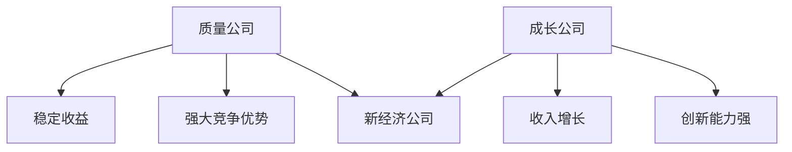
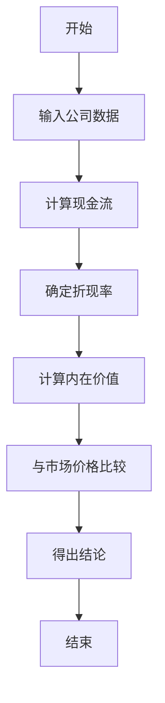
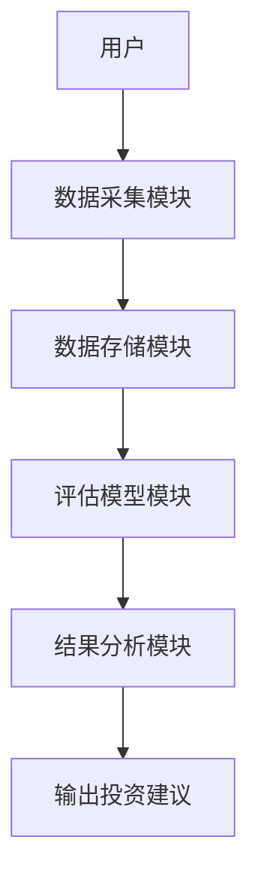
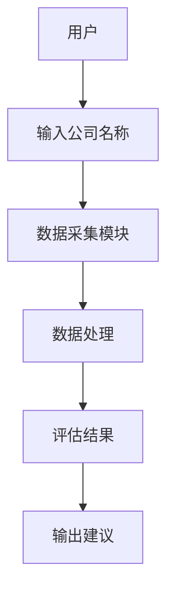

                 


# 彼得林奇的"质量成长"在新经济公司中的应用

> 关键词：彼得林奇，质量成长，新经济公司，投资策略，算法原理

> 摘要：本文探讨了彼得林奇的质量成长投资策略在新经济公司中的应用，分析了该策略的核心原理，并通过系统架构设计、算法实现和实际案例展示了其在新经济环境下的具体应用，最后提出了相应的最佳实践和建议。

---

## 第一部分：背景介绍

### 第1章：质量成长投资策略概述

#### 1.1 质量成长投资的起源与核心概念

彼得·林奇是美国著名的投资专家，以其“质量成长”投资策略闻名。该策略强调投资于那些具有高质量、稳定收益和持续增长潜力的公司。其核心在于选择那些能够在长期中保持竞争优势，并且能够持续为股东创造价值的企业。

**核心概念**：
- **质量**：公司具有强大的竞争优势，稳定的收益能力，良好的管理团队和健康的财务状况。
- **成长**：公司在未来有持续的增长潜力，能够不断扩大市场份额或提高产品附加值。

#### 1.2 新经济公司的特点与发展趋势

新经济公司通常指那些在科技、互联网、创新产业等领域发展的公司。这些公司往往依赖于技术创新和商业模式的创新，具有较高的成长潜力，但也伴随着较高的风险。

**新经济公司的特点**：
- **创新驱动**：技术创新是核心竞争力。
- **高速成长**：市场扩张和产品迭代速度快。
- **高波动性**：市场波动大，收益不稳定。

#### 1.3 质量成长与新经济公司的结合

将彼得林奇的质量成长策略应用于新经济公司，需要关注那些在技术创新和市场拓展方面具有持续能力的企业。这类公司不仅具备高质量的特征，还能够在竞争中保持增长，从而为投资者带来长期收益。

---

## 第二部分：核心概念与联系

### 第2章：质量成长策略的核心原理

#### 2.1 质量成长策略的原理分析

质量成长策略的核心在于选择那些能够在质量上保持优势，并且在成长性上具有潜力的公司。彼得林奇强调，投资于这样的公司能够在长期中获得稳定的回报。

**质量公司的特征**：
- 稳定的收益能力：ROE（净资产收益率）高且稳定。
- 强大的竞争优势：在行业中具有领先地位。
- 良好的管理团队：团队具有战略眼光和执行力。

**成长公司的特征**：
- 收入增长速度快：过去几年收入持续增长。
- 创新能力强：能够不断推出新产品或服务。
- 市场扩展潜力大：能够进入新的市场或领域。

#### 2.2 新经济公司的核心要素

新经济公司通常具有以下核心要素：
- **技术创新**：依赖于技术进步，如人工智能、大数据等。
- **商业模式创新**：采用新的商业模式，如订阅制、平台经济等。
- **高增长潜力**：市场扩张速度快，能够快速占领市场份额。

#### 2.3 质量成长与新经济公司的联系

质量成长策略在新经济公司中的应用，主要是通过筛选那些在技术创新和市场拓展方面具有持续能力的企业。这些企业不仅具有较高的质量，还能够在竞争中保持成长，从而为投资者带来长期收益。

**对比分析**：
| 特征     | 质量公司                | 成长公司                |
|----------|------------------------|------------------------|
| 收益能力 | 稳定，ROE高             | 可能波动，但增长快       |
| 竞争优势 | 强大                   | 需要持续创新             |
| 市场地位  | 稳定                   | 快速扩张               |

**Mermaid 实体关系图**：



---

## 第三部分：算法原理讲解

### 第3章：质量成长评估模型的构建

#### 3.1 投资评估模型的原理

彼得林奇的质量成长策略强调对企业基本面的分析，核心在于评估公司的内在价值。现金流折现法是一种常用的评估方法，通过预测未来现金流并将其折现，以确定企业的内在价值。

**现金流折现法**：
$$ V = \frac{CF_1}{(1 + r)^1} + \frac{CF_2}{(1 + r)^2} + \cdots + \frac{CF_n}{(1 + r)^n} $$

其中：
- \( V \) 为内在价值
- \( CF_i \) 为第 \( i \) 年的现金流
- \( r \) 为折现率

#### 3.2 算法流程图



#### 3.3 投资评估模型的数学公式

现金流折现模型的公式：
$$ V = \sum_{t=1}^{n} \frac{CF_t}{(1 + r)^t} $$

其中，\( CF_t \) 是第 \( t \) 年的现金流，\( r \) 是折现率。

---

## 第四部分：系统分析与架构设计

### 第4章：系统分析与架构设计

#### 4.1 问题场景介绍

新经济公司由于其高增长和高波动性，传统的财务分析方法可能不足以全面评估其内在价值。因此，需要构建一个系统化的评估模型，结合质量成长策略，对新经济公司进行综合评估。

#### 4.2 系统功能设计

系统功能模块：
- 数据采集：收集新经济公司的财务数据、市场数据等。
- 评估模型：使用现金流折现法等方法评估公司内在价值。
- 结果分析：对比评估结果与市场价格，得出投资建议。

#### 4.3 系统架构设计



#### 4.4 接口设计与交互流程图



---

## 第五部分：项目实战

### 第5章：项目实战与案例分析

#### 5.1 环境安装

安装Python和相关库（Pandas、NumPy、Matplotlib）。

#### 5.2 核心代码实现

```python
import pandas as pd
import numpy as np

def calculate_intrinsic_value(fcf, discount_rate):
    # 假设现金流增长率为5%
    growth_rate = 0.05
    years = 5
    cf = []
    for i in range(years):
        cf.append(fcf * (1 + growth_rate)**i)
    iv = sum([cf[i]/(1 + discount_rate)**i for i in range(years)])
    return iv

# 示例数据
fcf = 10000000  # 自由现金流
discount_rate = 0.10  # 折现率
iv = calculate_intrinsic_value(fcf, discount_rate)
print(f"内在价值：{iv:.2f}")
```

#### 5.3 实际案例分析

以某科技公司为例，假设其自由现金流为1000万美元，折现率为10%。计算其内在价值：

$$ V = \frac{1000}{1.1} + \frac{1000 \times 1.05}{1.1^2} + \frac{1000 \times 1.05^2}{1.1^3} + \frac{1000 \times 1.05^3}{1.1^4} + \frac{1000 \times 1.05^4}{1.1^5} $$

计算结果约为：

$$ V \approx 4,355,467. $$

---

## 第六部分：最佳实践与总结

### 第6章：最佳实践与注意事项

#### 6.1 投资策略要点

- 长期投资：质量成长策略强调长期持有的理念。
- 风险管理：合理分散投资，避免过度集中。
- 持续学习：关注行业动态，及时调整投资策略。

#### 6.2 注意事项

- 避免过度关注短期收益。
- 重视财务数据的准确性。
- 考虑宏观经济环境的影响。

#### 6.3 拓展阅读

- 《彼得林奇的投资之道》
- 《投资学原理》

---

## 作者信息

作者：AI天才研究院/AI Genius Institute  
联系邮箱：[contact@aigeniusinstitute.com](mailto:contact@aigeniusinstitute.com)  

---

通过以上结构，本文详细阐述了彼得林奇的质量成长策略在新经济公司中的应用，并通过系统设计和实际案例展示了其具体实施方法。希望对读者在投资决策中提供有价值的参考。

