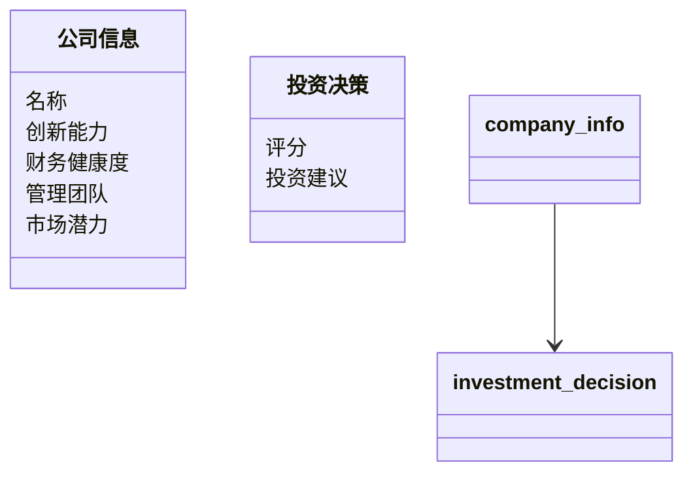
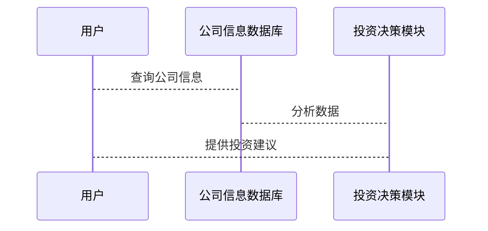

                 


# 彼得林奇的"质量成长"在生物科技初创公司中的应用

## 关键词：
- 彼得林奇
- 质量成长
- 生物科技
- 初创公司
- 投资策略
- 算法模型
- 企业架构

## 摘要：
本文探讨了彼得·林奇的质量成长投资策略在生物科技初创公司中的应用。通过分析质量成长的核心要素，结合生物科技行业的特点，构建了评估模型和数学公式，并通过实际案例展示了策略的有效性。文章还详细介绍了系统架构设计和项目实战，为投资者提供了实用的指导。

---

## 第一部分：背景与基础

### 第1章：质量成长投资的基本概念

#### 1.1 投资策略概述

- **1.1.1 质量成长投资的定义**
  质量成长投资是一种长期投资策略，注重选择具有持续增长潜力、良好管理和强大竞争优势的公司。

- **1.1.2 质量成长投资的核心要素**
  - 高质量的管理层
  - 强大的竞争优势
  - 可持续的财务表现
  - 健康的财务状况

- **1.1.3 质量成长与价值投资的区别**
  - 质量成长投资关注成长性和质量，而价值投资关注低估值。

#### 1.2 生物科技初创公司的特点

- **1.2.1 生物科技行业的独特性**
  - 技术驱动型
  - 高风险高回报
  - 创新密集

- **1.2.2 初创公司的成长模式**
  - 快速迭代
  - 高研发投入
  - 依赖融资

- **1.2.3 生物科技初创公司的风险与机遇**
  - 技术失败风险
  - 市场竞争风险
  - 高增长潜力

#### 1.3 质量成长与生物科技初创公司的结合

- **1.3.1 投资策略的应用场景**
  - 早期发现优质公司
  - 长期价值投资

- **1.3.2 生物科技行业的长期潜力**
  - 人口老龄化需求
  - 技术进步推动

- **1.3.3 初创公司作为投资标的的优势**
  - 高增长潜力
  - 早期投资高回报

---

## 第二部分：核心概念与分析

### 第2章：质量成长投资的原理

#### 2.1 投资策略的核心要素

- **2.1.1 公司基本面分析**
  - 财务状况
  - 管理层质量
  - 竞争优势

- **2.1.2 管理层质量评估**
  - 经验与声誉
  - 战略规划
  - 执行能力

- **2.1.3 行业地位与竞争优势**
  - 市场份额
  - 技术壁垒

#### 2.2 生物科技初创公司的评估维度

- **2.2.1 产品创新性**
  - 技术创新
  - 产品差异化

- **2.2.2 技术壁垒**
  - 专利数量
  - 技术深度

- **2.2.3 市场潜力与团队能力**
  - 市场需求
  - 团队背景

---

## 第三部分：算法原理与数学模型

### 第3章：质量成长评分系统

#### 3.1 质量成长评分系统

- **评分指标**
  - 创新能力（权重30%）
  - 财务健康度（权重30%）
  - 管理团队（权重20%）
  - 市场潜力（权重20%）

- **综合评分计算公式**
  $$ \text{综合评分} = \sum (\text{指标权重} \times \text{指标得分}) $$

- **评分标准**
  - 优秀：≥85分
  - 良好：70-84分
  - 一般：60-69分
  - 合格：50-59分
  - 不合格：<50分

#### 3.2 财务健康度分析

- **财务指标**
  - 净利润
  - 现金流
  - 负债率

- **财务健康度评估模型**
  $$ \text{财务健康度} = \frac{\text{净利润} + \text{现金流}}{\text{总负债}} $$

---

## 第四部分：系统分析与架构设计

### 第4章：系统功能设计

#### 4.1 领域模型



#### 4.2 系统架构设计


#### 4.3 系统接口设计

- **输入接口**
  - 公司信息输入
- **输出接口**
  - 投资决策输出
  - 可视化报告

#### 4.4 系统交互流程



---

## 第五部分：项目实战

### 第5章：环境配置与代码实现

#### 5.1 环境配置

- **Python版本**
  - Python 3.8+

- **依赖库安装**
  - numpy
  - pandas
  - matplotlib

```bash
pip install numpy pandas matplotlib
```

#### 5.2 核心代码实现

```python
import numpy as np
import pandas as pd
import matplotlib.pyplot as plt

# 示例数据
companies = {
    '名称': ['公司A', '公司B', '公司C'],
    '创新能力': [90, 70, 80],
    '财务健康度': [85, 65, 75],
    '管理团队': [90, 80, 70],
    '市场潜力': [80, 70, 90]
}

df = pd.DataFrame(companies)

# 计算综合评分
weights = {'创新能力': 0.3, '财务健康度': 0.3, '管理团队': 0.2, '市场潜力': 0.2}
df['综合评分'] = df[list(weights.keys())].apply(lambda x: sum(w * x for w, x in zip(weights.values(), x)), axis=1)

# 可视化
plt.figure(figsize=(10,6))
plt.bar(df['名称'], df['综合评分'])
plt.title('公司综合评分')
plt.xlabel('公司名称')
plt.ylabel('综合评分')
plt.show()
```

#### 5.3 代码应用解读

- **数据输入**
  - 公司信息数据框

- **计算综合评分**
  - 使用加权平均方法

- **可视化展示**
  - 柱状图展示评分结果

#### 5.4 实际案例分析

- **案例公司分析**
  - 公司A：创新能力高，财务健康，适合投资
  - 公司B：创新能力较低，财务健康一般
  - 公司C：市场潜力大，但创新能力稍低

---

## 第六部分：总结与展望

### 第6章：总结

- **质量成长策略的有效性**
  - 能够筛选出优质公司
  - 提供长期投资价值

- **系统设计的优势**
  - 结构清晰
  - 可扩展性强

### 第6.1章：最佳实践 tips

- **定期评估**
  - 每季度复评公司情况
- **分散投资**
  - 减少风险集中
- **关注管理层**
  - 管理层能力是关键

### 第6.2章：未来展望

- **人工智能辅助**
  - 使用AI优化评估模型
- **大数据分析**
  - 提高评估准确性
- **国际化扩展**
  - 考虑全球生物科技公司

---

## 作者：AI天才研究院/AI Genius Institute & 禅与计算机程序设计艺术/Zen And The Art of Computer Programming

---

**注**：本文为理论与实践相结合的技术博客文章，旨在为生物科技初创公司的投资者和从业者提供有价值的见解和方法。

