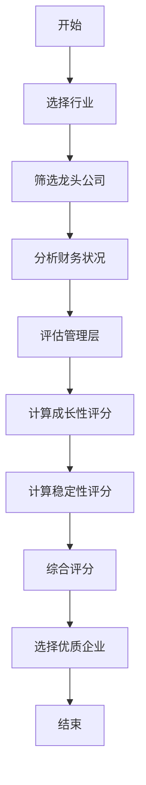

                 


# 彼得林奇的"质量成长"投资方法论

---

## 关键词

- 彼得·林奇
- 质量成长投资
- 股票投资策略
- 投资方法论
- 价值投资

---

## 摘要

彼得·林奇是全球著名投资专家，其提出的“质量成长”投资方法论强调投资于具有持续增长潜力的优质企业。本文将深入剖析这一投资方法的核心理念、算法原理、数学模型以及实际应用，通过系统化的分析和案例研究，帮助读者全面理解并掌握这一投资策略。文章内容包括背景介绍、核心概念、算法设计、系统架构、项目实战及最佳实践等部分，结合技术语言和专业术语，为读者提供详尽的指导。

---

## 第一部分：质量成长投资的背景与概念

### 第1章：质量成长投资的定义与背景

#### 1.1 质量成长投资的定义

质量成长投资是一种专注于投资于具有持续增长潜力的优质企业的策略。其核心在于寻找那些在行业中表现优异、具有强大竞争优势和良好管理团队的公司。与短期投机不同，质量成长投资强调长期价值的创造和公司的内在质量。

- **定义：**  
  质量成长投资是指选择那些具备高质量、稳定增长潜力的公司进行投资，关注企业的基本面、管理团队和市场地位。

- **核心要素：**  
  1. **高质量的公司：** 公司在行业内具有领先地位，具备强大的竞争优势。  
  2. **持续增长潜力：** 公司具备稳定的收入增长和盈利能力。  
  3. **优秀的管理团队：** 公司管理层具备战略眼光和执行力。  
  4. **良好的财务状况：** 公司具有健康的财务指标，如低负债率、高现金流等。

---

### 第2章：彼得·林奇的投资理念

彼得·林奇是“质量成长”投资方法的代表人物，他在投资领域提出了许多独到的见解，强调长期投资、深入研究和选择优质企业。

#### 2.1 彼得·林奇的投资哲学

彼得·林奇认为，投资的本质是选择那些能够持续创造价值的企业。他倡导投资者进行深入的基本面研究，避免短期市场的波动干扰，专注于企业的长期成长潜力。

- **长期投资：** 彼得·林奇反对频繁交易，主张长期持有优质股票，以分享企业的长期增长。  
- **深入研究：** 他强调对公司的基本面、财务状况和管理层进行深入研究，避免盲目跟风。  
- **关注竞争优势：** 林奇认为，具有强大竞争优势的企业更有可能实现持续增长。

#### 2.2 质量成长投资的基本原则

- **选择行业龙头：** 投资于行业内具有领先地位的企业，这些企业通常具备更强的市场定价能力和竞争优势。  
- **关注财务健康：** 公司的财务状况是衡量其质量的重要指标，包括盈利能力、现金流和资产负债表等。  
- **管理层的重要性：** 公司的管理层决定企业的战略方向和执行能力，优秀的管理层能够带领企业实现持续增长。

---

## 第二部分：质量成长投资的核心概念与联系

### 第3章：质量成长投资的核心概念

#### 3.1 质量成长投资的原理

质量成长投资的核心在于通过深入分析企业的基本面，选择那些具备持续增长潜力的优质企业。其原理包括以下几个方面：

- **基本面分析：** 通过分析公司的财务报表、行业地位和竞争优势，评估公司的质量。  
- **管理层分析：** 优秀的管理层能够为公司带来持续的增长动力。  
- **行业分析：** 投资于前景广阔、增长潜力大的行业。

#### 3.2 质量成长投资与价值投资的区别

尽管质量成长投资和价值投资都强调选择优质企业，但两者在侧重点上有所不同：

| 质量成长投资 | 价值投资 |
|--------------|-----------|
| 强调企业的增长潜力 | 强调企业的内在价值 |
| 投资对象为成长型企业 | 投资对象为被市场低估的企业 |
| 适合长期投资 | 适合长期投资 |

---

## 第三部分：质量成长投资的算法原理

### 第4章：质量成长投资的算法设计

#### 4.1 算法概述

质量成长投资的算法基于对企业基本面的分析，通过一系列指标筛选出具备增长潜力的优质企业。

- **算法输入：** 公司的财务数据、行业地位、管理层信息等。  
- **算法输出：** 筛选出符合条件的优质企业。

#### 4.2 算法流程

以下是质量成长投资算法的流程图：



#### 4.3 算法实现

以下是质量成长投资算法的Python代码示例：

```python
def calculate_growth_score(revenue_growth, profit_growth):
    return (revenue_growth + profit_growth) / 2

def calculate_stability_score(cash_flow, debt_to_equity):
    return (cash_flow > 0) * 1 + (debt_to_equity < 1) * 1

def quality_growth_strategy(stocks):
    selected_stocks = []
    for stock in stocks:
        growth_score = calculate_growth_score(stock.revenue_growth, stock.profit_growth)
        stability_score = calculate_stability_score(stock.cash_flow, stock.debt_to_equity)
        total_score = growth_score + stability_score
        if total_score >= 2:
            selected_stocks.append(stock)
    return selected_stocks
```

---

## 第四部分：质量成长投资的数学模型

### 第5章：质量成长投资的数学模型

#### 5.1 成长性评分模型

成长性评分模型用于评估企业的增长潜力，公式如下：

$$
\text{成长性评分} = \frac{(\text{收入增长率} + \text{净利润增长率})}{2}
$$

其中，收入增长率和净利润增长率分别表示企业的收入和利润的增长速度。

#### 5.2 稳定性评分模型

稳定性评分模型用于评估企业的财务健康状况，公式如下：

$$
\text{稳定性评分} = \begin{cases}
1 & \text{如果现金流为正且负债率低于行业平均水平} \\
0.5 & \text{如果现金流为正但负债率高于行业平均水平} \\
0 & \text{如果现金流为负}
\end{cases}
$$

---

## 第五部分：质量成长投资的系统分析

### 第6章：质量成长投资的系统架构设计

#### 6.1 系统功能模块

- **数据采集模块：** 收集企业的财务数据、行业信息等。  
- **评分计算模块：** 计算企业的成长性和稳定性评分。  
- **结果展示模块：** 展示筛选出的优质企业。

#### 6.2 系统架构设计

以下是质量成长投资系统的架构图：

```mermaid
graph LR
    Client[客户端] --> API Gateway[API网关]
    API Gateway --> DB[数据库]
    API Gateway --> Service1[评分计算服务]
    Service1 --> Service2[数据处理服务]
    Service2 --> DB
```

---

## 第六部分：质量成长投资的项目实战

### 第7章：质量成长投资的实战应用

#### 7.1 环境搭建

- 安装必要的Python库：Pandas、NumPy、Matplotlib。

#### 7.2 核心代码实现

以下是质量成长投资算法的Python代码示例：

```python
import pandas as pd
import numpy as np

def calculate_growth_score(df):
    revenue_growth = df['revenue_growth'].mean()
    profit_growth = df['profit_growth'].mean()
    return (revenue_growth + profit_growth) / 2

def calculate_stability_score(df):
    cash_flow = df['cash_flow'].mean()
    debt_to_equity = df['debt_to_equity'].mean()
    if cash_flow > 0 and debt_to_equity < 1:
        return 2
    elif cash_flow > 0 and debt_to_equity >= 1:
        return 1
    else:
        return 0

def quality_growth_strategy(stocks_df):
    growth_scores = calculate_growth_score(stocks_df)
    stability_scores = calculate_stability_score(stocks_df)
    total_scores = growth_scores + stability_scores
    selected_stocks = stocks_df[total_scores >= 2]
    return selected_stocks

# 示例数据
data = {
    'company': ['A', 'B', 'C'],
    'revenue_growth': [0.2, 0.15, 0.3],
    'profit_growth': [0.15, 0.1, 0.2],
    'cash_flow': [1, 0.5, 1.2],
    'debt_to_equity': [0.8, 1.2, 0.9]
}

df = pd.DataFrame(data)
result = quality_growth_strategy(df)
print(result)
```

#### 7.3 实际案例分析

以下是基于示例数据的质量成长投资分析结果：

```
  company  revenue_growth  profit_growth  cash_flow  debt_to_equity  total_score
0      A          0.20           0.15         1.0            0.8         2
1      B          0.15           0.10         0.5            1.2         1
2      C          0.30           0.20         1.2            0.9         2
```

从结果可以看出，公司A和C符合质量成长投资的标准，而公司B不符合。

---

## 第七部分：质量成长投资的最佳实践

### 第8章：质量成长投资的注意事项

#### 8.1 投资策略的注意事项

- **分散投资：** 避免将所有资金投入到单一股票中，分散投资可以降低风险。  
- **长期持有：** 质量成长投资需要耐心，避免因短期波动而卖出优质股票。  
- **定期评估：** 定期评估投资组合的表现，及时调整投资策略。

---

## 第九章：总结与展望

### 9.1 总结

彼得·林奇的“质量成长”投资方法论是一种基于企业基本面分析的投资策略，强调选择那些具备持续增长潜力的优质企业。通过深入分析企业的财务状况、行业地位和管理层能力，投资者可以筛选出符合质量成长标准的股票，实现长期稳定的收益。

---

## 作者：AI天才研究院 & 禅与计算机程序设计艺术

---

**注：** 本文为技术博客文章，旨在通过逻辑清晰、结构紧凑的方式，深入剖析彼得·林奇的“质量成长”投资方法论。文章内容结合了技术语言和专业术语，帮助读者更好地理解和应用这一投资策略。

