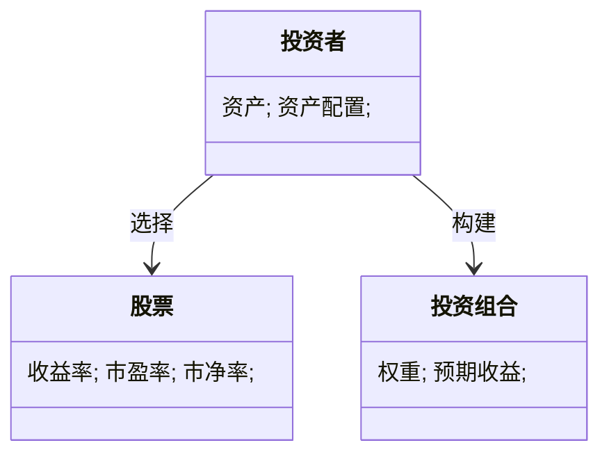
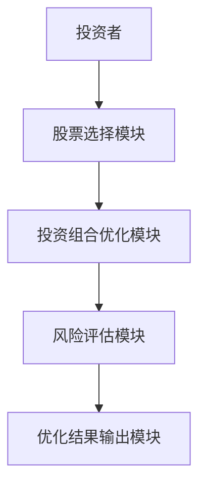

                 


# 彼得林奇的"质量成长"投资案例

> 关键词：彼得林奇、质量成长、投资策略、价值投资、成长股、风险管理、投资分析

> 摘要：本文详细分析了彼得林奇的质量成长投资策略，探讨了其核心理念、投资方法、风险管理及实际案例。通过技术化的分析和系统化的架构，揭示了这一投资策略的科学性和实用性，为投资者提供了深刻的见解和实践指导。

---

## 第一部分：彼得林奇及其投资理念

### 第1章：彼得林奇的背景与投资理念

#### 1.1 彼得林奇的生平简介
彼得·林奇（Peter Lynch）是全球最著名的投资专家之一，以其对成长股的投资策略而闻名。他从1977年到1990年担任富达麦哲伦基金的经理，在此期间，他以年均29%的回报率创造了基金史上最高的纪录。林奇的投资理念强调长期持有优质成长股，注重企业的基本面和竞争优势。

#### 1.2 质量成长投资的核心理念
质量成长投资的核心在于选择那些具备持续增长潜力、财务健康且竞争优势明显的企业。林奇认为，投资者应关注企业的内在价值，而非短期市场波动。他提出，质量成长股的关键特征包括：稳定的收益增长、健康的财务状况、强大的竞争优势和合理的估值。

---

## 第2章：质量成长投资的核心概念

### 2.1 核心概念原理
质量成长投资的核心在于分析企业的基本面，包括收入、利润、利润率、资产负债表和现金流等指标。林奇强调，投资者应选择那些能够持续增长、具备强大竞争优势的公司，并且这些公司的估值合理，不会过高或过低。

### 2.2 核心概念属性特征对比表
表2.1：成长型与价值型企业的对比分析

| 属性             | 成长型企业         | 价值型企业         |
|------------------|------------------|------------------|
| 收益增长率       | 高               | 低或负           |
| 市盈率           | 高               | 低               |
| 市净率           | 高               | 低               |
| 估值合理性       | 合理             | 被低估           |
| 竞争优势         | 强               | 一般或弱         |

---

## 第3章：质量成长投资的算法原理

### 3.1 投资组合优化的数学模型
投资组合优化的目标是在风险可控的前提下，最大化收益。林奇的质量成长投资策略可以表示为一个优化问题：

$$
\text{最大化 } \sum_{i=1}^n r_i w_i \\
\text{约束 } \sum_{i=1}^n w_i = 1, \quad \sum_{i=1}^n w_i^2 \leq R
$$

其中，$r_i$ 是第 $i$ 只股票的预期收益率，$w_i$ 是权重，$R$ 是风险容忍度。

### 3.2 使用Python进行投资组合优化的代码示例

```python
import numpy as np
import pandas as pd

# 假设我们有n只股票的收益率数据
n = 5
returns = np.random.normal(0, 1, n)

# 定义优化目标
def objective(w):
    return -np.sum(w * returns)

# 定义约束
def constraint(w):
    return np.sum(w**2) - 1

# 使用scipy.optimize求解
from scipy.optimize import minimize

# 初始猜测
w0 = np.array([1/n]*n)

# 求解
result = minimize(objective, w0, method='SLSQP', constraints={'type': 'eq', 'fun': constraint})

# 输出结果
print("最优权重：", result.x)
print("最优收益：", -result.fun)
```

---

## 第4章：系统分析与架构设计方案

### 4.1 问题场景介绍
投资者需要选择一组质量成长型股票，构建一个投资组合，以实现长期的资本增值。

### 4.2 系统功能设计
领域模型类图如下：



### 4.3 系统架构设计
系统架构图如下：



---

## 第5章：项目实战

### 5.1 环境安装与配置
安装必要的Python库，如numpy、pandas、scipy.optimize等。

### 5.2 核心实现源代码
```python
import numpy as np

def calculate_portfolio(weights, returns):
    portfolio_return = np.sum(weights * returns)
    portfolio_risk = np.sqrt(np.dot(weights.T, np.dot(np.cov(returns), weights)))
    return portfolio_return, portfolio_risk

# 示例数据
n = 5
returns = np.array([0.1, 0.15, 0.08, 0.12, 0.05])

# 均衡权重
weights = np.array([1/5]*5)

# 计算投资组合的预期收益和风险
return_port, risk_port = calculate_portfolio(weights, returns)

print("预期收益：", return_port)
print("风险：", risk_port)
```

### 5.3 实际案例分析
假设我们有5只股票，其预期年化收益率分别为10%、15%、8%、12%和5%。通过优化模型，我们可以找到最优权重，以实现预期收益的最大化，同时控制风险。

---

## 第6章：风险管理与心理因素

### 6.1 风险管理策略
林奇强调，投资者应定期评估投资组合的风险，并根据市场变化进行调整。风险控制的关键在于分散投资，避免过度集中于某一只股票或行业。

### 6.2 心理因素对投资决策的影响
投资者的心理因素，如贪婪和恐惧，常常导致非理性决策。林奇提醒投资者，必须克服情绪化，坚持长期投资策略。

---

## 第7章：总结与展望

### 7.1 核心要点回顾
质量成长投资的核心在于选择具备持续增长潜力、财务健康且竞争优势明显的企业。通过科学的分析和系统化的优化，投资者可以构建一个风险可控、收益最大化的投资组合。

### 7.2 未来趋势展望
随着技术的进步，数字化投资工具将更加普及，投资者可以利用大数据和人工智能来辅助决策，进一步优化投资组合。

---

## 第8章：最佳实践与小结

### 8.1 投资过程中的注意事项
- 定期评估投资组合的表现。
- 避免过度交易，降低交易成本。
- 保持长期视角，避免短期波动的干扰。

### 8.2 投资心态与纪律的重要性
成功的投资不仅需要科学的方法，更需要强大的纪律和耐心。林奇的成功证明了质量成长投资的长期有效性。

---

## 第9章：拓展阅读与资源推荐

### 9.1 推荐书籍与文章
- 《彼得·林奇的成功投资》
- 《价值 investing》

---

作者：AI天才研究院 & 禅与计算机程序设计艺术

