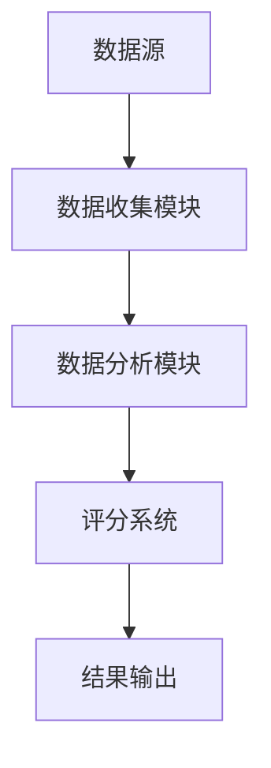

                 


# 彼得林奇的"质量成长"股票特征

> 关键词：质量成长投资，彼得·林奇，股票筛选，财务分析，投资策略

> 摘要：本文详细探讨了彼得·林奇提出的“质量成长”股票投资策略。通过分析质量成长股票的核心特征，包括盈利能力、财务状况、行业地位等，结合实际案例和数学模型，帮助读者理解如何筛选和评估具有成长潜力的优质股票。文章还提供了具体的Python代码实现和系统架构设计，帮助读者在实际投资中应用这些策略。

---

## 第一部分: 质量成长投资的背景与核心概念

### 第1章: 质量成长投资的定义与背景

#### 1.1 质量成长投资的定义
质量成长投资是一种专注于投资那些具有持续增长潜力和高质量基本面的公司的策略。它结合了价值投资和成长投资的优点，注重公司内在质量和未来成长性。

#### 1.2 质量成长投资的背景
现代投资学的发展使得投资者不再仅仅关注短期价格波动，而是更注重公司基本面和长期发展潜力。彼得·林奇作为著名的投资专家，提出了质量成长投资的理念，强调选择那些具有竞争优势和稳定增长的公司。

---

### 第2章: 质量成长股票的核心特征

#### 2.1 质量成长股票的定义
质量成长股票是指那些具有稳定盈利能力、良好财务状况、行业领先地位和优秀管理团队的公司股票。

#### 2.2 质量成长股票的核心要素
| 特征 | 描述 |
|------|------|
| 盈利能力 | 公司在过去几年中持续增长的净利润和营业收入 |
| 财务状况 | 低负债率、健康的流动比率和速动比率 |
| 行业地位 | 高市场占有率、行业龙头地位 |
| 管理团队 | 经验丰富、稳定的管理团队 |
| 估值水平 | 合理的市盈率、市净率和市销率 |

---

## 第二部分: 质量成长股票的筛选与评估

### 第4章: 质量成长股票的筛选标准

#### 4.1 盈利能力分析
盈利能力是筛选质量成长股票的重要指标，包括净利润增长率、营业收入增长率和净资产收益率（ROE）。

#### 4.2 财务状况分析
通过资产负债率、流动比率和速动比率等指标评估公司的财务健康状况。

#### 4.3 行业地位分析
分析公司的市场占有率和行业竞争格局，选择行业龙头公司。

### 第5章: 质量成长股票的估值方法

#### 5.1 市盈率（P/E）分析
市盈率是衡量股票估值的重要指标，计算公式为：
$$ P/E = \frac{\text{股价}}{\text{每股收益}} $$

#### 5.2 市净率（P/B）分析
市净率是公司股价与每股净资产的比率：
$$ P/B = \frac{\text{股价}}{\text{每股净资产}} $$

#### 5.3 市销率（P/S）分析
市销率是公司股价与每股销售收入的比率：
$$ P/S = \frac{\text{股价}}{\text{每股销售收入}} $$

---

## 第三部分: 质量成长投资的系统架构与实战

### 第6章: 系统架构设计

#### 6.1 系统功能设计
- 数据收集模块：获取公司财务数据和行业信息。
- 数据分析模块：计算各项财务指标并进行对比分析。
- 评分系统：根据筛选标准对股票进行评分。

#### 6.2 系统架构图


### 第7章: 项目实战

#### 7.1 环境安装
- Python 3.8+
- pandas, numpy, matplotlib库

#### 7.2 核心代码实现
```python
import pandas as pd
import numpy as np

# 数据加载
data = pd.read_csv('stock_data.csv')

# 盈利能力分析
data['净利润增长率'] = (data['净利润'] - data['净利润'].shift(1)) / data['净利润'].shift(1)

# 财务状况分析
data['流动比率'] = data['流动资产'] / data['流动负债']

# 行业地位分析
data['市场占有率'] = data['营业收入'] / data['行业总销售额']

# 估值分析
data['P/E'] = data['股价'] / data['每股收益']
data['P/B'] = data['股价'] / data['每股净资产']
data['P/S'] = data['股价'] / data['每股销售收入']
```

#### 7.3 案例分析
以科技行业为例，筛选出具有高净利润增长率和合理市盈率的公司，如苹果和微软。

---

## 第四部分: 总结与扩展

### 第8章: 总结与注意事项

#### 8.1 最佳实践
- 定期评估投资组合，及时调整。
- 结合行业趋势和宏观经济环境进行投资决策。

#### 8.2 小结
质量成长投资是一种长期有效的策略，通过选择具有持续成长潜力的优质股票，投资者可以在长期获得稳定的收益。

#### 8.3 注意事项
- 避免过度依赖单一指标，综合考虑多个因素。
- 定期复盘，及时调整投资策略。

#### 8.4 拓展阅读
- 彼得·林奇的《选股三要素：价值、成长和管理》
- 巴菲特的《巴菲特投资哲学》

---

作者：AI天才研究院 & 禅与计算机程序设计艺术

