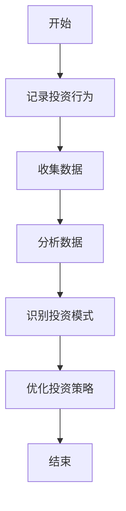
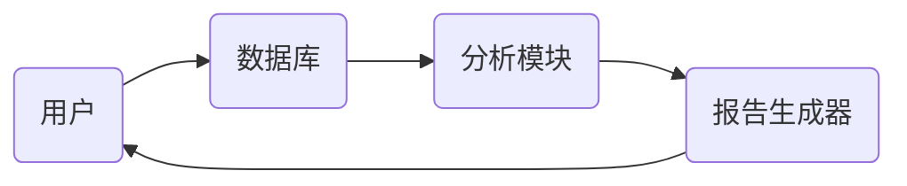

                 


# 彼得林奇的"跟踪记录"投资法

> **关键词**：投资法，彼得林奇，跟踪记录，数据分析，投资策略  
> **摘要**：本文深入探讨了彼得·林奇的“跟踪记录”投资法，从其背景、核心概念、数学模型到系统设计和项目实战，详细分析了该方法的原理和应用，为投资者提供了科学的投资策略参考。

---

## 第一部分：彼得林奇的"跟踪记录"投资法概述

### 第1章：彼得林奇与"跟踪记录"投资法的背景

#### 1.1 彼得林奇的生平与投资理念
彼得·林奇（Peter Lynch）是美国著名的投资专家，以其在富达投资集团（Fidelity Investments）的卓越表现而闻名。他从1971年到2000年担任麦哲伦基金的经理，期间使基金资产从1800万美元增长至约140亿美元，年平均回报率达到29%。林奇的投资哲学强调长期持有优质股票，避免短期波动，并注重对公司基本面的深入研究。

#### 1.2 "跟踪记录"投资法的背景与起源
"跟踪记录"投资法是林奇在其投资实践中发展出的一种独特方法。该方法的核心在于通过持续记录和分析投资行为，发现成功的投资模式，并优化未来的投资决策。这种方法不仅适用于个人投资者，也为企业和机构提供了有效的投资策略。

---

### 第2章："跟踪记录"投资法的核心概念

#### 2.1 投资记录的重要性
记录是投资决策的重要工具，能够帮助投资者发现投资模式，识别潜在风险，并优化投资组合。以下是记录的三个关键方面：

1. **记录的内容与格式**：包括买入时间、价格、数量、卖出时间、价格、数量，以及公司基本面分析。
2. **记录的系统与工具**：使用电子表格或专门的投资记录软件，确保记录的完整性和准确性。
3. **记录的分析方法**：通过统计分析和趋势分析，识别成功的投资模式。

#### 2.2 "跟踪记录"法的实施步骤
1. **确定记录内容**：记录每次投资的详细信息，包括买入和卖出的时间、价格、数量等。
2. **建立记录系统**：使用数据库或电子表格，确保记录易于管理和查询。
3. **记录更新与维护**：定期更新记录，确保数据的准确性和完整性。

#### 2.3 记录分析的策略与方法
1. **数据分析的基本原则**：使用统计方法分析投资回报率、波动率等关键指标。
2. **数据可视化**：通过图表展示投资表现，帮助识别趋势和异常值。
3. **避免分析误区**：注意样本偏差和情绪化决策。

---

### 第3章："跟踪记录"法的数学模型与算法

#### 3.1 记录分析的数学模型
1. **数据统计与概率分布**：计算投资回报的平均值、标准差等统计指标，分析其分布特性。
2. **时间序列分析**：利用ARIMA模型预测未来的投资回报。
3. **回归分析**：通过回归模型识别影响投资回报的关键因素。

#### 3.2 算法原理与流程图
以下是一个简化的算法流程图：



#### 3.3 算法实现的Python代码示例
以下代码展示了如何用Python进行简单的数据统计分析：

```python
import pandas as pd
import numpy as np

# 创建示例数据
data = {
    '投资日期': ['2020-01-01', '2020-02-01', '2020-03-01'],
    '买入价格': [100, 110, 90],
    '卖出价格': [120, 115, 95]
}

df = pd.DataFrame(data)

# 计算回报率
df['回报率'] = (df['卖出价格'] - df['买入价格']) / df['买入价格']

# 统计平均回报率
average_return = df['回报率'].mean() * 100
print(f'平均回报率: {average_return}%')

# 绘制趋势图
import matplotlib.pyplot as plt
plt.plot(df['投资日期'], df['回报率'])
plt.title('投资回报率趋势图')
plt.xlabel('日期')
plt.ylabel('回报率')
plt.show()
```

---

### 第4章："跟踪记录"法的系统架构与设计

#### 4.1 系统分析与需求定义
1. **系统目标**：设计一个投资记录与分析系统，帮助投资者优化投资策略。
2. **功能需求**：包括数据录入、统计分析、趋势预测和报告生成。
3. **用户角色**：投资者、系统管理员。

#### 4.2 系统架构设计
以下是一个简化的系统架构图：



#### 4.3 接口设计与交互流程图
以下是一个交互流程图：


---

### 第5章：项目实战

#### 5.1 环境安装
需要安装Python和相关库（如Pandas、Matplotlib）。

#### 5.2 核心实现代码
以下是投资回报率分析的Python代码：

```python
import pandas as pd
import matplotlib.pyplot as plt

# 假设我们有一个包含投资记录的CSV文件
df = pd.read_csv('投资记录.csv')

# 统计每个投资的回报率
df['回报率'] = (df['卖出价格'] - df['买入价格']) / df['买入价格']

# 绘制回报率分布图
plt.hist(df['回报率'], bins=10, alpha=0.7)
plt.title('投资回报率分布图')
plt.xlabel('回报率 (%)')
plt.ylabel('频率')
plt.show()
```

#### 5.3 案例分析
通过分析某投资者的记录，发现其在特定行业上的投资表现优于整体市场，从而优化投资组合。

---

## 第六部分：总结与扩展

### 6.1 总结
彼得林奇的“跟踪记录”投资法通过持续记录和分析投资行为，帮助投资者发现成功模式并优化决策。本文详细介绍了该方法的核心概念、数学模型和系统设计，并通过案例展示了其实际应用。

### 6.2 最佳实践 Tips
1. **坚持记录**：定期记录投资行为，确保数据的完整性。
2. **数据分析**：利用统计工具深入分析数据，识别趋势。
3. **持续优化**：根据分析结果，不断调整投资策略。

### 6.3 注意事项
- 避免情绪化决策，保持理性分析。
- 定期回顾和优化记录系统，确保其高效性。

### 6.4 拓展阅读
推荐阅读彼得林奇的《击败市场的投资方法》和《投资的智慧》。

---

## 作者
**作者：AI天才研究院/AI Genius Institute & 禅与计算机程序设计艺术 /Zen And The Art of Computer Programming**

---

通过以上详细分析，本文为投资者提供了科学的投资策略参考，帮助他们更好地理解和应用“跟踪记录”投资法。

