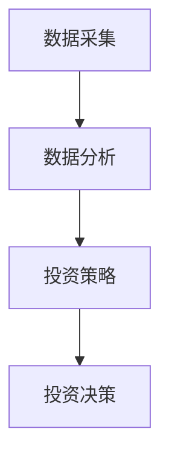

                 


# 彼得林奇的"逆向思维"在新兴市场投资中的应用

---

## 关键词：  
- 彼得·林奇  
- 逆向思维  
- 新兴市场  
- 投资策略  
- 数学模型  
- 系统架构  

---

## 摘要：  
本文深入探讨了彼得·林奇的“逆向思维”在新兴市场投资中的应用。通过分析逆向思维的核心理念、数学模型和系统架构，结合实战案例，本文揭示了如何在新兴市场中利用逆向思维制定有效的投资策略。文章内容涵盖逆向思维的定义、核心概念、算法实现、系统设计以及实际应用，为投资者提供了全面的指导和实践建议。

---

## 第1章: 逆向思维在投资中的重要性  

### 1.1 逆向思维的定义与核心概念  

#### 1.1.1 逆向思维的定义  
逆向思维是一种与传统顺势思维相反的投资策略，强调在市场低谷时买入，在市场高点时卖出。其核心在于反向操作，避免跟随市场的盲目波动。  

#### 1.1.2 逆向思维的核心要素  
- **市场周期性**：识别市场周期，抓住低谷期的投资机会。  
- **价值发现**：寻找被市场低估的资产或企业。  
- **风险管理**：通过逆向操作降低投资风险。  

#### 1.1.3 逆向思维在投资中的独特性  
逆向思维的独特性在于其反周期特性，能够在市场恐慌时发现机会，在市场狂热时规避风险。  

---

### 1.2 彼得·林奇投资理念的背景  

#### 1.2.1 彼得·林奇的生平简介  
彼得·林奇是美国著名投资家，以其在逆向思维领域的卓越表现闻名。他的投资理念强调长期价值，注重企业的基本面分析。  

#### 1.2.2 彼得·林奇的投资风格  
林奇的投资风格以逆向思维为核心，注重在市场低谷时买入优质资产，长期持有，避免短期波动的影响。  

#### 1.2.3 逆向思维在彼得·林奇投资中的应用  
林奇通过逆向思维，在市场低谷期发现并投资于具有长期增长潜力的企业，取得了卓越的投资业绩。  

---

## 第2章: 逆向思维的核心概念与模型  

### 2.1 逆向思维的核心概念  

#### 2.1.1 市场周期理论  
市场周期包括繁荣、衰退、复苏和增长四个阶段。逆向思维强调在衰退阶段寻找投资机会，在繁荣阶段规避风险。  

#### 2.1.2 价值投资与逆向思维的关系  
价值投资注重企业的内在价值，而逆向思维强调在市场低估时投资于具有长期价值的企业。  

#### 2.1.3 逆向思维的决策模型  
逆向思维的决策模型包括市场分析、资产评估、投资时机选择等关键步骤。  

---

### 2.2 逆向思维与市场情绪的关系  

#### 2.2.1 市场情绪的波动性  
市场情绪受投资者心理影响，呈现周期性波动。逆向思维强调在市场情绪低落时寻找机会，在市场情绪高涨时规避风险。  

#### 2.2.2 逆向思维如何应对市场情绪  
通过逆向思维，投资者可以在市场恐慌时保持冷静，利用市场情绪低点进行投资。  

#### 2.2.3 市场情绪与投资决策的关联性  
市场情绪是影响投资决策的重要因素，逆向思维通过反向操作降低市场情绪对决策的干扰。  

---

## 第3章: 新兴市场投资的特点与挑战  

### 3.1 新兴市场的定义与特点  

#### 3.1.1 新兴市场的经济特征  
新兴市场通常具有高增长潜力，但市场波动性较大，政策风险较高。  

#### 3.1.2 新兴市场的投资机会  
新兴市场中往往存在被低估的优质资产，适合逆向思维的投资策略。  

#### 3.1.3 新兴市场的风险因素  
新兴市场的风险包括经济波动、政策变化和市场不透明等。  

---

### 3.2 逆向思维在新兴市场中的应用  

#### 3.2.1 新兴市场中的低谷期投资  
在新兴市场低谷期，逆向思维投资者可以投资于具有长期增长潜力的企业。  

#### 3.2.2 新兴市场中的价值发现  
通过基本面分析，逆向思维投资者可以发现新兴市场中被低估的资产。  

#### 3.2.3 新兴市场中的逆向投资策略  
逆向投资策略包括在市场低谷时增加投资，在市场高点时减少投资。  

---

## 第4章: 逆向思维的数学模型与算法  

### 4.1 逆向思维的数学模型  

#### 4.1.1 投资价值评估模型  
投资价值 = 现金流量的现值  
$$ PV = \frac{CF}{r} $$  
其中，CF为现金流，r为折现率。  

#### 4.1.2 市场周期模型  
市场周期模型将市场分为四个阶段：繁荣、衰退、复苏和增长。  

#### 4.1.3 逆向投资决策树  
```
如果市场处于低谷期：
    投资于优质资产
否则：
    减少投资
```

---

### 4.2 算法原理与实现  

#### 4.2.1 逆向思维算法流程  
1. 数据采集：获取市场数据，包括价格、成交量等。  
2. 市场分析：判断市场所处阶段（繁荣、衰退等）。  
3. 投资决策：根据市场阶段，执行相应的投资策略。  

#### 4.2.2 逆向思维算法的Python实现  
```python
def reverse_thinking_investment(data):
    # 判断市场阶段
    if data['market_phase'] == 'recession':
        return 'invest'
    else:
        return 'reduce_investment'
```

---

## 第5章: 系统架构与投资策略设计  

### 5.1 投资系统架构设计  

#### 5.1.1 系统功能模块划分  
- 数据采集模块：采集市场数据。  
- 数据分析模块：分析市场阶段。  
- 投资策略模块：执行逆向思维策略。  

#### 5.1.2 系统架构图  


---

### 5.2 投资策略的系统实现  

#### 5.2.1 系统功能实现  
- 数据采集模块：通过API获取市场数据。  
- 数据分析模块：判断市场阶段。  
- 投资策略模块：根据市场阶段执行投资策略。  

#### 5.2.2 系统测试与优化  
通过历史数据验证系统的有效性，优化算法参数。  

---

## 第6章: 实战案例分析  

### 6.1 案例一: 新兴市场的逆向投资  

#### 6.1.1 案例背景  
假设新兴市场处于低谷期，投资者选择投资于一家具有长期增长潜力的企业。  

#### 6.1.2 投资策略实施  
- 数据分析：确认市场处于低谷期。  
- 投资决策：投资于优质资产。  

#### 6.1.3 投资结果分析  
通过长期持有，投资者获得了显著的收益。  

---

### 6.2 案例二: 逆向思维在市场低谷期的应用  

#### 6.2.1 案例背景  
假设市场处于衰退阶段，投资者选择减少投资。  

#### 6.2.2 投资策略实施  
- 数据分析：确认市场处于衰退阶段。  
- 投资决策：减少投资。  

#### 6.2.3 投资结果分析  
通过减少投资，投资者规避了市场的进一步下跌风险。  

---

## 第7章: 最佳实践与投资小结  

### 7.1 投资中的注意事项  

#### 7.1.1 风险管理  
投资者应注重风险管理，避免过度集中投资。  

#### 7.1.2 长期视角  
逆向思维需要长期视角，避免短期波动的干扰。  

---

## 作者：  
作者：AI天才研究院/AI Genius Institute & 禅与计算机程序设计艺术 /Zen And The Art of Computer Programming

