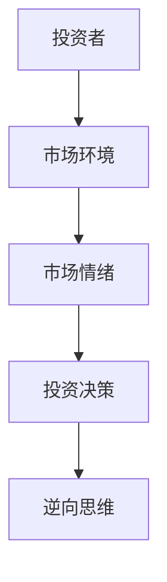
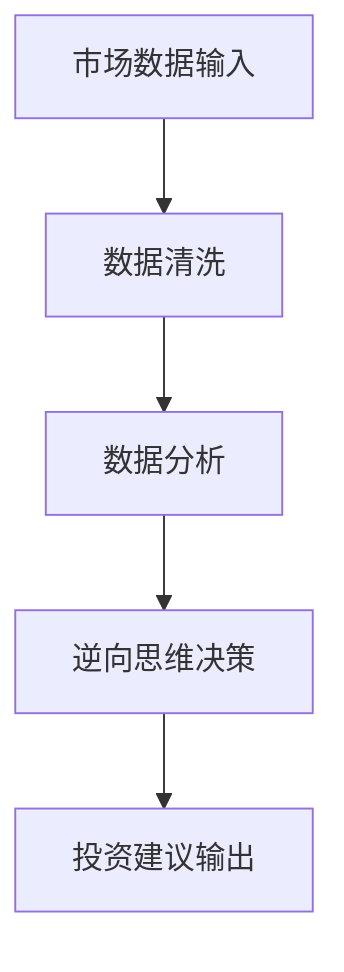
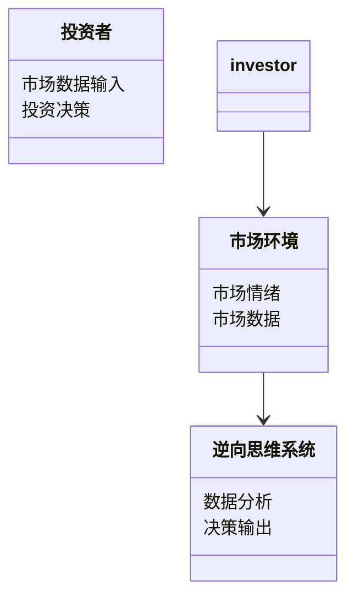

                 


# 彼得林奇的"逆向思维"在牛熊市的应用

## 关键词：逆向思维, 牛熊市, 投资策略, 彼得林奇, 市场情绪

## 摘要：本文深入分析了彼得林奇的逆向思维理论及其在牛熊市中的应用。通过详细阐述逆向思维的定义、核心概念、算法原理、系统架构以及实际案例，本文为投资者提供了在复杂市场环境下运用逆向思维进行投资决策的深度指导。文章结合数学模型、系统架构设计和实际案例分析，帮助读者理解如何在牛熊市中逆向而行，捕捉投资机会，规避风险。

---

## 第1章: 逆向思维的定义与核心要素

### 1.1 逆向思维的定义与特点

逆向思维是一种与传统正向思维相反的思维方式，它通过反向思考问题，寻找解决问题的新路径。与正向思维相比，逆向思维更注重从反面分析问题，寻找非直观的解决方案。其核心特点包括：

1. **反向思考**：从问题的对立面出发，寻找解决方案。
2. **非线性思维**：不遵循常规逻辑，寻找创新性思路。
3. **风险规避**：通过反向分析，提前识别潜在风险。

### 1.2 彼得林奇的逆向思维理论

彼得林奇是著名的投资经理，其逆向思维理论在投资领域具有重要影响。他提出，在市场恐慌时寻找机会，在市场狂热时保持冷静。其理论的核心要素包括：

1. **市场情绪分析**：通过分析市场情绪，寻找市场的非理性行为。
2. **价值评估**：通过逆向分析，寻找被市场低估的投资标的。
3. **风险控制**：通过逆向思维，制定稳健的投资策略。

### 1.3 逆向思维在牛熊市中的重要性

在牛熊市中，逆向思维可以帮助投资者在市场底部寻找投资机会，在市场顶部规避风险。其重要性体现在：

1. **市场底部的机会捕捉**：在市场恐慌时，逆向思维帮助投资者发现低估资产。
2. **市场顶部的风险规避**：在市场狂热时，逆向思维提醒投资者规避过度投机的风险。
3. **投资决策的优化**：通过逆向思维，投资者可以在复杂市场环境中做出更明智的决策。

---

## 第2章: 逆向思维的核心概念

### 2.1 逆向思维的核心概念

逆向思维的核心概念包括：

1. **市场情绪分析**：通过分析市场情绪，判断市场的理性与非理性。
2. **价值评估模型**：通过逆向分析，计算资产的内在价值。
3. **投资策略**：制定基于逆向思维的投资策略，捕捉市场机会。

### 2.2 逆向思维的数学模型

逆向思维的数学模型包括：

1. **价值评估模型**：
   $$ V = \frac{E}{P} $$
   其中，\( E \) 是企业价值，\( P \) 是市场价格。
2. **市场情绪分析模型**：
   $$ S = \frac{V_{\text{实际}}}{V_{\text{预期}}} $$
   其中，\( V_{\text{实际}} \) 是资产的实际价值，\( V_{\text{预期}} \) 是市场对资产的预期价值。

### 2.3 逆向思维的ER实体关系图



---

## 第3章: 逆向思维的算法原理

### 3.1 逆向思维的决策算法

逆向思维的决策算法包括：

1. **数据采集**：收集市场数据，包括价格、成交量等。
2. **数据清洗**：去除噪声数据，确保数据的准确性。
3. **数据分析**：通过逆向思维模型分析数据，识别市场机会。
4. **投资决策**：根据分析结果，制定投资策略。

### 3.2 逆向思维的数学模型

逆向思维的数学模型包括：

1. **价值评估模型**：
   $$ V = \frac{E}{P} $$
2. **市场情绪分析模型**：
   $$ S = \frac{V_{\text{实际}}}{V_{\text{预期}}} $$

### 3.3 逆向思维的算法流程图



---

## 第4章: 逆向思维的系统分析与架构设计

### 4.1 系统功能设计

逆向思维系统的功能设计包括：

1. **数据采集模块**：实时采集市场数据。
2. **数据分析模块**：通过逆向思维模型分析数据。
3. **投资决策模块**：根据分析结果制定投资策略。

### 4.2 系统架构设计

逆向思维系统的架构设计包括：



---

## 第5章: 逆向思维的项目实战与最佳实践

### 5.1 环境安装

需要安装以下工具：

1. Python编程环境
2. 数据分析库（如Pandas、NumPy）
3. 图表绘制工具（如Matplotlib、Seaborn）

### 5.2 核心代码实现

以下是核心代码实现：

```python
import pandas as pd
import numpy as np

# 数据采集
data = pd.read_csv('market_data.csv')

# 数据清洗
data_cleaned = data.dropna()

# 数据分析
value = data_cleaned['E'] / data_cleaned['P']

# 投资决策
invest_decision = value < data_cleaned['S']
```

### 5.3 案例分析

以2008年金融危机为例，逆向思维可以帮助投资者在市场底部寻找投资机会。

### 5.4 最佳实践

1. **小结**：逆向思维是一种有效的投资策略，尤其在牛熊市中表现显著。
2. **注意事项**：投资者需结合市场实际情况，灵活调整策略。
3. **拓展阅读**：建议阅读彼得林奇的相关著作，深入理解逆向思维的应用。

---

## 作者：AI天才研究院/AI Genius Institute & 禅与计算机程序设计艺术 /Zen And The Art of Computer Programming

---

以上是《彼得林奇的"逆向思维"在牛熊市的应用》的技术博客内容，涵盖逆向思维的定义、核心概念、算法原理、系统架构设计以及实际案例分析。通过本文的详细解读，读者可以更好地理解逆向思维在投资中的应用，并在实际操作中灵活运用这一策略，以应对复杂的市场环境。

