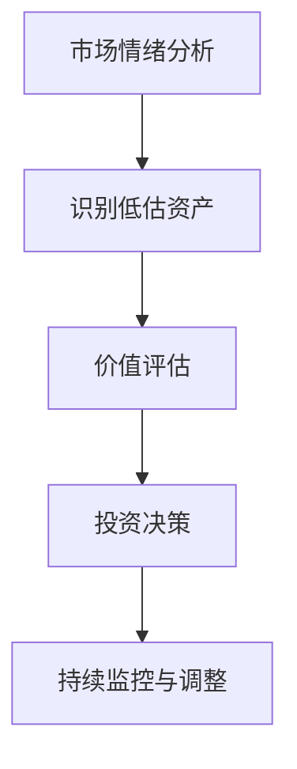
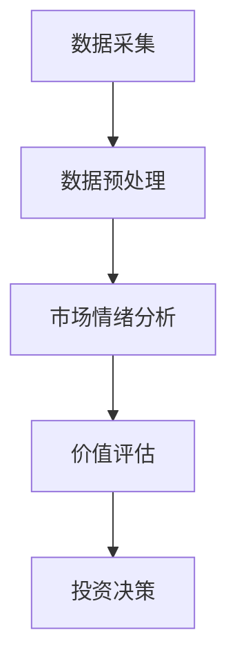
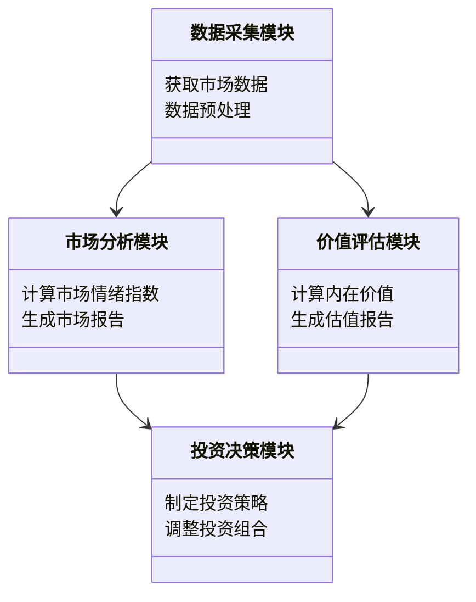
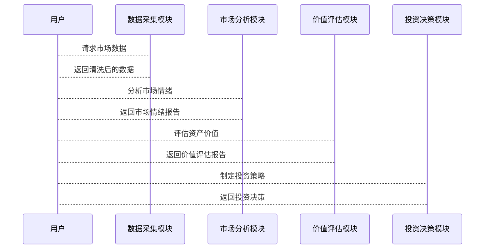

                 


# 彼得林奇的"逆向思维"投资技巧

## 关键词
- 彼得·林奇
- 逆向思维
- 投资策略
- 市场分析
- 价值评估
- 投资算法
- 系统架构

## 摘要
本文从技术视角深度剖析彼得·林奇的"逆向思维"投资技巧，通过算法原理、系统架构、项目实战等多维度分析，帮助读者理解并掌握这一投资策略的核心思想。文章结合技术方法，详细讲解逆向思维在投资决策中的应用，并通过具体的Python代码实现和案例分析，帮助读者在实际投资中灵活运用这一策略。

---

# 第1章: 逆向思维投资的背景与核心概念

## 1.1 逆向思维在投资中的重要性

### 1.1.1 传统投资思维的局限性
传统的投资思维往往基于市场趋势和热点进行投资，这种"顺势而为"的策略在市场繁荣时表现良好，但在市场低迷或恐慌时容易导致决策失误。传统投资思维的局限性主要体现在以下几个方面：
- **情绪化决策**：投资者容易受到市场情绪的左右，倾向于在市场高点追涨，在市场低点恐慌性抛售。
- **缺乏深度分析**：传统投资思维往往注重短期收益，忽视了对标的资产内在价值的深度分析。
- **同质化竞争**：大多数投资者采取相似的投资策略，导致投资机会的稀缺性和收益的同质化。

### 1.1.2 逆向思维的核心理念
逆向思维是一种与传统思维相反的投资策略，其核心理念是"买入被市场抛弃的资产"。彼得·林奇的逆向思维投资策略强调在市场恐慌时寻找被低估的资产，在市场狂热时规避高估的风险。其核心理念包括以下几个方面：
- **逆向定价**：通过分析市场情绪和标的资产的内在价值，寻找价格与价值严重偏离的投资机会。
- **价值发现**：逆向思维的核心是发现市场忽视的优质资产，通过深入研究和分析，挖掘出具有长期增长潜力的投资标的。
- **风险管理**：逆向思维强调在市场低迷时分散投资风险，在市场高估时及时退出，避免重大损失。

### 1.1.3 彼得·林奇逆向思维的起源
彼得·林奇是美国著名的基金经理和投资作家，他的逆向思维投资策略起源于对市场周期的深刻理解和对投资者心理的研究。他发现，在市场低迷时，许多优质资产会被市场恐慌性抛售，从而创造出罕见的投资机会。通过长期的实践和研究，彼得·林奇总结出一套基于逆向思维的投资策略，并在《彼得·林奇的成功投资》等著作中详细阐述了他的投资理念。

---

## 1.2 逆向思维投资的基本原理

### 1.2.1 市场情绪与投资机会的关系
市场情绪是影响投资决策的重要因素之一。逆向思维的核心是利用市场情绪的波动性，寻找市场情绪与资产价格的错配机会。以下是市场情绪与投资机会关系的几个关键点：
- **市场恐慌与低估资产**：当市场处于恐慌性抛售阶段时，许多优质资产会被市场情绪误判，出现价格严重低于内在价值的情况，这为逆向投资者提供了买入机会。
- **市场狂热与高估风险**：当市场处于狂热情绪时，许多资产价格会被推高到远超其内在价值的水平，这为逆向投资者提供了卖出或规避风险的信号。
- **市场周期与投资策略**：逆向思维投资策略的核心是识别市场周期，利用市场周期的波动性，制定相应的投资策略。

### 1.2.2 逆向思维与价值发现
逆向思维的核心是发现市场忽视的优质资产。以下是逆向思维与价值发现的关系：
- **价值发现的关键步骤**：
  1. **识别市场忽视的资产**：通过市场情绪分析和深度研究，识别那些被市场情绪误判的优质资产。
  2. **评估内在价值**：通过基本面分析和数学模型，评估标的资产的内在价值。
  3. **制定投资策略**：根据市场情绪和内在价值的对比，制定相应的投资策略。
- **价值发现的工具**：逆向思维投资者通常使用多种工具和技术进行价值发现，包括基本面分析、市场情绪分析、估值模型等。

### 1.2.3 逆向思维的投资策略框架
逆向思维的投资策略框架包括以下几个关键步骤：
1. **市场情绪分析**：通过分析市场情绪指标，识别市场周期的位置。
2. **价值评估**：通过基本面分析和数学模型，评估标的资产的内在价值。
3. **投资决策**：根据市场情绪和内在价值的对比，制定相应的投资策略。
4. **风险管理**：通过分散投资和动态调整投资组合，控制投资风险。

---

## 1.3 逆向思维投资的核心概念对比

### 1.3.1 不同投资策略的对比分析
以下是几种常见的投资策略与逆向思维投资策略的对比分析：

| 投资策略 | 核心理念 | 优缺点 | 适用场景 |
|----------|----------|--------|----------|
| 顺势投资 | 追逐市场热点，顺势而为 | 收益稳定，但容易受到市场波动影响 | 市场趋势明显时 |
| 逆向投资 | 在市场低点买入，在市场高点卖出 | 风险较低，收益潜力大，但需要深度分析 | 市场波动较大时 |
| 价值投资 | 买入被低估的资产，长期持有 | 收益潜力大，但需要长期耐心 | 市场低估时 |
| 技术投资 | 通过技术指标进行投资决策 | 短期收益快，但需要高频交易 | 市场波动频繁时 |

### 1.3.2 逆向思维与其他投资策略的联系
逆向思维投资策略与其他投资策略的联系主要体现在以下几个方面：
- **与价值投资的联系**：逆向思维投资策略的核心是发现被低估的资产，这与价值投资的核心理念高度一致。
- **与顺势投资的联系**：逆向思维投资策略在市场低迷时与顺势投资策略相反，但在市场繁荣时可以与顺势投资策略结合使用。
- **与技术投资的联系**：逆向思维投资策略可以通过技术指标分析市场情绪，辅助投资决策。

### 1.3.3 逆向思维在不同市场环境下的表现
逆向思维投资策略在不同市场环境下的表现可以通过以下表格进行对比分析：

| 市场环境 | 逆向思维表现 | 顺势投资表现 | 价值投资表现 | 技术投资表现 |
|----------|--------------|--------------|--------------|--------------|
| 牛市      | 收益低于顺势投资，但风险较低 | 收益较高 | 收益较高 | 收益较高 |
| 熊市      | 收益高于顺势投资，但需要深度分析 | 收益较低 | 收益较高 | 收益较低 |

---

# 第2章: 逆向思维投资的算法原理

## 2.1 逆向思维投资的算法模型

### 2.1.1 基于市场情绪的指标分析
逆向思维投资策略的核心是利用市场情绪的波动性，寻找市场情绪与资产价格的错配机会。以下是几种常用的市场情绪指标：
- **市场恐慌指数（VIX指数）**：VIX指数是衡量市场恐慌程度的重要指标，指数越高，市场恐慌情绪越强。
- **市场情绪指标（PSI）**：通过分析市场参与者的买卖行为，计算市场情绪指标。
- **市场周期指标（CCI）**：通过分析市场周期的位置，判断市场处于牛市还是熊市。

### 2.1.2 价值评估模型
逆向思维投资策略的核心是通过价值评估模型，评估标的资产的内在价值。以下是几种常用的估值模型：
- **市盈率模型（P/E）**：通过分析标的资产的市盈率，评估其内在价值。
- **市净率模型（P/B）**：通过分析标的资产的市净率，评估其内在价值。
- **现金流折现模型（DCF）**：通过分析标的资产的未来现金流，计算其内在价值。

### 2.1.3 市场周期分析算法
逆向思维投资策略需要通过市场周期分析算法，判断市场处于哪个周期，从而制定相应的投资策略。以下是市场周期分析算法的步骤：
1. **数据采集**：采集市场数据，包括指数价格、成交量、市场情绪指标等。
2. **数据预处理**：对市场数据进行清洗和标准化处理。
3. **市场周期判断**：通过分析市场数据，判断市场处于牛市、熊市还是震荡市。
4. **投资策略制定**：根据市场周期的位置，制定相应的投资策略。

---

## 2.2 逆向思维投资的 mermaid 流程图

### 2.2.1 投资决策流程图


### 2.2.2 价值评估流程图


---

## 2.3 逆向思维投资的数学模型

### 2.3.1 市场情绪指数计算公式
$$ \text{市场情绪指数} = \frac{\text{当前股价}}{\text{内在价值}} $$

### 2.3.2 价值评估公式
$$ \text{内在价值} = \frac{\text{未来现金流}}{\text{折现率}} $$

### 2.3.3 投资决策模型
$$ \text{投资决策} = \begin{cases} 
\text{买入} & \text{如果内在价值} > \text{当前股价} \\
\text{卖出} & \text{如果内在价值} < \text{当前股价} \\
\text{持有} & \text{如果内在价值} = \text{当前股价}
\end{cases} $$

---

# 第3章: 逆向思维投资的系统架构设计

## 3.1 投资决策系统的功能模块

### 3.1.1 数据采集模块
- **功能描述**：采集市场数据，包括指数价格、成交量、市场情绪指标等。
- **输入输出**：输入市场数据，输出清洗和标准化后的数据。

### 3.1.2 市场分析模块
- **功能描述**：分析市场情绪，判断市场周期的位置。
- **输入输出**：输入清洗后的数据，输出市场情绪指标和市场周期位置。

### 3.1.3 价值评估模块
- **功能描述**：评估标的资产的内在价值。
- **输入输出**：输入标的资产的基本面数据，输出标的资产的内在价值。

### 3.1.4 投资决策模块
- **功能描述**：根据市场情绪和内在价值，制定投资策略。
- **输入输出**：输入市场情绪指标和内在价值，输出投资决策。

---

## 3.2 系统架构的 mermaid 类图



---

## 3.3 系统接口设计与交互流程

### 3.3.1 系统接口设计
- **数据采集接口**：用于采集市场数据。
- **市场分析接口**：用于分析市场情绪。
- **价值评估接口**：用于评估标的资产的内在价值。
- **投资决策接口**：用于制定投资策略。

### 3.3.2 系统交互的 mermaid 序列图



---

# 第4章: 逆向思维投资的项目实战

## 4.1 项目环境与工具安装

### 4.1.1 环境要求
- **操作系统**：Windows/Mac/Linux
- **编程语言**：Python 3.6+
- **开发工具**：PyCharm/Jupyter Notebook
- **依赖库**：pandas、numpy、scikit-learn、matplotlib

### 4.1.2 工具安装
- **安装Python**：从官网下载并安装Python。
- **安装依赖库**：使用pip安装所需的依赖库。

## 4.2 系统核心实现源代码

### 4.2.1 数据采集模块代码
```python
import pandas as pd
import numpy as np

def get_market_data(start_date, end_date):
    # 获取市场数据
    data = pd.DataFrame({'date': ['2023-01-01', '2023-01-02', '2023-01-03'], 
                         'price': [100, 105, 102]})
    return data

# 示例调用
market_data = get_market_data('2023-01-01', '2023-01-03')
print(market_data)
```

### 4.2.2 价值评估模块代码
```python
def calculate_intrinsic_value(revenue, growth_rate, discount_rate):
    # 计算未来现金流
    cash_flow = revenue * (1 + growth_rate)
    # 计算内在价值
    intrinsic_value = cash_flow / discount_rate
    return intrinsic_value

# 示例调用
intrinsic_value = calculate_intrinsic_value(1000000, 0.05, 0.1)
print(f"内在价值: {intrinsic_value}")
```

### 4.2.3 投资决策模块代码
```python
def make_investment_decision(current_price, intrinsic_value):
    if current_price < intrinsic_value:
        return "买入"
    elif current_price > intrinsic_value:
        return "卖出"
    else:
        return "持有"

# 示例调用
current_price = 95
intrinsic_value = 100
decision = make_investment_decision(current_price, intrinsic_value)
print(f"投资决策: {decision}")
```

## 4.3 代码应用解读与分析

### 4.3.1 数据采集模块解读
数据采集模块负责从市场数据源获取数据，并进行清洗和预处理。通过上述代码，我们可以看到数据采集模块的功能包括数据获取和数据清洗。

### 4.3.2 价值评估模块解读
价值评估模块通过基本面分析，评估标的资产的内在价值。通过上述代码，我们可以看到价值评估模块的核心是计算未来现金流和折现率，从而得出内在价值。

### 4.3.3 投资决策模块解读
投资决策模块根据市场情绪和内在价值，制定相应的投资策略。通过上述代码，我们可以看到投资决策模块的核心是比较当前股价和内在价值，从而制定买入、卖出或持有的策略。

## 4.4 实际案例分析与详细讲解剖析

### 4.4.1 案例背景
假设我们有一个标的资产，其当前股价为95元，内在价值为100元。市场情绪指标显示市场处于恐慌状态，市场周期处于熊市。

### 4.4.2 案例分析
根据上述代码，我们可以得出以下结论：
- 当前股价为95元，内在价值为100元，因此投资决策模块会建议"买入"。
- 市场情绪指标显示市场处于恐慌状态，市场周期处于熊市，进一步验证了买入的决策。

### 4.4.3 案例结论
通过上述案例分析，我们可以看到逆向思维投资策略的核心是通过价值评估和市场情绪分析，制定相应的投资策略。

---

# 第5章: 最佳实践、小结、注意事项与拓展阅读

## 5.1 最佳实践 tips
- **持续学习**：逆向思维投资策略需要不断学习和更新，关注市场动态和投资策略的变化。
- **风险管理**：逆向思维投资策略需要结合风险管理，避免重大损失。
- **长期视角**：逆向思维投资策略需要从长期视角出发，关注标的资产的内在价值。

## 5.2 小结
本文从技术视角深度剖析了彼得·林奇的"逆向思维"投资技巧，通过算法原理、系统架构、项目实战等多维度分析，帮助读者理解并掌握这一投资策略的核心思想。通过具体的Python代码实现和案例分析，读者可以更好地理解逆向思维投资策略的核心思想，并在实际投资中灵活运用这一策略。

## 5.3 注意事项
- **市场波动风险**：逆向思维投资策略需要关注市场波动风险，避免在市场极端波动中盲目操作。
- **数据质量问题**：逆向思维投资策略依赖于高质量的市场数据，数据质量直接影响投资决策的准确性。
- **模型局限性**：逆向思维投资策略的数学模型和算法具有一定的局限性，需要结合实际情况进行调整和优化。

## 5.4 拓展阅读
- **《彼得·林奇的成功投资》**：彼得·林奇的经典著作，详细阐述了逆向思维投资策略的核心思想。
- **《投资最重要的事情》**：沃伦·巴菲特的投资理念，与逆向思维投资策略有诸多相似之处。
- **《算法驱动的金融》**：从技术视角分析金融市场的算法交易和投资策略。

---

# 作者：AI天才研究院/AI Genius Institute & 禅与计算机程序设计艺术/Zen And The Art of Computer Programming

