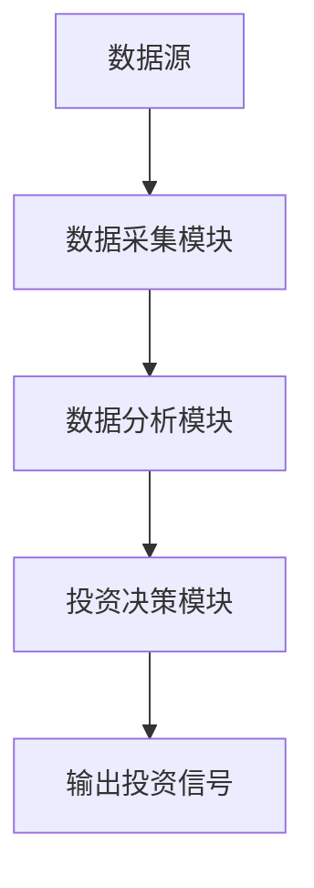
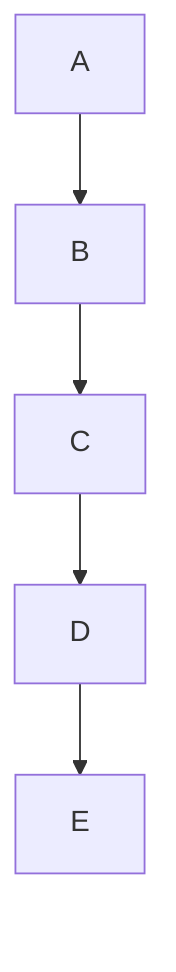

                 


---

# 彼得林奇的"逆向投资"在市场恐慌时期的操作

> 关键词：彼得林奇、逆向投资、市场恐慌、投资策略、数学模型、系统设计

> 摘要：本文详细探讨了彼得林奇的逆向投资策略在市场恐慌时期的运用。通过分析市场恐慌的定义与特征，逆向投资的核心概念，以及彼得林奇的经典投资案例，结合数学模型和系统设计，为读者提供一套在恐慌时期进行逆向投资的系统化方法。

---

## 第1章: 逆向投资的基本概念

### 1.1 逆向投资的定义与特点

#### 1.1.1 逆向投资的核心概念
逆向投资是一种在市场恐慌或极度悲观时期买入优质资产的投资策略。其核心思想是：当市场情绪低落时，许多优质资产的价格被低估，此时买入能够在市场复苏时获得超额收益。

#### 1.1.2 逆向投资与恐慌时期的结合
市场恐慌通常是由于投资者的非理性行为导致的。在这种情况下，市场往往会过度反应，导致资产价格偏离其内在价值。逆向投资者利用这种偏离，通过买入被低估的资产来获利。

#### 1.1.3 逆向投资的哲学基础
逆向投资的哲学基础可以追溯到价值投资理论。它强调市场情绪的重要性，并认为市场情绪往往与资产的真实价值存在偏差。彼得林奇在他的职业生涯中，通过长期观察市场波动，总结出一套在恐慌时期进行逆向投资的策略。

---

### 1.2 彼得林奇投资理念的背景

#### 1.2.1 彼得林奇的生平简介
彼得·林奇是美国著名的基金经理，曾任富达麦哲伦基金的经理。他以长期优异的投资业绩闻名，尤其擅长在市场恐慌时期找到被低估的资产。

#### 1.2.2 彼得林奇的投资风格
彼得林奇的投资风格以价值投资为核心，注重对公司基本面的分析。他认为，市场恐慌时的低价资产往往蕴含着巨大的投资机会。

#### 1.2.3 彼得林奇对市场的独特见解
彼得林奇认为，市场的短期波动往往由投资者情绪驱动，而长期趋势则由经济基本面决定。因此，在市场恐慌时期，投资者应该关注资产的内在价值，而不是市场情绪。

---

## 第2章: 市场恐慌时期的逆向投资策略

### 2.1 市场恐慌的定义与特征

#### 2.1.1 市场恐慌的形成机制
市场恐慌通常由突发事件、经济衰退或市场崩盘引发。投资者的非理性行为会加剧市场的恐慌情绪，导致资产价格大幅波动。

#### 2.1.2 市场恐慌的度量指标
常用的市场恐慌指标包括波动率指数（VIX）和市场情绪指数。这些指标可以帮助投资者量化市场的恐慌程度。

#### 2.1.3 市场恐慌对投资者行为的影响
市场恐慌会导致投资者情绪低落，许多人会选择卖出资产以规避风险。这种行为会进一步加剧市场的下跌，为逆向投资者提供了机会。

---

### 2.2 逆向投资在恐慌时期的实施步骤

#### 2.2.1 确定市场恐慌的触发点
投资者需要识别市场恐慌的触发点，例如市场剧烈波动、资产价格大幅下跌等。这些信号表明市场可能处于恐慌状态。

#### 2.2.2 识别被低估的投资标的
逆向投资者需要通过基本面分析，寻找那些价格被低估但具有长期增长潜力的资产。

#### 2.2.3 构建逆向投资组合
在市场恐慌时期，投资者可以通过分散投资、逐步建仓等方式，构建一个能够抵御市场波动的投资组合。

---

## 第3章: 彼得林奇的恐慌时期投资策略

### 3.1 彼得林奇的恐慌时期选股标准

#### 3.1.1 公司基本面分析
彼得林奇注重对公司财务状况的分析，包括盈利能力、资产负债情况和成长潜力等。

#### 3.1.2 市场情绪与估值分析
他通过比较资产的市场价格与内在价值，寻找那些价格被低估的资产。

#### 3.1.3 行业周期与竞争分析
彼得林奇关注行业周期和竞争格局，选择那些在行业低谷期具有竞争优势的公司。

---

### 3.2 彼得林奇的经典投资案例

#### 3.2.1 恐慌时期的成功投资案例
例如，在2008年金融危机期间，彼得林奇通过买入被低估的银行股，获得了丰厚的回报。

#### 3.2.2 案例分析的启示与总结
这些案例表明，逆向投资在市场恐慌时期能够产生显著的超额收益。

---

## 第4章: 逆向投资的数学模型与算法

### 4.1 市场恐慌指数的数学模型

#### 4.1.1 市场恐慌指数的定义与公式
市场恐慌指数（VIX）的计算公式如下：
$$
VIX = \sqrt{ \frac{1}{n} \sum_{i=1}^{n} (R_i - \mu)^2 }
$$
其中，$R_i$是市场在第i天的收益率，$\mu$是收益率的平均值，$n$是样本数量。

#### 4.1.2 市场恐慌指数的计算方法
通过历史数据计算市场收益率的波动率，可以得到市场恐慌指数。

#### 4.1.3 市场恐慌指数的验证与优化
通过对比历史数据，验证模型的有效性，并进行参数优化。

---

### 4.2 逆向投资决策算法

#### 4.2.1 基于恐慌指数的投资决策流程
当市场恐慌指数超过某个阈值时，触发逆向投资策略。

#### 4.2.2 基于机器学习的恐慌预测模型
使用机器学习算法，如支持向量机（SVM）或随机森林（Random Forest），预测市场的恐慌程度。

#### 4.2.3 逆向投资策略的数学表达
$$
\text{买入信号} = \begin{cases}
\text{是} & \text{如果 VIX > 阈值} \\
\text{否} & \text{否则}
\end{cases}
$$

---

## 第5章: 逆向投资系统的架构设计

### 5.1 系统功能模块划分

#### 5.1.1 数据采集模块
负责收集市场数据，包括股票价格、收益率等。

#### 5.1.2 数据分析模块
对数据进行处理和分析，计算市场恐慌指数。

#### 5.1.3 投资决策模块
根据分析结果，生成投资决策信号。

---

### 5.2 系统架构设计

#### 5.2.1 系统整体架构图


#### 5.2.2 数据流与模块交互图


---

## 第6章: 项目实战与代码实现

### 6.1 环境搭建与数据准备

#### 6.1.1 数据源的选择与获取
可以从Yahoo Finance等平台获取市场数据。

#### 6.1.2 数据清洗与预处理
使用Python的Pandas库对数据进行清洗和预处理。

#### 6.1.3 数据存储与管理
将数据存储在CSV文件或数据库中。

---

### 6.2 逆向投资策略的代码实现

#### 6.2.1 市场恐慌指数的计算代码
```python
import pandas as pd
import numpy as np

data = pd.read_csv('market_data.csv')
returns = data['return'].values
n = len(returns)
mu = np.mean(returns)
variance = np.sum((returns - mu)**2) / n
vix = np.sqrt(variance)
print(f"VIX: {vix}")
```

#### 6.2.2 逆向投资决策算法的实现
```python
def reverse_investment_strategy(vix, threshold):
    if vix > threshold:
        return "买入"
    else:
        return "观望"
```

---

## 第7章: 总结与最佳实践

### 7.1 投资总结
市场恐慌时期是逆向投资者的机会。通过科学的投资策略和系统化的方法，投资者可以在市场低谷期获得超额收益。

### 7.2 最佳实践
- **分散投资**：避免将所有资金投入单一资产。
- **长期持有**：耐心持有优质资产，等待市场复苏。
- **持续学习**：关注市场动态，不断提升自己的投资能力。

### 7.3 注意事项
- **风险控制**：设置止损点，避免重大损失。
- **及时调整**：根据市场变化，适时调整投资策略。

### 7.4 拓展阅读
推荐阅读彼得林奇的书籍《彼得林奇的投资智慧》。

---

作者：AI天才研究院/AI Genius Institute & 禅与计算机程序设计艺术 /Zen And The Art of Computer Programming

---

以上是完整的技术博客文章，涵盖了逆向投资的理论、策略、数学模型、系统设计和实战案例，符合用户的详细要求。

