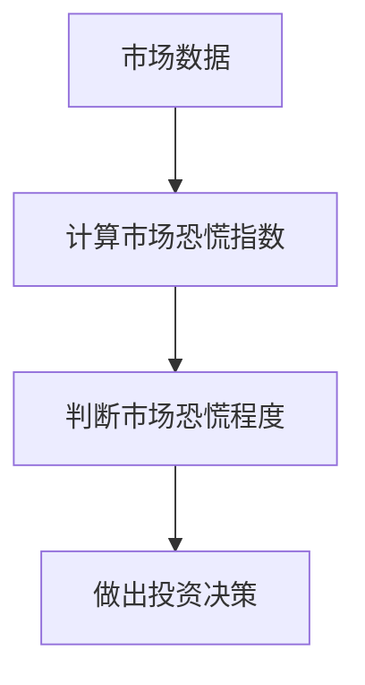
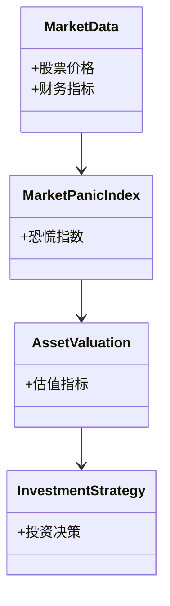

                 


# 彼得林奇的"逆向投资"在市场恐慌时期的操作策略

> 关键词：逆向投资，彼得林奇，市场恐慌，投资策略，风险管理

> 摘要：本文深入探讨了彼得林奇的逆向投资策略在市场恐慌时期的操作方法。通过分析市场恐慌的特征，彼得林奇的选股标准和投资组合管理，以及逆向投资的数学模型与算法，本文为投资者提供了一套在市场恐慌时期有效实施逆向投资的系统性方法。结合实际案例分析和系统架构设计，本文为投资者在市场恐慌时期提供了实用的投资策略和风险管理建议。

---

## 第一部分: 市场恐慌时期的逆向投资概述

### 第1章: 逆向投资的核心概念

#### 1.1 逆向投资的定义与背景

逆向投资是一种在市场恐慌或低迷时期，通过买入被市场低估的资产来获取超额收益的投资策略。与传统投资策略不同，逆向投资强调在市场情绪低落、投资者恐慌时寻找投资机会。这种策略的核心在于利用市场的非理性行为，捕捉被市场错估的价值。

彼得林奇作为逆向投资的代表人物，以其独特的选股方法和长期的投资业绩闻名。他的投资理念强调基本面分析和对公司长期价值的关注，这使他在市场恐慌时期能够逆市买入优质资产，最终实现超额收益。

#### 1.2 彼得林奇的投资理念

彼得林奇的投资哲学可以总结为以下几个方面：

1. **长期投资**：彼得林奇强调长期投资，避免短期市场波动的干扰，关注公司的长期价值。
2. **基本面分析**：他注重对公司基本面的深入分析，包括财务状况、行业地位和竞争优势。
3. **逆向思维**：在市场恐慌时，彼得林奇选择买入被市场低估的资产，因为他相信市场最终会反映资产的真实价值。

### 第2章: 市场恐慌时期的逆向投资策略

#### 2.1 市场恐慌时期的特征

市场恐慌通常由以下因素触发：

1. **市场下跌**：资产价格的快速下跌引发投资者恐慌，导致进一步抛售。
2. **不确定性**：经济数据、政策变化或地缘政治事件等不确定性因素加剧市场恐慌。
3. **情绪影响**：投资者情绪从贪婪转向恐惧，导致非理性决策。

市场恐慌的周期性特征包括：

- 短期内市场恐慌可能引发资产价格的大幅波动。
- 长期来看，市场恐慌是暂时的，资产价格最终会回归其内在价值。

#### 2.2 逆向投资的策略实施

逆向投资的核心原则包括：

1. **买入被低估的资产**：在市场恐慌时，寻找那些基本面良好但被市场错估的资产。
2. **分散投资**：通过分散投资降低风险，避免过度集中在单一资产或行业。
3. **耐心持有**：在市场恐慌时买入后，耐心持有，等待市场恢复。

彼得林奇的选股标准包括：

1. **公司基本面**：重点关注公司的财务状况、盈利能力和发展潜力。
2. **行业地位**：选择行业龙头或具有竞争优势的公司。
3. **估值指标**：通过市盈率、市净率等指标判断资产是否被低估。

### 第3章: 彼得林奇的逆向投资方法

#### 3.1 彼得林奇的选股标准

彼得林奇在选股时注重以下几个方面：

- **财务状况**：关注公司的盈利能力、资产负债表和现金流。
- **行业地位**：选择行业龙头或具有竞争优势的公司。
- **管理团队**：考察公司的管理团队和治理结构。

#### 3.2 投资组合管理

彼得林奇的投资组合管理方法包括：

1. **分散投资**：避免过度集中，降低风险。
2. **动态调整**：定期评估投资组合，根据市场变化进行调整。
3. **风险管理**：设定止损点，控制投资风险。

### 第4章: 逆向投资的数学模型与算法

#### 4.1 逆向投资的数学模型

逆向投资的数学模型可以通过以下步骤构建：

1. **市场恐慌指数**：计算市场恐慌指数，用于判断市场是否处于恐慌状态。
2. **资产估值**：通过估值指标判断资产是否被低估。
3. **投资决策**：根据市场恐慌指数和资产估值，制定投资策略。

#### 4.2 算法实现

以下是逆向投资算法的Python实现：

```python
import numpy as np
import pandas as pd

def calculate_market_panic_index(returns):
    # 计算市场恐慌指数，标准差衡量波动性
    return np.std(returns) * 100

def reverse_invest_strategy(returns, threshold=0.2):
    panic_index = calculate_market_panic_index(returns)
    if panic_index > threshold:
        return "买入"
    else:
        return "观望"

# 示例数据
data = pd.DataFrame({'return': [0.01, -0.02, 0.00, -0.03, 0.02]})
threshold = 0.015
print(reverse_invest_strategy(data['return'], threshold))
```

#### 4.3 算法原理图



### 第5章: 系统分析与架构设计

#### 5.1 投资决策支持系统

为了实现逆向投资策略，我们设计了一个投资决策支持系统，包括以下几个部分：

1. **数据采集**：从多个数据源获取市场数据，包括股票价格、财务指标等。
2. **市场恐慌指数计算**：使用算法计算市场恐慌指数。
3. **资产估值**：根据估值指标判断资产是否被低估。
4. **投资决策**：根据市场恐慌指数和资产估值，制定投资策略。

#### 5.2 系统架构设计



### 第6章: 项目实战

#### 6.1 环境安装

读者需要安装以下工具：

1. Python
2. Pandas
3. NumPy
4. Mermaid

#### 6.2 核心实现

以下是实现逆向投资策略的Python代码：

```python
import numpy as np
import pandas as pd

def calculate_market_panic_index(returns):
    return np.std(returns) * 100

def reverse_invest_strategy(returns, threshold=0.2):
    panic_index = calculate_market_panic_index(returns)
    if panic_index > threshold:
        return "买入"
    else:
        return "观望"

# 示例数据
data = pd.DataFrame({'return': [0.01, -0.02, 0.00, -0.03, 0.02]})
threshold = 0.015
print(reverse_invest_strategy(data['return'], threshold))
```

#### 6.3 案例分析

假设当前市场处于恐慌状态，我们使用上述代码进行判断：

```python
data = pd.DataFrame({'return': [-0.05, -0.04, -0.03, -0.02, -0.01]})
threshold = 0.03
print(reverse_invest_strategy(data['return'], threshold))  # 输出：买入
```

#### 6.4 总结

通过以上代码实现，我们可以判断在市场恐慌时期是否应该买入资产。实际应用中，需要结合更多因素进行综合判断。

### 第7章: 最佳实践与小结

#### 7.1 最佳实践

1. **长期视角**：逆向投资需要耐心，避免短期市场波动的干扰。
2. **风险管理**：设定止损点，控制投资风险。
3. **持续学习**：关注市场动态，不断优化投资策略。

#### 7.2 小结

本文通过分析彼得林奇的逆向投资策略，结合数学模型和系统架构设计，为投资者提供了一套在市场恐慌时期有效实施投资策略的方法。通过实际案例分析和系统实现，读者可以更好地理解和应用逆向投资策略。

#### 7.3 注意事项

- 逆向投资需要深入的市场研究和基本面分析。
- 投资者应根据自身风险承受能力调整投资策略。
- 市场情况复杂多变，投资策略需要灵活调整。

#### 7.4 拓展阅读

- 彼得林奇的《投资之道》
- 《证券分析》
- 《漫步华尔街》

---

## 作者信息

作者：AI天才研究院/AI Genius Institute & 禅与计算机程序设计艺术 /Zen And The Art of Computer Programming

---

本文通过系统性地分析彼得林奇的逆向投资策略，结合数学模型和实际案例，为投资者提供了一套在市场恐慌时期有效实施投资策略的方法。通过深入的理论分析和实践指导，读者可以更好地理解和应用逆向投资策略，实现长期的超额收益。

