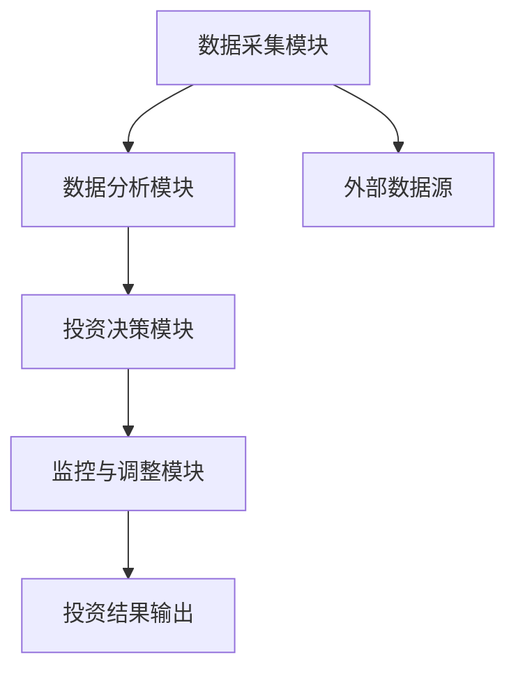
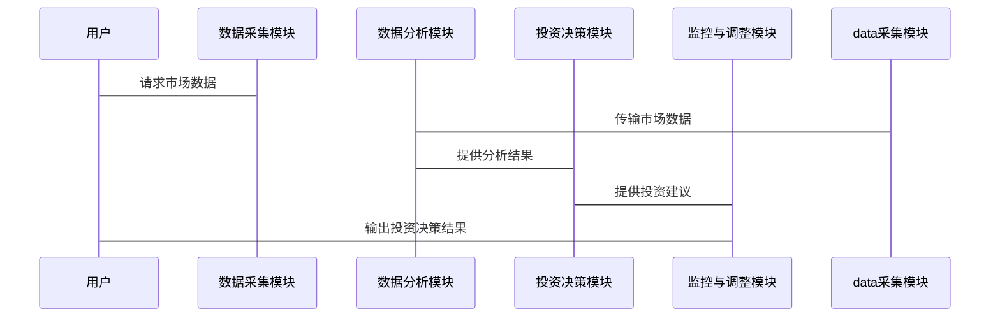

                 


# 彼得林奇的"逆向投资"心理准备

## 关键词：逆向投资、彼得林奇、心理准备、投资策略、市场情绪、估值模型

## 摘要：本文深入探讨彼得林奇的逆向投资策略，重点分析投资者在逆向投资中所需的心理准备，包括心理特征、情绪管理和认知偏差等方面。通过数学模型、算法实现和系统架构的详细讲解，结合实际案例分析，帮助读者全面理解逆向投资的核心原理和实践方法。

## 目录

### 第一部分: 逆向投资的背景与核心概念

#### 第1章: 逆向投资的定义与优势

##### 1.1 逆向投资的定义

- **1.1.1 投资的正向与逆向模式**  
  介绍正向投资和逆向投资的基本概念，对比两者的区别。

- **1.1.2 逆向投资的核心特征**  
  分析逆向投资的独特之处，如反向思维、逆市场趋势操作等。

- **1.1.3 逆向投资与传统投资的区别**  
  比较传统投资和逆向投资在策略、时机选择和风险承受上的差异。

##### 1.2 彼得林奇的逆向投资理念

- **1.2.1 彼得林奇的背景介绍**  
  简述彼得·林奇的个人经历和他在投资领域的成就。

- **1.2.2 彼得林奇的逆向投资策略**  
  详细阐述彼得林奇的逆向投资策略，包括买入被市场低估的资产和卖出高估资产的具体方法。

- **1.2.3 彼得林奇的成功案例分析**  
  通过具体案例展示彼得林奇逆向投资的成功实践，如在市场低谷期买入优质资产的案例。

##### 1.3 逆向投资的心理准备

- **1.3.1 逆向投资的心理特征**  
  分析逆向投资者需要具备的心理特征，如冷静、理性、耐心等。

- **1.3.2 逆向投资中的情绪管理**  
  探讨在逆向投资中如何管理和控制情绪，避免情绪化决策。

- **1.3.3 逆向投资中的认知偏差**  
  识别和克服常见的认知偏差，如从众心理、过度自信等，确保理性决策。

#### 第2章: 逆向投资的核心概念

##### 2.1 投资者心理偏差分析

- **2.1.1 从众心理**  
  分析从众心理对投资决策的影响，探讨如何避免随大流的错误。

- **2.1.2 过度自信**  
  探讨过度自信如何导致错误的投资决策，以及如何克服。

- **2.1.3 拉姆效应**  
  介绍拉姆效应在投资中的表现，解释其对逆向投资的影响。

- **2.1.4 沉没成本谬误**  
  分析沉没成本谬误在投资中的常见表现，探讨如何避免因此产生的错误决策。

##### 2.2 市场情绪分析

- **2.2.1 市场情绪的定义**  
  详细解释市场情绪的概念，及其对投资决策的影响。

- **2.2.2 市场情绪的分类**  
  列举并分析不同类型的市场情绪，如乐观、悲观、恐慌等。

- **2.2.3 市场情绪的指标体系**  
  介绍常用的市场情绪指标，如恐慌指数、投资者情绪指数等，分析其计算方法和应用。

##### 2.3 投资者心理准备的核心要素

- **2.3.1 知识储备**  
  强调投资者在进行逆向投资前需要具备的知识储备，包括财务分析、市场分析等。

- **2.3.2 心理韧性**  
  分析逆向投资者需要具备的心理韧性，以应对市场波动和挫折。

- **2.3.3 风险承受能力**  
  探讨投资者对风险的承受能力，及其对逆向投资策略选择的影响。

- **2.3.4 投资纪律性**  
  强调严格遵守投资纪律的重要性，尤其是在市场波动剧烈时。

#### 第3章: 逆向投资的策略与方法

##### 3.1 逆向投资的策略选择

- **3.1.1 基于估值的逆向投资**  
  介绍基于资产估值的逆向投资策略，如买入市盈率、市净率低于行业平均水平的股票。

- **3.1.2 基于情绪的逆向投资**  
  分析市场情绪指标在逆向投资中的应用，如在市场恐慌时买入。

- **3.1.3 基于趋势的逆向投资**  
  探讨逆向投资与趋势分析的结合，如在长期趋势反转时进行投资。

##### 3.2 逆向投资的实施步骤

- **3.2.1 确定投资目标**  
  明确投资目标和财务目标，制定合理可行的投资计划。

- **3.2.2 制定投资计划**  
  根据市场情况和个人财务状况，制定详细的投资计划，包括资金分配、时间安排等。

- **3.2.3 执行投资策略**  
  严格按照投资计划执行，避免受市场波动和情绪影响。

- **3.2.4 监控与调整**  
  定期监控市场变化和投资组合的表现，根据实际情况进行必要的调整。

##### 3.3 逆向投资的风险管理

- **3.3.1 风险识别与评估**  
  分析逆向投资中可能面临的主要风险，如市场风险、流动性风险等。

- **3.3.2 风险控制策略**  
  探讨有效的风险管理策略，如分散投资、设置止损点等。

- **3.3.3 风险调整与优化**  
  根据风险评估结果，优化投资组合，降低整体风险水平。

### 第二部分: 逆向投资的数学模型与算法

#### 第4章: 逆向投资的数学模型与算法

##### 4.1 逆向投资的数学模型

- **4.1.1 市场情绪模型**  
  介绍用于衡量市场情绪的数学模型，如恐慌指数的计算公式。

- **4.1.2 估值模型**  
  推导资产估值的数学模型，如市盈率、市净率等指标的计算方法。

- **4.1.3 风险评估模型**  
  分析用于评估投资组合风险的数学模型，如夏普比率、波动率等。

##### 4.2 逆向投资的算法实现

- **4.2.1 市场情绪指数计算**  
  利用算法计算市场情绪指数，如通过新闻数据和市场数据的结合分析。

- **4.2.2 估值指标分析**  
  通过算法分析资产的估值指标，判断其是否处于合理区间。

- **4.2.3 投资组合优化**  
  使用优化算法构建最优投资组合，如利用均值-方差优化模型。

##### 4.3 逆向投资的案例分析

- **4.3.1 案例背景介绍**  
  选择一个具体的逆向投资案例，介绍其背景和市场环境。

- **4.3.2 数据分析与建模**  
  展示如何通过数据分析和建模，识别出投资机会。

- **4.3.3 投资决策与结果**  
  分析投资决策过程，评估投资结果和收益情况。

#### 第5章: 逆向投资的系统架构与实现

##### 5.1 逆向投资决策支持系统

- **5.1.1 系统功能需求**  
  明确系统需要实现的功能，如数据采集、分析、决策支持等。

- **5.1.2 系统架构设计**  
  绘制系统架构图，展示各模块之间的关系和数据流。

- **5.1.3 系统实现步骤**  
  列出系统实现的主要步骤，如数据采集、模型训练、结果输出等。

##### 5.2 系统功能模块

- **5.2.1 数据采集模块**  
  介绍数据采集模块的功能，如从多种数据源获取市场数据。

- **5.2.2 数据分析模块**  
  展示数据分析模块的实现，如市场情绪分析、资产估值计算等。

- **5.2.3 投资决策模块**  
  分析投资决策模块的实现，如基于模型生成投资建议。

- **5.2.4 监控与调整模块**  
  介绍监控与调整模块的功能，如实时监控市场变化，自动调整投资组合。

##### 5.3 系统架构图



##### 5.4 系统接口设计

- **5.4.1 数据接口**  
  描述系统与外部数据源的接口，如API接口的设计和使用方法。

- **5.4.2 用户接口**  
  展示用户与系统的交互界面，如数据输入、结果查看等。

##### 5.5 系统交互流程



### 第三部分: 逆向投资的项目实战

#### 第6章: 逆向投资的项目实战

##### 6.1 环境安装与配置

- **6.1.1 安装Python环境**  
  指导读者安装Python编程环境，如Anaconda的安装步骤。

- **6.1.2 安装相关库**  
  列出项目中需要用到的Python库，如pandas、numpy、matplotlib等，并提供安装命令。

##### 6.2 核心实现源代码

- **6.2.1 数据采集代码**  
  展示如何通过API获取市场数据的Python代码，如使用Yahoo Finance API。

```python
import pandas as pd
import numpy as np

# 示例代码：从Yahoo Finance获取市场数据
def get_market_data(ticker, start_date, end_date):
    import yfinance as yf
    data = yf.download(ticker, start=start_date, end=end_date)
    return data

market_data = get_market_data('SPY', '2020-01-01', '2023-12-31')
print(market_data.head())
```

- **6.2.2 数据分析与建模代码**  
  展示如何分析市场情绪和估值指标的Python代码。

```python
import pandas as pd
import numpy as np

# 示例代码：计算恐慌指数
def calculate_fear_index(data, window=20):
    data['SMA'] = data['Close'].rolling(window).mean()
    data['Volatility'] = data['Close'].rolling(window).std()
    data['FearIndex'] = (data['Close'] - data['SMA']) / data['Volatility']
    return data['FearIndex']

fear_index = calculate_fear_index(market_data)
print(fear_index.head())
```

- **6.2.3 投资决策代码**  
  展示基于分析结果生成投资信号的Python代码。

```python
import pandas as pd

# 示例代码：生成买入信号
def generate_buy_signal(data, threshold=-1.5):
    data['BuySignal'] = data['FearIndex'] < threshold
    return data['BuySignal']

buy_signal = generate_buy_signal(market_data)
print(buy_signal.head())
```

##### 6.3 项目实战分析

- **6.3.1 案例分析**  
  选择一个具体的市场环境，分析逆向投资策略的应用过程。

- **6.3.2 数据分析与结果解读**  
  展示数据分析的结果，解释投资决策的依据。

- **6.3.3 投资结果评估**  
  评估投资结果，分析收益和风险，总结经验教训。

##### 6.4 项目小结

- **6.4.1 项目总结**  
  总结项目的主要成果和经验，强调逆向投资策略的有效性。

- **6.4.2 项目启示**  
  提出项目对逆向投资实践的启示，如数据的重要性、模型的可优化性等。

### 第四部分: 最佳实践与小结

#### 第7章: 最佳实践与注意事项

##### 7.1 最佳实践 tips

- **7.1.1 知识储备**  
  强调持续学习和知识更新的重要性。

- **7.1.2 风险管理**  
  提醒读者在投资过程中严格管理风险，避免过度杠杆。

- **7.1.3 投资纪律**  
  强调遵守投资纪律，避免情绪化决策。

##### 7.2 小结

- **7.2.1 逆向投资的核心要素**  
  总结逆向投资成功的关键要素，如心理准备、策略选择、风险管理等。

- **7.2.2 逆向投资的未来发展**  
  展望逆向投资在技术进步和市场变化中的发展和应用。

#### 第8章: 拓展阅读与深入思考

##### 8.1 拓展阅读推荐

- **8.1.1 经典书籍**  
  推荐与逆向投资相关的经典书籍，如《彼得·林奇的投资智慧》。

- **8.1.2 专业论文**  
  推荐相关的学术论文，深入探讨逆向投资的理论基础和实证研究。

##### 8.2 深入思考与实践

- **8.2.1 技术创新**  
  探讨技术进步对逆向投资的影响，如大数据分析、人工智能在投资决策中的应用。

- **8.2.2 市场变化**  
  分析市场环境的变化对逆向投资策略的影响，如全球经济波动、地缘政治风险等。

### 作者

作者：AI天才研究院/AI Genius Institute & 禅与计算机程序设计艺术 /Zen And The Art of Computer Programming

